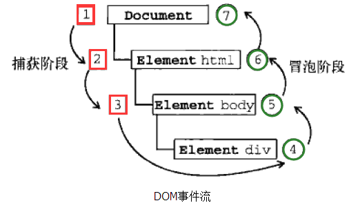
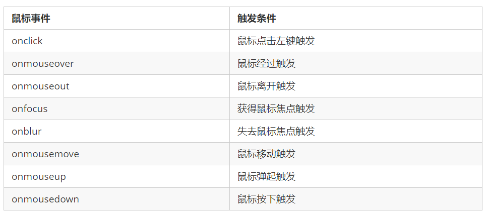

#  Web APIs - day03 

> 学习目标：
>
> 能够使用removeChild()方法删除节点
>
> 能够完成动态生成表格案例
>
> 能够使用传统方式和监听方式给元素注册事件
>
> 能够说出事件流执行的三个阶段
>
> 能够在事件处理函数中获取事件对象
>
> 能够使用事件对象取消默认行为
>
> 能够使用事件对象阻止事件冒泡
>
> 能够使用事件对象获取鼠标的位置
>
> 能够完成跟随鼠标的天使案例

## 1.1. 节点操作

### 1.1.1 删除节点 *** 

（01-节点操作-删除节点.avi）

- 语法

  ```js
  node.removeChild(child)
  ```

  说明：node.removeChild() 方法从 node节点中删除一个子节点，返回删除的节点。

- 例子

```js
    <button>删除</button>
    <ul>
        <li>熊大</li>
        <li>熊二</li>
        <li>光头强</li>
    </ul>
    <script>
        // 1.获取元素
        var ul = document.querySelector('ul');
        var btn = document.querySelector('button');
        // 2. 删除元素  node.removeChild(child)
        // ul.removeChild(ul.children[0]);
        // 3. 点击按钮依次删除里面的孩子
        btn.onclick = function() {
            if (ul.children.length == 0) {
                this.disabled = true;
            } else {
                //注意：每次点击都是删除第一个
                //第一次删除3个里边的第一个，删除之后原来的1,2变为0,1，所以在次删除还是删除0
                ul.removeChild(ul.children[0]);
            }
        }
    </script>
```


### 1.1.2 案例：删除留言 

（02-删除留言案例.avi）

- 案例效果：


- 案例分析：
  1. 当我们把文本域里面的值赋值给li 的时候，多添加一个删除的链接
  2. 需要把所有的链接获取过来，当我们点击当前的链接的时候，删除当前链接所在的li
  3. 阻止链接跳转需要添加 javascript:void(0); 或者  javascript:;  （**如果不添加，点击删除时，界面会刷新**）
- 案例代码：

```js
    <textarea name="" id=""></textarea>
    <button>发布</button>
    <ul>

    </ul>
    <script>
        // 1. 获取元素
        var btn = document.querySelector('button');
        var text = document.querySelector('textarea');
        var ul = document.querySelector('ul');
        // 2. 注册事件
        btn.onclick = function() {
            if (text.value == '') {
                alert('您没有输入内容');
                return false;
            } else {
                // console.log(text.value);
                // (1) 创建元素
                var li = document.createElement('li');
                // 先有li 才能赋值
                li.innerHTML = text.value + "<a href='javascript:;'>删除</a>";
                // (2) 添加元素
                // ul.appendChild(li);
                ul.insertBefore(li, ul.children[0]);
                // (3) 删除元素 删除的是当前链接的li  它的父亲
                var as = document.querySelectorAll('a');
                for (var i = 0; i < as.length; i++) {
                    as[i].onclick = function() {
                        // 删除的是 li 当前a所在的li  this.parentNode;
                        ul.removeChild(this.parentNode);
                    }
                }
                // 第三步有简单的方式1：
                li.querySelector('a').onclick = function() {
                    ul.removeChild(this.parentNode);
                }
                // 第三步有简单的方式2：
                li.children[0].onclick = function () {
                    ul.removeChild(this.parentNode);
                }
                // 第三步简单方式3：
                 var a = document.querySelector('a');
                 a.onclick = function() {
                     ul.removeChild(this.parentNode);
                 };
                // 分析：
                // 第一种删除逻辑是，当添加了一个li和a之后，查找当前界面所有的a，
                // 然后循环给a添加删除事件，但其实这么做有点麻烦
                // 因为如果是添加的第二个a，添加点击事件的时候，他又找了所有的a，给a添加点击事件
                // 但其实此时的第一个a已经在第一次添加到ul中的时候，已经添加过点击事件了
                // 第二种逻辑(简单方式)：添加一个，只给当前添加的这个li下边的a添加点击事件，不重复
            }
        }
    </script>
		
```

- 注意：href与onclick对吧：

  ```js
  <!--href和onclick，其实都是点击a之后，触发的逻辑-->
  <!-- //当点击删除超链接之后，跳转到百度 -->
  <a href='http://www.baidu.com'>删除</a>
  <!-- //当点击删除超链接之后，弹出123，可通过href实现，也可以通过onclick -->
  <a href='javascript:alert(123);' onclick="alert(123)">删除</a>
  <!-- 这个href中写javascript意思就是，不跳转界面，而是要执行js代码-->
  
  <!-- // href写#，点击之后，url后会加上#-->
  <a href="#" onclick="alert(123)">删除</a>
  <!-- 不希望href做点击响应，href就写javascript:; 相当于执行空代码 -->
  <a href='javascript:;' onclick="alert(123)">删除</a>
  <ul>
  <!--总结：一般情况下，我们要给a绑定事件，就给href赋值为javascript:; -->
  ```

### 1.1.3 复制（克隆）节点 

（03-节点操作-复制节点.avi）

- 语法：

  ```
  node.cloneNode([isDeep]) ;// 是否深度拷贝，true
  ```

  说明：node.cloneNode() 方法返回调用该方法的节点的一个副本，意思就是放一个node的副本， 也称为克隆节点/拷贝节点

- 案例：

```js
    <ul>
        <li>1111</li>
        <li>2</li>
        <li>3</li>
    </ul>
    <script>
        var ul = document.querySelector('ul');
        // 1. node.cloneNode(); 括号为空或者里面是false 浅拷贝 只复制标签不复制里面的内容
        // 2. node.cloneNode(true); 括号为true 深拷贝 复制标签复制里面的内容
        var lili = ul.children[0].cloneNode(true);
        ul.appendChild(lili);
    </script>
	//理解： 
	//浅拷贝，只是浅浅的拷贝，点到为止，所以只给标签表面（标签本身）拷贝了一下
	//深拷贝，就是深度的拷贝，将标签表面，和标签内部所有的内容都拷贝
```

### 1.1.4 案例：动态生成表格 *** 

（04-09-动态生成表格.avi）

- 案例效果：


- 案例分析：

  1. 因为里面的学生数据都是**动态**的，我们需要js 动态生成。 这里我们模拟数据，自己定义好数据。 数据我们采取对象形式存储。
  2. 所有的数据都是放到tbody里面的**行**里面。
  3. 因为行很多，我们需要循环创建多个行（对应多少人）
  4. 每个行里面又有很多单元格（对应里面的数据），我们还继续使用循环创建多个单元格，并且把数据存入里面（有行有列，使用双重for循环）
  5. 最后一列单元格是删除，需要单独创建单元格。
  6. 最后添加删除操作，单击删除，可以删除当前行。

  **问题**：

  1. 为啥每行数据，用一个对象进行存储？


  ​		因为每一行，都有三对数据：姓名-xxx，科目-xxx，成绩-xxx。典型的key和value，所以就是对象。

​	2. 数据都是动态的，怎么理解？

​		意思就是时时刻刻都是变化的，而数据是由后台维护的，所以是有后台将数据传递给我们前端，然后我们进行动态显示。但是这里我们没有后台的支持，所以一会要自己模拟一个后台传递过来的数据。

- 案例代码：

```js
    <script>
        // 1.先去准备好学生的数据 （datas是一个数组，数组中存储多个对象）
        var datas = [{
            name: '魏璎珞',
            subject: 'JavaScript',
            score: 100
        }, {
            name: '弘历',
            subject: 'JavaScript',
            score: 98
        }, {
            name: '傅恒',
            subject: 'JavaScript',
            score: 99
        }, {
            name: '明玉',
            subject: 'JavaScript',
            score: 88
        }, {
            name: '大猪蹄子',
            subject: 'JavaScript',
            score: 0
        }];
        // 2. 往tbody 里面创建行： 有几个人（通过数组的长度）我们就创建几行
        var tbody = document.querySelector('tbody');
		// 遍历数组
        for (var i = 0; i < datas.length; i++) { 
            // 2.1. 创建 tr行
            var tr = document.createElement('tr');
            tbody.appendChild(tr); // 创建完元素对象，就添加，避免忘记
            // 2.2. 行里面创建单元格td 单元格的数量取决于每个对象里面的属性个数  
            // 使用for in遍历学生对象‘
            {
                name: '魏璎珞',
                subject: 'JavaScript',
                score: 100
        	}
            var Obj = datas[i];
            for (var k in Obj) { //'name';
                // 创建单元格 
                var td = document.createElement('td');
                // 把对象里面的属性值 datas[i][k] 给 td  
                td.innerHTML = Obj[k];//比如第一行的第一列：魏璎珞  Obj['name'],Obj.name
                tr.appendChild(td);
            }
            // 2.3. 创建 有删除2个字 的单元格 
            var td = document.createElement('td');
            td.innerHTML = '<a href="javascript:;">删除 </a>';
            tr.appendChild(td);

        }
        // 3. 删除操作 开始 
        var as = document.querySelectorAll('a');
        for (var i = 0; i < as.length; i++) {
            as[i].onclick = function() {
                // 点击a 删除 当前a 所在的行(链接的爸爸的爸爸)  node.removeChild(child)  
                tbody.removeChild(this.parentNode.parentNode)
            }
        
		// 分析：
		// 这个第三步删除操作，放到外边就没有重复添加点击事件的情况
		// 因为我们是先整体添加完完成，然后再找所有a，添加点击事件
		// 当然也有更简单的方式，跟之前删除留言案例一样，可以在2.3，添加完之后，立马找到a并且添加事件
		// td.children[0].onclick = function () {
         //      tbody.removeChild(this.parentNode.parentNode);
         // }
    </script>
```

### 1.1.5 创建元素的三种方式

（10-document.write创建元素（了解）.avi）

- 语法：
  - document.write() 
  - element.innerHTML
  - document.createElement()
- 区别：
  1. document.write 是直接将内容写入页面的内容流，**界面加载完成之后，再写入，这样它会导致页面全部重绘**
  2. innerHTML 是将内容写入某个 DOM 节点，不会导致页面全部重绘
  3. innerHTML 创建多个元素效率更高（不要拼接字符串，采取数组形式拼接），结构稍微复杂
  4. createElement() 创建多个元素效率稍低一点点，但是结构更清晰
  5. **总结**：**不同浏览器下，innerHTML 效率要比 creatElement 高**
- 案例：

```js
    <script>
        // 三种创建元素方式区别 
        // 1. document.write() 创建元素  如果页面文档流加载完毕，再调用这句话会导致页面重绘
         var btn = document.querySelector('button');
         btn.onclick = function() {
             document.write('<div>123</div>');
         }
        // 2. innerHTML 创建元素
        var inner = document.querySelector('.inner');
         for (var i = 0; i <= 100; i++) {
             inner.innerHTML += '<a href="#">百度</a>'
         }
        var arr = [];
        for (var i = 0; i <= 100; i++) {
            arr.push('<a href="#">百度</a>');
        }
        inner.innerHTML = arr.join('');
        // 3. document.createElement() 创建元素
        var create = document.querySelector('.create');
        for (var i = 0; i <= 100; i++) {
            var a = document.createElement('a');
            create.appendChild(a);
        }
    </script>
```

### 1.1.6 innerTHML和createElement效率对比

（11-innerHTML和createElement效率对比.avi）

- **innerHTML字符串拼接方式（效率低）**

```js
<script>
    function fn() {
        var d1 = +new Date();
        var str = '';
        for (var i = 0; i < 1000; i++) {
            document.body.innerHTML += '<div style="width:100px; height:2px; border:1px solid blue;"></div>';
        }
        var d2 = +new Date();
        console.log(d2 - d1);
    }
    fn();
</script>
```

​	总结：上述操作相当于字符串拼接，而字符串不可变性导致没拼接一次开辟一个变量空间，所以效率低下

- **createElement方式（效率一般，但结构清晰）**

```js
<script>
    function fn() {
        var d1 = +new Date();
        for (var i = 0; i < 1000; i++) {
            var div = document.createElement('div');
            div.style.width = '100px';
            div.style.height = '2px';
            div.style.border = '1px solid red';
            document.body.appendChild(div);
        }
        var d2 = +new Date();
        console.log(d2 - d1);
    }
    fn();
</script>
```

- **innerHTML数组方式（效率高）**


```js
<script>
    function fn() {
        var d1 = +new Date();
        var array = [];
        for (var i = 0; i < 1000; i++) {
            array.push('<div style="width:100px; height:2px; border:1px solid blue;"></div>');
        }
        document.body.innerHTML = array.join('');
        var d2 = +new Date();
        console.log(d2 - d1);
    }
    fn();
</script>
```

## 1.2. DOM的核心总结

（12-DOM重点核心.avi）

- 文档对象模型（Document Object Model，简称 DOM），是 W3C 组织推荐的处理可扩展标记语言（HTML或者XML）的标准编程接口。
- W3C 已经定义了一系列的 DOM 接口，通过这些 DOM 接口可以改变网页的内容、结构和样式。

  - 对于JavaScript，为了能够使JavaScript操作HTML，JavaScript就有了一套自己的dom编程接口。
- 对于HTML，dom使得html形成一棵dom树.  包含 文档、元素、节点


关于dom操作，我们主要针对于元素的操作。主要有创建、增、删、改、查、属性操作、事件操作。

### 1.2.1. 创建

1. document.write
2. innerHTML
3. createElement

### 1.2.2. 增加

1. appendChild
2. insertBefore

### 1.2.3. 删

1. removeChild

### 1.2.4. 改

主要修改dom的元素属性，dom元素的内容、属性, 表单的值等

1. 修改元素属性： src、href、title等
2. 修改普通元素内容： innerHTML 、innerText
3. 修改表单元素： value、type、disabled等
4. 修改元素样式： style、className

### 1.2.5. 查

主要获取查询dom的元素

1. DOM提供的API 方法：  getElementById、getElementsByTagName  古老用法 不太推荐 
2. H5提供的新方法： querySelector、querySelectorAll   提倡
3. 利用节点操作获取元素： 父(parentNode)、子(children)、兄(previousElementSibling、nextElementSibling)    提倡

### 1.2.6. 属性操作

主要针对于自定义属性：一组元素中（同一个父亲），每个元素他自己不知道自己排行老几，设置自定义属性，来排行。

1. setAttribute：设置dom的属性值
2. getAttribute：得到dom的属性值
3. removeAttribute移除属性

### 1.2.7. 事件操作（重点）

给元素注册事件， 采取  事件源.on事件类型 = 事件处理程序


## 1.3. 事件高级

（13-事件高级导读.avi）

-  能够写出元素注册事件的两种方式
-  能够说出删除事件的两种方式
-  能够说出 DOM 事件流的三个阶段
-  能够利用事件对象完成跟随鼠标案例
-  能够封装阻止冒泡的兼容性函数
-  能够说出事件委托的原理
-  能够说出常用的鼠标和键盘事件

### 1.3.1. 注册事件（2种方式）***

( 14-注册事件两种方式.avi )

- 给元素添加事件，称为注册事件或者绑定事件。

- 注册事件有两种方式：传统方式和方法监听注册方式

- 传统方式

  - 利用 on 开头的事件 onclick 

  - `<button onclick=“alert('hi~')”></button>`

  - `btn.onclick = function() {} `

  - 特点： 注册事件的**唯一性**（只能有一个）

  - 同一个元素同一个事件只能设置一个处理函数，最后注册的处理函数将会覆盖前面注册的处理函数

  - 代码：

    ```javascript
    btns[0].onclick = function() {
    		alert('hi');
    	}
    btns[0].onclick = function() {
    		alert('hao a u');
    	}
    	// 点击btn之后弹出 hao a u
    ```

- 方法监听

  - w3c 标准 推荐方式 ：addEventListener()

  - addEventListener() ： 添加事件监听

  - IE9 之前的 IE 不支持此方法，可使用 attachEvent() 代替  （了解即可）

    - （attach：附着，附着事件，理解为绑定事件）

  - 特点：同一个元素同一个事件可以注册多个监听器（事件处理程序） 

  - 按注册顺序依次执行

  - 代码

    ```javascript
    // 参数1：事件类型，它是字符串 必定加引号 而且不带on
    // 参数2：事件处理程序
    btns[1].addEventListener('click', function() {
    	alert(22);
    })
    btns[1].addEventListener('click', function() {
    	alert(33);
    })
    // 3. attachEvent ie9以前的版本支持 ，这里的事件需要带on
    btns[2].attachEvent('onclick', function() {
    	alert(11);
    })
    ```

    addEventListener详细介绍见1.3.2。

### 1.3.2 事件监听

#### 1. addEventListener事件监听 ***

- 语法：

```
 eventTarget.addEventListener(type, listener[, useCapture])  
```

- 注意：
  - addEventListener()事件监听（IE9以后支持）
  - eventTarget.addEventListener()方法将指定的监听器注册到 eventTarget（目标对象）上，当该对象触发指定的事件时，就会执行事件处理函数。

- 该方法接收三个参数：
  1. type：事件类型**字符串**，比如 click 、mouseover ，注意这里不要带 on
  2. listener：事件处理函数，事件发生时，会调用该监听函数
  3. useCapture：可选参数，是一个布尔值，默认是 false。学完 DOM 事件流后，我们再进一步学习

#### 2. attacheEvent()事件监听（IE678支持）

（15-attachEvent注册事件.avi）

- 语法：

```javascript
 eventTarget.attachEvent(eventNameWithOn, callback) 
```

- 注意：	

eventTarget.attachEvent()方法将指定的监听器注册到 eventTarget（目标对象） 上，当该对象触发指定的事件时，指定的回调函数就会被执行。

- 该方法接收两个参数：
  1. eventNameWithOn：事件类型字符串，比如 onclick 、onmouseover ，这里要带 on
  2. callback： 事件处理函数，当目标触发事件时回调函数被调用

- 案例：

```js
<button>传统注册事件</button>
<button>方法监听注册事件</button>
<button>ie9 attachEvent</button>
<script>
    var btns = document.querySelectorAll('button');
    // 1. 传统方式注册事件
    btns[0].onclick = function() {
        alert('hi');
    }
    btns[0].onclick = function() {
            alert('hao a u');
        }
   // 2. 事件侦听注册事件 addEventListener 
   // (1) 里面的事件类型是字符串 必定加引号 而且不带on
   // (2) 同一个元素 同一个事件可以添加多个侦听器（事件处理程序）
    btns[1].addEventListener('click', function() {
        alert(22);
    })
    btns[1].addEventListener('click', function() {
            alert(33);
    })
    // 3. attachEvent ie9以前的版本支持
    btns[2].attachEvent('onclick', function() {
        alert(11);
    })
</script>
```
#### 3. 事件监听兼容性解决方案

兼容性处理的原则： 首先照顾大多数浏览器，再处理特殊浏览器

封装一个函数，函数中判断浏览器的类型：

```javascript
 function addEventListener(element, eventName, fn) {
      // 判断当前浏览器是否支持 addEventListener 方法
      if (element.addEventListener) { // 浏览器支持此种方式，可以根据方法名找到方法声明，方法声明会转换为true
        element.addEventListener(eventName, fn);  // 第三个参数 默认是false
      } else if (element.attachEvent) {
        element.attachEvent('on' + eventName, fn);
      } else {
        // 相当于 element.onclick = fn;
        element['on' + eventName] = fn;
 } 

```

### 1.3.3. 删除事件（解绑事件）

（16-删除事件.avi）

1. 传统注册方式

   ```
   eventTarget.onclick = null; ***
   ```

2. 方法监听注册方式

   ```javascript
   1. eventTarget.removeEventListener(type, listener[, useCapture]); ***
   2. eventTarget.detachEvent(eventNameWithOn, callback);
   ```

3. 案例：

   ```html
   <div>1</div>
       <div>2</div>
       <div>3</div>
       <script>
           var divs = document.querySelectorAll('div');
           divs[0].onclick = function() {
               alert(11);
               // 1. 传统方式删除事件
               divs[0].onclick = null;
           }
           // 2. removeEventListener 删除事件
           divs[1].addEventListener('click', fn) // 里面的fn 不需要调用加小括号
           function fn() {
               alert(22);
               // 点击div1的时候弹出22，然后直接移除点击事件。
               // 移除事件需要参数1，哪种事件，参数2，这种事件中的fn处理程序
               // 为啥需要指定处理程序fn？因为这个点击事件可以有多个处理程序，你要指定删除哪个
               divs[1].removeEventListener('click', fn);
               // divs[1].addEventListener('click', fn()) // 里面的fn 不需要调用加小括号
               // 如果添加了小括号，就相当于将fn()调用完成的返回值作为第二个参数传递了
               // 事件处理程序，不是我们调用的，而是js引擎调用的。
               // 我们通过第二个参数，告诉js引擎，事件发生时要调用的方法是谁，所以只告诉他方面即可
           }
           // 3. detachEvent
           divs[2].attachEvent('onclick', fn1);
   
           function fn1() {
               alert(33);
               divs[2].detachEvent('onclick', fn1);
           }
       </script>
   ```
   注意：

4. **删除事件兼容性解决方案 **

   ```javascript
   function removeEventListener(element, eventName, fn) {
         // 判断当前浏览器是否支持 removeEventListener 方法
         if (element.removeEventListener) {
           element.removeEventListener(eventName, fn);  // 第三个参数 默认是false
         } else if (element.detachEvent) {
           element.detachEvent('on' + eventName, fn);
         } else {
           element['on' + eventName] = null;
    } 
   
   ```

### 1.3.4. DOM事件流

#### 1. 介绍

（17-DOM事件流理论.avi）

- 思考问题：

  > html中的标签都是相互嵌套的，我们可以将元素想象成一个盒子装一个盒子，document是最外面的大盒子。
  > 当你单击一个div时，同时你也单击了div的父元素，甚至整个页面。
  >
  > 那么是先执行父元素的单击事件，还是先执行div的单击事件 ？？？
  > 要搞清楚这个问题，就需要学习事件流

- 介绍：
  - 事件流描述的是**从页面中接收事件的顺序**。(事件流，事件传播的流程)
  - 事件发生时会在元素节点之间按照特定的顺序传播，这个传播过程即 DOM 事件流。

- 举例说明：

  比如：我们给页面中的一个div注册了单击事件，当你单击了div时，也就单击了body，单击了html，单击了document

  如下图：

  

  - 事件冒泡： IE 最早提出，事件开始时由最具体的元素接收，然后逐级向上传播到到 DOM 最顶层节点的过程。

  - 事件捕获： 网景最早提出，由 DOM 最顶层节点开始，然后逐级向下传播到到最具体的元素接收的过程。如何理解捕获，就相当于事件发生的时候，从顶级节点开始，先知道事件发生。**捕获理解为知道即可**。

    > 当时的2大浏览器霸主谁也不服谁！
    > IE 提出从目标元素开始，然后一层一层向外接收事件并响应，也就是冒泡型事件流。
    > Netscape（网景公司）提出从最外层开始，然后一层一层向内接收事件并响应，也就是捕获型事件流。
    >
    > 江湖纷争，武林盟主也脑壳疼！！！
    >
    > 最终，w3c 采用折中的方式，平息了战火，制定了统一的标准 —--— 先捕获再冒泡。
    > 现代浏览器都遵循了此标准，所以当事件发生时，会经历3个阶段。

- 结论：DOM 事件流会经历3个阶段： 

  1. 捕获阶段
  2. 当前目标阶段
  3. 冒泡阶段 

- 再理解事件流***


​	我们向水里面扔一块石头，首先它会有一个下降的过程，这个过程就可以理解为从最顶层向事件发生的最具体元素（目标点）的捕获过程；之后会产生泡泡，会在最低点（ 最具体元素）之后漂浮到水面上，这个过程相当于事件冒泡。 


#### 2. 案例

（18-DOM事件流代码验证.avi）

- **事件冒泡案例**

```js
    <div class="father">
        <div class="son">son盒子</div>
    </div>
    <script>
        // 如果addEventListener 第三个参数是 true 那么则处于捕获阶段
        // 顺序为：document -> html -> body -> father -> son
        // 如果addEventListener 第三个参数是 false 或者 省略 那么处理冒泡阶段
        // 顺序为：son -> father ->body -> html -> document
        var son = document.querySelector('.son');
		// 给son注册单击事件
        son.addEventListener('click', function() {
            alert('son');
        }, false);
		// 给father注册单击事件
        var father = document.querySelector('.father');
        father.addEventListener('click', function() {
            alert('father');
        }, false);
		// 给document注册单击事件，省略第3个参数
        document.addEventListener('click', function() {
            alert('document');
        })
    </script>
```

#### 3. 结论 ***

**事件发生时会在元素节点之间按照特定的顺序传播，这个传播过程即 DOM 事件流**。

事件为啥要传播？事件发生之后，与当前事件相关的元素，都需要知道这个事件的发生。

注意：

1. JS 代码中只能执行捕获或者冒泡其中的一个阶段。

   ​	为啥不能同时存在, 因为捕获和冒泡都是通知相关元素知晓事件的发生,所以没必要通知两次.

2. onclick 和 attachEvent 只能得到冒泡阶段。（理解：只在冒泡阶段触发）

3. addEventListener(type, listener[, useCapture])第三个参数如果是 true，表示在事件捕获阶段调用事件处理程序；如果是 false（不写默认就是false），表示在事件冒泡阶段调用事件处理程序。

4. **实际开发中我们很少使用事件捕获，我们更关注事件冒泡**。

5. **有些事件是没有冒泡的，比如 onblur、onfocus、onmouseenter、onmouseleave**

6. **事件冒泡有时候会带来麻烦，有时候又会帮助很巧妙的做某些事件，我们后面讲解**。

7. 事件捕获, 不是字面意思, 传递到某个元素就捕获了, 不在继续传递了, 捕获理解为知道即可.

8. 事件传递到某个元素就捕获了, 不在继续传递了, 这个其实叫做阻止事件传递(后边会讲).

9. 不管相关元素有没有同时绑定相同事件, 事件传递一直都存在. 只是在事件传递过程中,会询问当前元素是否有这个事件,如果有就执行,没有就不执行.

### 1.3.5. 事件对象

#### 1. 什么是事件对象 ***

（19-什么是事件对象.avi） 

官方解释：event 对象代表事件的状态，比如键盘按键的状态、鼠标的位置、鼠标按钮的状态。

简单理解：**事件发生后，跟事件相关的一系列信息数据的集合都放到这个对象里面，这个对象就是事件对象 event，它有很多属性和方法**。

比如：  

1. 谁绑定了这个事件。
2. 鼠标触发事件的话，会得到鼠标的相关信息，如鼠标位置。
3. 键盘触发事件的话，会得到键盘的相关信息，如按了哪个键。

#### 2. 事件对象的使用 ***

事件触发发生时就会产生事件对象，并且系统会以实参的形式传给事件处理函数。

所以，在事件处理函数中声明1个形参用来接收事件对象。

例子：

```javascript
  eventTarget.onclick = function(event) {
     // 这个 event 就是事件对象，我们还喜欢的写成 e 或者 evt 
  } 
  eventTarget.addEventListener('click', function(event) {
    // 这个 event 就是事件对象，我们还喜欢的写成 e 或者 evt 
  }）
// event谁传递的？
// 函数的形参是由谁传递的？  调用者传递
// 事件处理程序是谁调用的。
// js引擎调用，div.onclick(e);
// 当事件发生之后，js引擎将事件相关信息封装为一个对象，e。调用事件处理程序时将e传递
//  var obj = {
//         name:'',
//         onclick:function(e){

//         }

// }
// obj.onclick(e);
```

应用场景：什么时候添加形参e：事件处理程序中需要用到事件对象，那么就添加形参e

#### 3. 事件对象的兼容性处理

事件对象本身的获取存在兼容问题：

1. 标准浏览器中是浏览器给方法传递的参数，只需要定义形参 e 就可以获取到。
2. 在 IE6~8 中，浏览器不会给方法传递参数，如果需要的话，需要到 window.event 中获取查找。

语法：

```js
兼容写法：
e = e || window.event;
这个利用了短路逻辑运算：
如果浏览器支持e，而e转boolean为true，则直接返回e
如果浏览器不支持e，会去识别window.event，然后返回window.event
```

代码：

```javascript
<div>123</div>
    <script>
        var div = document.querySelector('div');
        div.onclick = function(e) {
                // 事件对象
                e = e || window.event;
                console.log(e);
        }
    </script>
```


#### 4. 事件对象的属性和方法

（20-e.target和this区别.avi）


- 重点： target，preventDefault()，stopPropagation()  ***

#### 5. e.target 和 this 的区别 ***

- this 是事件绑定的元素（绑定这个事件处理函数的元素） 。

- e.target 是事件触发的元素。

  > 通常情况下target 和 this是一致的
  > 但有一种情况不同，那就是在事件冒泡时（父子元素有相同事件，单击子元素，父元素的事件处理函数也会被触发执行），
  > 	这时候this指向的是父元素，因为它是绑定事件的元素对象，
  > 	而target指向的是子元素，因为他是触发事件的那个具体元素对象。
  >
  > 总结 ： 
  >
  > e.target 点击了哪个元素，就返回哪个元素
  >
  > this 哪个元素绑定了这个点击事件，那么就返回谁 

- 例子：没有冒泡的target和this


```js
    <div>123</div>
    <script>
        var div = document.querySelector('div');
        div.addEventListener('click', function(e) {
            // e.target 和 this指向的都是div
            console.log(e.target);
            console.log(this);

        });
    </script>
```

- 例子：事件冒泡下的e.target和this


```js
    <ul>
        <li>abc</li>
        <li>abc</li>
        <li>abc</li>
    </ul>
    <script>
        var ul = document.querySelector('ul');
        ul.addEventListener('click', function(e) {  //ul.onclick=function(){this}
              // 我们给ul 绑定了事件  那么this 就指向ul  
              console.log(this); // ul   //(当前函数所属对象，怎么理解，看上边普通方式)

              // e.target 触发了事件的对象 我们点击的是li e.target 指向的就是li
              console.log(e.target); // li  //(目标：目标阶段，触发的对象)
        });
    </script>
```

- **总结**：

		this：绑定事件的对象

		e.target：触发事件的对象

### 1.3.6 阻止默认行为 ***

（21-阻止默认行为.avi）

> html中一些标签有默认行为，例如a标签被单击后，默认会进行页面跳转。

```js
    <a href="http://www.baidu.com">百度</a>
    <script>
        // 2. 阻止默认行为 让链接不跳转 
        var a = document.querySelector('a');
        a.addEventListener('click', function(e) {
             e.preventDefault(); //  dom 标准写法
             // 可以替代href="javascript:;"
        });
        // 3. 传统的注册方式
        a.onclick = function(e) {
            // 普通浏览器 e.preventDefault();  方法
            e.preventDefault();
            // 低版本浏览器 ie678  returnValue  属性
            e.returnValue = false;
            // 我们可以利用return false 也能阻止默认行为 没有兼容性问题
            return false;
        }
    </script>
```

### 1.3.7 阻止事件冒泡 

（22-阻止事件冒泡.avi）

- 事件冒泡：开始时由最具体的元素接收，然后逐级向上传播到到 DOM 最顶层节点。

- 事件冒泡本身的特性，会带来的坏处，也会带来的好处，需要我们灵活掌握。

- 阻止事件冒泡的方式

  -  标准写法：利用事件对象里面的 stopPropagation()方法 （ stop 停止  Propagation 传播）

    ```
     e.stopPropagation()  ***
    ```

  -  非标准写法：IE 6-8  利用事件对象 cancelBubble 属性  （Bubble：水泡，cancelBubble ：取消冒泡）

    ```
     e.cancelBubble = true;
    ```

- 例子：

```js
    <div class="father">
        <div class="son">son儿子</div>
    </div>
    <script>
        var son = document.querySelector('.son');
		// 给son注册单击事件
        son.addEventListener('click', function(e) {
            alert('son');
            e.stopPropagation(); 
            window.event.cancelBubble = true; 
        }, false);

        var father = document.querySelector('.father');
		// 给father注册单击事件
        father.addEventListener('click', function() {
            alert('father'); // 在son中取消冒泡之后，这里就不会执行
        }, false);
		// 给document注册单击事件
        document.addEventListener('click', function() {
            alert('document');// 在son中取消冒泡之后，这里就不会执行
        })
    </script>
```

- **阻止事件冒泡的兼容性处理**


```javascript
  if(e && e.stopPropagation){
      e.stopPropagation();
  }else{
      window.event.cancelBubble = true;
  }
```

### 1.3.8 事件委托 ***

（23-事件委托.avi）

#### 1. 什么是事件委托

- 事件委托：把事情委托给别人，代为处理。
- 事件委托也称为事件代理，在 jQuery 里面称为事件委派。

- **理解**：说白了就是，不给子元素注册事件，给父元素注册事件，把处理代码在父元素的事件中执行。

- **生活中的委托：**
  - 咱们班有100个学生， 快递员有100个快递， 如果一个个的送花费时间较长。同时每个学生领取的时候，也需要排队领取，也花费时间较长，何如？
  - 解决方案：  快递员把100个快递，委托给班主任，班主任把这些快递放到办公室，同学们下课自行领取即可。
  - ​优势：  快递员省事，委托给班主任就可以走了。 同学们领取也方便，因为相信班主任。

- **js事件中的委托：**


```html
  <ul>
        <li>知否知否，应该有弹框在手</li>
        <li>知否知否，应该有弹框在手</li>
        <li>知否知否，应该有弹框在手</li>
        <li>知否知否，应该有弹框在手</li>
        <li>知否知否，应该有弹框在手</li>
  </ul>
```

点击每个 li 都会弹出对话框，以前需要给每个 li 注册事件，是非常辛苦的，而且访问 DOM 的次数越多，这就会延长整个页面的交互就绪时间，那怎么解决呢？看下一小节。

#### 2. 事件委托的原理

​	不是每个子节点单独设置事件监听器，而是事件监听器设置在其父节点上，然后**利用冒泡原理**影响设置每个子节点。

​	以上案例：给 ul 注册点击事件，然后利用事件对象的 target 来找到当前点击的 li，**因为点击 li，事件会冒泡到 ul 上， ul 有注册事件，就会触发事件监听器**。

#### 3. 事件委托的作用

- 我们只操作了一次 DOM ，提高了程序的性能。

- 动态新创建的子元素，也拥有事件。

```js
    <ul>
        <li>知否知否，点我应有弹框在手！</li>
        <li>知否知否，点我应有弹框在手！</li>
        <li>知否知否，点我应有弹框在手！</li>
        <li>知否知否，点我应有弹框在手！</li>
        <li>知否知否，点我应有弹框在手！</li>
    </ul>
    <script>
        // 事件委托的核心原理：给父节点添加侦听器， 利用事件冒泡影响每一个子节点
        var ul = document.querySelector('ul');
        ul.addEventListener('click', function(e) {
            // e.target 这个可以得到我们点击的对象
            e.target.style.backgroundColor = 'pink';
        })
    </script>
```

#### 4. 总结

- 事件委托，子元素委托父元素
- 什么情况下用事件委托：当要给一组元素添加相同事件时，可以直接添加给父亲
- 事件委托原理：事件冒泡，当触发子元素的事件时，通过冒泡，事件传递给父亲，父亲身上绑定有事件处理程序，进而触发
- 事件委托的好处: 
  - 提高代码效率(本来给多个儿子循环绑定事件, 现在只需要给父亲绑定事件)
  - 可以实现给未来元素添加事件(后边会介绍)

## 1.4. 常用鼠标事件***



### 1.4.1 案例：禁止选中文字和禁止右键菜单

（24-禁止选中文字和禁止右键菜单.avi）

1.禁止鼠标右键菜单

contextmenu事件：鼠标右键菜单事件。主要控制应该何时显示上下文菜单（右键菜单），主要用于程序员取消默认的上下文菜单

```javascript
document.addEventListener('contextmenu', function(e) {
	e.preventDefault();
})
```

2.禁止鼠标选中（selectstart 事件：鼠标选中事件，用于界面文字防止选中）

```javascript
document.addEventListener('selectstart', function(e) {
    e.preventDefault();
})
```

代码：

```js
<body>
    我是一段不愿意分享的文字
    <script>
        // 1. contextmenu 我们可以禁用右键菜单
        document.addEventListener('contextmenu', function(e) {
                e.preventDefault();
        })
        // 2. 禁止选中文字 selectstart
        document.addEventListener('selectstart', function(e) {
            e.preventDefault();
        })
    </script>
</body>
```

### 1.4.2 鼠标事件对象

event对象代表事件的状态，跟事件相关的一系列信息的集合。

现阶段我们主要是用鼠标事件对象 MouseEvent 和键盘事件对象 KeyboardEvent。

如下是MouseEvent鼠标事件对象的常用属性：


### 1.4.3 获取鼠标在页面的坐标

（25-获得鼠标在页面中的坐标.avi）

一会我们要处理的案例，需要获取鼠标在界面上的坐标，所以现在我们来看一下如何获取，代码如下：

```js
    <script>
        // 鼠标事件对象 MouseEvent
        document.addEventListener('click', function(e) {
            // 1. client 鼠标在可视区的x和y坐标
            console.log(e.clientX);
            console.log(e.clientY);
            console.log('---------------------');

            // 2. page 鼠标在页面文档的x和y坐标
            console.log(e.pageX);
            console.log(e.pageY);
            console.log('---------------------');

            // 3. screen 鼠标在电脑屏幕的x和y坐标
            console.log(e.screenX);
            console.log(e.screenY);

        })
    </script>
```

### 1.4.4 案例：跟随鼠标的天使

(26-跟随鼠标的天使.avi)

案例效果： 下图中的天使图片，跟着鼠标一起移动


案例分析：

1. 鼠标不断的移动，使用鼠标移动事件： mousemove
2. 在页面中移动，给document注册事件
3. 图片要移动距离，而且不占位置，我们使用绝对定位即可
4. **核心原理**： 每次鼠标移动，我们都会获得最新的鼠标坐标， 把这个x和y坐标做为图片的top和left 值就可以移动图片

案例代码：

```js
    
    <script>
        var pic = document.querySelector('img');
        document.addEventListener('mousemove', function(e) {
        	// 1. mousemove只要我们鼠标移动1px 就会触发这个事件
        	// 2. 核心原理： 每次鼠标移动，我们都会获得最新的鼠标坐标， 
            // 	  把这个x和y坐标做为图片的top和left 值就可以移动图片
        	var x = e.pageX;
        	var y = e.pageY;
        	console.log('x坐标是' + x, 'y坐标是' + y);
        	//3 . 千万不要忘记给left 和top 添加px 单位
        	pic.style.left = x - 50 + 'px';
        	pic.style.top = y - 40 + 'px';
    	});
    </script>
```
