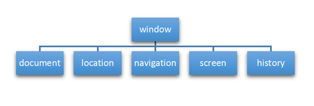
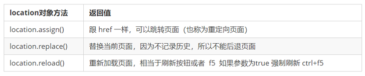
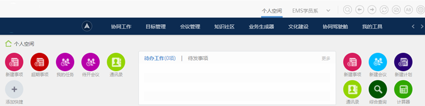

# day04 - Web APIs

> 学习目标：
>
> 能够说出常用的3-5个键盘事件
>
> 能够知道如何获取当前键盘按下的是哪个键
>
> 能够知道浏览器的顶级对象window
>
> 能够使用window.onload事件
>
> 能够使用window.onresize事件
>
> 能够说出两种定时器的区别
>
> 能够使用location对象的href属性完成页面之间的跳转
>
> 能够使用location对象获取url中的参数部分
>
> 能够使用history提供的方法实现页面刷新

## 1.1. 常用的键盘事件

### 1.1.1 键盘事件 ***

- （01-常用的键盘事件.avi）

- 事件除了使用鼠标触发，还可以使用键盘触发


- 事件：


- 注意：
  1. 如果使用addEventListener 不需要加 on
  2. onkeypress 和前面2个的区别是，它不识别功能键，比如左右箭头，shift 等。
  3. 三个事件的执行顺序是： keydown --  keypress  --- keyup （**按下--按住--抬起**）
- 案例：

```js
    <script>
        // 常用的键盘事件
        //1. keyup 按键弹起的时候触发 
        document.addEventListener('keyup', function() {
            console.log('我弹起了');
        })
        //3. keypress 按键按下的时候触发  不能识别功能键 比如 ctrl shift 左右箭头啊
        document.addEventListener('keypress', function() {
                console.log('我按下了press');
        })
        //2. keydown 按键按下的时候触发  能识别功能键 比如 ctrl shift 左右箭头啊
        document.addEventListener('keydown', function() {
                console.log('我按下了down');
        })
        // 4. 三个事件的执行顺序  keydown -- keypress -- keyup
    </script>
```

### 1.1.2 键盘事件对象 ***

- 我们来看一下常用的键盘事件对象的属性

- 键盘事件对象中的keyCode属性可以得到相应键的ASCII码值 ：


- 注意：


1. **onkeydown 和 onkeyup  不区分字母大小写**，通过keyCode属性获取到的a 和 A 得到的都是65 
2. **onkeypress 区分字母大小写** ，通过keyCode属性获取到的 a 是 97 和 A 得到的是65 
3. 但是在我们实际开发中，我们更多的使用keydown和keyup， 它能识别所有的键（包括功能键）
4. Keypress 不识别功能键，但是keyCode属性能区分大小写，返回不同的ASCII值

- 案例：**使用keyCode属性判断用户按下哪个键**


```js
    <script>
        // 键盘事件对象中的keyCode属性可以得到相应键的ASCII码值
        document.addEventListener('keyup', function(e) {
            console.log('up:' + e.keyCode);
            // 我们可以利用keycode返回的ASCII码值来判断用户按下了那个键
            if (e.keyCode === 65) {
                alert('您按下的a键');
            } else {
                alert('您没有按下a键')
            }
        })
        document.addEventListener('keypress', function(e) {
            // console.log(e);
            console.log('press:' + e.keyCode);
        })
    </script>
```

- ASCII码表


### 1.1.3 案例：模拟京东按键输入内容

（03-模拟京东按键输入内容案例.avi）

- **需求**：当我们按下 s 键， 光标就定位到搜索框（文本框获得焦点）


- **分析**：


1. 核心思路： 检测用户是否按下了s 键，如果按下s 键，就把光标定位到搜索框里面
2. 使用键盘事件对象里面的keyCode属性， 判断用户按下的是否是s键
3. 搜索框获得焦点： 使用 js 里面的 focus() 方法

- **案例代码**：


```js
    <input type="text">
    <script>
        // 获取输入框
        var search = document.querySelector('input');
		// 给document注册keyup事件
        document.addEventListener('keyup', function(e) {
            // 判断keyCode的值
            if (e.keyCode === 83) {
                // 触发输入框的获得焦点事件
                search.focus();
            }
        })
    </script>
```

- **注意**：
  - 如果通过键盘在text中输入内容，整个流程是：**keydown，keypress，内容输入到text文本框中，keyup**
  - 这里如果使用keydown或者keypress，你会发现，虽然输入s能够让搜索框获取焦点，但是s也被输入到文本框中了，因为上边的流程，keydown和keypress是在内容输入之前。

  - 所以当你使用keydown或者keypress事件处理这个逻辑的话，会先获取焦点，然后内容输入。

  - 所以，只有keyup可以。
- 问题1：search.focus()啥意思？
  - 事件触发有两种方式：
    - 用户触发
    - 程序员通过代码触发
  - 而search.focus(); 就属于程序员主动触发获取焦点事件 
  - 程序员调用事件的语法:  元素.事件名(); 
- 问题2：search.focus()与search.onfocus=function(){}的关系？
  - search.onfocus=function(){}是绑定获取焦点事件
  - search.focus()是触发获取焦点事件

### 1.1.4 案例：模拟京东快递单号查询

- （4-模拟京东快递单号查询（上）.avi - 05-模拟京东快递单号查询（下）.avi）

- **需求**：当我们在文本框中输入内容时，文本框上面自动显示大字号的内容。


- **效果**：


- 显示大号字效果如下：


- **分析**：


1. 快递单号输入内容时， 上面的大号字体盒子（con）显示(这里面的字号更大）
2. 同时把快递单号里面的值（value）获取过来赋值给 con盒子（innerText）做为内容
3. 如果快递单号里面内容为空，则隐藏大号字体盒子(con)盒子
4. **注意**： keydown 和 keypress 在文本框里面的特点： 他们两个事件触发的时候，文字还没有落入文本框中。
5. **keyup事件触发的时候， 文字已经落入文本框里面了**
6. 所以，**如果想监听文本框中输入的内容，只能使用keyup** 
7. 当我们失去焦点，就隐藏这个con盒子
8. 当我们获得焦点，并且文本框内容不为空，就显示这个con盒子

- **案例代码**：


```js
    <div class="search">
        <div class="con">123</div>
        <input type="text" placeholder="请输入您的快递单号" class="jd">
    </div>
    <script>
        // 获取要操作的元素
        var con = document.querySelector('.con');
        var jd_input = document.querySelector('.jd');
		// 给输入框注册keyup事件
        jd_input.addEventListener('keyup', function() { //**如果想监听文本框中输入的内容，只能使用keyup** 
				// 判断输入框内容是否为空
                if (this.value == '') {
                    // 为空，隐藏放大提示盒子
                    con.style.display = 'none';
                } else {
                    // 不为空，显示放大提示盒子，设置盒子的内容
                    con.style.display = 'block';
                    con.innerText = this.value;
                }
            })
        // 给输入框注册失去焦点事件，隐藏放大提示盒子
        jd_input.addEventListener('blur', function() {
                con.style.display = 'none';
            })
        // 给输入框注册获得焦点事件
        jd_input.addEventListener('focus', function() {
            // 判断输入框内容是否为空
            if (this.value !== '') {
                // 不为空则显示提示盒子
                con.style.display = 'block';
            }
        })
    </script>
```

## 1.2. BOM

（06-BOM导读.avi）

目标：

-  能够说出什么是 BOM
-  能够知道浏览器的顶级对象 window
-  能够写出页面加载事件以及注意事项
-  能够写出两种定时器函数并说出区别
-  能够说出 JS 执行机制
-  能够使用 location 对象完成页面之间的跳转
-  能够知晓 navigator 对象涉及的属性
-  能够使用 history 提供的方法实现页面刷新

### 1.2.1. 什么是BOM

（07-BOM概述.avi）

​	BOM（Browser Object Model）即浏览器对象模型，它提供了独立于内容而与**浏览器窗口进行交互的对象**，其核心对象是 **window**。

​	BOM 由一系列相关的对象构成，并且每个对象都提供了很多方法与属性。

​	BOM 缺乏标准，JavaScript 语法的标准化组织是 ECMA，DOM 的标准化组织是 W3C，BOM 最初是Netscape 浏览器标准的一部分。


### 1.2.2. BOM的构成

BOM 比 DOM 更大，它包含 DOM



### 1.2.3. 顶级对象window

- window 对象是浏览器的顶级对象，它具有双重角色。
  - 它是 JS 访问浏览器窗口的一个接口。
  - 它是一个全局对象。定义在全局作用域中的变量、函数都会变成 window 对象的属性和方法。
- 在调用的时候可以省略 window，前面学习的对话框都属于 window 对象方法，如 alert()、prompt() 等。
- 注意：window下的一个特殊属性 window.name

### 1.2.4. window对象的常见事件 ***

#### 1. 两种页面（窗口）加载事件

（09-页面加载事件.avi）

##### **第1种**

**语法**：

```javascript
window.onload = function(){}
或者 
window.addEventListener("load",function(){});
```

window.onload 是窗口 (页面）加载事件，**当文档内容完全加载完成**会触发该事件(包括图像、脚本文件、CSS 文件等), 就调用的处理函数。

**问题**：

为啥有跟click事件一样，有两种写法，因为load也是一个事件，是界面加载完成事件。

**注意**：

1. 有了 window.onload 就可以把 JS 代码写到页面元素的上方，因为 onload 是等页面内容全部加载完毕，再去执行处理函数。
2. window.onload 传统注册事件方式 只能写一次，如果有多个，会以最后一个 window.onload 为准。
3. 如果使用 addEventListener 则没有限制

##### **第2种**

**语法**：

```javascript
document.addEventListener('DOMContentLoaded',function(){})
```

**注意**：	

- DOMContentLoaded 事件触发时，仅当DOM加载完成，不包括样式表，图片，flash等等。

- IE9以上才支持！！！


- 如果页面的图片很多的话, 从用户访问到onload触发可能需要较长的时间, 交互效果就不能实现，必然影响用户的体验，此时用 DOMContentLoaded 事件比较合适。

**例子代码**：

```js
    <script>
        window.addEventListener('load', function() {
            var btn = document.querySelector('button');
            btn.addEventListener('click', function() {
                alert('点击我');
            })
        })
        window.addEventListener('load', function() {
            alert(22);
        })
        document.addEventListener('DOMContentLoaded', function() {
            alert(33);
        })
    </script>
```

#### 2. 调整窗口大小事件

（10-调整窗口大小事件.avi）

**语法**：

```javascript
 window.onresize = function(){}

 window.addEventListener("resize",function(){});

```

​	window.onresize 是调整窗口大小加载事件,  当触发时就调用的处理函数。

**注意**：

1. 只要窗口大小发生像素变化，就会触发这个事件。
2. 我们经常利用这个事件完成响应式布局。 window.innerWidth 当前屏幕的宽度

**例子代码**：

```js
    <script>
        // 注册页面加载事件
        window.addEventListener('load', function() {
            var div = document.querySelector('div');
        	// 注册调整窗口大小事件
            window.addEventListener('resize', function() {
                // window.innerWidth 获取窗口大小
                console.log('变化了');
                if (window.innerWidth <= 800) {
                    div.style.display = 'none';
                } else {
                    div.style.display = 'block';
                }
            })
        })
    </script>
    <div></div>
```


### 1.2.5. 定时器（两种）

（11-定时器之setTimeout.avi）

window 对象给我们提供了 2 个非常好用的方法-定时器。

- setTimeout() 

- setInterval()  

#### 1. setTimeout() 炸弹定时器

##### 开启定时器

**语法**：

```javascript
 window.setTimeout(回调函数, [延迟的毫秒数]);
```

setTimeout() 方法用于设置一个定时器，该定时器在定时器到期后执行调用函数。

**注意**：

1. window 可以省略。
2. 这个调用函数可以直接写函数，或者写函数名或者采取字符串‘函数名()'三种形式。第三种不推荐
3. 延迟的毫秒数省略默认是 0，如果写，必须是毫秒。
4. 因为定时器可能有很多，所以我们经常给定时器赋值一个标识符。

**回调函数理解**：

（12-回调函数以及5秒之后自动关闭的广告.avi）

setTimeout(callback,delayTime)  这个调用函数我们也称为回调函数 callback

call: 调用

back：回头

- 普通函数是按照代码顺序直接调用。
- 简单理解： 回调，就是回头调用的意思。上一件事干完，再回头调用这个函数。
  - 定时器：setTimeout(function(){},2000)，倒计时数完，再回头调用 回调函数
    - function setTimeout(callback,delaytime){  // callback = function(){},delaytime = 2000
    - 时间间隔代码
    - 一旦时间数完，callback();
    - }
  - 点击事件：div.addEventListener('click',function(){})，用户点击完成，再回头调用 回调函数
- 例如：定时器中的调用函数，事件处理函数，也是回调函数。
- 以前我们讲的   element.onclick = function(){}   或者  element.addEventListener(“click”, fn);   里面的 函数也是回调函数。
- **总结**：什么是回调函数：
  -  将函数作为参数传递，这个函数就叫做回调函数 

**例子代码**：

```js
    <script>
        // 回调函数是一个匿名函数
         setTimeout(function() {
             console.log('时间到了');

         }, 2000);
        function callback() {
            console.log('爆炸了');
        }
		// 回调函数是一个有名函数
        var timer1 = setTimeout(callback, 3000);
        var timer2 = setTimeout(callback, 5000);
		//setTimeout('callback()', 3000); // 我们不提倡这个写法
    </script>
```

##### 案例：5秒后关闭广告

**效果**： 如下图广告，5s之后自动关闭


**分析**：

1. 核心思路：5秒之后，就把这个广告隐藏起来
2. 用定时器setTimeout  

**案例代码**：

```js
<body>
    
    <script>
        // 获取要操作的元素
        var ad = document.querySelector('.ad');
		// 开启定时器
        setTimeout(function() {
            ad.style.display = 'none';
        }, 5000);
    </script>
</body>
```

##### 停止定时器

（13-清除定时器clearTimeout.avi）

接下来我们来讨论一下如何停止定时器

**语法**：

```javascript
 window.clearTimeout(timeoutID)
```

clearTimeout()方法取消了先前通过调用 setTimeout() 建立的定时器。

**注意**：

1. window 可以省略。
2. 里面的参数就是定时器的标识符 （如下代码中的**timer**）。

**例子代码**：

```js
    <button>点击停止定时器</button>
    <script>
        var btn = document.querySelector('button');
		// 开启定时器
        var timer = setTimeout(function() {
            console.log('爆炸了');
        }, 5000);
		// 给按钮注册单击事件
        btn.addEventListener('click', function() {
            // 停止定时器
            clearTimeout(timer);
        })
    </script>
```


#### 2. setInterval() 闹钟定时器 ***

（14-定时器之setInterval.avi）

##### 开启定时器

**语法**：

```javascript
 window.setInterval(回调函数, [间隔的毫秒数]);
```

setInterval() 方法重复调用一个函数，每隔这个时间，就去调用一次回调函数。

**注意**：

1. window 可以省略。
2. 这个调用函数可以直接写函数，或者写函数名或者采取字符串 '函数名()'  三种形式。
3. 间隔的毫秒数省略默认是 0，如果写，必须是毫秒，表示每隔多少毫秒就自动调用这个函数。
4. 因为定时器可能有很多，所以我们经常给定时器赋值一个标识符。
5. **第一次执行也是间隔毫秒数之后执行**，之后每隔毫秒数就执行一次。

**例子代码**：

```js
// 1. setInterval 
// 语法规范：  window.setInterval(调用函数, 延时时间);
setInterval(function() {
    console.log('继续输出');

}, 1000);
// 2. setTimeout  延时时间到了，就去调用这个回调函数，只调用一次 就结束了这个定时器
// 3. setInterval  每隔这个延时时间，就去调用这个回调函数，会调用很多次，重复调用这个函数

```

##### 案例：倒计时

（15-倒计时效果.avi）

**效果**：


**分析**：

1. 这个倒计时是不断变化的，因此需要定时器来自动变化（setInterval）
2. 三个黑色盒子里面分别存放时分秒
3. 三个黑色盒子利用innerHTML 放入计算的小时分钟秒数 
4. 第一次执行也是间隔毫秒数，**因此刚刷新页面会有空白**
5. 最好采取封装函数的方式， **这样可以先调用一次这个函数，防止刚开始刷新页面有空白问题**

**案例代码**：

```js
    <div>
        <span class="hour">1</span>
        <span class="minute">2</span>
        <span class="second">3</span>
    </div>
    <script>
        // 1. 获取元素（时分秒盒子） 
        var hour = document.querySelector('.hour'); // 小时的黑色盒子
        var minute = document.querySelector('.minute'); // 分钟的黑色盒子
        var second = document.querySelector('.second'); // 秒数的黑色盒子
        var inputTime = +new Date('2019-5-1 18:00:00'); // 返回的是用户输入时间总的毫秒数

        countDown(); // 我们先调用一次这个函数，防止第一次刷新页面有空白 

        // 2. 开启定时器
        setInterval(countDown, 1000);
		
        function countDown() {
            var nowTime = +new Date(); // 返回的是当前时间总的毫秒数
            var times = (inputTime - nowTime) / 1000; // times是剩余时间总的秒数 
            var h = parseInt(times / 60 / 60 % 24); //时
            h = h < 10 ? '0' + h : h;
            hour.innerHTML = h; // 把剩余的小时给 小时黑色盒子
            var m = parseInt(times / 60 % 60); // 分
            m = m < 10 ? '0' + m : m;
            minute.innerHTML = m;
            var s = parseInt(times % 60); // 当前的秒
            s = s < 10 ? '0' + s : s;
            second.innerHTML = s;
        }
    </script>
```

##### 停止定时器

（16-清除定时器clearInterval.avi）

**语法**：

```javascript
 window.clearInterval(intervalID);
```

clearInterval()方法取消了先前通过调用 setInterval()建立的定时器。

**注意**：

1. window 可以省略。
2. 里面的参数就是定时器的标识符 

**代码**：

```html
<body>
    <button class="begin">开启定时器</button>
    <button class="stop">停止定时器</button>
    <script>
        var begin = document.querySelector('.begin');
        var stop = document.querySelector('.stop');
        // 全局变量  null是一个空对象（定时器是一个对象，但是setInterval并没有返回定时器对象，而是返回的定时器id）
        var timer = null;
        begin.addEventListener('click', function() {
            timer = setInterval(function() {
                console.log('ni hao ma');

            }, 1000);
            console.log(timer); // 1 ，定时器的id

        })
        stop.addEventListener('click', function() {
                clearInterval(timer);
            })
        // 补充内容：
        // 变量的默认初始值，刚开始不知道是什么，那怎么给初始值？变量要存储的数据是什么类型。
        var str = '';
        // sdfasdf  在经过一堆代码执行之后，才知道具体值是什么
        str = 'zs';

        // var num = 0,1,-1

        // var flag = true,false;

        // var obj = null;
    </script>
</body>
```


#### 3. 案例：发送短信倒计时

(17-发送短信案例.avi)

**需求**：点击按钮后，该按钮60秒之内不能再次点击，防止重复发送短信。

**效果**：


点击之后的效果：


**分析**：

1. 按钮点击之后，会禁用 disabled 为true 
2. 同时按钮里面的内容会变化， 注意 button 里面的内容通过 innerHTML修改
3. 里面秒数是有变化的，因此需要用到定时器
4. 定义一个变量，在定时器里面，不断递减
5. 如果变量为0 说明到了时间，我们需要停止定时器，并且复原按钮初始状态。

**案例代码**：

```js
    手机号码： <input type="number"> <button>发送</button>
    <script>
        var btn = document.querySelector('button');
		// 全局变量，定义剩下的秒数
        var time = 3; 
		// 注册单击事件
        btn.addEventListener('click', function() {
            // 禁用按钮
            btn.disabled = true;
            // 开启定时器
            var timer = setInterval(function() {
                // 判断剩余秒数
                if (time == 0) {
                    // 清除定时器和复原按钮
                    clearInterval(timer);
                    btn.disabled = false;
                    btn.innerHTML = '发送';
                } else {
                    btn.innerHTML = '还剩下' + time + '秒';
                    time--;
                }
            }, 1000);
        });
    </script>
```


### 1.2.6. this指向问题

（18-this指向问题.avi）

​	this的指向在函数定义的时候是确定不了的，只有函数执行的时候才能确定this到底指向谁，**一般情况下this的最终指向的是那个调用它的对象**。

现阶段，我们先了解一下几个this指向

1. 全局作用域或者普通函数中，this指向全局对象window（注意定时器里面的this也指向window）
2. 方法调用中，谁调用方法，this指向谁
3. 构造函数中this指向构造函数的实例（通过构造函数new出来的对象）

例子代码：

```js
    <button>点击</button>
    <script>
        // this 指向问题 一般情况下this的最终指向的是那个调用它的对象
        // 1. 全局作用域或者普通函数中this指向全局对象window（ 注意定时器里面的this指向window）
        console.log(this);
        function fn() {
            console.log(this);
        }
        window.fn();
        window.setTimeout(function() { // 倒计时一到，其实是有window调用匿名函数，所以也可以理解为谁调用此函数，this指向谁
            console.log(this);
        }, 1000);
        // 2. 方法调用中谁调用this指向谁
        var o = {
            sayHi: function() {
                console.log(this); // this指向的是 o 这个对象
            }
        }
        o.sayHi();
        var btn = document.querySelector('button');
        btn.addEventListener('click', function() {
                console.log(this); // 事件处理函数中的this指向的是btn这个按钮对象
            })
        // 3. 构造函数中this指向构造函数的实例
        function Fun() {
            console.log(this); // this 指向的是fun 实例对象
        }
        var fun = new Fun();
    </script>
```


### 1.2.7. location对象

（22-location对象常见属性.avi）

讲这块内容之前，先讲解1.3JS执行机制

#### 1. 什么是 location 对象

window 对象给我们提供了一个 **location 属性**用于**获取或设置窗体的 URL**，并且可以用于**解析 URL** 。 因为这个属性返回的是一个对象，所以我们将这个属性也称为 **location 对象**。

#### 2. URL

- **统一资源定位符** (Uniform Resource Locator, URL) 是互联网上**标准资源的地址**。

- 互联网上的每个文件都有一个唯一的 URL，它包含的信息指出文件的位置以及浏览器应该怎么处理它。

- URL 的一般语法格式为：

  ```
   protocol://host[:port]/path/[?query]#fragment
  
   http://www.itcast.cn/index.html?name=andy&age=18#link
  ```

组成如图：


#### 3. location 对象的属性


#### 4. 案例：5分钟自动跳转页面

（23-5秒钟之后跳转页面.avi）

**效果**：


**分析**：

1. 利用定时器做倒计时效果
2. 时间到了，就跳转页面。 使用 location.href

**案例代码**：

```js
    <button>点击</button>
    <div></div>
    <script>
        var btn = document.querySelector('button');
        var div = document.querySelector('div');
        btn.addEventListener('click', function() {
            // console.log(location.href);
            location.href = 'http://www.itcast.cn';
        })
        var timer = 5;
        setInterval(function() {
            if (timer == 0) {
                location.href = 'http://www.itcast.cn';
            } else {
                div.innerHTML = '您将在' + timer + '秒钟之后跳转到首页';
                timer--;
            }
        }, 1000);
    </script>
```

#### 5. 案例：获取URL参数

（24-获取URL参数.avi）

**需求**：获取url参数内容如下：？之后的内容，即为参数


**分析**：

1. 第一个登录页面，里面有提交表单， action 提交到 index.html页面
2. 第二个页面，可以使用第一个页面的参数，这样实现了一个数据不同页面之间的传递效果
3. 第二个页面之所以可以使用第一个页面的数据，是利用了URL 里面的 location.search参数
4. 在第二个页面中，需要把这个参数提取。
5. 第一步去掉？  利用 substr 
6. 第二步 利用=号分割 键 和 值     split(‘=‘)
7. 第一个数组就是键   第二个数组就是值

**案例代码**：login.html

```html
<body>
    <!--
	补充内容：
	点击submit提交按钮之后，表单会进行提交
        1. action是什么，跳转的url
        2. 提交方式：get，post，默认get
        3. 如果是get，就会在跳转的url后跟上参数,
        index.html?uname=red: 会将表单中所有带name的表单标签的数据进行收集
        表单标签的name的值，作为参数的key
        表单标签的value的值，作为参数的value

        url携带参数的格式： index.html?key1=value1&key2=value2....
        
    -->
    <form action="index.html">
        用户名： <input type="text" name="uname" value='red'>
        <input type="submit" value="登录">
    </form>
</body>
```

**案例代码**：index.html

```js
    <div></div>
	<script>
        console.log(location.search); // ?uname=andy
        // 1.先去掉？  substr('起始的位置'，截取几个字符);
        var params = location.search.substr(1); // uname=andy
        console.log(params);
        // 2. 利用=把字符串分割为数组 split('=');
        var arr = params.split('=');
        console.log(arr); // ["uname", "ANDY"]
        var div = document.querySelector('div');
        // 3.把数据写入div中
        div.innerHTML = arr[1] + '欢迎您';
    </script>
```

#### 6. location对象的常见方法

（25-location常见方法.avi）

常见方法如下：



**例子代码**：

```js
    <button>点击</button>
    <script>
        var btn = document.querySelector('button');
        btn.addEventListener('click', function() {
            // 记录浏览历史，所以可以实现后退功能
            // location.assign('http://www.itcast.cn');
            // 不记录浏览历史，所以不可以实现后退功能
            // location.replace('http://www.itcast.cn');
            location.reload(true);
        })
    </script>
```

### 1.2.8. navigator对象

（26-navigator对象.avi）

​	navigator 对象包含有关浏览器的信息，它有很多属性，我们最常用的是 userAgent，该属性可以返回由客户机发送服务器的 user-agent 头部的值。

下面前端代码可以判断用户那个终端打开页面，实现跳转

```js
if((navigator.userAgent.match(/(phone|pad|pod|iPhone|iPod|ios|iPad|Android|Mobile|BlackBerry|IEMobile|MQQBrowser|JUC|Fennec|wOSBrowser|BrowserNG|WebOS|Symbian|Windows Phone)/i))) {
    window.location.href = "";     //手机
 } else {
    window.location.href = "";     //电脑
 }
```

**理解**：

```
这里的userAgent，翻译过来是用户代理，但是真正的意思是浏览器信息。
怎么理解呢？
用户访问www.jd.com来问京东服务器要数据，那用户是通过浏览器这个桥梁来访问的，而不是用户直接就可以京东服务器。
所以对于服务器来说，浏览器就是用户的代理。
```


### 1.2.9 history对象

（27-history对象.avi）

​	window对象给我们提供了一个 history对象，与浏览器历史记录进行交互。该对象包含用户（在浏览器窗口中）访问过的URL。


history对象一般在实际开发中比较少用，但是会在一些 OA 办公系统中见到。



## 1.3. JS执行机制 （了解）

### 1.3.1 JS 是单线程

（19-js 同步和异步.avi）

- JavaScript 语言的一大特点就是**单线程**，也就是说，**同一个时间只能做一件事**。
- 这是因为 Javascript 这门脚本语言诞生的使命所致——JavaScript 是为处理页面中用户的交互，以及操作 DOM 而诞生的。
- 比如我们对某个 DOM 元素进行添加和删除操作，不能同时进行。 应该先进行添加，之后再删除。

```js
	单线程就意味着，所有任务需要排队，前一个任务结束，才会执行后一个任务。如果前一个任务耗时很长，后一个任务就不得不一直等着。
	这样所导致的问题是： 如果 JS 执行的时间过长，这样就会造成页面的渲染不连贯，导致页面渲染加载阻塞的感觉。
```

**问题**：

以下代码执行的结果是什么？

```js
 console.log(1);   // 先打印1
 
 setTimeout(function () {
     console.log(3); // 1s钟之后打印3
 }, 1000);
 console.log(2);  
// 如果是单线程，这个代码只有在打印3之后，才打印2。 时间比较久，需要等待上个定时器执行完成
// 如果是多线程，就会打印1，直接打印2，再去打印3 （实际打印：1,2,3）
```

那么单线程，多线程是什么呢？继续往下走：

### 1.3.2 同步任务和异步任务

​	单线程导致的问题就是后面的任务等待前面任务完成，如果前面任务很耗时（比如读取网络数据），后面任务不得不一直等待！！

​	为了解决这个问题，利用多核 CPU 的计算能力，HTML5 提出 Web Worker 标准，允许 JavaScript 脚本创建多个线程，但是子线程完全受主线程控制。于是，JS 中出现了**同步任务**和**异步任务**。

#### 同步

​	前一个任务结束后再执行后一个任务，程序的执行顺序与任务的排列顺序是一致的、同步的。比如做饭的同步做法：我们要烧水煮饭，等水开了（10分钟之后），再去切菜，炒菜。

#### 异步

​	你在做一件事情时，因为这件事情会花费很长时间，在做这件事的同时，你还可以去处理其他事情。比如做饭的异步做法，我们在烧水的同时，利用这10分钟，去切菜，炒菜。


> ```js
> JS中所有任务可以分成两种，一种是同步任务（synchronous），另一种是异步任务（asynchronous）。
> 
> 同步任务指的是：
> 	在主线程上排队执行的任务，只有前一个任务执行完毕，才能执行后一个任务；
> 异步任务指的是：
> 	不进入主线程、而进入”任务队列”的任务，当主线程中的任务运行完了，才会从”任务队列”取出异步任务放入主线程执行。
> ```

**理解**：

同步，不是两件事情同时去做，而是先做一件事情，然后再做另一件事情。**他是单线程，一个人依次做多件事情**

异步，是两件事情同时去做，**他是多线程，多个人同时做多个事情**

#### 同步任务，异步任务

（20-同步任务和异步任务执行过程.avi）

**再来看一个问题**：

```javascript
console.log(1);

setTimeout(function() {

	console.log(3);

}, 0);
console.log(2);
// 结果还是1,2,3
// 为啥呢？继续往下走：
```

我们来看一下同步任务和异步任务：


了解完这一块之后，我们知道了刚刚的问题代码中，**setTimeout的回调函数，是异步任务，放到任务队列了，但是为啥后执行呢**？继续往下走：

### 1.3.3 JS执行机制

#### 1. 执行顺序

1. 先执行执行栈中的同步任务。
2. 异步任务（回调函数）放入任务队列中。（**但是不执行回调函数**）
3. 一旦执行栈中的所有同步任务执行完毕，系统就会按次序读取任务队列中的异步任务，于是被读取的异步任务结束等待状态，进入执行栈，开始执行。

如图：


#### 2. 事件循环

(21-js执行机制.avi)

**问题**：

```javascript
console.log(1);
document.onclick = function () {
    console.log('click');
}
console.log(2);
setTimeout(function () {
    console.log(3)
}, 3000)
```

分析过程：

1. 此代码中有两个异步任务，我们先给同步代码和异步代码分开：


2. 当主线代码执行完了之后，1,2打印完了。
3. 3s之后，定时任务时间到了，就将fn放到异步任务的任务队列中了：


4. 然后执行异步任务的打印3。最终出现1,2,3。

5. 如果setTimeout的回调函数的任务执行完成，异步任务队列就为空了。

6. 如果此时点击了document，onclick的回调函数就放到异步任务了

   

7. 然后执行，最终出现1,2,3，click

8. 执行完了，异步任务又会清空

9. 最后有个注意事项，主线程代码执行完成之后，会反复去异步任务中看是否有任务需要执行


**由于主线程不断的重复获得任务、执行任务、再获取任务、再执行，所以这种机制被称为事件循环（ event loop）**。

事件循环综合图：


### 1.3.4 代码思考题

```js
 console.log(1);
 document.onclick = function() {
   console.log('click');
 }

 setTimeout(function() {
   console.log(3)
 }, 3000)
 console.log(2);
```

