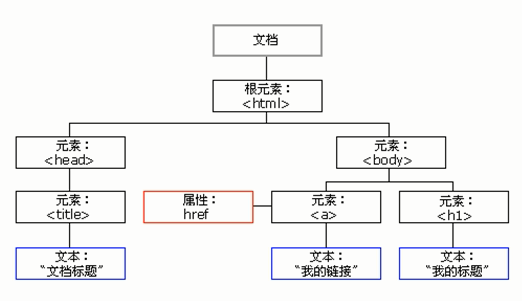

day01 - Web APIs

> 学习目标：
>
> 能够通过ID来获取元素
> 能够通过标签名来获取元素
> 能够通过class来获取元素
> 能够通过选择器来获取元素
> 能够获取body和html元素
> 能够给元素注册事件
> 能够修改元素的内容
> 能够区分innerText和innerHTML的区别
> 能够修改像div这类普通元素的属性
> 能够修改表单元素的属性
> 能够修改元素的样式属性

## 1. Web API介绍

### 1.1 API的概念

- API（Application Programming Interface，应用程序编程接口）是一些预先定义的函数
- 目的是提供应用程序与开发人员基于某软件或硬件得以访问一组例程的能力
- 而又无需访问源码，无需理解其内部工作机制细节，只需直接调用使用即可。


- 举例解释什么是API，例如：
  - C语言中有一个函数 fopen()可以打开硬盘上的文件，这个函数对于我们来说，就是一个C语言提供的打开文件的工具。
  - javascript中有一个函数alert()可以在页面弹一个提示框，这个函数就是js提供的一个弹框工具。
  - 这些工具（函数）由编程语言提供，内部的实现已经封装好了，我们只要学会灵活的使用这些工具即可。
- **总结**：API : 接口，工具，方法/属性
  - Math，Date，Array，String ： 工具类，提供的是方法和属性
  - 接口：电脑上各种插口，有充电的插口，插usb的插口，插耳机的插口，这些插口就可以理解为接口
  - 如果想充电就找到插电的插口，这个插口帮你完成充电工作，内部是如何处理的你不用关心
  - 如果你想计算一组数的最大值，那么你就找到Math的max()这个方法，直接使用即可，不需要他内部是如何实现的

### 1.2 Web  API的概念

- Web API 是**浏览器提供的一套操作浏览器功能和页面元素的 API** 
- Web API分为：**BOM 和 DOM** 
- 现阶段我们主要针对于浏览器讲解常用的 API , 主要针对浏览器做交互效果。比如我们想要浏览器弹出一个警示框， 直接使用 alert(‘弹出’)

- MDN 详细 API : https://developer.mozilla.org/zh-CN/docs/Web/API

- 因为 Web API 很多，所以我们将这个阶段称为 Web APIs

- 此处的 Web API 特指浏览器提供的一系列API(很多函数或对象方法)，即操作网页的一系列工具。例如：操作html标签、操作页面地址的方法


### 1.3 API 和 Web  API 总结

1. API 是为我们程序员提供的一个接口，帮助我们实现某种功能，我们会使用就可以了，不必纠结内部如何实现

2. Web API 主要是针对于浏览器提供的接口，主要针对于浏览器做交互效果。

3. Web API 一般都有输入和输出（函数的传参和返回值），Web API 很多都是方法（函数）

4. 学习 Web API 可以结合前面学习内置对象方法的思路学习

## 2. DOM 介绍

### 2.1 什么是DOM

- 文档对象模型（Document Object Model，简称DOM），是 [W3C](https://baike.baidu.com/item/W3C) 组织推荐的处理[可扩展标记语言](https://baike.baidu.com/item/%E5%8F%AF%E6%89%A9%E5%B1%95%E7%BD%AE%E6%A0%87%E8%AF%AD%E8%A8%80)（html或者xhtml）的标准[编程接口](https://baike.baidu.com/item/%E7%BC%96%E7%A8%8B%E6%8E%A5%E5%8F%A3)

- W3C 已经定义了一系列的 DOM 接口，通过这些 DOM 接口可以**改变网页的内容、结构和样式**

- DOM是W3C组织制定的一套处理 html和xml文档的规范，所有的浏览器都遵循了这套标准

### 2.2. DOM树

- DOM树 又称为文档树模型，把文档映射成树形结构，通过节点对象对其处理，处理的结果可以加入到当前的页面
- DOM树如下：




- 文档：**一个页面就是一个文档，DOM中使用document表示**
- 节点：网页中的所有内容，在文档树中都是节点（标签、属性、文本、注释等），使用node表示
- 标签节点：网页中的所有**标签**，通常称为元素节点，又简称为“**元素**”，使用element表示

### 2.3 总结

- DOM: 将html文档，转换为了一个document对象，并且封装了各种各样的属性和方法。
- 我们通过这些属性和方法来操作html文档：
  - 操作网页内容
  - 操作界面结构
  - 操作样式

## 3. 获取元素

- 为什么要获取页面元素？

- 例如：我们想要操作页面上的某部分(显示/隐藏，动画)，**需要先获取到该部分对应的元素**，**再对其进行操作**。


### 3.1. 根据ID获取

- 语法：`document.getElementById(id)`

- 作用：根据ID获取元素对象
- 参数：id值，区分大小写的字符串
- 返回值：元素对象 或 null

- **案例代码**


```js
<body>
    <div id="time">2019-9-9</div>
    <script>
        // 因为我们文档页面从上往下加载，所以先得有标签 所以我们script写到标签的下面
        var timer = document.getElementById('time');
        console.log(timer);
        console.log(typeof timer);
        // console.dir 打印我们返回的元素对象 更好的查看里面的属性和方法
        console.dir(timer);
    </script>
</body>
```

- 问题：document哪来的？
  - document是DOM提供的一个用于操作文档的对象（JS的内置对象）
- console.dir()理解：
  - directory：目录。（电话号码簿）
  - 元素对象的属性也有些是的对象，所以一级一级的，像是一个目录

### 3.2. 根据标签名获取元素

- 语法：`document.getElementsByTagName('标签名')` 或者` element.getElementsByTagName('标签名') `
- 作用：根据标签名获取元素对象
- 参数：标签名
- 返回值：元素对象集合（伪数组，数组元素是元素对象）

- **案例代码**


```javascript
<body>
    <ul>
        <li>知否知否，应是等你好久11</li>
        <li>知否知否，应是等你好久22</li>
        <li>知否知否，应是等你好久33</li>
        <li>知否知否，应是等你好久44</li>
        <li>知否知否，应是等你好久55</li>
    </ul>
    <ul id="nav">
        <li>生僻字</li>
        <li>生僻字</li>
        <li>生僻字</li>
        <li>生僻字</li>
        <li>生僻字</li>
    </ul>
    <script>
        // 1.返回的是 获取过来元素对象的集合 以伪数组的形式存储的
        var lis = document.getElementsByTagName('li');
        console.log(lis);
        console.log(lis[0]);
        // 2. 我们想要依次打印里面的元素对象我们可以采取遍历的方式
        for (var i = 0; i < lis.length; i++) {
            console.log(lis[i]);
        }
        // 3. element.getElementsByTagName()  可以得到这个元素里面的某些标签
        var nav = document.getElementById('nav'); // 这个获得nav 元素
        var navLis = nav.getElementsByTagName('li');
        console.log(navLis);
    </script>
</body>
```

- **注意**：getElementsByTagName()获取到的是动态集合，即：当页面增加了标签，这个集合中也就增加了元素

- **总结**： 

  - DOM提供的获取元素的方法，都是父亲获取后代（儿子/孙子...）  ***

  - DOM提供的获取元素的方法，不仅可以通过document调用（document为DOM树中的顶级对象，所以通过document可以获取整个界面的任何元素），也可以通过普通元素对象调用(限定范围查找)


### 3.3. H5新增获取元素方式

- 根据类名返回元素对象集合：`document.getElementsByClassName(‘类名’)；`
- 根据指定选择器返回第一个元素对：`document.querySelector('选择器');    `    ***
  - query：查询，selector：选择器。querySelector：根据选择器查询元素
- 根据指定选择器返回：`document.querySelectorAll('选择器');  `   ***
  - all：所有
- 注意： querySelector 和 querySelectorAll里面的选择器需要加符号
  - 比如:document.querySelector('#nav'); 
  - 这两个方法重点掌握

**案例代码**

```js
<body>
    <div class="box">盒子1</div>
    <div class="box">盒子2</div>
    <div id="nav">
        <ul>
            <li>首页</li>
            <li>产品</li>
        </ul>
    </div>
    <script>
        // 1. getElementsByClassName 根据类名获得某些元素集合
        var boxs = document.getElementsByClassName('box');
        console.log(boxs);
        // 2. querySelector 返回指定选择器的第一个元素对象  切记 里面的选择器需要加符号 .box  #nav
        var firstBox = document.querySelector('.box');
        console.log(firstBox);
        var nav = document.querySelector('#nav');
        console.log(nav);
        var li = document.querySelector('li');
        console.log(li);
        // 3. querySelectorAll()返回指定选择器的所有元素对象集合
        var allBox = document.querySelectorAll('.box');
        console.log(allBox);
        var lis = document.querySelectorAll('li');
        console.log(lis);
    </script>
</body>
```

### 3.4 获取元素方式总结

- js选定元素的方式，与css选定元素的方式一样。 ***
- 如下表：

|   选择器   |           js普通方式           |       js通用方式        | css选择器 |
| :--------: | :----------------------------: | :---------------------: | :-------: |
|  id选择器  |     getElementById('id值')     | querySelector('#id值')  |  \#id值   |
| 标签选择器 | getElementsByTagName('标签名') | querySelector('标签名') |  标签名   |
|  类选择器  | getElementsByClassName('类名') | querySelector('.类名')  |   .类名   |

- 对比理解：
  - 为啥普通方式不需要添加符号：#.，因为方法名已经指明是哪种选择器
  - 为啥js通用方式需要添加符号，因为没有指明是哪种选择器，只是说根据选择器查询。
- 问题：返回值的对比：
  -  nodelist ： 节点列表  (querySelectorAll返回的类型)
  -  htmlcollection： html标签集合   (getElementsByTagName,getElementsByClassName返回类型)
  - 这两种类型，都是可以存储多个数据的对象，都是伪数组。

### 3.5 获取特殊元素（body，html）

- 获取body：`doucumnet.body;  // 返回body元素对象`
- 获取html：`document.documentElement ; // 返回html元素对象`
  - 注意：不是document.html

## 4. 事件基础***

### 4.1. 事件概述

- JavaScript 使我们有能力创建动态页面，而事件是可以被 JavaScript 侦测到的行为
  - 简单理解： **触发--- 响应机制**
- 网页中的每个元素都可以产生某些可以触发 JavaScript 的事件
  - 例如，我们可以在用户点击某按钮时产生一个 事件，然后去执行某些操作

### 4.2. 事件三要素

- 事件源（谁）：触发事件的元素
- 事件类型（什么事件）： 例如 click 点击事件
- 事件处理程序（做啥）：事件触发后要执行的代码(函数形式)，事件处理函数
- 语法：`element.on事件名=function(){}`
- **案例代码**


```js
<body>
    <button id="btn">唐伯虎</button>
    <script>
        // 点击一个按钮，弹出对话框
        // 1. 事件是有三部分组成  事件源  事件类型  事件处理程序   我们也称为事件三要素
        //(1) 事件源 事件被触发的对象   谁  按钮
        var btn = document.getElementById('btn');
        //(2) 事件类型  如何触发 什么事件 比如鼠标点击(onclick) 还是鼠标经过 还是键盘按下
        //(3) 事件处理程序  通过一个函数赋值的方式 完成
        btn.onclick = function() {
            alert('点秋香');
        }
    </script>
</body>
```

- **理解**：
  - onclick 是一个比较特殊的方法，叫做事件
  - 事件理解：当什么时候，做什么事情
  - 这里的onclick就是：当点击的时候，执行事件处理程序
  - on：理解为**当**的意思
- **注意**：
  - 事件处理程序不是程序员主动调用的（并没有写：`btn.onclick()`）
  - 当用户点击btn的时候，由js引擎调用的，执行类似这个逻辑：`btn.onclick()`

### 4.3. 执行事件的步骤

- 添加事件过程
  1. 获取事件源
  2. 注册事件（绑定事件）
  3. 添加事件处理程序（采取函数赋值形式）
- 事件是触发响应机制**理解**：
  1. 用户触发：由用户触发事件
  2. js引擎响应：由js引擎调用事件处理程序

- **案例代码**


```js
<body>
    <div>123</div>
    <script>
        // 执行事件步骤
        // 点击div 控制台输出 我被选中了
        // 1. 获取事件源
        var div = document.querySelector('div');
        // 2.绑定事件 注册事件
        // div.onclick 
        // 3.添加事件处理程序 
        div.onclick = function() {
            console.log('我被选中了');
        }
    </script>
</body>
```

### 4.4. 常见的鼠标事件

- 常见的鼠标事件如下：


- 这些事件，后边我们陆陆续续会介绍

## 5. 操作元素

- JavaScript的 DOM 操作可以改变网页内容、结构和样式
- 我们可以利用 DOM 操作元素来**改变元素里面的内容、属性**等
- 注意：这些操作都是通过元素对象的属性实现的

### 5.1. 改变元素内容

- 内部文本：`element.innerText`
  - 识别文本
- 内部标签：`element.innerHTML` ***
  - 识别标签和文本

- **改变元素内容--案例**


```js
<body>
    <button>显示当前系统时间</button>
    <div>某个时间</div>
    <p>1123</p>
    <script>
        // 当我们点击了按钮，  div里面的文字会发生变化
        // 1. 获取元素 
        var btn = document.querySelector('button');
        var div = document.querySelector('div');
        // 2.注册事件
        btn.onclick = function() {
            // div.innerText = '2019-6-6';
            div.innerText = getDate();
        }
        function getDate() {
            var date = new Date();
            // 我们写一个 2019年 5月 1日 星期三
            var year = date.getFullYear();
            var month = date.getMonth() + 1;
            var dates = date.getDate();
            var arr = ['星期日', '星期一', '星期二', '星期三', '星期四', '星期五', '星期六'];
            var day = date.getDay();
            return '今天是：' + year + '年' + month + '月' + dates + '日 ' + arr[day];
        }
    </script>
</body>
```

- **innerText和innerHTML的区别**

  - innerText是非标准的，innerHTML是W3C标准的

  - 获取内容时的区别：

     innerText会去除空格和换行，而innerHTML会保留空格和换行	

  - 设置内容时的区别：

     innerText不会识别html，而innerHTML会识别

- **案例代码**


```js
<body>
    <div></div>
    <p>
        我是文字
        <span>123</span>
    </p>
    <script>
        // innerText 和 innerHTML的区别 
        // 1. innerText 不识别html标签 非标准  去除空格和换行
        var div = document.querySelector('div');
        // div.innerText = '<strong>今天是：</strong> 2019';
        // 2. innerHTML 识别html标签 W3C标准 保留空格和换行的
        div.innerHTML = '<strong>今天是：</strong> 2019';
        // 这两个属性是可读写的  可以获取元素里面的内容
        var p = document.querySelector('p');
        console.log(p.innerText);
        console.log(p.innerHTML);
    </script>
</body>
```

- **总结**：
  - 元素对象的属性/方法（事件），**都支持获取，修改（读写）**

### 5.2. 常用元素的属性操作

- 还有一些其他的元素常见属性
  - src、href
  - id、alt、title
- 操作语法
  - 获取：`element.属性名`
  - 设置：`element.属性名=属性值`

- **案例代码**


```js
<body>
    <button id="ldh">刘德华</button>
    <button id="zxy">张学友</button> <br>
    
    <script>
        // 修改元素属性  src
        // 1. 获取元素
        var ldh = document.getElementById('ldh');
        var zxy = document.getElementById('zxy');
        var img = document.querySelector('img');
        // 2. 注册事件  处理程序
        zxy.onclick = function() {
            img.src = 'images/zxy.jpg';
            img.title = '张学友思密达';
        }
        ldh.onclick = function() {
            img.src = 'images/ldh.jpg';
            img.title = '刘德华';
        }
    </script>
</body>
```


### 5.3. 案例：分时问候

- 需求：
  - 根据不同时间，页面显示不同图片，同时显示不同的问候语。
  - 如果上午时间打开页面，显示上午好，显示上午的图片。
  - 如果下午时间打开页面，显示下午好，显示下午的图片。
  - 如果晚上时间打开页面，显示晚上好，显示晚上的图片。

- 分析：
  1. 根据系统不同时间来判断，所以需要用到日期内置对象
  2. 利用多分支语句来设置不同的图片
  3. 需要一个图片，并且根据时间修改图片，就需要用到操作元素src属性
  4. 需要一个div元素，显示不同问候语，修改元素内容即可

- 代码：

  ```html
  
  <div>上午好</div>
  <script>
      // 根据系统不同时间来判断，所以需要用到日期内置对象
      // 利用多分支语句来设置不同的图片
      // 需要一个图片，并且根据时间修改图片，就需要用到操作元素src属性
      // 需要一个div元素，显示不同问候语，修改元素内容即可
      // 1.获取元素
      var img = document.querySelector('img');
      var div = document.querySelector('div');
      // 2. 得到当前的小时数
      var date = new Date();
      var h = date.getHours();
      // 3. 判断小时数改变图片和文字信息
      if (h < 12) {
          img.src = 'images/s.gif';
          div.innerHTML = '亲，上午好，好好写代码';
      } else if (h < 18) {
          img.src = 'images/x.gif';
          div.innerHTML = '亲，下午好，好好写代码';
      } else {
          img.src = 'images/w.gif';
          div.innerHTML = '亲，晚上好，好好写代码';
  
      }
  </script>
  ```

### 5.4. 表单元素的属性操作

- 利用 DOM 可以操作如下表单元素的属性：
- type、value、checked、selected、disabled
- 操作语法
  - 获取：`element.属性名`
  - 设置：`element.属性名=属性值`

- **案例代码**


```js
<body>
    <button>按钮</button>
    <input type="text" value="输入内容">
    <script>
        // 1. 获取元素
        var btn = document.querySelector('button');
        var input = document.querySelector('input');
        // 2. 注册事件 处理程序
        btn.onclick = function() {
            // 表单里面的值 文字内容是通过 value 来修改的
            input.value = '被点击了';
            // 如果想要某个表单被禁用 不能再点击 disabled  我们想要这个按钮 button禁用
            // btn.disabled = true;
            this.disabled = true;
            // this 指向的是事件函数的调用者 btn
        }
    </script>
</body>
```

- 注意：

  - html标签中的属性值 ， 如果是可用，不可用，两种可选状态的，
  - 那么元素对象中的属性值就是boolean类型：true，false。
  - 比如： checked、selected、disabled
  - 具体写法如下：

  ```js
  //html中如下书写：
  <button disabled="disabled" disabled>按钮</button>
  //js中如下书写：
  btn.disabled = true
  ```

### 5.5. 案例：仿京东显示密码

- 需求：点击按钮将密码框切换为文本框，并可以查看密码明文。

- 效果：

  

- 分析：

  1. 核心思路：  点击眼睛按钮，把密码框类型改为文本框就可以看见里面的密码
  2. 一个按钮两个状态，点击一次，切换为文本框，继续点击一次切换为密码框
  3. 算法：利用一个flag变量，来判断flag的值，如果是1 就切换为文本框，flag 设置为0，如果是0 就切换为密码框，flag设置为1

- 代码：

  ```html
  <body>
      <div class="box">
          <label for="">
              
          </label>
          <input type="password" name="" id="pwd">
      </div>
      <script>
          // 1. 获取元素
          var eye = document.getElementById('eye');
          var pwd = document.getElementById('pass');
          // 2. 注册事件 处理程序
          //var flag = 0;//这里用flag=0不太妥当
          var isOpen = false; //是否眼睛睁开，默认是闭着的
          eye.onclick = function() {
              // 点击一次之后， flag 一定要变化
              // if(flag==0){
              // if (isOpen == false) {//if (!isOpen) {
              //     pwd.type = 'text';
              //     eye.src = 'images/open.png';
              //     // flag = 1; // 赋值操作
              //     isOpen = true;
              // } else { // else if (isOpen == true) // else if(isOpen)
              //     pwd.type = 'password';
              //     eye.src = 'images/close.png';
              //     // flag = 0;
              //     isOpen = false;
              // }
              // 另外一种思路，不利用标记变量
              // 如果type为password，则改为text
              // 否则，反之
              if (pwd.type == 'password') { //千万要记住属性可读可写
                  pwd.type = 'text';
                  eye.src = 'images/open.png';
              } else {
                  pwd.type = 'password';
                  eye.src = 'images/close.png';
              }
  
          }
      </script>
  </body>
  ```

### 5.6. 样式属性操作

- 我们可以通过 JS 修改元素的大小、颜色、位置等样式
- 两种方式
  1. 行内样式操作：`element.style  `  
  2. 类名样式操作：`element.className `

#### 5.6.1 方式1：通过操作style属性

- 我们先来看第一种方式，行内样式操作：`element.style  `  


- **案例代码**

  ```html
  <div style="background-color:red;width:100px;"></div>
  <script>
      // 1. 获取元素
      var div = document.querySelector('div');
      console.dir(div);
      // 2. 注册事件 处理程序
      div.onclick = function() {
          // div.style里面的属性 采取驼峰命名法 
          // this.style = "background-color:red;width:100px;";//js中不这么写，太麻烦
          this.style.backgroundColor = 'purple';
          this.style.width = '250px';
      }
  </script>
  ```

- 注意：
  - JS 里面的样式采取驼峰命名法 比如 fontSize、 backgroundColor
  - JS 修改 style 样式操作，产生的是行内样式，CSS 权重比较高

#### 5.6.2 案例：淘宝点击关闭二维码

- 需求：当鼠标点击二维码关闭按钮的时候，则关闭整个二维码

- 效果：


- 分析：
  - 核心思路：  利用样式的显示和隐藏完成， display:none 隐藏元素、
  -  display:block 显示元素  点击按钮，就让这个二维码盒子隐藏起来即可

- 代码：

  ```html
  <body>
      <div class="box">
          淘宝二维码
          
          <i class="close-btn">×</i>
      </div>
      <script>
          // 1. 获取元素 
          var btn = document.querySelector('.close-btn');
          var box = document.querySelector('.box');
          // 2.注册事件 程序处理
          btn.onclick = function() {
              box.style.display = 'none';
          }
      </script>
  </body>
  ```

  

#### 5.6.3 案例：循环精灵图背景

- 需求：可以利用 for 循环设置一组元素的精灵图背景

- 效果：

  

- 分析：

  1. 首先精灵图图片排列有规律的
  2. 核心思路： 利用for循环  修改精灵图片的 背景位置 background-position
  3. 剩下的就是考验你的数学功底了
  4. 让循环里面的 i 索引号 * 44 就是每个图片的y坐标

- 代码：

  ```html
  <body>
      <div class="box">
          <ul>
              <li></li>
              <li></li>
              <li></li>
              <li></li>
              <li></li>
              <li></li>
              <li></li>
              <li></li>
              <li></li>
              <li></li>
              <li></li>
              <li></li>
          </ul>
      </div>
      <script>
          // 1. 获取元素 所有的小li 
          var lis = document.querySelectorAll('li');
          for (var i = 0; i < lis.length; i++) {
              // 让索引号 乘以 44 就是每个li 的背景y坐标  index就是我们的y坐标
              var index = i * 44;
              lis[i].style.backgroundPosition = '0 -' + index + 'px';
              //lis[i].style.backgroundPositionY = '-' + index + 'px';
          }
      </script>
  </body>
  ```

#### 5.6.4 案例：显示隐藏文本框内容

- 需求：当鼠标点击文本框时，里面的默认文字隐藏，当鼠标离开文本框时，里面的文字显示。

- 效果：

  

- 分析：

  1. 首先表单需要2个新事件，获得焦点 onfocus  失去焦点 onblur   
  2. 如果获得焦点， 判断表单里面内容是否为默认文字，如果是默认文字，就清空表单内容
  3. 如果失去焦点， 判断表单内容是否为空，如果为空，则表单内容改为默认文字

- 代码：

  ```html
  <body>
      <input type="text" value="手机">
      <script>
          // 1.获取元素
          var text = document.querySelector('input');
          // 2.注册事件 获得焦点事件 onfocus 
          text.onfocus = function() {
                  // console.log('得到了焦点');
                  if (this.value === '手机') {
                      this.value = '';
                  }
                  // 获得焦点需要把文本框里面的文字颜色变黑
                  this.style.color = '#333';
              }
              // 3. 注册事件 失去焦点事件 onblur
          text.onblur = function() {
              // console.log('失去了焦点');
              if (this.value === '') {
                  this.value = '手机';
              }
              // 失去焦点需要把文本框里面的文字颜色变浅色
              this.style.color = '#999';
          }
      </script>
  
  </body>
  ```

- 注意：两个新事件

  - 获得鼠标焦点触发：onfocus			
  	 失去鼠标焦点触发：onblur			

#### 5.6.5 方式2：通过操作className属性

- 接下来我们来看第二种操作样式的方式，类名样式操作：`element.className `


- **案例代码**


```js
<body>
    <div class="first">文本</div>
    <script>
        // 1. 使用 element.style 获得修改元素样式  如果样式比较少 或者 功能简单的情况下使用
        var test = document.querySelector('div');
        test.onclick = function() {
            // this.style.backgroundColor = 'purple';
            // this.style.color = '#fff';
            // this.style.fontSize = '25px';
            // this.style.marginTop = '100px';

            // 2. 我们可以通过 修改元素的className更改元素的样式 适合于样式较多或者功能复杂的情况
            // 3. 如果想要保留原先的类名，我们可以这么做 多类名选择器
            // this.className = 'change';
            this.className = 'first change';
            //这里可以简写为：
            this.className +=' change';//别忘了空格
        }
    </script>
</body>
```

- 注意：

1. 如果样式修改较多，可以采取操作类名方式更改元素样式。

  2. class因为是个保留字，因此使用className来操作元素类名属性
  3. className 会直接更改元素的类名，会覆盖原先的类名。

#### 5.6.6 案例：密码框格式提示错误信息

- 需求：用户如果离开密码框，里面输入个数不是6~16，则提示错误信息，否则提示输入正确信息

- 效果：

  

- 分析：

  1. 首先判断的事件是表单失去焦点 onblur
  2. 如果输入正确则提示正确的信息颜色为绿色小图标变化
  3. 如果输入不是6到16位，则提示错误信息颜色为红色 小图标变化
  4. 因为里面变化样式较多，我们采取className修改样式

- 代码：

  ```html
  <body>
      <div class="register">
          <input type="password" class="ipt">
          <p class="message">请输入6~16位密码</p>
      </div>
      <script>
          // 首先判断的事件是表单失去焦点 onblur
          // 如果输入正确则提示正确的信息颜色为绿色小图标变化
          // 如果输入不是6到16位，则提示错误信息颜色为红色 小图标变化
          // 因为里面变化样式较多，我们采取className修改样式
          // 1.获取元素
          var ipt = document.querySelector('.ipt');
          var message = document.querySelector('.message');
          //2. 注册事件 失去焦点
          ipt.onblur = function() {
              // 根据表单里面值的长度 ipt.value.length
              if (this.value.length < 6 || this.value.length > 16) {
                  // console.log('错误');
                  message.className = 'message wrong';//同样可以更换为+=
                  message.innerHTML = '您输入的位数不对要求6~16位';
              } else {
                  message.className = 'message right';
                  message.innerHTML = '您输入的正确';
              }
          }
      </script>
  </body>
  ```

### 5.3 DOM操作属性总结***

- html标签中的属性，与 DOM中元素对象的属性 基本是一致的 ***
- 具体对比表格如下：

|   html标签中的属性   | DOM中元素对象的属性 |               备注                |
| :------------------: | :-----------------: | :-------------------------------: |
|          id          |         id          |                                   |
|         name         |        name         |                                   |
|         src          |         src         |                                   |
|         href         |        href         |                                   |
|         type         |        type         |                                   |
|        value         |        value        |        操作表单控件的内容         |
| 标签内容（无此属性） |      innerHTML      |       操作非表单控件的内容        |
|       selected       |      selected       |                                   |
|       disabled       |      disabled       |                                   |
|       checked        |       checked       |                                   |
|        style         |        style        |                                   |
|   background-color   |   backgroundColor   | 属性不支持字符-，所以改为驼峰命名 |
|        class         |      className      |           class是保留字           |

- 注意

  1. 元素对象的属性，都可以获取，设置/修改（读写）

  2. 标签内容：指的是开始标签结束标签中间的内容，innerHTML操作的就是标签内容

     ```html
     <a id="" href="">我是一个链接</a> <!--我是一个链接就是标签内容  -->
     ```

  3. html标签中的属性值 ，大部分与元素对象中的**属性值**一样，基本上都是**字符串类型**的 ***

     但是如果是可用/不可用，两种可选状态的属性值就改为boolean类型的值：true，false。 ***

     比如：checked、selected、disabled

     例子：

     ```js
     //html中如下书写：
     <button disabled="disabled" disabled>按钮</button>
     //js中如下书写：
     btn.disabled = true
     ```

     . 样式属性名包含有 - ，变为驼峰命名	 

     ```js
     //html中如下书写：
     <button id="btn" style="background-color:red;font-size:10px">按钮</button>
     //js中如下书写：
     btn.style.backgroundColor = 'red';
     btn.style.background-color = 'red';// 不符合命名规范
     btn.style.width = '100px';
     //为啥不与html一致呢？
     btn.style = "background-color:red;width:100px";  //比较复杂，可读性糟糕，将style变成了一个对象，样式属性变为style的属性
     ```

     **理解**： btn.style.width，为啥style还可以点属性？

     ```js
     //之前说过一句话：谁可以点属性/方法，只有对象。
     //所以btn对象中的style属性，也是一个对象。  
     //某个对象的属性的数据类型，也可以是对象类型 （任意类型都可以） ***
     
     //这里有个例子，理解一下对象的属性还是对象
     //人类构造函数
     function Person(name,classes){
         this.name = name;
         this.classes = classes;  // 对象的属性值，可以是任意的数据类型，包含复杂类型，对象
         this.sayHi = function(){}
     }
     //班级构造函数
     function Classes(name){
         this.name = name;
     }
     //创建班级1
     var class1 = new classes('班级一;);  // class1.name ---- 班级一
     //创建zs
     var zs = new Person('张三',class1); 
     //问，如何获取张三所属班级的名称？
     //zs.classes --- class1 : 是一个班级对象
     //zs.classes.name  --- 张三所在班级的名称
     ```


## 6. 今日总结


