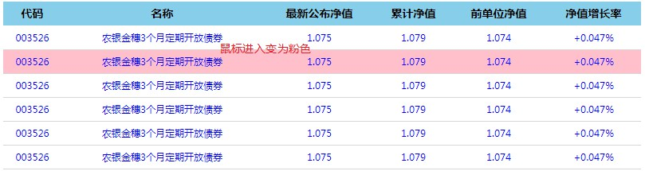

# day02 - Web APIs

> 学习目标：
>
> 能够说出排他操作的一般实现步骤
>
> 能够使用html5中的dataset方式操作自定义属性
>
> 能够根据提示完成百度换肤的案例
>
> 能够根据提示完成全选案例
>
> 能够根据提示完成tab栏切换案例
>
> 能够区分元素节点、文本节点、属性节点
>
> 能够获取指定元素的父元素
>
> 能够获取指定元素的所有子元素
>
> 能够说出childNodes和children的区别
>
> 能够使用createElement创建页面元素

## 1. 排他操作 ***

### 1.1 排他思想 （重难点）


- 如果有同一组元素，我们想要某一个元素实现某种样式， 需要用到循环的排他思想算法：

  1. 所有元素全部清除样式（干掉其他人）
  2. 给当前元素设置样式 （留下我自己）
  3. 注意顺序不能颠倒，首先干掉其他人，再设置自己

- 代码如下：

```js
    <button>按钮1</button>
    <button>按钮2</button>
    <button>按钮3</button>
    <button>按钮4</button>
    <button>按钮5</button>
    <script>
        // 1. 获取所有按钮元素
        var btns = document.getElementsByTagName('button');
        // btns得到的是伪数组  里面的每一个元素 btns[i]
        for (var i = 0; i < btns.length; i++) {
            btns[i].onclick = function() {
                // (1) 我们先把所有的按钮背景颜色去掉  干掉所有人
                for (var i = 0; i < btns.length; i++) {
                    btns[i].style.backgroundColor = '';
                }
                // (2) 然后才让当前的元素背景颜色为pink 留下我自己
                this.style.backgroundColor = 'pink';
                //注意：这里不能将this替换为btns[i]
                //btns[i].style.backgroundColor = 'pink';
            }
        }
    </script>
```

### 1.2 总结

- this和添加事件的对象**可以替换**的情况：

  - 如果是给一个元素对象添加事件，事件处理程序中可将this与div替换
  - 代码如下：

  ```js
   var div = document.getElementById('div01');
   div.onclick = function() {
       this.style.backgroundColor = 'pink';
       //这种情况下，this可以替换为添加onclick事件的对象div
       div.style.backgroundColor = 'pink';
   }
  ```

- this和添加事件的对象**不可以替换**的情况：

  - 如果是**循环给一组元素添加事件**，然后在事件处理程序中，如果想要操作当前对象（事件源），只能使用this，不能使用添加事件的对象

  - 代码如下：

    ```js
    <script>
    // 1. 获取所有按钮元素
    var btns = document.getElementsByTagName('button');
    // btns得到的是伪数组  里面的每一个元素 btns[i]
    for (var i = 0; i < btns.length; i++) {
        btns[i].onclick = function() {
            // (1) 我们先把所有的按钮背景颜色去掉  干掉所有人
            for (var i = 0; i < btns.length; i++) {
                btns[i].style.backgroundColor = '';
            }
            // (2) 然后才让当前的元素背景颜色为pink 留下我自己
            this.style.backgroundColor = 'pink';
            //注意：这里不能将this替换为btns[i]
            //btns[i].style.backgroundColor = 'pink';
        }
    }
    </script>
    ```

  - 原因：

    - 因为在事件处理程序中有一个for循环，这个循环执行完成之后i永远是5，不是当前点击的btn的序号，不能代表当前事件源
    - 即使事件处理程序中的for循环没有用i，那么外层循环的i依然是是固定的5
    - 当前此循环，不是双重循环。两个循环执行的时机不一样。***
    - 外边的循环，是在界面加载的时候执行的。 给所有的btn添加点击事件。***
    - 里边的循环，点击某个按钮的时候执行的。 清楚所有按钮的样式。（干掉所有人）***
      - 事件处理程序，也是点击某个按钮执行的，他与外层循环代码执行时机是不一样的。***

- **最终总结**：其实大家完全可以不用记什么时候可以用this，什么情况下可以用btns[i]，因为这两种情况，都可以用this，只要是在事件处理程序中想要操作事件源，就可以用this。

## 2 案例

### 2.1 百度换肤

- 需求：点击图片，切换body的背景图片
- 效果：


- 分析：
  1. 这个案例练习的是给一组元素注册事件
  2. 给4个小图片利用循环注册点击事件
  3. 当我们点击了这个图片，让我们页面背景改为当前的图片
  4. 核心算法： 把当前图片的src 路径取过来，给 body 做为背景即可
- 代码：

```js
<body>
    <ul class="baidu">
        <li></li>
        <li></li>
        <li></li>
        <li></li>
    </ul>
    <script>
        // 1. 获取元素 
        var imgs = document.querySelector('.baidu').querySelectorAll('img');
        // console.log(imgs);
        // 2. 循环注册事件 
        for (var i = 0; i < imgs.length; i++) {
            imgs[i].onclick = function() {
                // this.src 就是我们点击图片的路径   images/2.jpg
                // console.log(this.src);
                // 把这个路径 this.src 给body 就可以了
                document.body.style.backgroundImage = 'url(' + this.src + ')';
            }
        }
    </script>
</body>
```

### 2.2 表格隔行变色

- 需求：鼠标经过某个tr后变色，离开恢复原色

- 效果：

  

- 分析：

  1. 用到新的鼠标事件：**鼠标经过 onmouseover   鼠标离开 onmouseout**
  2. 核心思路：鼠标经过 tr 行，当前的行变背景颜色， 鼠标离开去掉当前的背景颜色
  3. 注意： 第一行（thead里面的行）不需要变换颜色，因此我们获取的是 tbody 里面的行

- 代码：

  ```js
  <script>
  // 1.获取元素 获取的是 tbody 里面所有的行
  var trs = document.querySelector('tbody').querySelectorAll('tr');
  // 2. 利用循环绑定注册事件
  for (var i = 0; i < trs.length; i++) {
      // 3. 鼠标经过事件 onmouseover
      trs[i].onmouseover = function() {
          // console.log(11);
          this.className = 'bg';
      }
      // 4. 鼠标离开事件 onmouseout
      trs[i].onmouseout = function() {
          this.className = '';
      }
  }
  </script>
  ```

- **注意**：mouseover与mouseout的效果，和hover是基本一样的
  - Js中的很多效果，通过css都是可以实现的
  - 以后开发，我们会用css实现某些特效，也会用Js实现某些特效
  - 至于什么情况下用css实现，什么情况下用js实现，以后会慢慢介绍

### 2.3 全选以及取消全选

- 需求：

  1. 点击上面全选复选框，下面所有的复选框都选中（全选）
  2. 再次点击全选复选框，下面所有的复选框都不中选（取消全选）
  3. 如果下面复选框全部选中，上面全选按钮就自动选中
  4. 如果下面复选框有一个没有选中，上面全选按钮就不选中
  5. 所有复选框一开始默认都没选中状态

- 效果：

  

- 分析：

  1. 全选和取消全选做法：  让下面所有复选框的checked属性（选中状态） 跟随 全选按钮即可
  2. 下面复选框需要全部选中， 上面全选才能选中做法： 给下面所有复选框绑定点击事件，每次点击，都要循环查看下面所有的复选框是否有没选中的，如果有一个没选中的， 上面全选就不选中
  3. 可以设置一个变量，来控制全选是否选中

- 代码：

  ```js
   <script>
  // 1. 全选和取消全选做法：  让下面所有复选框的checked属性（选中状态） 跟随 全选按钮即可
  // 获取元素
  var j_cbAll = document.getElementById('j_cbAll'); 
  var j_tbs = document.getElementById('j_tb').getElementsByTagName('input'); 
  // 全选按钮注册事件
  j_cbAll.onclick = function() {
      // this.checked 当前复选框的选中状态
      console.log(this.checked);
      for (var i = 0; i < j_tbs.length; i++) {
          j_tbs[i].checked = this.checked;
      }
  }
  //2. 下边ck控制全选
  //2.1 给所有的子复选框注册单击事件
  for (var i = 0; i < j_tbs.length; i++) {
      j_tbs[i].onclick = function() {
          //flag 控制全选按钮是否选中（//这个变量可以改个名字：isCheckAll，是否全选）
          //2.2 假设是全都选中了 （我们这里利用了一种假设的思想）
          var flag = true;
          //2.3 验证假设（既然是假设，就需要验证）
          // 每次点击下面的复选框都要循环检查者4个小按钮是否全被选中
          for (var i = 0; i < j_tbs.length; i++) {
              if (!j_tbs[i].checked) { // 相当于if(j_tbs[i].checked == false)
                  flag = false;
                  break; //只要有一个未选中，则认为未全选，跳出即可，后续不需要在判断
              }
          }
          //2.4 循环结束之后，就已经知道是否全选
          // 设置全选按钮的状态
          j_cbAll.checked = flag;
      }
  }
  </script>
  ```

- **注意**：

  - 这里用到了一种假设的思想，很多时候，我们都会使用这种思想
  - 刚开始是不知道是真是假，需要执行某段逻辑之后才知道，那就使用假设
  - 先假设，再验证

- **补充**：判断是否全选还有另一种思路

  - 可以通过一个计数器，来记录选中的个数，如果选中个数与j_tb的个数一致，那么就认为全选

## 3. 自定义属性操作

- 属性分为两种：
  1. 元素自带属性
  2. 程序员添加的自定义属性

### 3.1. 获取属性值

- 那么如何操作这两种属性呢？先来看如何获取：
- 获取语法：
  - 获取元素自带属性，通过点语法：`element.属性  `
  - 获取自定义属性，通过方法：`element.getAttribute('属性');`
- 代码：

```html
<div id="demo" index="1" class="nav"></div>
<script>
    var div = document.querySelector('div');
    // 1. 获取元素的属性值
    // (1) element.属性
    console.log(div.id);
    //(2) element.getAttribute('属性')  get得到获取 attribute 属性的意思 我们程序员自己添加的属性我们称为自定义属性 index
    console.log(div.getAttribute('id'));//getAttribute也可以获取自带属性，但是没有点语法方便
    console.log(div.getAttribute('index'));
</script>
```

### 3.2. 设置属性值

- 接下来，我们研究下如何设置属性
- 设置语法：
  - 设置元素自带属性，通过点语法：`element.属性='属性值'  `
  - 设置自定义属性，通过方法：`element.setAttribute('属性','属性值');`
- 代码：

```js
// 2. 设置元素属性值
// (1) element.属性= '值'
div.id = 'test';
div.className = 'navs';
// (2) element.setAttribute('属性', '值');  主要针对于自定义属性
div.setAttribute('index', 2);
div.setAttribute('class', 'footer'); // class 特殊  这里面写的就是class （也可以设置自带属性，但是麻烦）
```

### 3.3. 移除自定义属性

- 最后，我们来看一下移除属性
- 移除自定义属性语法：`element.removeAttribute('属性值')`

```js
// 3 移除属性 removeAttribute(属性)    
div.removeAttribute('index');
div.removeAttribute('id');
```

- 注意：可以移除所有属性：自带和自定义

- 移除的作用：属性和属性值都没了

  ```html
  <div style="background-color:red"  id="id"></div>
  //赋值为空字符串：属性还在，但是值没了
  div.id= "";//<div style="background-color:red"  id=""></div>
  div.setAttribute('id','');//<div style="background-color:red"  id=""></div>
  //移除效果： 这个属性没了
  div.removeAttribute('id') //<div style="background-color:red"  ></div>
  ```

### 3.4 总结 ***

- 属性分为两种：
  1. 元素自带属性
  2. 程序员添加的自定义属性
- 操作属性：
  1. **自带属性**，**通过点语法**，获取和设置
  2. **自定义属性**，**通过xxxAttribute()方法**，获取和设置并且可以移除
  3. 虽然xxxAttribute()方法也可以操作自带（原生）属性，但是不规范并且不方便

### 3.5. 案例：tab栏 （难点）

- 需求：当鼠标点击上面相应的选项卡（tab），下面内容跟随变化

- 效果：

  

- 分析：

  1. Tab栏切换有2个大的模块
  2. 上的模块选项卡，点击某一个，当前这一个底色会是红色，其余不变（排他思想） 修改类名的方式
  3. 下面的模块内容，会跟随上面的选项卡变化。所以下面模块变化写到点击事件里面
  4. 规律：下面的模块显示内容和上面的选项卡一一对应，相匹配
  5. 核心思路： 给上面的tab_list 里面的所有小li 添加自定义属性，属性值从0开始编号 
  6. 当我们点击tab_list 里面的某个小li，让tab_con 里面对应序号的 内容显示，其余隐藏（排他思想）

- 代码：

```js
    <script>
        // 获取元素
        var tab_list = document.querySelector('.tab_list');
        var lis = tab_list.querySelectorAll('li');
        var items = document.querySelectorAll('.item');
        // for循环，给选项卡绑定点击事件
        for (var i = 0; i < lis.length; i++) {
            // 开始给5个小li 设置索引号 
            lis[i].setAttribute('index', i);
            lis[i].onclick = function() {
                // 1. 上的模块选项卡，当前这一个底色会是红色，其余不变（排他思想）
                // 干掉所有人 其余的li清除 class 这个类
                for (var i = 0; i < lis.length; i++) {
                    lis[i].className = '';
                }
                // 留下我自己 
                this.className = 'current';
                // 2. 下面的显示内容模块
                var index = this.getAttribute('index');
                console.log(index);
                // 干掉所有人 让其余的item 这些div 隐藏
                for (var i = 0; i < items.length; i++) {
                    items[i].style.display = 'none';
                }
                // 留下我自己 让对应的item 显示出来
                items[index].style.display = 'block';
            }
        }
    </script>
```

- **总结**：
  - 在循环添加事件之后，事件处理程序中不能使用i，需要使用自定义属性。 因为循环完成之后，i是固定的值
  - 在循环添加点击事件的时候，同时添加自定义属性，自定义属性值就是索引
  - 循环过程中i的值是变化的，可以用，但是循环执行完成之后i是固定值，不能用
- **自定义属性的应用场景**：***
  - 
    一组元素，如果想进行排行（添加索引），那就使用自定义属性。（一组元素，默认每个元素是不知道在自家排行老几的。）
  - 自定义属性就是用于保存数据的，这里保存的数据，就是每个元素自家的排行索引。

### 3.6. H5自定义属性

- 自定义属性目的：**是为了保存并使用数据**。有些数据可以保存到页面中而不用保存到数据库中。

- 但是有些自定义属性很容易引起歧义，不容易判断是元素的内置属性还是自定义属性。


- H5规定自定义属性data-开头做为属性名并且赋值。
  - `<div data-index=“1”></div>`
- 获取语法：`element.getAttribute(‘data-index’);`
- H5新增获取语法：`element.dataset.index  或者 element.dataset[‘index’]   ie 11才开始支持`
- 设置语法：`element.setAttribute(‘data-index’, 2)`
- 代码：

```js
    <div getTime="20" data-index="2" data-list-name="andy"></div>
    <script>
        var div = document.querySelector('div');
        // console.log(div.getTime);
        console.log(div.getAttribute('getTime'));
        div.setAttribute('data-time', 20);
        console.log(div.getAttribute('data-index'));
        console.log(div.getAttribute('data-list-name'));
        // h5新增的获取自定义属性的方法 它只能获取data-开头的
        // dataset 是一个集合里面存放了所有以data开头的自定义属性
        console.log(div.dataset);
        console.log(div.dataset.index);
        console.log(div.dataset['index']);
        // 如果自定义属性里面有多个-链接的单词，我们获取的时候采取 驼峰命名法
        console.log(div.dataset.listName);
        console.log(div.dataset['listName']);
    </script>
```

## 4. 节点操作

### 4.1. 节点概述

- **网页中的所有内容都是节点（标签、属性、文本、注释等）**，在DOM 中，节点使用 node 来表示。

  

- HTML DOM 树中的所有节点均可通过 JavaScript 进行访问，所有 HTML 元素（节点）均可被修改，也可以创建或删除。

- 节点属性：

  1. 属性：

  		nodeType（节点类型）、nodeName（节点名称）和nodeValue

  2. 节点类型

  		元素节点  nodeType  为 1  ***
  	属性节点  nodeType  为 2
  	文本节点  nodeType  为 3 （文本节点包含文字、空格、换行等）

- 获取元素通常使用两种方式：

  1. 利用 DOM 提供的方法获取元素
  2. 利用节点层级关系获取元素

- 总结：

  - 利用节点获取元素比较简单，那么可以替代原始DOM方式么？
  - 不可以，因为根据层级关系查找节点，需要通过一个元素对象出发。
  - 我们一般通过DOM提供的获取元素的方法，获取一个元素，
  - 然后利用节点层级关系获取 **与其相关** 的元素。
  - 例如：4.3的例子

### 4.2. 节点层级

​	利用 DOM 树可以把节点划分为不同的层级关系，常见的是**父子兄层级关系**。

​    

### 4.3. 父级节点 ***

- 语法：`element.parentNode`
- 如果element没有父节点，那么就返回null
- 例子：

```js
    <div class="demo">
        <div class="box">
            <span class="erweima">×</span>
        </div>
    </div>
    <script>
        // 1. 父节点 parentNode
        var erweima = document.querySelector('.erweima');
        // var box = document.querySelector('.box');
        // 得到的是离元素最近的父级节点(亲爸爸) 如果找不到父节点就返回为 null
        console.log(erweima.parentNode);
    </script>
```

### 4.4. 子节点

- 获取**子节点**语法：`element.childNodes`，返回element的所有子节点的集合 （包括元素节点，文本节点等）
- 获取**子元素节点**语法：`element.children `，返回element的所有的子元素节点 ***
  - children虽然是非标准，但是大部分浏览器都支持
- 例子：

```js
    <ul>
        <li>我是li</li>
        <li>我是li</li>
        <li>我是li</li>
        <li>我是li</li>
    </ul>
    <script>
        // DOM 提供的方法（API）获取
        var ul = document.querySelector('ul');
        var lis = ul.querySelectorAll('li');
        // 1. 子节点  childNodes 所有的子节点 包含 元素节点 文本节点等等
        console.log(ul.childNodes);
        console.log(ul.childNodes[0].nodeType);
        console.log(ul.childNodes[1].nodeType);
        // 2. children 获取所有的子元素节点 也是我们实际开发常用的
        console.log(ul.children);
    </script>
```

- 获取第一个子节点：`element.firstChild`

			返回element的第一个子节点 （这个子节点可以是元素节点，也可以是文本节点）

- 获取最后一个子节点：`element.lastChild`

			返回element的最后一个子节点（这个子节点可以是元素节点，也可以是文本节点）

- 获取第一个子元素节点：`element.firstElementChild IE9+`

			返回第一个子元素节点

- 获取最后一个子元素节点：`element.lastElementChild  IE9+`

			返回最后一个子元素节点

- 实际开发中，firstChild 和 lastChild 包含其他节点，操作不方便，而 firstElementChild 和 lastElementChild又有兼容性问题，那么我们如何获取第一个子元素节点或最后一个子元素节点呢？
  - 如果想要第一个子元素节点，可以使用 `element.chilren[0] `
  - 如果想要最后一个子元素节点，可以使用 `element.chilren[element.chilren.length - 1]`

- 例子：


```js
    <ol>
        <li>我是li1</li>
        <li>我是li2</li>
        <li>我是li3</li>
        <li>我是li4</li>
        <li>我是li5</li>
    </ol>
    <script>
        var ol = document.querySelector('ol');
        // 1. firstChild 第一个子节点 不管是文本节点还是元素节点
        console.log(ol.firstChild);
        console.log(ol.lastChild);
        // 2. firstElementChild 返回第一个子元素节点 ie9才支持
        console.log(ol.firstElementChild);
        console.log(ol.lastElementChild);
        // 3. 实际开发的写法  既没有兼容性问题又返回第一个子元素
        console.log(ol.children[0]);
        console.log(ol.children[ol.children.length - 1]);
    </script>
```

### 4.5. 案例：新浪下拉菜单

- 需求：鼠标悬浮菜单之后出现下拉菜单

- 效果：

  

- 分析：

  1. 导航栏里面的li 都要有鼠标经过效果，所以需要循环注册鼠标事件
  2. 核心原理： 当鼠标经过li 里面的 第二个孩子 ul 显示， 当鼠标离开，则ul 隐藏

- 代码：

```js
    <script>
        // 1. 获取元素
        var nav = document.querySelector('.nav');
        var lis = nav.children; // 得到4个小li
        // 2.循环注册事件
        for (var i = 0; i < lis.length; i++) {
            lis[i].onmouseover = function() {
                this.children[1].style.display = 'block';
            }
            lis[i].onmouseout = function() {
                this.children[1].style.display = 'none';
            }
        }
    </script>
```

### 4.6. 兄弟节点

1. 获取下一个兄弟节点：`element.nextSibling`

		返回element的下一个兄弟节点（这个节点可以是元素节点，也可以是文本节点）

2. 获取上一个兄弟节点：`element.previousSibling`

		返回element的上一个兄弟节点（这个节点可以是元素节点，也可以是文本节点）

3. 获取下一个兄弟元素节点：`element.nextElementSibling  IE9+` ***

		返回element的下一个兄弟元素节点

4. 获取上一个兄弟元素节点：`element.previousElementSibling  IE9+` ***

		返回element的上一个兄弟元素节点

- 例子：

```js
    <div>我是div</div>
    <span>我是span</span>
    <script>
        var div = document.querySelector('div');
        // 1.nextSibling 下一个兄弟节点 包含元素节点或者 文本节点等等
        console.log(div.nextSibling);
        console.log(div.previousSibling);
        // 2. nextElementSibling 得到下一个兄弟元素节点
        console.log(div.nextElementSibling);
        console.log(div.previousElementSibling);
    </script>
```

- 获取下一个兄弟元素兼容函数写法：


```js
   function getNextElementSibling(element) {
      var el = element;
      while (el = el.nextSibling) {
        if (el.nodeType === 1) {
            return el;
        }
      }
      return null;
    }  
```

### 4.7. 创建节点 ***

- 创建节点：`document.createElement('tagName')`
- document.createElement() 方法创建由 tagName 指定的 HTML 元素。
- 因为这些元素原先不存在，是根据我们的需求动态生成的，所以我们也称为动态创建元素节点。

### 4.8. 添加节点 ***

- 创建出来的元素节点，需要添加到界面上才能显示

- 添加方式：

  1. 末尾添加：`element.appendChild(childNode) `
     将 childNode 添加到element的子节点列表的末尾  （追加）

  2. 指定位置添加：`element.insertBefore(childNode, 指定元素) `

     将childNode 添加到element的指定元素的前面

- 例子：

```js
    <ul>
        <li>123</li>
    </ul>
    <script>
        // 1. 创建节点元素节点
        var li = document.createElement('li');
        // 2. 添加节点 node.appendChild(child)  node 父级  child 是子级 后面追加元素
        var ul = document.querySelector('ul');
        ul.appendChild(li);
        // 3. 添加节点 node.insertBefore(child, 指定元素);
        var li2 = document.createElement('li');
        ul.insertBefore(li2, ul.children[0]);
        // 4. 我们想要页面添加一个新的元素 ： 1. 创建元素 2. 添加元素
    </script>
```

### 4.9. 案例：简单版发布留言

- 需求：输入内容，点击发布，显示到界面上

- 效果：

  

- 分析：

  1. 核心思路： 点击按钮之后，就动态创建一个li，添加到ul 里面。
  2. 创建li 的同时，把文本域里面的值通过li.innerHTML 赋值给 li
  3. 如果想要新的留言后面显示就用 appendChild 如果想要前面显示就用insertBefore

- 代码：

```js
<body>
    <textarea name="" id=""></textarea>
    <button>发布</button>
    <ul>

    </ul>
    <script>
        // 1. 获取元素
        var btn = document.querySelector('button');
        var text = document.querySelector('textarea');
        var ul = document.querySelector('ul');
        // 2. 注册事件
        btn.onclick = function() {
            if (text.value == '') {
                alert('您没有输入内容');
                return false;
            } else {
                // console.log(text.value);
                // (1) 创建元素
                var li = document.createElement('li');
                // 先有li 才能赋值
                li.innerHTML = text.value;
                // (2) 添加元素
                // ul.appendChild(li);
                ul.insertBefore(li, ul.children[0]);
            }
        }
    </script>
</body>
```

## 5.难点总结

- 循环添加事件，在事件处理程序中不能使用i
  - 因为i在循环结束之后，值是定死的。
  - 在事件处理程序中如何想获取，当前点击的这个元素的索引，就需要通过自定义属性来处理：例如tab烂切换
  - 代码：

```js
var tab_list = document.querySelector('.tab_list');
var lis = tab_list.querySelectorAll('li');
var items = document.querySelectorAll('.item');
// for循环绑定点击事件
for (var i = 0; i < lis.length; i++) {
    // 开始给5个小li 设置索引号 
    lis[i].setAttribute('index', i);
    lis[i].onclick = function () {
        var i;
        console.log(i);// 5 , undefined
        // 2. 下面的显示内容模块
        var index = this.getAttribute('index');
        // 干掉所有人 让其余的item 这些div 隐藏
        for (var i = 0; i < items.length; i++) {
            items[i].style.display = 'none';
        }
        // 留下我自己 让对应的item 显示出来
        items[index].style.display = 'block';
    }
}
```

- 循环添加事件，在事件处理程序中不能使用xx[i]
  - 因为i在循环结束之后，值是定死的。
  - 在事件处理程序中如果想获取当前点击的事件源，直接使用this即可，例如
  - 代码：

```js
for (var i = 0; i < btns.length; i++) { // 界面加载时执行
    btns[i].onclick = function () {
        // (1) 我们先把所有的按钮背景颜色去掉  干掉所有人
        for (var i = 0; i < btns.length; i++) { 
            btns[i].style.backgroundColor = '';
        }
        // (2) 然后才让当前的元素背景颜色为pink 留下我自己
        this.style.backgroundColor = 'pink'; // 当前的事件源
        // this 不能换成 btns[i]

    }
}
```