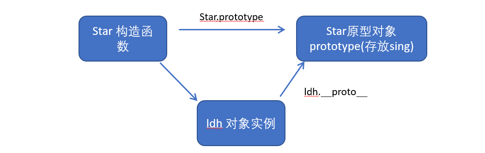

# JavaScript高级第02天笔记

## 1. 构造函数和原型

### 1.1 对象的三种创建方式--复习 

（02-利用构造函数创建对象.avi）

1. 字面量方式

   ```js
   var obj = {};
   ```

2. new关键字

   ```js
   var obj = new Object();
   ```

3. 构造函数方式

   ```js
   function Person(name，age){
     this.name = name;
     this.age = age;
   }
   var obj = new Person('zs'，12);
   ```

### 1.2 静态成员和实例成员 

(03-实例成员和静态成员.avi)

- JavaScript 的构造函数中可以添加一些成员
- 可以在构造函数本身上添加，也可以在构造函数内部的 this 上添加
- 通过这两种方式添加的成员，就分别称为静态成员和实例成员

#### 1.2.1 实例成员

- **实例成员就是构造函数内部通过this添加的成员** 
- 如下列代码中uname age sing 就是实例成员，实例成员只能通过实例化的对象来访问

```js
 function Star(uname， age) {
     this.uname = uname;
     this.age = age;
     this.sing = function() {
     console.log('我会唱歌');
    }
}
var ldh = new Star('刘德华'， 18);
console.log(ldh.uname);//实例成员只能通过实例化的对象来访问
```

#### 1.2.2 静态成员 

- **静态成员 在构造函数本身上添加的成员** 
-  如下列代码中 sex 就是静态成员，静态成员只能通过构造函数来访问

```js
 function Star(uname， age) {
     this.uname = uname;
     this.age = age;
     this.sing = function() {
     console.log('我会唱歌');
    }
}
Star.sex = '男';//针对不同的实例对象，此静态成员的内容是固定的，不变化的。
var ldh = new Star('刘德华'， 18);
var zxy = new Star('xx'， xx);
console.log(Star.sex);//静态成员只能通过构造函数来访问
```

### 1.3 构造函数的问题 

（04-构造函数原型对象prototype.avi）

构造函数方法很好用，但是存在浪费内存的问题。（proto：原型机，样机;）


**问题描述**：这里的ldh和zxy都存储了sing这个一模一样的方法，造成了内存浪费。

那如何解决呢？通过构造函数原型对象prototype。

### 1.4 构造函数原型prototype ***

- 构造函数通过原型分配的函数是所有对象所**共享的**

- JavaScript 规定，**每一个构造函数都有一个prototype 属性**，指向另一个对象
- 注意：这个prototype就是一个对象，这个对象的所有属性和方法，都会被构造函数所拥有
- **我们可以把那些不变的方法，直接定义在 prototype 对象上，这样所有对象的实例就可以共享这些方法**
- 代码：

```js
    <script>
        // 1. 构造函数的问题. 
        function Star(uname， age) {
            this.uname = uname;
            this.age = age;
            // this.sing = function() {
            //     console.log('我会唱歌');

            // }
        }
        Star.prototype.sing = function() {
            console.log('我会唱歌');
        }
        var ldh = new Star('刘德华'， 18);
        var zxy = new Star('张学友'， 19);
        console.log(ldh.sing === zxy.sing);//true，证明这两个对象共享了sing方法
        // console.dir(Star);
        ldh.sing();//实例对象可以直接访问通过构造函数的原型对象添加的方法
        zxy.sing();
        // 2. 一般情况下，我们的公共属性定义到构造函数里面， 公共的方法我们放到原型对象身上
    </script>
```


### 1.5 对象原型 

(05-对象原型\__proto__.avi)

- **对象都会有一个属性 \__proto__** ，指向构造函数的 prototype 原型对象，之所以我们对象可以使用构造函数 prototype 原型对象的属性和方法，就是因为对象有 \_\_proto__ 原型的存在。
- \__proto__对象原型和原型对象 prototype 是等价的
- \__proto__对象原型的意义就在于为对象的查找机制提供一个方向，或者说一条路线，但是它是一个非标准属性，因此实际开发中，不可以使用这个属性，它只是内部指向原型对象 prototype

代码：

```js
    <script>
        function Star(uname， age) {
            this.uname = uname;
            this.age = age;
        }
        Star.prototype.sing = function() {
            console.log('我会唱歌');
        }
        var ldh = new Star('刘德华'， 18);
        var zxy = new Star('张学友'， 19);
        ldh.sing();
        console.log(ldh); // 对象身上系统自己添加一个 __proto__ 指向我们构造函数的原型对象 prototype
        console.log(ldh.__proto__ === Star.prototype);//true
        // 方法的查找规则: 首先先看ldh 对象身上是否有 sing 方法，如果有就执行这个对象上的sing
        // 如果么有sing 这个方法，因为有__proto__ 的存在，就去构造函数原型对象prototype身上去查找sing这个方法
    </script>
```

分析图如下：



静态成员与原型对象成员对比： ***

```js
 <script>
        function Star(uname, age) {
            this.uname = uname;// 公共属性:只有属性名是一样的
            this.age = age;
        }
        //1.构造函数添加公用属性
        Star.sex = '男';  //  固定属性:属性名和值都一样
        var ldh = new Star('刘德华', 18);
        var zxy = new Star('张学友', 19);
        console.log(ldh.sex); //对象无法访问静态成员
        console.log(zxy.sex);
        console.log(Star.sex);

        //2.构造函数添加公共方法
        Star.sing = function() {
            console.log("唱歌");

        };
        // console.log(ldh.sing()); //对象无法访问静态成员
        // console.log(zxy.sing());
        console.log(Star.sing());


        //3.构造函数原型对象添加公共属性
        Star.prototype.sex = '女';
        console.log(ldh.sex); //对象可以访问prototype成员
        console.log(zxy.sex);
        //4.构造函数原型对象添加公共方法
        Star.prototype.sing = function() {
            console.log("唱歌");
        }
        ldh.sing(); //对象可以访问prototype成员
        zxy.sing();
        //总结：
        //1.构造函数对象Star与构造函数原型对象Star.prototype，都可以共享公共的方法和属性
        //2.但是构造函数对象存储的成员，对象无法访问，而原型对象的成员可以通过对象访问
        //3.所以我们一般使用原型对象存储公共的方法和属性
        //问题：公共属性不是要构造函数添加么？怎么也可以通过prototype添加？
        // 构造函数添加的公共的属性，有一个特点，属性值可能不一致
        // prototype添加的公共的属性，属性值是一样的
        // 就是说prototype添加的成员，是完全一样的，成员名和成员值都一样
        // 而构造函数添加的只有属性名是一样的，属性值可能不一样
    </script>

```


### 1.6 constructor构造函数 

（06-原型constructor构造函数.avi）

- **对象原型（ \_\_proto__）和构造函数（prototype）原型对象里面都有一个属性 constructor 属性** ，constructor 我们称为构造函数，因为它指向构造函数本身。

  

- constructor 主要用于记录该对象引用于哪个构造函数，它可以让原型对象重新指向原来的构造函数。

  - constructor用于记录对象是用哪个构造函数创建出来的

- **一般情况下，对象的方法都在构造函数的原型对象中设置**。

  如果有多个对象的方法，我们可以给原型对象采取对象形式赋值，但是这样就会覆盖构造函数原型对象原来的内容，这样修改后的原型对象 constructor  就不再指向当前构造函数了。此时，我们可以在修改后的原型对象中，添加一个 constructor 指向原来的构造函数。

- 如果我们修改了原来的原型对象，给原型对象赋值的是一个对象，则必须手动的利用constructor指回原来的构造函数如：


```js
 function Star(uname， age) {
     this.uname = uname;
     this.age = age;
 }
 // 很多情况下，我们需要手动的利用constructor 这个属性指回 原来的构造函数
 // 比如我们需要给原型对象指定多个函数，如下
        // Star.prototype.sing = function() {
        //     console.log('我会唱歌');
        // };
        // Star.prototype.movie = function() {
        //     console.log('我会演电影');
        // }
 // 指定多个函数时，上述代码比较麻烦，我们一般会采用对象的形式指定：
 Star.prototype = {
// 如果我们修改了原来的原型对象，给原型对象赋值的是一个对象，则必须手动的利用constructor指回原来的构造函数
   constructor: Star， // 手动设置指回原来的构造函数，如果没有收动指回构造函数，则会指向一个Object
   sing: function() {
     console.log('我会唱歌');
   }，
   movie: function() {
     console.log('我会演电影');
   }
}
var zxy = new Star('张学友'， 19);
```

### 1.7 构造函数实例和原型对象三角关系 

（07-构造函数实例和原型对象三角关系.avi）

- 1.构造函数的prototype属性指向了构造函数原型对象
- 2.实例对象是由构造函数创建的，实例对象的\_\_proto__属性指向了构造函数的原型对象
- 3.构造函数的原型对象的constructor属性指向了构造函数，实例对象的原型的constructor属性也指向了构造函数
- 关系图如下：


**原型对象总结**：

[js原型对象 - 简书.html](files/js原型对象 - 简书.html)

### 1.8 原型链和成员的查找机制

#### 1.8.1 原型链

（08-原型链.avi）

- 任何对象都有原型对象，也就是prototype属性
- 任何原型对象也是一个对象，该对象就有__proto__属性
- 这样一层一层往上找，就形成了一条链，我们称此为原型链

原型链图：


代码：

```js
    <script>
        function Star(uname, age) {
            this.uname = uname;
            this.age = age;
        }
        Star.prototype.sing = function() {
            console.log('我会唱歌');
        }
        var ldh = new Star('刘德华', 18);
        // 1. 只要是对象就有__proto__ 原型, 指向原型对象
        console.log(Star.prototype);
        console.log(Star.prototype.__proto__ === Object.prototype);
        // 2.我们Star原型对象里面的__proto__原型指向的是 Object.prototype
        console.log(Object.prototype.__proto__);
        // 3. 我们Object.prototype原型对象里面的__proto__原型  指向为 null
    </script>
```

#### 1.8.2 查找机制 

（09-对象成员查找规则.avi）

- 当访问一个对象的属性（包括方法）时，首先查找这个对象自身有没有该属性
- 如果没有就查找它的原型（也就是 \_\_proto__指向的 prototype 原型对象）
- 如果还没有就查找原型对象的原型（Object的原型对象）
- 依此类推一直找到 Object 为止（null）
- \_\_proto__对象原型的意义就在于为对象成员查找机制提供一个方向，或者说一条路线
- 代码：

```js
    <script>
        function Star(uname, age) {
            this.uname = uname;
            this.age = age;
        }
        Star.prototype.sing = function() {
            console.log('我会唱歌');

        }
        Star.prototype.sex = '女';
        // Object.prototype.sex = '男';
        var ldh = new Star('刘德华', 18);
        ldh.sex = '男';
        console.log(ldh.sex);
        console.log(Object.prototype);
        console.log(ldh);
        console.log(Star.prototype);
        console.log(ldh.toString());
    </script>
```


### 1.9 原型对象中this指向 

（10-原型对象this指向.avi）

不管构造函数中的this还是原型对象的this，都指向我们new出来的实例对象

代码：

```js
 <script>
        function Star(uname, age) {
            this.uname = uname;
            this.age = age;
        }
        var that;
        Star.prototype.sing = function() {
            console.log('我会唱歌');
            that = this;
        }
        var ldh = new Star('刘德华', 18);
        // 1. 在构造函数中,里面this指向的是对象实例 ldh
        ldh.sing();
        console.log(that === ldh);

        // 2.原型对象函数里面的this 指向的是 实例对象 ldh
    </script>
```


### 1.10 通过原型为数组扩展内置方法

（11-利用原型对象扩展内置对象方法.avi）

- 可以通过原型对象，对原来的内置对象进行扩展自定义的方法
- 比如给数组增加自定义求偶数和的功能
- **注意**：数组和字符串内置对象不能给原型对象覆盖操作 Array.prototype = {} ，只能是 Array.prototype.xxx = function(){} 的方式
- 代码：

```js
 <script>
// 原型对象的应用 扩展内置对象方法
 Array.prototype.sum = function() {//此时数组对象中已经存在sum()方法了，可以使用数组.sum()进行数据的求和
       var sum = 0;
       for (var i = 0; i < this.length; i++) {
           sum += this[i];
       }
       return sum;
   };
// Array.prototype = {// 不能直接覆盖，因为数组中原本是自带非常多的方法的
//     sum: function() {
//         var sum = 0;
//         for (var i = 0; i < this.length; i++) {
//             sum += this[i];
//         }
//         return sum;
//     }

// }
var arr = [1, 2, 3];
console.log(arr.sum());
console.log(Array.prototype);
var arr1 = new Array(11, 22, 33);
console.log(arr1.sum());
</script>
```

## 2. 继承

- ES6之前并没有给我们提供 extends 继承
- 我们可以通过构造函数+原型对象模拟实现继承，被称为组合继承 

### 2.1 call() 

(12-call方法的作用.avi)

- call()可以调用函数
- call()可以修改this的指向
- 使用call()的时候，参数一是修改后的this指向，参数2，参数3..使用逗号隔开连接
- 语法：

```js
fun.call(thisArg, arg1, arg2, ...)
//thisArg ：当前调用函数 this 的指向对象
//arg1，arg2：传递的其他参数
```

- 代码：

```js
    <script>
        // call 方法
        function fn(x, y) {
            console.log('我想喝手磨咖啡');
            console.log(this);
            console.log(x + y);
        }
        var o = {
            name: 'andy'
        };
        // fn();
        // 1. call() 可以调用函数
        // fn.call();
        // 2. call() 可以改变这个函数的this指向 此时这个函数的this 就指向了o这个对象
        fn.call(o, 1, 2);
    </script>
```

### 2.2 子构造函数继承父构造函数中的属性

(13-利用父构造函数继承属性.avi)

- ES6之前并没有给我们提供 extends 继承。
- 我们可以通过构造函数+原型对象模拟实现继承，被称为组合继承。 
- 那么我们在ES6之前，具体如何实现继承呢？
- 通过子构造函数继承父构造函数中的属性，具体步骤如下：

1. 先定义一个父构造函数
2. 再定义一个子构造函数
3. 子构造函数继承父构造函数的属性(使用call方法)

代码：

```js
 // 1. 父构造函数
 function Father(uname， age) {
   // this 指向父构造函数的对象实例
   this.uname = uname;
   this.age = age;
 }
  // 2 .子构造函数 
function Son(uname， age， score) {
  // this 指向子构造函数的对象实例
  // 3.使用call方式实现子继承父的属性
  Father.call(this， uname， age);
  this.score = score;
}
var son = new Son('刘德华'， 18， 100);
console.log(son);
```

### 2.3 借用原型对象继承方法

(14-利用原型对象继承方法(上).avi+15-利用原型对象继承方法(下).avi)

- 再来看另一种实现方式
- 借用原型对象继承方法
- 实现步骤如下：

1. 先定义一个父构造函数
2. 再定义一个子构造函数
3. 子构造函数继承父构造函数的属性(使用call方法)

- 代码：

```js
// 1. 父构造函数
function Father(uname， age) {
  // this 指向父构造函数的对象实例
  this.uname = uname;
  this.age = age;
}
Father.prototype.money = function() {
  console.log(100000);
 };
 // 2 .子构造函数 
  function Son(uname， age， score) {
      // this 指向子构造函数的对象实例
      Father.call(this， uname， age);
      this.score = score;
  }
// Son.prototype = Father.prototype;  这样直接赋值会有问题，如果修改了子原型对象，父原型对象也会跟着一起变化（父类的原型对象会有子类原型对象特有的方法exam，这就是问题）
// 通过指定父类实例对象方法解决：
  Son.prototype = new Father();
  // 如果利用对象的形式修改了原型对象，别忘了利用constructor 指回原来的构造函数
  Son.prototype.constructor = Son;
  // 这个是子构造函数专门的方法
  Son.prototype.exam = function() {
    console.log('孩子要考试');

  }
  var son = new Son('刘德华'， 18， 100);
  console.log(son);
```

- 上述代码中的问题分析图如下：


 

- **总结**：子类原型对象指向了父类原型对象，那么子类原型对象增加exam，那么父类原型对象自然有exam。

- 上述代码，通过指定父类实例对象方法解决，分析图如下：


- 总结：
  - 此时Son的原型对象，可以通过\_\_proto__访问父类原型对象中的money
  - 但是Son的原型对象，增加方法却不会影响父类原型对象

## 3. ES5新增方法

### 3.1 数组方法forEach遍历数组 ***

- 语法：

```js
var arr = [1,2,3]; 
arr.forEach(function(value， index， array) {
       //参数一是:数组元素
       //参数二是:数组元素的索引
       //参数三是:当前的数组
 })
  //相当于数组遍历的 for循环 没有返回值
function forEach（fn）{
    for(var i=0;i<this.length;i++){
        fn(this[i],i,this);
    }
}
```

- 代码：

```js
    <script>
        // forEach 迭代(遍历) 数组
        var arr = [1, 2, 3];
        var sum = 0;
        arr.forEach(function(value, index, array) {
            console.log('每个数组元素' + value);
            console.log('每个数组元素的索引号' + index);
            console.log('数组本身' + array);
            sum += value;
        })
        console.log(sum);
    </script>
```

### 3.2 数组方法filter过滤数组 ***

- 语法：

```js
  var arr = [12， 66， 4， 88， 3， 7];
  var newArr = arr.filter(function(value， index，array) {
  	 //参数一是:数组元素
     //参数二是:数组元素的索引
     //参数三是:当前的数组
     return value >= 20;
  });
  console.log(newArr);//[66，88] //返回值是一个新数组
function myFilter(fnCallback){
    // 根据fnCallback的返回值来进行过滤
    // 返回值就是过滤条件
    var tj = fnCallback(12,0,arr);
    if(tj){
        newArr.push(12);
    }
}
```

- 代码：

```js
    <script>
        // filter 筛选数组
        var arr = [12, 66, 4, 88, 3, 7];
        var newArr = arr.filter(function(value, index) {
            // return value >= 20;
            return value % 2 === 0;
        });
        console.log(newArr);
    </script>
```

### 3.3 数组方法some ***

- 语法：

```js
some 查找数组中是否有满足条件的元素 
 var arr = [10， 30， 4];
 var flag = arr.some(function(value，index，array) {
     //参数一是:数组元素
     //参数二是:数组元素的索引
     //参数三是:当前的数组
     return value < 15;
  });
console.log(flag);//返回值是布尔值，只要查找到满足条件的一个元素就立马终止循环

// some的源码
function some(fn) {
    for (var i = 0; i < this.length; i++) {
        var result = fn(this[i], i, this);
        if(result == true){
            return true;
        }
    }
}
```

- 代码：

```js
    <script>
        // some 查找数组中是否有满足条件的元素 
        // var arr = [10, 30, 4];
        // var flag = arr.some(function(value) {
        //     // return value >= 20;
        //     return value < 3;
        // });
        // console.log(flag);
        var arr1 = ['red', 'pink', 'blue'];
        var flag1 = arr1.some(function(value) {
            return value == 'pink';
        });
        console.log(flag1);
        // 1. filter 也是查找满足条件的元素 返回的是一个数组 而且是把所有满足条件的元素返回回来
        // 2. some 也是查找满足条件的元素是否存在  返回的是一个布尔值 如果查找到第一个满足条件的元素就终止循环
    </script>
```


### 3.4 筛选商品案例

#### 3.4.1 定义数组对象数据

```js
var data = [{
            id: 1，
            pname: '小米'，
            price: 3999
        }， {
            id: 2，
            pname: 'oppo'，
            price: 999
        }， {
            id: 3，
            pname: '荣耀'，
            price: 1299
        }， {
            id: 4，
            pname: '华为'，
            price: 1999
        }， ];
```
#### 3.4.2 使用forEach遍历数据并渲染到页面中

```js
data.forEach(function(value) {
  var tr = document.createElement('tr');
  tr.innerHTML = '<td>' + value.id + '</td><td>' + value.pname + '</td><td>' + value.price + '</td>';
  tbody.appendChild(tr);
 });
```
#### 3.4.3 根据价格筛选数据

1. 获取到搜索按钮并为其绑定点击事件

   ```js
   search_price.addEventListener('click'， function() {
   });
   ```

2. 使用filter将用户输入的价格信息筛选出来

   ```js
   search_price.addEventListener('click'， function() {
         var newDate = data.filter(function(value) {
           //start.value是开始区间
           //end.value是结束的区间
         	return value.price >= start.value && value.price <= end.value;
         });
         console.log(newDate);
    });
   ```

3. 将筛选出来的数据重新渲染到表格中

   1. 将渲染数据的逻辑封装到一个函数中

      ```js
      function setDate(mydata) {
        // 先清空原来tbody 里面的数据
        tbody.innerHTML = '';
        mydata.forEach(function(value) {
          var tr = document.createElement('tr');
          tr.innerHTML = '<td>' + value.id + '</td><td>' + value.pname + '</td><td>' + value.price + '</td>';
            tbody.appendChild(tr);
        });
       }
      ```

   2. 将筛选之后的数据重新渲染

      ```js
       search_price.addEventListener('click'， function() {
           var newDate = data.filter(function(value) {
           return value.price >= start.value && value.price <= end.value;
           });
           console.log(newDate);
           // 把筛选完之后的对象渲染到页面中
           setDate(newDate);
      });
      ```


#### 3.4.4 根据商品名称筛选

1. 获取用户输入的商品名称

2. 为查询按钮绑定点击事件，将输入的商品名称与这个数据进行筛选

   ```js
    search_pro.addEventListener('click'， function() {
        var arr = [];
        data.some(function(value) {
          if (value.pname === product.value) {
            // console.log(value);
            arr.push(value);
            return true; // return 后面必须写true  
          }
        });
        // 把拿到的数据渲染到页面中
        setDate(arr);
   })
   ```

### 3.5 some和forEach区别

- 如果查询数组中唯一的元素， 用some方法更合适，在some 里面 遇到 return true 就是终止遍历 迭代效率更高
- 在forEach 里面 return 不会终止迭代

**补充** :

```
1. forEach :
   (1).作用:  遍历数组,取出数组中的每一项 
   (2).参数:  function(value,index,array){}
   (3).返回值: 没有返回值
	
	forEach不会使用回调函数的返回值
	
2. filter:
	(1).作用: 遍历数组,筛选出满足条件的项,将满足条件的项放到新数组中,并且返回
    (2).参数: function(value,index,array){}
    (3).返回值: 返回存放了满足条件的项的新数组
	
	如果发现回调函数,返回了true,就会将当前的value,放到新数组中

3. some :
	(1).作用: 遍历数组,判断是否有满足条件的元素,如果有返回true,如果没有返回false
    (2).参数: function(value,index,array){}
    (3).返回值: 返回true/false

	如果发现回调函数,返回了true,就会停止遍历
	
```


### 3.6 trim方法去除字符串两端的空格 ***

```js
var str = '   hello   '
console.log(str.trim()）  //hello 去除两端空格
var str1 = '   he l l o   '
console.log(str.trim()）  //he l l o  去除两端空格
```

### 3.7 获取对象的属性名

Object.keys(对象) 获取到当前对象中的属性名 ，返回值是一个数组

```js
 var obj = {
     id: 1，
     pname: '小米'，
     price: 1999，
     num: 2000
};
var result = Object.keys(obj)
console.log(result)//[id，pname，price，num]
```

### 3.8 Object.defineProperty

Object.defineProperty设置或修改对象中的属性

```js
Object.defineProperty(对象，修改或新增的属性名，{
		value:修改或新增的属性的值，
		writable:true/false，//如果值为false 不允许修改这个属性值
		enumerable: false，//enumerable 如果值为false 则不允许遍历
        configurable: false  //configurable 如果为false 则不允许删除这个属性 属性是否可以被删除或是否可以再次修改特性
})	
// writable/enumerable/configurable的默认值都为true.
```

