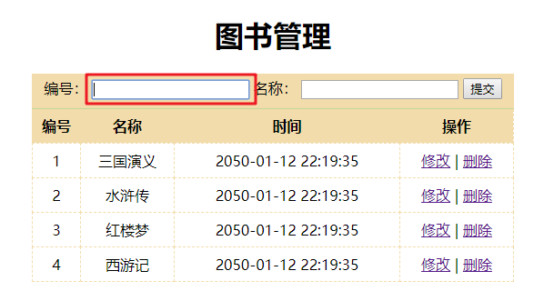
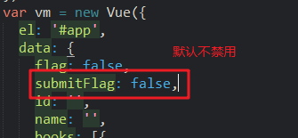

# Day02

## 1. Vue常用特性

- 常用特性如下：

  

  - 表单操作：之前已经使用v-mode对文本框进行了双向数据绑定，那接下来我们需要对表单操作再详细介绍一下
  - 自定义指令：之前使用的都是vue内置的指令，为了满足一些特定的需求，我们可以自定义vue指令
  - 计算属性：跟methods的方法类似，但是也有特殊之处
  - 过滤器：用于格式化数据
  - 侦听器：用于监听数据变化
  - 声明周期：Vue实例从创建到销毁的整个过程

### 1.1 表单操作

- 接下来我们就详细来看下表单操作

#### 1.1.1 基本介绍

- 介绍：表单常见控件如下：

  

  - 案例效果：我们将表单中最常用的控件都来用一用

  

- 案例代码：表单中所有的控件都用v-model进行双向数据绑定：

  ```html
  <head>
    <meta charset="UTF-8">
    <title>Document</title>
    <style type="text/css">
    
    form div {
      height: 40px;
      line-height: 40px;
    }
    form div:nth-child(4) {
      height: auto;
    }
    form div span:first-child {
      display: inline-block;
      width: 100px;
    }
    </style>
  </head>
  <body>
    <div id="app">
      <form action="http://itcast.cn">
        <div>
          <span>姓名：</span>
          <span>
            <input type="text" v-model='uname'><!--双向绑定-->
          </span>
        </div>
        <div>
          <span>性别：</span>
          <span>
            <input type="radio" id="male" value="1" v-model='gender'><!--双向绑定-->
            <label for="male">男</label>
            <input type="radio" id="female" value="2" v-model='gender'><!--双向绑定-->
            <label for="female">女</label>
          </span>
        </div>
        <div>
          <span>爱好：</span>
          <input type="checkbox" id="ball" value="1" v-model='hobby'><!--双向绑定-->
          <!--for指定一个checkbox的id，这样点击这个lable，对应的checkbox也会选中-->
          <label for="ball">篮球</label>
          <input type="checkbox" id="sing" value="2" v-model='hobby'><!--双向绑定-->
          <label for="sing">唱歌</label>
          <input type="checkbox" id="code" value="3" v-model='hobby'><!--双向绑定-->
          <label for="code">写代码</label>
        </div>
        <div>
          <span>职业：</span>
          <!--occupation:职业[ˌɒkjuˈpeɪʃn] -->
          <!--multiple：让select可以多选-->
          <select v-model='occupation' multiple> <!--双向绑定-->
            <option value="0">请选择职业...</option>
            <option value="1">教师</option>
            <option value="2">软件工程师</option>
            <option value="3">律师</option>
          </select>
        </div>
        <div>
          <span>个人简介：</span>
          <textarea v-model='desc'></textarea><!--双向绑定-->
        </div>
        <div>
          <!--阻止默认行为：submit的默认行为是提交表单，我们这里只是看一下表单控件绑定的数据，所以不需要提交表单-->
          <input type="submit" value="提交" @click.prevent='handle'>
        </div>
      </form>
    </div>
    <script type="text/javascript" src="js/vue.js"></script>
  <script type="text/javascript">
      /*
        表单基本操作
      */
      var vm = new Vue({
        el: '#app',
        data: {
          uname: 'lisi',
          gender: 2,
          hobby: ['2','3'],
          // occupation: 3,
          occupation: ['2','3'],//如果职业是多选，那值必须是数组
          desc: 'nihao'
        },
        methods: {
          //点击提交之后，分别打印绑定的数据，观察效果
          handle: function(){
            // console.log(this.uname)
            // console.log(this.gender)
            // console.log(this.hobby.toString())
            // console.log(this.occupation)
            console.log(this.desc)
  
          }
        }
      });
    </script>
  ```

  - **注意**：
  - v-model是将表单控件的value属性与data数据属性进行了绑定
  - 所以checkbox，select，radio，都需要给每一项添加value值才可以
  - text和textarea，也可以通过value指定默认值，但是一般是由用户输入即可（用户输入的内容就是给value属性赋的值）

#### 1.1.2  表单域修饰符

- 接下来我们再来研究一下表单域的修饰符

- 介绍

  

  - 表单域修饰符，可以用在text和textarea通过v-model双向数据绑定的时候
  - 表单域修饰符与按键修饰符的用法一样
  - lazy：懒惰
    - input事件，文本框内容改变就会触发
    - change事件，文本框失去焦点才会触发
    - change相对于input来说，change更晚一点，更懒lazy一点
    - lazy将input事件改为change事件，就意味着更懒惰了

- 代码：

  ```html
  <body>
    <div id="app">
      <input type="text" v-model.number='age'>
      <input type="text" v-model.trim='info'>
      <!--默认是input事件：文本框内容改变就会触发，影响msg的值（双向绑定），所以下边的差值表达式也会立马改变
  	    如果使用lazy修饰，会改为change事件，change事件是在失去焦点的时候才会触发，影响msg的值。
  		所以相对input来说，change更晚一点，更懒lazy一点
  -->
      <input type="text" v-model.lazy='msg'>
      <div>{{msg}}</div>
      <button @click='handle'>点击</button>
    </div>
    <script type="text/javascript" src="js/vue.js"></script>
    <script type="text/javascript">
      /*
        表单域修饰符
      */
      var vm = new Vue({
        el: '#app',
        data: {
          age: '',
          info: '',
          msg: ''
        },
        methods: {
          handle: function(){
            // console.log(this.age + 13)
            // console.log(this.info.length)
          }
        }
      });
    </script>
  ```

### 1.2 自定义指令

#### 1.2.1 基本用法

- 介绍

  

  - directive：指令
  - 第一个参数：自定义指令名称
  - 第二个参数：描述自定义指令的业务逻辑
  - 第二个参数中的固定属性：inserted(插入的)，指令的钩子函数（下边介绍）
  - el：指令所绑定的元素。**当inserted函数被调用时，系统会将当前元素对象作为参数传入**
  - 使用指令：v-自定义指令名

- 案例需求：自定义一个指令，可以让当前文本框自动获取焦点

- 案例代码：

  ```html
  <body>
    <div id="app">
      <!--整个过程：当界面加载到第一个input时，vue会给他添加一个自定义指令
  		这个指令是在这个元素被插入到父节点时执行，元素获取焦点
  	-->
      <input type="text" v-focus><!--现象：当界面显示得时候默认第一个获取焦点-->
      <input type="text">
    </div>
    <script type="text/javascript" src="js/vue.js"></script>
    <script type="text/javascript">
      /*
        自定义指令
      */
      Vue.directive('focus', {
        //被绑定元素插入父节点时调用
        inserted: function(el){
          // el表示指令所绑定的元素
          el.focus();
        }
      });
      var vm = new Vue({
        el: '#app',
        data: {
          
        },
        methods: {
          handle: function(){
            
          }
        }
      });
    </script>
  </body>
  ```

- **补充**：钩子函数就是当前指令在执行过程中，会调用的一些方法

  

  - 这些构造函数，大家先了解inserted即可
  - insert插入，inserted已经插入

#### 1.2.2 带参数

- 自定义指令如何想有些内置指令一样，可以在后边跟上值呢？

  ```html
   <input type="text" v-model='name'>
  ```

  - 这个值其实是作为参数传递给指令的
  - 接下来我们就是来看下自定义指令如何定义参数

- 介绍：

  

  - 定义指令时：
    - 构造函数中增加一个形参binding（捆绑，参数捆绑着指令传递进来，binding可改名字，但一般都用binding）
    - 通过binding.value可以获取到使用指令时，传递的参数（等号右侧引号中的值）
    - 传递是一个对象{color:"orange"}，所以binding.value就是这个对象
    - 通过binding.value.color获取到“orange”
  - 使用指令时，指令后跟的值，是作为参数进行传递的，传递给binding

- 案例需求：自定义指令，改变元素背景颜色

- 案例代码：

  ```html
  <body>
    <div id="app">
      <input type="text" v-color='msg'>
    </div>
    <script type="text/javascript" src="js/vue.js"></script>
    <script type="text/javascript">
      /*
        自定义指令-带参数
      */
      Vue.directive('color', {
        //指令第一次绑定元素时调用的钩子函数（在这里使用哪个钩子函数都可以）
        bind: function(el, binding){//bingding参数可以获取msg
          // 根据指令的参数设置背景色
          // console.log(binding.value.color)
          el.style.backgroundColor = binding.value.color;//binding.value可以获取到msg的值
        }
      });
      var vm = new Vue({
        el: '#app',
        data: {
          msg: {
            color: 'blue'
          }
        },
        methods: {
          handle: function(){
            
          }
        }
      });
    </script>
  </body>
  ```

#### 1.2.3 局部指令用法

- 之前通过Vue的directive方法添加的自定义指令是全局指令
- 接下来我们来看一下局部指令
  - 全局指令与局部指令的作用域不一样，详细介绍后边会讲

- 介绍：

  

  - 在Vue实例中增加选项directives，与methods同级
  - directives是一个对象，对象中可以有多个自定义指令
  - 对象的key就是自定义指令的名字（字符串），与之前的Vue.directive方法第一个参数相同
  - 对象的value就是指令的业务逻辑（对象），与之前的Vue.directive方法第二个参数相同

- 案例需求：自定义背景颜色指令，自定义获取焦点指令（与全局指令案例一致）

- 案例代码：

  ```html
  <body>
    <div id="app">
      <input type="text" v-color='msg'>
      <input type="text" v-focus>
    </div>
    <script type="text/javascript" src="js/vue.js"></script>
    <script type="text/javascript">
      /*
        自定义指令-局部指令
      */
      var vm = new Vue({
        el: '#app',
        data: {
          msg: {
            color: 'red'
          }
        },
        methods: {
          handle: function(){
            
          }
        },
        //directives与el，data，methods同级，也是创建Vue实例时参数的一部分
        directives: {
          color: {
            bind: function(el, binding){
              el.style.backgroundColor = binding.value.color;
            }
          },
          focus: {
            inserted: function(el) {
              el.focus();
            }
          }
        }
      });
    </script>
  </body>
  ```

- 补充：局部指令是有限制的，这个在学完组件化之后详细介绍

### 1.3 计算属性 ***

#### 1.3.1 介绍

- 为啥需要计算属性


- 如下：插值表达式中，计算逻辑比较复杂（将msg内容反转）


- 计算属性用法：

  

  - computed：计算的
  - 书写位置：与methods，data同级
  - 里边定义的reversedMessage就是计算属性名，后边跟上一个匿名函数
  - 有同学说，这不是一个方法么，其实我们最早跟大家说过方法也可以理解为属性，方法属性。
  - 其实这里只是给computed选项中的内容起个名字，叫做计算属性（实在不行你可以私下叫计算方法，但是人家既然起名字了，所以工作中最好叫计算属性）

- 代码：

  ```html
  <body>
    <div id="app">
      <div>{{msg}}</div>
      <!--计算属性与data属性用法一致，可以直接放入插值表达式中（系统内部会加括号调用计算属性）-->
      <div>{{reverseString}}</div>
    </div>
    <script type="text/javascript" src="js/vue.js"></script>
    <script type="text/javascript">
      /*
        计算属性
      */
      var vm = new Vue({
        el: '#app',
        data: {
          msg: 'Nihao'
        },
        computed: {
          reverseString: function(){
            return this.msg.split('').reverse().join('');
            // ['N','i','h','a','o']
            // ['o','a','h','i','N']
            //'oahiN'
          }
        }
      });
    </script>
  </body>
  ```

#### 1.3.2 计算属性与方法区别

- 区别

  

- 计算属性演示：

  

  - 计算属性使用了两次，而控制台只打印了一次computed。这是因为第一次使用之后，将结果放入了缓存，第二次直接使用缓存即可。
  - 所以我们一般把**计算**比较复杂的逻辑，放入**计算**属性中，以提高效率
  - 而方法就是处理一些普通的逻辑

- 方法演示：

  ```html
  <body>
    <div id="app">
      <div>{{reverseString}}</div>
      <div>{{reverseString}}</div>
        <!--方法调用两次，控制台输出两次methods，说明方法没有缓存-->
      <div>{{reverseMessage()}}</div>
      <div>{{reverseMessage()}}</div>
      <!--注意：计算属性不需要添加下括号，方法需要添加小括号调用-->
    </div>
    <script type="text/javascript" src="js/vue.js"></script>
    <script type="text/javascript">
      /*
        计算属性与方法的区别:计算属性是基于依赖进行缓存的，而方法不缓存
      */
      var vm = new Vue({
        el: '#app',
        data: {
          msg: 'Nihao',
          num: 100
        },
        methods: {
          reverseMessage: function(){
            console.log('methods')
            return this.msg.split('').reverse().join('');
          }
        },
        computed: {
          reverseString: function(){
            console.log('computed')
            // return this.msg.split('').reverse().join('');
            //除了上边的计算，还可以处理for循环，依然是会缓存
            var total = 0;
            for(var i=0;i<=this.num;i++){
              total += i;
            }
            return total;
          }
        }
      });
    </script>
  </body>
  ```

  - 基于**依赖**缓存，其实是**基于依赖的数据进行缓存**，比如上边的msg改变了，那么肯定会重新执行一次，再缓存

  - **补充**：其实，不管是计算属性，还是普通方法，只要他们的代码中使用的数据属性发生改变，他们都会重新执行

    

    - 但是你会发现修改num的时候，methods也调用了，说明methods发现如果data中任意数据改变，不管跟自己有没有关系，都会重新执行
      - 前提是这个数据需要被使用，如果你在data中定义了一个从未被使用过的属性，改变这个属性，那么methods也不会重新执行
    - 而computed，只有跟自己相关的数据发生改变，才会重新执行

  - **总结**：大家需要记忆的是这个总结

    - 计算属性和方法中使用的data属性，发生改变，他们就会重新执行
    - 计算属性会缓存，方法不会。如果计算属性中使用的data属性发生改变，计算属性会重新缓存。

### 1.4 监听器

#### 1.4.1 用法

- 介绍：

  

  - 从数据发生改变，监听器方法就会重新执行的角度来看，他与计算属性非常类似
  - 但是他有自己的特殊的应用场景：执行异步，开销较大的操作
  - 侦听器具体的应用场景案例，后边再说。我们现在先简单用一用。
  - **注意**：监听器是一个对象，内部可以监听多个数据属性的变化
    - 监听器的key：要监听的数据属性名
    - 监听器的value：数据发生改变之后执行的逻辑
    - 参数val：数据属性改变之后的新值

- 案例需求：修改一个老外的firstName或者lastName，然后fullName跟着一起变化

- 案例代码：

  ```html
  <body>
    <div id="app">
      <div>
        <span>名：</span>
        <span>
          <input type="text" v-model='firstName'>
        </span>
      </div>
      <div>
        <span>姓：</span>
        <span>
          <input type="text" v-model='lastName'>
        </span>
      </div>
      <div>{{fullName}}</div>
    </div>
    <script type="text/javascript" src="js/vue.js"></script>
    <script type="text/javascript">
      /*
        侦听器
      */
      var vm = new Vue({
        el: '#app',
        data: {
          firstName: 'Jim',
          lastName: 'Green',
          // fullName: 'Jim Green'
        },
        watch: {
           //firstName绑定的text发生改变时，会重新计算fullName
           firstName: function(val) {
             this.fullName = val + ' ' + this.lastName;
           },
           //lastName绑定的text发生改变时，会重新计算fullName
           lastName: function(val) {
             this.fullName = this.firstName + ' ' + val;
           }
        },
        computed: {
          //使用计算属性也可以实现：因为他依赖的值发生改变，会重新计算
          fullName: function(){
            return this.firstName + ' ' + this.lastName;
          }
        },
        //其实方法也可以，只不过方法使用的时候需要添加小括号
        methods: {
            fullName: function() {
                return this.firstName + ' ' + this.lastName;
            }
        },
      });
    </script>
  </body>
  ```

#### 1.4.2 案例

- 案例描述：用户名是否存在校验

- 效果：

  

- 需求：

  

- 分析：

  

- 代码：

  ```html
  <body>
    <div id="app">
      <div>
        <span>用户名：</span>
        <span>
          <!--使用lazy变为change事件，失去焦点再处理。
  		失去焦点之后，如果这个input的值发生改变，uname的值就会更新。
  		uname的值一旦变化watch监听器就会发现，就会执行对应逻辑
  		-->
          <input type="text" v-model.lazy='uname'>
        </span>
        <!--  -->
        <span>{{tip}}</span>
      </div>
    </div>
    <script type="text/javascript" src="js/vue.js"></script>
    <script type="text/javascript">
      /*      
        侦听器
        1、采用侦听器监听用户名的变化
        2、调用后台接口进行验证
        3、根据验证的结果调整提示信息
      */
      var vm = new Vue({
        el: '#app',
        data: {
          uname: '',
          tip: ''
        },
        methods: {
          checkName: function(uname) {
            // 调用接口，但是可以使用定时任务的方式模拟接口调用
            var that = this;//这里为啥要将this给that，setTimeout中不能直接使用this么？因为setTimeout中的this代表的是window对象，而我们想修改tip的值，只能通过vm调用，所以搞了一个that
            setTimeout(function(){
              // 模拟接口调用
              if(uname == 'admin') {
                that.tip = '用户名已经存在，请更换一个';
              }else{
                that.tip = '用户名可以使用';
              }
            }, 2000);
          }
        },
        watch: {
          uname: function(val){
            // 调用后台接口验证用户名的合法性
            this.checkName(val);//这里做延迟的主要原因就是仿真，先提示正在验证，2s之后提示结果
            // 修改提示信息
            this.tip = '正在验证...';
          }
        }
      });
    </script>
  </body>
  ```

#### 1.4.3 区别：methods，computed，watch

- 计算属性（computed）：一定要返回一个值，属性的结果会被缓存，除非依赖的数据属性变化才会重新计算，主要当做属性来使用，适合计算的逻辑
- 方法（methods）：表示一个具体的操作，主要书写业务逻辑
- 监听（watch）：一个对象，键是需要观察的表达式，值是对应回调函数。主要用来监听某些特定数据的变化，从而进行某些具体的业务逻辑操作；可以看做 computed 和 methods 的结合体
- **总结**：watch用的相对来说比较少，重点放到计算属性和方法上

### 1.5 过滤器 ***

#### 1.5.1 基本用法

- 介绍

  

- 定义

  - 全局的过滤器

    

    - 过滤器一般是将数据属性的值进行格式化，所以使用格式：**data属性 | 过滤器名称**
    - value就是使用过滤器的data属性值
    - **将格式化之后的数据，通过return返回**

  - 局部过滤器：

    

    - 定义位置与methods一致
    - capitalize是过滤器名称，function也需要一个参数，也需要返回值

- 使用

  

- 代码：

  ```html
  <body>
    <div id="app">
      <input type="text" v-model='msg'>
      <div>{{msg | upper}}</div> <!--差值表达式绑定过滤器-->
      <div>{{msg | upper | lower}}</div><!--过滤器级联操作-->
      <!--绑定自定义属性-->
      <div :abc='msg | upper'>测试数据</div><!--自定义属性绑定过滤器-->
    </div>
    <script type="text/javascript" src="js/vue.js"></script>
    <script type="text/javascript">
      /*
        过滤器
        1、可以用与插值表达式和属性绑定
        2、支持级联操作
      */
      // Vue.filter('upper', function(val) {
      //   return val.charAt(0).toUpperCase() + val.slice(1);
      // });
      Vue.filter('lower', function(val) {
        return val.charAt(0).toLowerCase() + val.slice(1);
      });
      var vm = new Vue({
        el: '#app',
        data: {
          msg: ''
        },
        filters: {//局部过滤器
          upper: function(val) {
            return val.charAt(0).toUpperCase() + val.slice(1);
          }
        }
      });
    </script>
  </body>
  ```

#### 1.5.2 带参数的过滤器

- 介绍

  

  - 第一个参数是用于接收使用过滤器的数据属性：date
  - 第二个参数是用于接收过滤器小括号中的值

- 案例

  

- 代码：

  ```html
  <body>
    <div id="app">
      <div>{{date | format('yyyy-MM-dd hh:mm:ss')}}</div>
    </div>
    <script type="text/javascript" src="js/vue.js"></script>
    <script type="text/javascript">
      /*
        过滤器案例：格式化日期
      */
      // Vue.filter('format', function(value, arg) {//这种写法，处理的格式比较单一：yyyy-MM-dd
      //   if(arg == 'yyyy-MM-dd') {
      //     var ret = '';
      //     ret += value.getFullYear() + '-' + (value.getMonth() + 1) + '-' + value.getDate();//month是0-11，需要+1
      //     return ret;
      //   }
      //   return value;
      // })
      //以下逻辑是直接拿过来的，不需要自己写
      //通过正则的方式进行格式匹配，然后解析出最终格式
      Vue.filter('format', function(value, arg) {
        function dateFormat(date, format) {
            if (typeof date === "string") {
                var mts = date.match(/(\/Date\((\d+)\)\/)/);
                if (mts && mts.length >= 3) {
                    date = parseInt(mts[2]);
                }
            }
            date = new Date(date);
            if (!date || date.toUTCString() == "Invalid Date") {
                return "";
            }
            var map = {
                "M": date.getMonth() + 1, //月份 
                "d": date.getDate(), //日 
                "h": date.getHours(), //小时 
                "m": date.getMinutes(), //分 
                "s": date.getSeconds(), //秒 
                "q": Math.floor((date.getMonth() + 3) / 3), //季度 
                "S": date.getMilliseconds() //毫秒 
            };
  
            format = format.replace(/([yMdhmsqS])+/g, function(all, t) {
                var v = map[t];
                if (v !== undefined) {
                    if (all.length > 1) {
                        v = '0' + v;
                        v = v.substr(v.length - 2);
                    }
                    return v;
                } else if (t === 'y') {
                    return (date.getFullYear() + '').substr(4 - all.length);
                }
                return all;
            });
            return format;
        }
        return dateFormat(value, arg);
      })
      var vm = new Vue({
        el: '#app',
        data: {
          date: new Date()
        }
      });
    </script>
  </body>
  ```


### 1.6 生命周期

- Vue实例的声明周期：Vue实例从创建到销毁的整个过程。

- 声明周期介绍：


- 生命周期图图

  

- vue实例生产过程

  

  - 声明周期中的每一步，其实都是一个函数
  - 他们会在不同时机被系统调用
  - 声明周期函数定义的位置与methods一致

- 案例需求：

  - 界面显示数据msg
  - 一个按钮更新msg的值，观察声明周期函数的执行
  - 一个按钮销毁Vue实例，观察声明周期函数的执行

- 代码：

  ```html
  <body>
    <div id="app">
      <div>{{msg}}</div>
      <button @click='update'>更新</button>
      <button @click='destroy'>销毁</button>
    </div>
    <script type="text/javascript" src="js/vue.js"></script>
    <script type="text/javascript">
      /*
        Vue实例的生命周期
        
      */
      var vm = new Vue({
        el: '#app',
        data: {
          msg: '生命周期'
        },
        methods: {
          update: function(){
            this.msg = 'hello';
          },
          destroy: function(){
            this.$destroy();
          }
        },
        beforeCreate: function(){
          console.log('beforeCreate');
        },
        created: function(){
          console.log('created');
        },
        beforeMount: function(){
          console.log('beforeMount');
        },
        mounted: function(){
          console.log('mounted');
        },
        beforeUpdate: function(){
          console.log('beforeUpdate');
        },
        updated: function(){
          console.log('updated');
        },
        beforeDestroy: function(){
          console.log('beforeDestroy');
        },
        destroyed: function(){
          console.log('destroyed');
        }
      });
    </script>
  </body>
  ```


- 效果

  - 界面加载

    

  - 数据更新

    

  - 销毁

    

## 2. 综合案例-图书管理

### 2.1 功能概述

- 效果图

  

- 功能分析如下：

  - 显示图片列表
  - 添加图书：输入编号和名称，点击提交，就可以添加图书。添加的新图书，立马显示到列表中
  - 点击修改，当前图书信息，重新填充到最上方表单中，内容修改之后，点击提交可以修改
  - 点击删除，直接就删除了，列表中不在有删除的这个图书

### 2.2 Vue数组处理相关概念

- 在处理这个图片管理案例之前，需要补充一些vue对数组的操作方法

- vue对于数组的方法进行了升级，使得这些方法也具有响应式

- vue对于数组的方法进行了归类，分为两类：

  - 变异方法：会直接修改数组的原始数据（使得原始数据变化，变异，所以称之为变异方法）
  - 替换数组方法：会将修改的数据作为新数组返回（一般生成的新数组会赋值给原始数组，相当于给原始数组替换了，所以这种方法称之为替换数组）

- 两类方法如下：

  

- 官网介绍-变异方法：

  

- 官网介绍-替换数组：主要特征，返回一个新数组（后续会使用）

  

- 代码：

  ```html
  <body>
    <div id="app">
      <div>
        <span>
          <input type="text" v-model='fname'><!--添加的内容-->
          <button @click='add'>添加</button>
          <button @click='del'>删除</button>
          <button @click='change'>替换</button>
        </span>
      </div>
      <ul>
        <li :key='index' v-for='(item,index) in list'>{{item}}</li>
      </ul>
    </div>
    <script type="text/javascript" src="js/vue.js"></script>
    <script type="text/javascript">
      /*
        Vue数组操作
        1、变异方法：会影响数组的原始数据的变化。
        2、替换数组：不会影响原始的数组数据，而是形成一个新的数组。
      */
      var vm = new Vue({
        el: '#app',
        data: {
          fname: '',
          list: ['apple','orange','banana']//默认数据
        },
        methods: {
          add: function(){//将input的内容添加到数组中
            this.list.push(this.fname);//list一旦变化，就会影响列表。因为push方法已经被vue改成了响应式方法了，就是说push增加数据之后，界面也会变化
          },
          del: function(){
            this.list.pop();
          },
          change: function(){
            this.list = this.list.slice(0,2);//替换数组，原数组不影响，而是返回新数组，所以这里想影响原数组，需要重新赋值
            //slice就是替换数组，生成的新数组替换了原始数组
          }
        }
      });
    </script>
  </body>
  ```

### 2.3 Vue动态处理响应式数据  ***

- 直接通过索引修改数组的值，这种方式不是响应式的，我们看效果：

  

- Vue也提供了特殊的方法，如下：

  

  - 方式1：Vue直接调用set
  - 方式2：Vue实例调用set，但是需要通过$set调用
    - 通过Vue实例对象调用方法，一般都是需要添加$

- 代码：

  ```html
  <body>
    <div id="app">
      <ul>
        <li v-for='item in list'>{{item}}</li>
      </ul>
      <div>
        <div>{{info.name}}</div>
        <div>{{info.age}}</div>
        <div>{{info.gender}}</div>
      </div>
    </div>
    <script type="text/javascript" src="js/vue.js"></script>
    <script type="text/javascript">
      /*
        动态处理响应式数据
        
      */
      var vm = new Vue({
        el: '#app',
        data: {
          list: ['apple', 'orange', 'banana'],
          info: {
            name: 'lisi',
            age: 12
          }
        },
      });
      // vm.list[1] = 'lemon';//这种方式不是响应式的
      // Vue.set(vm.list, 2, 'lemon');
      vm.$set(vm.list, 1, 'lemon');
  
      // vm.info.gender = 'male';//这种方式不是响应式的
      vm.$set(vm.info, 'gender', 'female');
    </script>
  </body>
  ```

### 2.4 图书列表展示

- 介绍

  

- 步骤：

  - 先给静态表格的结构写出来
  - 然后定义数据，通过v-for循环数据，动态显示表格
  - 处理操作列的超链接，修改和删除

- 代码：

  ```html
   <style type="text/css">
      .grid {
        margin: auto;
        width: 500px;
        text-align: center;
      }
      .grid table {
        width: 100%;
        border-collapse: collapse;
      }
      .grid th,td {
        padding: 10;
        border: 1px dashed orange;
        height: 35px;
        line-height: 35px;
      }
      .grid th {
        background-color: orange;
      }
    </style>
  </head>
  <body>
    <div id="app">
      <div class="grid">
        <table>
          <thead>
            <tr>
              <th>编号</th>
              <th>名称</th>
              <th>时间</th>
              <th>操作</th>
            </tr>
          </thead>
          <tbody>
              <!--遍历books-->
            <tr :key='item.id' v-for='item in books'>
              <td>{{item.id}}</td>
              <td>{{item.name}}</td>
              <td>{{item.date}}</td>
              <td>
                <a href="" @click.prevent>修改</a><!--超链接阻止默认行为-->
                <span>|</span>
                <a href="" @click.prevent>删除</a>
              </td>
            </tr>
          </tbody>
        </table>
      </div>
    </div>
    <script type="text/javascript" src="js/vue.js"></script>
    <script type="text/javascript">
      /*
        图书管理-图书列表展示功能
        注意事项：<a href="" @click.prevent>修改</a>
        事件绑定时，可以只添加修饰符，而不绑定事件函数
      */
      var vm = new Vue({
        el: '#app',
        data: {
          books: [{//定义图书列表数据
            id: 1,
            name: '三国演义',
            date: ''
          },{
            id: 2,
            name: '水浒传',
            date: ''
          },{
            id: 3,
            name: '红楼梦',
            date: ''
          },{
            id: 4,
            name: '西游记',
            date: ''
          }]
        }
      });
    </script>
  </body>
  ```

- 效果

  

### 2.5 添加图书

- 介绍：输入内容，点击提交，即可添加图书

  

- 步骤：

  - 将两个文本框与data属性进行双向绑定（双向绑定之后，就可以通过data属性实时获取文本的值）
  - 提交按钮绑定点击事件
  - 处理事件处理函数逻辑：
    - 创建图书对象
    - 填充图书对象中的数据
    - 将图书对象添加到books中
    - 清空文本框

- 代码

  ```html
  <!--样式增加-->
  .grid .book {
        padding-bottom: 10px;
        padding-top: 5px;
        background-color: #F3DCAB;
      }
  <body>
    <div id="app">
      <div class="grid">
        <div>
          <h1>图书管理</h1>
          <div class="book">
            <div>
              <label for="id">
                编号：
              </label>
              <input type="text" id="id" v-model='id'><!--双向绑定id-->
              <label for="name">
                名称：
              </label>
              <input type="text" id="name" v-model='name'><!--双向绑定name-->
              <button @click='handle'>提交</button><!--点击事件-->
            </div>
          </div>
        </div>
        <table>
          <thead>
            <tr>
              <th>编号</th>
              <th>名称</th>
              <th>时间</th>
              <th>操作</th>
            </tr>
          </thead>
          <tbody>
            <tr :key='item.id' v-for='item in books'>
              <td>{{item.id}}</td>
              <td>{{item.name}}</td>
              <td>{{item.date}}</td>
              <td>
                <a href="" @click.prevent>修改</a>
                <span>|</span>
                <a href="" @click.prevent>删除</a>
              </td>
            </tr>
          </tbody>
        </table>
      </div>
    </div>
    <script type="text/javascript" src="js/vue.js"></script>
    <script type="text/javascript">
      /*
        图书管理-添加图书
      */
      var vm = new Vue({
        el: '#app',
        data: {
          id: '',
          name: '',
          books: [{
            id: 1,
            name: '三国演义',
            date: ''
          },{
            id: 2,
            name: '水浒传',
            date: ''
          },{
            id: 3,
            name: '红楼梦',
            date: ''
          },{
            id: 4,
            name: '西游记',
            date: ''
          }]
        },
        methods: {
          //添加图书处理逻辑：新建图书对象，给属性赋值，然后通过push添加实现双向绑定
          handle: function(){
            // 添加图书
            var book = {};
            book.id = this.id;
            book.name = this.name;
            book.date = '';
            this.books.push(book);
            // 清空表单
            this.id = '';
            this.name = '';
          }
        }
      });
    </script>
  </body>    
   
  ```

- 效果

  

### 2.6 修改图书

- 介绍：

  

  - 点击修改，数据回填到文本框中
  - 修改填充之后的名称文本框的书名
  - 点击提交即可修改

- 步骤：

  - 数据回填
    - 修改按钮添加点击事件
    - 获取当前条目的图书数据
    - 填充到文本框中
  - 提交
    - 将修改后的图书名称，更新到books中对应的图书对象中
    - 这个提交按钮，需要区分到底是添加图书还是修改图书

- 代码：

  ```html
  <body>
    <div id="app">
      <div class="grid">
        <div>
          <h1>图书管理</h1>
          <div class="book">
            <div>
              <label for="id">
                编号：
              </label>
              <!--绑定属性disabled，如果是修改则不可用（不能修改id）-->
              <input type="text" id="id" v-model='id' :disabled="flag">
              <label for="name">
                名称：
              </label>
              <input type="text" id="name" v-model='name'>
              <button @click='handle'>提交</button>
            </div>
          </div>
        </div>
        <table>
          <thead>
            <tr>
              <th>编号</th>
              <th>名称</th>
              <th>时间</th>
              <th>操作</th>
            </tr>
          </thead>
          <tbody>
            <tr :key='item.id' v-for='item in books'>
              <td>{{item.id}}</td>
              <td>{{item.name}}</td>
              <td>{{item.date}}</td>
              <td>
                <a href="" @click.prevent='toEdit(item.id)'>修改</a><!--修改图书绑定方法toEdit，并传达参数：当前图书id-->
                <span>|</span>
                <a href="" @click.prevent>删除</a>
              </td>
            </tr>
          </tbody>
        </table>
      </div>
    </div>
    <script type="text/javascript" src="js/vue.js"></script>
    <script type="text/javascript">
      /*
        图书管理-添加图书
      */
      var vm = new Vue({
        el: '#app',
        data: {
          flag: false,//默认不禁用，可用（默认为添加图书）
          //其实这个flag改为isEdit，是否是修改图书，更加合适
          id: '',
          name: '',
          books: [{
            id: 1,
            name: '三国演义',
            date: ''
          },{
            id: 2,
            name: '水浒传',
            date: ''
          },{
            id: 3,
            name: '红楼梦',
            date: ''
          },{
            id: 4,
            name: '西游记',
            date: ''
          }]
        },
        methods: {
          handle: function(){
            if(this.flag) {//根据flag来区分编辑还是添加
              // 编辑图书
              // 就是根据当前的ID去更新数组中对应的数据
              this.books.some((item) => {//箭头函数，some遍历books：筛选出当前修改图书，并修改
                if(item.id == this.id) {
                  item.name = this.name;
                  // 完成更新操作之后，需要终止循环
                  return true;
                }
              });
              this.flag = false;
            }else{
              // 添加图书
              var book = {};
              book.id = this.id;
              book.name = this.name;
              book.date = '';
              this.books.push(book);
              // 清空表单
              this.id = '';
              this.name = '';
            }
            // 清空表单
            this.id = '';
            this.name = '';
          },
          //编辑功能：当选择修改超链接，就找出当前id图书，并将信息显示到表单中
          toEdit: function(id){
            // 禁止修改ID
            this.flag = true;
            console.log(id)
            // 根据ID查询出要编辑的数据（filter返回的是包含了满足条件图书对象的数组，即使只有一个图书满足条件，依然会放到数组中，所以book是数组。这个book可以改名为filterBooks更贴切）
            var book = this.books.filter(function(item){
              return item.id == id;
            });
            console.log(book)
            // 把获取到的信息填充到表单
            this.id = book[0].id;//其实book里只有一条数据，所以通过[0]取出
            this.name = book[0].name;
          }
        }
      });
    </script>
  </body>
  ```

- 效果：

  

### 2.7 删除图书

- 介绍：

  

- 步骤：

  - 删除超链接添加点击事件
  - 从books中删除当前图书

- 代码：

  ```html
  <body>
    <div id="app">
      <div class="grid">
        <div>
          <h1>图书管理</h1>
          <div class="book">
            <div>
              <label for="id">
                编号：
              </label>
              <input type="text" id="id" v-model='id' :disabled="flag">
              <label for="name">
                名称：
              </label>
              <input type="text" id="name" v-model='name'>
              <button @click='handle'>提交</button>
            </div>
          </div>
        </div>
        <table>
          <thead>
            <tr>
              <th>编号</th>
              <th>名称</th>
              <th>时间</th>
              <th>操作</th>
            </tr>
          </thead>
          <tbody>
            <tr :key='item.id' v-for='item in books'>
              <td>{{item.id}}</td>
              <td>{{item.name}}</td>
              <td>{{item.date}}</td>
              <td>
                <a href="" @click.prevent='toEdit(item.id)'>修改</a>
                <span>|</span>
                <a href="" @click.prevent='deleteBook(item.id)'>删除</a><!--删除绑定deleteBook方法，并传递参数id-->
              </td>
            </tr>
          </tbody>
        </table>
      </div>
    </div>
    <script type="text/javascript" src="js/vue.js"></script>
    <script type="text/javascript">
      /*
        图书管理-添加图书
      */
      var vm = new Vue({
        el: '#app',
        data: {
          flag: false,
          id: '',
          name: '',
          books: [{
            id: 1,
            name: '三国演义',
            date: ''
          },{
            id: 2,
            name: '水浒传',
            date: ''
          },{
            id: 3,
            name: '红楼梦',
            date: ''
          },{
            id: 4,
            name: '西游记',
            date: ''
          }]
        },
        methods: {
          handle: function(){
            if(this.flag) {
              // 编辑图书
              // 就是根据当前的ID去更新数组中对应的数据
              this.books.some((item) => {
                if(item.id == this.id) {
                  item.name = this.name;
                  // 完成更新操作之后，需要终止循环
                  return true;
                }
              });
              this.flag = false;
            }else{
              // 添加图书
              var book = {};
              book.id = this.id;
              book.name = this.name;
              book.date = '';
              this.books.push(book);
              // 清空表单
              this.id = '';
              this.name = '';
            }
            // 清空表单
            this.id = '';
            this.name = '';
          },
          toEdit: function(id){
            // 禁止修改ID
            this.flag = true;
            console.log(id)
            // 根据ID查询出要编辑的数据
            var book = this.books.filter(function(item){
              return item.id == id;
            });
            console.log(book)
            // 把获取到的信息填充到表单
            this.id = book[0].id;
            this.name = book[0].name;
          },
          //删除逻辑：
          deleteBook: function(id){
            // 删除图书
            // 根据id从数组中查找元素的索引
            // findIndex是查找  满足回调函数的条件的 item 的索引
            // var index = this.books.findIndex(function(item){
            //   return item.id == id;
            // });
            // 根据索引删除数组元素
            // this.books.splice(index, 1);
            // -------------------------
            // 方法二：通过filter方法进行删除，将不删除的图书过滤出来，然后重新赋值给books
            this.books = this.books.filter(function(item){
              return item.id != id;
            });
          }
        }
      });
    </script>
  </body>
  ```

- 效果：点击删除，界面立马就没有这条数据了


### 2.8 常用特性应用场景

#### 2.8.1 介绍

- 为了能够将之前的一些常用特性进行练习，我们增加一些效果

- 增加功能如下

  

#### 2.8.2 过滤器（格式化日期）

- 增加日期数据：

  

  - 这里的日期数据都是毫秒值
  - 我们需要使用过滤器对日期格式进行格式化

- 增加过滤器

  

- 效果：


#### 2.8.3 自定义指令（获取表单焦点）

- 指令：增加获取焦点指令

  

- 使用指令：让编号文本框自动获取焦点

  

- 效果：

  

#### 2.8.4 计算属性（统计图书数量）

- 结构增加：

  

- 样式增加：

  

- 代码增加：用于计算的逻辑，放到计算属性中

  

- 效果：

  

#### 2.8.5 监听器（验证图书存在性）

- 提交按钮：需要控制是否可用

  

- 对应变量：

  

- 监听：监听器名字是name，这个是监听了名称文本框的变化

  

- 效果：

  - 如果是已经存在的，无法提交

  

  - 如果是不存在的，则可提交

  

#### 2.8. 生命周期（图书数据处理）

- 代码修改，删除books的初始值：

  

- 增加钩子函数

  

