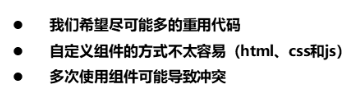
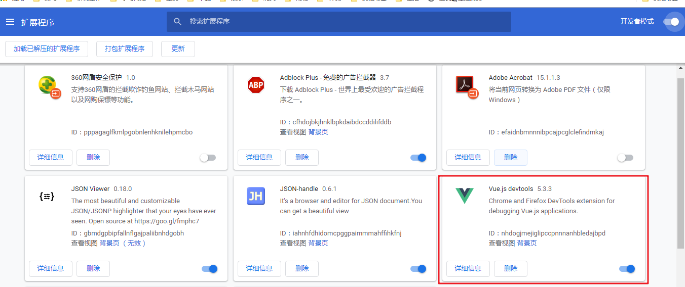

## Day03

## 1. 组件化开发思想

### 1.1 现实中的组件化思想体现

- 介绍：组件化即是**对某些可以进行复用的功能进行封装的标准化工作** 

  

- 描述：

  - PC电脑就实现了组件化，可以自己买零件，然后组装起来
  - 之前谷歌也研究过手机可不可以组件化开发，跟PC电脑一样，但是由于各种原因并没有面向公众
  - 标准：要想组件能够成功组合在一起，每个组件必须要有标准
  - 分治：将不同的功能封装到不同的组件中，每个组件都能够独立生产
  - 重用：两台手机，一个手机A只有cpu可以用，一个手机B只有cpu坏了，我们就可以将手机A的cpu重用起来，装到手机B中
  - 组合：组件组合起来，可以形成一个整体

### 1.2 编程中的组件化思想体现

- 图示：

  

- 描述：

  - 一个界面中会有各种模块，他们有兄弟关系，父子关系。
  - 我们会将用的比较多的模块进行组件化。形成有关系的组件网。
  - 组件网中，纵向的是父子关系，横向的是兄弟关系

- **举例**：

  - 一般的网站，都有相同的头布局，和脚布局。
  - 那么遵循组件化开发的话，我们会将头布局，和脚布局独立出去，形成一个独立的界面（组件）。
  - 然后其他界面，只需要引用这个界面（组件）即可。

- 组件：

  - 就是将界面中的某一部分，组合在了一起，方便使用，可以重用。
  - 我们一般把一些固定搭配的几个元素，给组合在一起，形成组件

### 1.3 组件化规范：Web Components

- 介绍：

  - 编程中要想实现组件化开发，我们可以遵循组件化规范：Web Components
  - Web Components：网页组件，Component：[kəmˈpəʊnənt] ，组成

- 问题：

  

  - 自定义组件不太好实现，因为涉及到html和css，js的融合

- 解决：

  

  - 因为涉及到冲突等问题，我们一般只会将一些特定的功能封装到元素中

- 官网：

  <https://developer.mozilla.org/zh-CN/docs/Web/Web_Components> 

## 2. 组件注册

###  2.1 全局组件注册语法

- 全局组件定义语法：

  

  - 参数1：组件名，参数2：描述组件的对象
    - data：组件中使用的数据，都定义在这。
      - data是一个方法，将使用的数据，以return的方式返回（供组件使用）
    - template：组件模板的内容，其实就是一个HTML字符串
      - 组件其实就是按照需求处理过的，一个标签或多个标签
      - 所以组件模板中定义的，其实就是html标签
  - 上图右侧的组件定义：button-counter：按钮计数器，让当前按钮可以显示自己被点击的次数
  - 全局组件定义，与自定义指令，过滤器类似。

- 使用语法：

  

  - **直接将组件当成一个标签使用**
  - **组件其实就是特殊处理过的一个自定义标签**

- 代码：

  ```html
  <body>
    <div id="app">
      <button-counter></button-counter><!--直接把组件名称，当成标签使用-->
      <button-counter></button-counter><!--组件可以使用多次-->
      <button-counter></button-counter><!--组件可以使用多次-->
    </div>
    <script type="text/javascript" src="js/vue.js"></script>
    <script type="text/javascript">
      /*
        组件注册
      */
      Vue.component('button-counter', {
        //组件数据
        data: function(){//data是一个方法，返回一个对象，对象中定义所需数据
          return {
            count: 0
          }
        },
        //组件模板：一个html的字符串
        template: '<button @click="count++">点击了{{count}}次</button>',//简单处理就是count++
        //template: '<button @click="handle">点击了{{count}}次</button>',//也可以使用方法
        //组件方法：一个对象，对象中定义组件的方法
        methods: {
          handle: function(){
            //方法中处理相同逻辑
            this.count++;
            //也处理一下比较复杂的逻辑
            this.count += 2;
          }
        }
      })
      var vm = new Vue({
        el: '#app',
        data: {
          
        }
      });
    </script>
  </body>
  ```

### 2.2 组件注册注意事项

#### 2.2.1 3个注意事项

- 介绍


- 注意1演示：data必须是一个函数，并且将数据返回

  

- 注意2演示：组件模板必须只有一个根元素

  

- 注意3演示：组件模板可以是模板字符串

  

  - 模板字符串：使用反引号包裹（就是波浪线按键的反引号）

  - 模板字符串回顾：

    ```js
    let name = '张三'; 
    let sayHello = `<div>hello,my name is ${name}</div>`; // hello, my name is zhangsan
    //模板字符串中，通过${变量名}的方式来获取变量值
    //模板字符串，可以写html代码和js代码，js代码写在${}中
    ```

#### 2.2.2 组件命名方式

- 介绍：

  

  - 这里的驼峰是大驼峰，首单词首字母大写

- 代码：

  ```html
  <body>
    <div id="app">
      <button-counter></button-counter>
      <hello-world></hello-world><!--这里必须是短横线-->
    </div>
    <script type="text/javascript" src="js/vue.js"></script>
    <script type="text/javascript">
      /*
        组件注册注意事项
        如果使用驼峰式命名组件，那么在使用组件的时候，
        	只能在组件模板中用驼峰的方式使用组件，
        	但是在html标签中，必须使用短横线的方式使用组件
        如果使用短横线命名组件，使用的时候都是短横线（所以一般多使用短横线命名组件）
      */
      Vue.component('HelloWorld', {
        data: function(){
          return {
            msg: 'HelloWorld'
          }
        },
        template: '<div>{{msg}}</div>'
        //如果在这里使用button-counter，不用变成驼峰（但是HelloWorld和button-counter不能同时相互使用）
        template: '<div>{{msg}}<button-counter></button-counter></div>'
      });
      Vue.component('button-counter', {
        data: function(){
          return {
            count: 0
          }
        },
        template: `
          <div>
            <button @click="handle">点击了{{count}}次</button>
            <button>测试123</button>
            <HelloWorld></HelloWorld><!--这里必须是驼峰-->
          </div>
        `,
        methods: {
          handle: function(){
            this.count += 2;
          }
        }
      })
      var vm = new Vue({
        el: '#app',
        data: {
          
        }
      });
    </script>
  </body>
  ```

- **总结**：组件定义的时候，不管是驼峰还是横杠命名，在使用的时候需要注意：
  - 如果是组件模板中使用：与定义保持一致
  - 如果是html中使用：只能使用横杠命名
- **建议**，定义的时候使用横杠定义，使用的时候，不管实在组件模板还是html中使用，也都是横杠。

###  2.3 局部组件注册

- 介绍

  

  - 在实例化Vue对象的时候，通过components来定义局部组件
  - 语法其实是类似的，只不过写法不太一样
    - 都有组件名component-a，和描述组件的对象：ComponentA
    - 描述组件的对象，定义到了外边
    - ComponentA中会有data和template

- 代码：

  ```html
  <body>
    <div id="app">
      <hello-world></hello-world>
      <hello-tom></hello-tom>
      <hello-jerry></hello-jerry>
      <test-com></test-com>
    </div>
    <script type="text/javascript" src="js/vue.js"></script>
    <script type="text/javascript">
      /*
        局部组件注册
        局部组件只能在注册他的父组件中使用
      */
      Vue.component('test-com',{
        template: '<div>Test<hello-world></hello-world></div>'//全局组件不能使用局部组件
      });
      var HelloWorld = {
        data: function(){
          return {
            msg: 'HelloWorld'
          }
        },
        template: '<div>{{msg}}</div>'
      };
      var HelloTom = {
        data: function(){
          return {
            msg: 'HelloTom'
          }
        },
        template: '<div>{{msg}}</div>'
      };
     var HelloJerry = {
                data: function(){
                  return {
                    msg: 'HelloJerry'
                  }
                },
                template: '<div>{{msg}}</div>'
              }
        };
      var vm = new Vue({
        el: '#app',//局部组件只能在id为app的元素内使用
        data: {
          
        },
        components: {
          'hello-world': HelloWorld,
          'hello-tom': HelloTom,
          'hello-jerry':HelloJerry
          //局部组件还可以如下定义：组件描述对象不定义到外边，直接定义在这（不建议）
          'hello-jerry': {
                data: function(){
                  return {
                    msg: 'HelloJerry'
                  }
                },
                template: '<div>{{msg}}</div>'
              }
        }
      });
    </script>
  </body>
  ```

## 3. Vue调试工具用法

- 介绍：Vue调试工具Devtools，这个工具用于调试vue代码。

- 安装步骤：

  - 访问该地址：[vue调试工具插件](https://chrome.zzzmh.cn/info?token=nhdogjmejiglipccpnnnanhbledajbpd)  ，下载vue调试工具插件。直接点击推荐下载，相关文件就会下载下来。 

    

  - 将下载的文件进行解压，解压完之后，文件内容如下： 

    - （或者直接到今日素材\nhdogjmejiglipccpnnnanhbledajbpd文件夹中查找）

    

  - 打开谷歌浏览器，点击右上角 ==》选择更多工具按钮 ==》选择扩展程序 

  - 然后将之前解压的**Vue.js Devtools_5.3.3_chrome.zzzmh.cn.crx**文件拖拽到扩展程序界面，按照对应提示点击确认即可。 

  - 成功图示：

    

- 使用：

  - 在控制台，多出来一个Vue

    

  - 代码调试演示：

    - 代码：

      ```html
      <head>
        <meta charset="UTF-8">
        <title>Document</title>
        <style type="text/css">
          .root {
            background-color: orange;
          }
          .second {
            background-color: lightgreen;
          }
          .third {
            background-color: lightblue;
          }
        </style>
      </head>
      <body>
        <div id="app" class="root">
          <div>{{root}}</div>
          <second-com></second-com>
          <second-com></second-com>
        </div>
        <script type="text/javascript" src="js/vue.js"></script>
        <script type="text/javascript">
          /*
            Vue调试工具安装与基本使用
          */
          Vue.component('second-com',{
            data: function(){
              return {
                second: '二级组件'
              }
            },
            template: `<div class='second'>
              <div>{{second}}</div>
              <third-com></third-com>
              <third-com></third-com>
              <third-com></third-com>
            </div>`
          });
          Vue.component('third-com',{
            data: function(){
              return {
                third: '三级组件'
              }
            },
            template: '<div class="third"><div>{{third}}</div></div>'
          });
          
          var vm = new Vue({
            el: '#app',
            data: {
              root: '顶层组件'
            }
          });
        </script>
      </body>
      ```

    - 效果：代码中有三级组件，演示不同，效果如下

    

    - 右侧的小笔，还可以直接修改组件的内容

  - 如果右侧图标不亮

    

    

## 4. 组件间数据交互

- 组件之间存在结构关系，父子关系的组件，兄弟关系的组件
- 组件之间有时候需要传递数据
- 接下来我们就研究一下不同关系之间的组件如何传递数据

### 4.1 父组件向子组件传值

#### 4.1.1 基本用法

- 介绍

  

  - 组件定义时，接收数据
    - 接收数据是通过props属性，在组件定义的第二个参数对象中增加props
    - props，是一个数组，数组中就是接收的传递过来的值的属性名
      - 比如['title']，那么title就接收使用组件时的title属性传递的值
    - 然后在template中就可以直接把title当成属性使用：{{title}}
  - 组件使用时，传递数据，传递有两种方式：
    - 第一种：title="xxx"，值是固定的
    - 第二种：:title="title"，属性绑定，title属性绑定数据属性title，数据属性title是变化的
  - 理解：父组件向子组件传值？
    - 这里其实是，在**组件使用时**，**通过属性**，**传递给组件定义内**
    - **menu-item就是父组件**，**而menu-item的模板内容中的div是子组件**

- 代码：

  ```html
  <body>
    <div id="app">
      <div>{{pmsg}}</div><!--差值表达式，直接输出data属性pmsg的值-->
        <!--组件使用：传递title数据-->
      <menu-item title='来自父组件的值'></menu-item>
      <!--传递title=ptitle和content='hello'-->
      <menu-item :title='ptitle' content='hello'></menu-item>
       <!--title用了属性绑定，是因为ptitle是data的属性。
  		content并没有用属性绑定，是因为hello就是一个字符串
  	-->
    </div>
    <script type="text/javascript" src="js/vue.js"></script>
    <script type="text/javascript">
      /*
        父组件向子组件传值-基本使用
      */
      Vue.component('menu-item', {
        props: ['title', 'content'],//接收title属性值，content属性值
        data: function() {
          return {
            msg: '子组件本身的数据'
          }
        },
        //msg是组件自己的数据，title和content是接收的数据
        template: '<div>{{msg + "----" + title + "-----" + content}}</div>'
      });
      var vm = new Vue({
        el: '#app',
        data: {
          pmsg: '父组件中内容',
          ptitle: '动态绑定属性'
        }
      });
    </script>
  </body>
  ```

- 效果：

  

#### 4.1.2 分析

- 父组件向子组件传递数据分析图：

  

#### 4.1.3 props属性命名规则

- props属性的命名规则比较特殊，我们需要讨论下

- 介绍

  

  - 这个其实跟组件的名字的使用规则是一样的，定义的时候可以是驼峰，在组件模板中也可以是驼峰，但是在html中只能是横杠
  - 那有同学说，props属性直接使用短横线命名呗？抱歉，不允许（下边会详细介绍）

- 代码：

  ```html
  <body>
    <div id="app">
      <div>{{pmsg}}</div>
      <menu-item :menu-title='ptitle'></menu-item><!--组件和组件props属性在html中只能用短横线表示，不能是驼峰，而在字符串模板中可以用驼峰-->
    </div>
    <script type="text/javascript" src="js/vue.js"></script>
    <script type="text/javascript">
      /*
        父组件向子组件传值-props属性名规则
      */
      Vue.component('third-com', {
        props: ['testTile'],
        template: '<div>{{testTile}}</div>'
      });
      Vue.component('menu-item', {
        props: ['menuTitle'],
        template: '<div>{{menuTitle}}<third-com testTile="hello"></third-com></div>'
      });
      var vm = new Vue({
        el: '#app',
        data: {
          pmsg: '父组件中内容',
          ptitle: '动态绑定属性'
        }
      });
    </script>
  </body>
  ```

- 补充：props中不允许使用短横线命名

  ```html
  <body>
      <div id="app">
          <div>{{pmsg}}</div>
          <menu-item :menu-title='ptitle'></menu-item>
      </div>
      <script type="text/javascript" src="js/vue.js"></script>
      <script type="text/javascript">
          //父组件向子组件传值-props属性名规则
          Vue.component('menu-item', {
              props: ['menu-title'],
              template: '<div>{{menu-title}}</div>'
          });
          var vm = new Vue({
              el: '#app',
              data: {
                  pmsg: '父组件中内容',
                  ptitle: '动态绑定属性'
              }
          });
      </script>
  </body>
  ```

  - 报错如下：

  

  - 属性menu没有定义，其实我们并没有menu属性，而是menu-item属性，但是vue不识别带横杠的属性，所以只识别到了横杠前边的menu

- **总结**：
  - **组件命名建议用短横线**，使用都是短横线（html中，组件模板中）
  - **属性命名只能用驼峰**，在html中使用短横线，组件模板中使用驼峰
    - 建议：**属性命名**简短一点，**一个单词**足矣，这时候就不涉及驼峰命名法

#### 4.1.4 props属性值类型

- props的属性值支持不同类型的数据，我们需要分析一下：

- 支持类型如下：

  

- 代码：

  ```html
  <body>
    <div id="app">
      <div>{{pmsg}}</div>
      <!--这里的属性有的绑定了，有的没绑定
  		遵循两个原则：
  		1. 如果要用data属性做自定义组件的属性值，那么就需要绑定
  		2. 如果想要数值的原始类型生效，也需要绑定
  			如果这样传递：pnum='12'，收到的是字符串12
  			如果这样传递： :pnum='12'，收到的是数字12
  	-->
      <!---->
      <menu-item :pstr='pstr' :pnum='12' pboo='true' :parr='parr' :pobj='pobj'></menu-item>
    </div>
    <script type="text/javascript" src="js/vue.js"></script>
    <script type="text/javascript">
      /*
        父组件向子组件传值-props属性值类型
      */
      
      Vue.component('menu-item', {
        props: ['pstr','pnum','pboo','parr','pobj'],
        template: `
          <div>
            <div>{{pstr}}</div>
            <div>{{12 + pnum}}</div>
            <div>{{typeof pboo}}</div> 如果pboo没有加冒号绑定那就是string，绑定了就是boolean
            <ul>
              <li :key='index' v-for='(item,index) in parr'>{{item}}</li>
            </ul>
              <span>{{pobj.name}}</span>
              <span>{{pobj.age}}</span>
            </div>
          </div>
        `
      });
      var vm = new Vue({
        el: '#app',
        data: {
          pmsg: '父组件中内容',
          pstr: 'hello',
          parr: ['apple','orange','banana'],
          pobj: {
            name: 'lisi',
            age: 12
          }
        }
      });
    </script>
  ```

- 自定义组件的属性绑定**总结**：遵循两个原则：

    1. 如果要用data属性做自定义组件的属性值，那么就需要绑定

    2. 如果想要数值的原始类型生效，也需要绑定

       如果这样传递：pnum='12'，收到的是字符串12

       如果这样穿的： :pnum='12'，收到的是数字12

### 4.2 子组件向父组件传值

#### 4.2.1 基本用法

- 介绍：

  

  - 子组件传递信息：触发事件（第一步中的button就是子组件，是menu-item中template的内容）
    - $emit(“自定义事件名”)：触发自定义事件（\$emit是Vue实例的方法）

    - emit：发出，发射，[iˈmɪt]

      

  - 父组件接收信息：绑定事件（第二步中的menu-item就是父组件）
    - v-on:自定义事件名，绑定事件
    - **只要通过v-on绑定一个自定义事件，Vue实例身上就有这个自定义事件，就可以通过$emit触发**

  - **理解**：
    - **这里其实并没有传递数据**，而是通过子组件触发事件，和父组件绑定事件来间接执行逻辑
      - 如果想传递数据，子组件触发事件时需要传递参数（看4.2.2）
    - 一句话总结：子组件向父组件传值：是通过**由子组件触发父组件绑定的事件**来完成的

  - 步骤：

    - 定义组件时，在子组件中通过点击事件触发父组件绑定的事件
      - 通过$emit('父组件事件名')来触发
    - 使用组件时，父组件绑定事件
      - 组件绑定事件的事件处理程序，可以是vue的methods

- 案例需求：通过子组件按钮点击之后，通知父组件，让div的文字变大

- 案例代码：关键思路看如下注释中的1,2,3,4,5....

  ```html
  <body>
    <div id="app">
      <!--5.div样式绑定fontSize（一旦fontSize改变，这里就会改变）-->
      <div :style='{fontSize: fontSize + "px"}'>{{pmsg}}</div>
      <!--6.整个过程：
  		点击了子组件的按钮之后，触发enlarge-text事件，父组件监听到之后，调用handle方法
  		handle方法，改变fontSize数据的值，影响到上边div的字体大小
  	-->
      <!--3.父组件绑定事件，触发handle方法-->
      <menu-item :parr='parr' @enlarge-text='handle'></menu-item>
    </div>
    <script type="text/javascript" src="js/vue.js"></script>
    <script type="text/javascript">
      /*
        子组件向父组件传值-基本用法
        props传递数据原则：单向数据流
      */
      //1. 定义组件menu-item
      Vue.component('menu-item', {
        props: ['parr'],
        template: `
          <div>
            <ul>
              <li :key='index' v-for='(item,index) in parr'>{{item}}</li>
            </ul>
  		 <!--子组件中，可以直接操作父组件menu-item的数据parr-->
  		 <button @click='parr.push("lemon")'>点击增加</button>
  	     <!--2.子组件通过触发父组件绑定的事件，来传递数据-->
            <button @click='$emit("enlarge-text")'>扩大父组件中字体大小</button>
          </div>
        `
      });
      var vm = new Vue({
        el: '#app',
        data: {
          pmsg: '父组件中内容',
          parr: ['apple','orange','banana'],
          fontSize: 10
        },
        methods: {
          //4.定义handle方法：改变fontSize大小
          handle: function(){
            // 扩大字体大小
            this.fontSize += 5;
          }
        }
      });
    </script>
  </body>
  ```

#### 4.2.2 携带参数

- 之前的案例，子组件只是触发父组件的事件而已，并没有传递数据，那么现在我们来传递数据：

- 介绍：

  

  - 子组件：通过$emit()的第二个参数传递数据
  - 父组件，通过$event来接收数据
    - 之前在点击事件中，可以通过$event获取点击事件对象
    - **这里的自定义事件中，是没有事件对象的，所以用来接收参数数据**
    - 为啥自定义事件没有事件对象？
      - 点击事件，是点击鼠标产生的，所以产生的是鼠标事件对象
      - 按键事件，是点击键盘产生的，所以产生的是键盘事件对象
      - 这里的自定义事件，是通过emit触发的，所以没有类似的事件对象，但是依然生成了一个事件对象\$event，那么这个\$event就是专门用于接收emit的第二个参数（触发自定义事件时传递的数据）
  - 这样子组件就给父组件传递了0.1这个数据
  - 要求：emit只能传递两个参数
    1. 要触发的自定义事件名称
    2. 自定义事件要传递的数据（如果想传递两个数据，那么通过数组，对象）

- 案例需求：

  - 通过子组件按钮点击之后，通知父组件，让div的文字变大
  - 字体变大多少，由子组件决定，通过传递参数来实现

- 案例代码：关键思路看如下注释中的1,2,3,4,5....

  ```html
  <body>
    <div id="app">
      <!--6.div样式绑定fontSize-->
      <div :style='{fontSize: fontSize + "px"}'>{{pmsg}}</div>
      <!--4.父组件通过$event接收数据-->
      <menu-item :parr='parr' @enlarge-text='handle($event)'></menu-item>
    </div>
    <script type="text/javascript" src="js/vue.js"></script>
    <script type="text/javascript">
      /*
        子组件向父组件传值-携带参数
      */
      //1.定义组件
      Vue.component('menu-item', {
        props: ['parr'],
        template: `
          <div>
            <ul>
              <li :key='index' v-for='(item,index) in parr'>{{item}}</li>
            </ul>
  		<!--2.子组件传递数据5-->
            <button @click='$emit("enlarge-text", 5)'>扩大父组件中字体大小</button>
           <!--3.子组件传递数据10-->
  		<button @click='$emit("enlarge-text", 10)'>扩大父组件中字体大小</button>
          </div>
        `
      });
      var vm = new Vue({
        el: '#app',
        data: {
          pmsg: '父组件中内容',
          parr: ['apple','orange','banana'],
          fontSize: 10
        },
        methods: {
          //5.定义handle方法，val接收参数，改变fontSize大小
          handle: function(val){
            // 扩大字体大小
            this.fontSize += val;
          }
        }
      });
    </script>
  </body>
  ```

#### 4.2.3 分析

- 子组件向父组件传递数据分析

  

### 4.3 兄弟组件之间数据交互

- 介绍：

  

  - 兄弟组件传递数据，不再使用props和自定义事件
  - 而是通过**事件中心**
  - 其实类似自定义事件，都是通过**触发事件和监听事件**来实现

- 上述步骤详述：

  1. 单独定义一个Vue实例，作为事件中心对象（之前的定义el，data，methods的Vue实例也需要有）

  2. 在兄弟组件A中：通过$on方法监听事件（添加事件）

     - $on官网介绍

     

     - $off官网介绍

     

  3. 在兄弟组件B中，通过$emit触发组件A中添加的事件，并且通过第二个参数传递数据

- 案例效果：点击TOM的按钮，让Jerry+2，点击jerry电脑让Tom+1

  

- 案例代码：案例思路看注释的步骤

  ```html
  <body>
    <div id="app">
      <div>父组件</div>
      <div>
        <!--5. 单独定义一个按钮，销毁事件-->
        <button @click='handle'>销毁事件</button>
      </div>
      <test-tom></test-tom>
      <test-jerry></test-jerry>
    </div>
    <script type="text/javascript" src="js/vue.js"></script>
    <script type="text/javascript">
      /*
        兄弟组件之间数据传递
      */
      //1.提供事件中心
      var hub = new Vue();//专门用于操作事件的Vue实例
        
      //2.定义tom组件：有显示数据的div和按钮
      Vue.component('test-tom', {
        data: function(){
          return {
            num: 0//组件中有自己的数量变量
          }
        },
        template: `
          <div>
            <div>TOM:{{num}}</div>
            <div>
              <button @click='handle'>点击</button>
            </div>
          </div>
        `,
        methods: {
          handle: function(){
            hub.$emit('jerry-event', 2);//点击之后，触发jerry-event事件，并传递数据2
          }
        },
        //3. 在当前组件挂载之后，给事件中心hub添加事件tom-event
        mounted: function() {
          // 监听事件
          hub.$on('tom-event', (val) => {//事件是让num值变化
            this.num += val;
          });
        }
      });
       //jerry组件：有显示数据的div和按钮
      Vue.component('test-jerry', {
        data: function(){
          return {
            num: 0//组件中有自己的数量变量
          }
        },
        template: `
          <div>
            <div>JERRY:{{num}}</div>
            <div>
              <button @click='handle'>点击</button>
            </div>
          </div>
        `,
        methods: {
          //4. 通过jerry组件中的按钮，触发hanle，然后触发兄弟组件tom的事件，并且传递数据1
          handle: function(){
            // 触发兄弟组件的事件
            hub.$emit('tom-event', 1);
          }
        },
        mounted: function() {
          // 监听事件
          hub.$on('jerry-event', (val) => {
            this.num += val;
          });
        }
      });
      var vm = new Vue({//原来的Vue实例
        el: '#app',
        data: {
          
        },
        methods: {
          handle: function(){
            hub.$off('tom-event');//移除事件
            hub.$off('jerry-event');
          }
        }
      });
    </script>
  </body>
  ```

- 兄弟组件传值

  

## 5. 组件插槽

### 5.1 插槽基本使用

- 插槽作用

  

  - 父组件向子组件传递内容，注意这个内容是指的模板内容，而非数据
  - 原来我们在使用组件时，中间并没有内容
    - 如上图的hi，hello，haha，其实**这个内容就相当于标签的内部文本/内部标签**
  - 如果我们添加内容，组件内部会将这个内容自动传递给子组件
  - 子组件的slot插槽用于接收这个内容
    - slot：[slɒt] , 位置，插槽
  - **理解**： 插槽，就是用于占位，等待的父组件的内部内容插入进来

- 步骤：

  

  - 步骤详细描述
    1. 定义组件的时候，在template模板中留一个位置，插槽：\<slot\>\</slot\>
    2. 使用组件的时候，在组件中间，填写内容（这个内容，会传递到slot中）

- 代码：

  ```html
  <body>
    <div id="app">
      <alert-box>有bug发生</alert-box>
      <alert-box>有一个警告</alert-box>
      <alert-box></alert-box>
    </div>
    <script type="text/javascript" src="js/vue.js"></script>
    <script type="text/javascript">
      /*
        组件插槽：父组件向子组件传递内容
        子组件，定义slot标签，接收父组件传递的内部内容（开始标签结束标签中间的文本）
      */
      Vue.component('alert-box', {
        template: `
          <div>
            <strong>ERROR:</strong>
            <slot>默认内容</slot>
          </div>
        `
      });
      var vm = new Vue({
        el: '#app',
        data: {
          
        }
      });
    </script>
  </body>
  ```

- 效果：有了插槽之后，组件更像一个标签了，内部可以添加内容，并在界面上显示


### 5.2 具名插槽

- 介绍：base-layout是自定义组件的名字

  

  - 具名插槽，就是有名字的插槽
  - 如果只需要传递一块内容，就可以不用具名插槽
  - 如果需要传递的内容比较多，通过名字来确定给哪个插槽传递

- 步骤：

  1. 定义组件时，template模板中，通过\<slot name='插槽名字'\>\</slot\>，来定义一个有名字的插槽
  2. 使用组件时
     1. 如果传递的内容，只有一个标签：通过给内容标签添加属性slot='插槽名字'来传递内容
     2. 如果传递的内容，是多个标签，可以通过添加临时标签template来包裹多个标签，template需要添加属性slot='插槽名字'

- 代码：

  ```html
  <body>
    <div id="app">
      <base-layout>
        <p slot='header'>标题信息</p>
        <p>主要内容1</p>
        <p>主要内容2</p>
        <p slot='footer'>底部信息信息</p>
      </base-layout>
  
      <base-layout>
        <template slot='header'>
          <p>标题信息1</p>
          <p>标题信息2</p>
        </template>
        <p>主要内容1</p>
        <p>主要内容2</p>
        <template slot='footer'>
          <p>底部信息信息1</p>
          <p>底部信息信息2</p>
        </template>
      </base-layout>
    </div>
    <script type="text/javascript" src="js/vue.js"></script>
    <script type="text/javascript">
      /*
        具名插槽
      */
      Vue.component('base-layout', {
        template: `
          <div>
            <header>
              <slot name='header'></slot>
            </header>
            <main>
              <slot></slot>
            </main>
            <footer>
              <slot name='footer'></slot>
            </footer>
          </div>
        `
      });
      var vm = new Vue({
        el: '#app',
        data: {
          
        }
      });
    </script>
  </body>
  ```

- 效果：

  

### 5.3 作用域插槽 ***

- 应用场景：父组件对子组件的内容进行加工处理

- 案例理解场景：

  - 代码：

    ```html
    <body>
      <div id="app">
        <fruit-list :list='list'> </fruit-list>
      </div>
      <script type="text/javascript" src="js/vue.js"></script>
      <script type="text/javascript">
        /*
          作用域插槽
        */
        Vue.component('fruit-list', {
          props: ['list'],
          template: `
            <div>
              <li :key='item.id' v-for='item in list'></li>
            </div>
          `
        });
        var vm = new Vue({
          el: '#app',
          data: {
            list: [{
              id: 1,
              name: 'apple'
            },{
              id: 2,
              name: 'orange'
            },{
              id: 3,
              name: 'banana'
            }]
          }
        });
      </script>
    </body>
    ```

  - 效果：

    

  - 这里已经是动态的列表了，但是orange，需要变颜色

  - 这时候在组件的模板（子组件）中修改是不合适的，因为组件封装好了以后，一般是不会改变的

  - 一般都是在父组件中进行动态控制

  - 如何做呢？使用作用域插槽

- 语法：

  

  - 在组件的模板中定义插槽（上图右侧为模板内容）
    - 插槽标签slot绑定自定义属性，属性值就是遍历出来的item
    - slot标签内的{{item.name}}可以去掉，没有作用
  - 在组件使用的时候，通过template来确定插槽内容（上图右侧为使用组件代码：fruit-list是组件名）
    - template的slot-scope就是用来接收slot中的自定义属性的值的
    - slotProps这个名字可以自定义，一般叫插槽属性
    - slotProps可以获取自定义属性item（v-bind绑定的属性）
    - slotProps.item.name获取item的name值（因为item属性绑定了item变量，而item变量有name属性，所有slotProps.item可以获取name值）
    - 由上图写错了，item中没有text
  - slot-scope：scope翻译过来是作用域，整体翻译为作用域插槽
  - **作用域插槽**：是将父组件的template标签内容，插入到插槽slot中

- 步骤

  1. 定义组件时，在template中定义slot插槽的时候，绑定一个自定义属性

     ```js
     Vue.component('fruit-list', {
           props: ['list'],
           template: `
             <div>
               <li :key='item.id' v-for='item in list'>
                 <slot :info='item'></slot>
               </li>
             </div>
           `
         });
     //将自定义属性info与item绑定，item可以是组件中data的数据，也可以是有父组件传递
     ```

  2. 使用组件时，在组件中添加一个template标签作为内容（内部）

     ```html
     <fruit-list :list='list'>
         <template slot-scope='slotProps'>
             <strong v-if='slotProps.info.id==3' class="current">{{slotProps.info.name}}</strong>
             <span v-else>{{slotProps.info.name}}</span>
         </template>
     </fruit-list>
     //template接收slot绑定属性的数据，然后根据这个数据控制将要插入到slot中的内容
     ```

- 代码：

  ```html
  <style type="text/css">
    .current {
      color: orange;
    }
  </style>
  <body>
    <div id="app">
      <fruit-list :list='list'>
        <template slot-scope='slotProps'>
          <!--slot自定义属性为info，所以是slotProps.info
  		如果id为3，就显示带current样式的水果名称，并且是strong加粗
  		-->
          <strong v-if='slotProps.info.id==3' class="current">{{slotProps.info.name}}</strong>
          <span v-else>{{slotProps.info.name}}</span>
        </template>
      </fruit-list>
    </div>
    <script type="text/javascript" src="js/vue.js"></script>
    <script type="text/javascript">
      /*
        作用域插槽
      */
      Vue.component('fruit-list', {
        props: ['list'],
        template: `
          <div>
            <li :key='item.id' v-for='item in list'>
  		   //插槽内部一般是没有内容的，这个{{item.name}}是没作用的
  		   //因为这个slot会被父组件中的template替换
              <slot :info='item'>{{item.name}}</slot>
            </li>
          </div>
        `
      });
      var vm = new Vue({
        el: '#app',
        data: {
          list: [{
            id: 1,
            name: 'apple'
          },{
            id: 2,
            name: 'orange'
          },{
            id: 3,
            name: 'banana'
          }]
        }
      });
    </script>
  </body>
  ```

- 分析图如下

  

## 6. 基于组件的案例

###  6.1 购物车案例

#### 0. 功能概述

- 效果：

  

- 分析：

  

#### 1.  实现组件化布局

- 步骤：
  - 把静态页面转换成组件化模式
  - 把组件渲染到页面上

- 代码：

````html
 <div id="app">
    <div class="container">
      <!-- 2、把组件渲染到页面上 --> 
      <my-cart></my-cart>
    </div>
  </div>
  <script type="text/javascript" src="js/vue.js"></script>
  <script type="text/javascript">
    # 1、 把静态页面转换成组件化模式
    # 1.1  标题组件 
    var CartTitle = {
      template: `
        <div class="title">我的商品</div>
      `
    }
    # 1.2  商品列表组件 
    var CartList = {
      #  注意点 ：  组件模板必须是单个根元素  
      template: `
        <div>
          <div class="item">
            
            <div class="name"></div>
            <div class="change">
              <a href="">－</a>
              <input type="text" class="num" />
              <a href="">＋</a>
            </div>
            <div class="del">×</div>
          </div>
          <div class="item">
            
            <div class="name"></div>
            <div class="change">
              <a href="">－</a>
              <input type="text" class="num" />
              <a href="">＋</a>
            </div>
            <div class="del">×</div>
          </div>
          <div class="item">
            
            <div class="name"></div>
            <div class="change">
              <a href="">－</a>
              <input type="text" class="num" />
              <a href="">＋</a>
            </div>
            <div class="del">×</div>
          </div>
          <div class="item">
            
            <div class="name"></div>
            <div class="change">
              <a href="">－</a>
              <input type="text" class="num" />
              <a href="">＋</a>
            </div>
            <div class="del">×</div>
          </div>
          <div class="item">
            
            <div class="name"></div>
            <div class="change">
              <a href="">－</a>
              <input type="text" class="num" />
              <a href="">＋</a>
            </div>
            <div class="del">×</div>
          </div>
        </div>
      `
    }
    # 1.3  商品结算组件 
    var CartTotal = {
      template: `
        <div class="total">
          <span>总价：123</span>
          <button>结算</button>
        </div>
      `
    }
    ## 1.4  定义一个全局组件 my-cart
    Vue.component('my-cart',{
      ##  1.6 引入子组件  
      template: `
        <div class='cart'>
          <cart-title></cart-title>
          <cart-list></cart-list>
          <cart-total></cart-total>
        </div>
      `,
      # 1.5  注册子组件   
      components: {
        'cart-title': CartTitle,
        'cart-list': CartList,
        'cart-total': CartTotal
      }
    });
    var vm = new Vue({
      el: '#app',
      data: {

      }
    });

  </script>
````

#### 2. 实现标题和结算功能组件

- 步骤：
  - 标题组件实现动态渲染
    - 从父组件把标题数据传递过来 即 父向子组件传值
    - 把传递过来的数据渲染到页面上  
  - 结算功能组件
    - 从父组件把商品列表list 数据传递过来 即 父向子组件传值
    - 把传递过来的数据计算最终价格渲染到页面上  
- 代码：

```html
 <div id="app">
    <div class="container">
      <my-cart></my-cart>
    </div>
  </div>
  <script type="text/javascript" src="js/vue.js"></script>
  <script type="text/javascript">
     # 2.2  标题组件     子组件通过props形式接收父组件传递过来的uname数据
    var CartTitle = {
      props: ['uname'],
      template: `
        <div class="title">{{uname}}的商品</div>
      `
    }
	# 2.3  商品结算组件  子组件通过props形式接收父组件传递过来的list数据   
    var CartTotal = {
      props: ['list'],
      template: `
        <div class="total">
          <span>总价：{{total}}</span>
          <button>结算</button>
        </div>
      `,
      computed: {
        # 2.4    计算商品的总价  并渲染到页面上 
        total: function() {
          var t = 0;
          this.list.forEach(item => {
            t += item.price * item.num;
          });
          return t;
        }
      }
    }
    Vue.component('my-cart',{
      data: function() {
        return {
          uname: '张三',
          list: [{
            id: 1,
            name: 'TCL彩电',
            price: 1000,
            num: 1,
            img: 'img/a.jpg'
          },{
            id: 2,
            name: '机顶盒',
            price: 1000,
            num: 1,
            img: 'img/b.jpg'
          },{
            id: 3,
            name: '海尔冰箱',
            price: 1000,
            num: 1,
            img: 'img/c.jpg'
          },{
            id: 4,
            name: '小米手机',
            price: 1000,
            num: 1,
            img: 'img/d.jpg'
          },{
            id: 5,
            name: 'PPTV电视',
            price: 1000,
            num: 2,
            img: 'img/e.jpg'
          }]
        }
      },
      #  2.1  父组件向子组件以属性传递的形式 传递数据
      #   向 标题组件传递 uname 属性   向 商品结算组件传递 list  属性  
      template: `
        <div class='cart'>
          <cart-title :uname='uname'></cart-title>
          <cart-list></cart-list>
          <cart-total :list='list'></cart-total>
        </div>
      `,
      components: {
        'cart-title': CartTitle,
        'cart-list': CartList,
        'cart-total': CartTotal
      }
    });
    var vm = new Vue({
      el: '#app',
      data: {

      }
    });
  </script>
```

#### 3.  实现列表组件删除功能

- 步骤：
  - 从父组件把商品列表list 数据传递过来 即 父向子组件传值
  - 把传递过来的数据渲染到页面上    
  - 点击删除按钮的时候删除对应的数据 
    - 给按钮添加点击事件把需要删除的id传递过来  
      - 子组件中不推荐操作父组件的数据有可能多个子组件使用父组件的数据  我们需要把数据传递给父组件让父组件操作数据 
      - 父组件删除对应的数据
- 代码：

```html
 <div id="app">
    <div class="container">
      <my-cart></my-cart>
    </div>
  </div>
  <script type="text/javascript" src="js/vue.js"></script>
  <script type="text/javascript">
    
    var CartTitle = {
      props: ['uname'],
      template: `
        <div class="title">{{uname}}的商品</div>
      `
    }
    #  3.2 把列表数据动态渲染到页面上  
    var CartList = {
      props: ['list'],
      template: `
        <div>
          <div :key='item.id' v-for='item in list' class="item">
            
            <div class="name">{{item.name}}</div>
            <div class="change">
              <a href="">－</a>
              <input type="text" class="num" />
              <a href="">＋</a>
            </div>
			# 3.3  给按钮添加点击事件把需要删除的id传递过来
            <div class="del" @click='del(item.id)'>×</div>
          </div>
        </div>
      `,
      methods: {
        del: function(id){
           # 3.4 子组件中不推荐操作父组件的数据有可能多个子组件使用父组件的数据 
          # 	  我们需要把数据传递给父组件 让父组件操作数据 
          this.$emit('cart-del', id);
        }
      }
    }
    var CartTotal = {
      props: ['list'],
      template: `
        <div class="total">
          <span>总价：{{total}}</span>
          <button>结算</button>
        </div>
      `,
      computed: {
        total: function() {
          // 计算商品的总价
          var t = 0;
          this.list.forEach(item => {
            t += item.price * item.num;
          });
          return t;
        }
      }
    }
    Vue.component('my-cart',{
      data: function() {
        return {
          uname: '张三',
          list: [{
            id: 1,
            name: 'TCL彩电',
            price: 1000,
            num: 1,
            img: 'img/a.jpg'
          },{
            id: 2,
            name: '机顶盒',
            price: 1000,
            num: 1,
            img: 'img/b.jpg'
          },{
            id: 3,
            name: '海尔冰箱',
            price: 1000,
            num: 1,
            img: 'img/c.jpg'
          },{
            id: 4,
            name: '小米手机',
            price: 1000,
            num: 1,
            img: 'img/d.jpg'
          },{
            id: 5,
            name: 'PPTV电视',
            price: 1000,
            num: 2,
            img: 'img/e.jpg'
          }]
        }
      },
      # 3.1 从父组件把商品列表list 数据传递过来 即 父向子组件传值  
      template: `
        <div class='cart'>
          <cart-title :uname='uname'></cart-title>
		  #  3.5  父组件通过事件绑定 接收子组件传递过来的数据 
          <cart-list :list='list' @cart-del='delCart($event)'></cart-list>
          <cart-total :list='list'></cart-total>
        </div>
      `,
      components: {
        'cart-title': CartTitle,
        'cart-list': CartList,
        'cart-total': CartTotal
      },
      methods: {
        # 3.6    根据id删除list中对应的数据        
        delCart: function(id) {
          // 1、找到id所对应数据的索引
          var index = this.list.findIndex(item=>{
            return item.id == id;
          });
          // 2、根据索引删除对应数据
          this.list.splice(index, 1);
        }
      }
    });
    var vm = new Vue({
      el: '#app',
      data: {

      }
    });
  </script>
</body>
</html>
```

####  4.   实现组件更新数据功能  上

- 步骤：
  - 将输入框中的默认数据动态渲染出来
  - 输入框失去焦点的时候 更改商品的数量 
  - 子组件中不推荐操作数据 把这些数据传递给父组件 让父组件处理这些数据
  - 父组件中接收子组件传递过来的数据并处理 
- 代码：

```html
 <div id="app">
    <div class="container">
      <my-cart></my-cart>
    </div>
  </div>
  <script type="text/javascript" src="js/vue.js"></script>
  <script type="text/javascript">
    
    var CartTitle = {
      props: ['uname'],
      template: `
        <div class="title">{{uname}}的商品</div>
      `
    }
    var CartList = {
      props: ['list'],
      template: `
        <div>
          <div :key='item.id' v-for='item in list' class="item">
            
            <div class="name">{{item.name}}</div>
            <div class="change">
              <a href="">－</a>
				# 1. 将输入框中的默认数据动态渲染出来
				# 2. 输入框失去焦点的时候 更改商品的数量  需要将当前商品的id 传递过来
              <input type="text" class="num" :value='item.num' @blur='changeNum(item.id, $event)'/>
              <a href="">＋</a>
            </div>
            <div class="del" @click='del(item.id)'>×</div>
          </div>
        </div>
      `,
      methods: {
        changeNum: function(id, event){
          # 3 子组件中不推荐操作数据  因为别的组件可能也引用了这些数据
          #  把这些数据传递给父组件 让父组件处理这些数据
          this.$emit('change-num', {
            id: id,
            num: event.target.value
          });
        },
        del: function(id){
          // 把id传递给父组件
          this.$emit('cart-del', id);
        }
      }
    }
    var CartTotal = {
      props: ['list'],
      template: `
        <div class="total">
          <span>总价：{{total}}</span>
          <button>结算</button>
        </div>
      `,
      computed: {
        total: function() {
          // 计算商品的总价
          var t = 0;
          this.list.forEach(item => {
            t += item.price * item.num;
          });
          return t;
        }
      }
    }
    Vue.component('my-cart',{
      data: function() {
        return {
          uname: '张三',
          list: [{
            id: 1,
            name: 'TCL彩电',
            price: 1000,
            num: 1,
            img: 'img/a.jpg'
          }]
      },
      template: `
        <div class='cart'>
          <cart-title :uname='uname'></cart-title>
			# 4  父组件中接收子组件传递过来的数据 
          <cart-list :list='list' @change-num='changeNum($event)' @cart-del='delCart($event)'></cart-list>
          <cart-total :list='list'></cart-total>
        </div>
      `,
      components: {
        'cart-title': CartTitle,
        'cart-list': CartList,
        'cart-total': CartTotal
      },
      methods: {
        changeNum: function(val) {
          //4.1 根据子组件传递过来的数据，跟新list中对应的数据
          this.list.some(item=>{
            if(item.id == val.id) {
              item.num = val.num;
              // 终止遍历
              return true;
            }
          });
        },
        delCart: function(id) {
          // 根据id删除list中对应的数据
          // 1、找到id所对应数据的索引
          var index = this.list.findIndex(item=>{
            return item.id == id;
          });
          // 2、根据索引删除对应数据
          this.list.splice(index, 1);
        }
      }
    });
    var vm = new Vue({
      el: '#app',
      data: {

      }
    });

  </script>
```

#### 5. 实现组件更新数据功能  下

- 步骤：
  - 子组件通过一个标识符来标记对用的用户点击  + - 或者输入框输入的内容
  - 父组件拿到标识符更新对应的组件
- 代码：

```html
<!DOCTYPE html>
<html lang="en">
<head>
  <meta charset="UTF-8">
  <title>Document</title>
  <style type="text/css">
    .container {
    }
    .container .cart {
      width: 300px;
      margin: auto;
    }
    .container .title {
      background-color: lightblue;
      height: 40px;
      line-height: 40px;
      text-align: center;
      /*color: #fff;*/  
    }
    .container .total {
      background-color: #FFCE46;
      height: 50px;
      line-height: 50px;
      text-align: right;
    }
    .container .total button {
      margin: 0 10px;
      background-color: #DC4C40;
      height: 35px;
      width: 80px;
      border: 0;
    }
    .container .total span {
      color: red;
      font-weight: bold;
    }
    .container .item {
      height: 55px;
      line-height: 55px;
      position: relative;
      border-top: 1px solid #ADD8E6;
    }
    .container .item img {
      width: 45px;
      height: 45px;
      margin: 5px;
    }
    .container .item .name {
      position: absolute;
      width: 90px;
      top: 0;left: 55px;
      font-size: 16px;
    }

    .container .item .change {
      width: 100px;
      position: absolute;
      top: 0;
      right: 50px;
    }
    .container .item .change a {
      font-size: 20px;
      width: 30px;
      text-decoration:none;
      background-color: lightgray;
      vertical-align: middle;
    }
    .container .item .change .num {
      width: 40px;
      height: 25px;
    }
    .container .item .del {
      position: absolute;
      top: 0;
      right: 0px;
      width: 40px;
      text-align: center;
      font-size: 40px;
      cursor: pointer;
      color: red;
    }
    .container .item .del:hover {
      background-color: orange;
    }
  </style>
</head>
<body>
  <div id="app">
    <div class="container">
      <my-cart></my-cart>
    </div>
  </div>
  <script type="text/javascript" src="js/vue.js"></script>
  <script type="text/javascript">
    
    var CartTitle = {
      props: ['uname'],
      template: `
        <div class="title">{{uname}}的商品</div>
      `
    }
    var CartList = {
      props: ['list'],
      template: `
        <div>
          <div :key='item.id' v-for='item in list' class="item">
            
            <div class="name">{{item.name}}</div>
            <div class="change">
			  # 1.  + - 按钮绑定事件 
              <a href="" @click.prevent='sub(item.id)'>－</a>
              <input type="text" class="num" :value='item.num' @blur='changeNum(item.id, $event)'/>
              <a href="" @click.prevent='add(item.id)'>＋</a>
            </div>
            <div class="del" @click='del(item.id)'>×</div>
          </div>
        </div>
      `,
      methods: {
        changeNum: function(id, event){
          this.$emit('change-num', {
            id: id,
            type: 'change',
            num: event.target.value
          });
        },
        sub: function(id){
          # 2 数量的增加和减少通过父组件来计算   每次都是加1 和 减1 不需要传递数量   父组件需要一个类型来判断 是 加一 还是减1  以及是输入框输入的数据  我们通过type 标识符来标记 不同的操作   
          this.$emit('change-num', {
            id: id,
            type: 'sub'
          });
        },
        add: function(id){
         # 2 数量的增加和减少通过父组件来计算   每次都是加1 和 减1 不需要传递数量   父组件需要一个类型来判断 是 加一 还是减1  以及是输入框输入的数据  我们通过type 标识符来标记 不同的操作
          this.$emit('change-num', {
            id: id,
            type: 'add'
          });
        },
        del: function(id){
          // 把id传递给父组件
          this.$emit('cart-del', id);
        }
      }
    }
    var CartTotal = {
      props: ['list'],
      template: `
        <div class="total">
          <span>总价：{{total}}</span>
          <button>结算</button>
        </div>
      `,
      computed: {
        total: function() {
          // 计算商品的总价
          var t = 0;
          this.list.forEach(item => {
            t += item.price * item.num;
          });
          return t;
        }
      }
    }
    Vue.component('my-cart',{
      data: function() {
        return {
          uname: '张三',
          list: [{
            id: 1,
            name: 'TCL彩电',
            price: 1000,
            num: 1,
            img: 'img/a.jpg'
          },{
            id: 2,
            name: '机顶盒',
            price: 1000,
            num: 1,
            img: 'img/b.jpg'
          },{
            id: 3,
            name: '海尔冰箱',
            price: 1000,
            num: 1,
            img: 'img/c.jpg'
          },{
            id: 4,
            name: '小米手机',
            price: 1000,
            num: 1,
            img: 'img/d.jpg'
          },{
            id: 5,
            name: 'PPTV电视',
            price: 1000,
            num: 2,
            img: 'img/e.jpg'
          }]
        }
      },
      template: `
        <div class='cart'>
          <cart-title :uname='uname'></cart-title>	
		# 3 父组件通过事件监听   接收子组件的数据  
          <cart-list :list='list' @change-num='changeNum($event)' @cart-del='delCart($event)'></cart-list>
          <cart-total :list='list'></cart-total>
        </div>
      `,
      components: {
        'cart-title': CartTitle,
        'cart-list': CartList,
        'cart-total': CartTotal
      },
      methods: {
        changeNum: function(val) {
          #4 分为三种情况：输入框变更、加号变更、减号变更
          if(val.type=='change') {
            // 根据子组件传递过来的数据，跟新list中对应的数据
            this.list.some(item=>{
              if(item.id == val.id) {
                item.num = val.num;
                // 终止遍历
                return true;
              }
            });
          }else if(val.type=='sub'){
            // 减一操作
            this.list.some(item=>{
              if(item.id == val.id) {
                item.num -= 1;
                // 终止遍历
                return true;
              }
            });
          }else if(val.type=='add'){
            // 加一操作
            this.list.some(item=>{
              if(item.id == val.id) {
                item.num += 1;
                // 终止遍历
                return true;
              }
            });
          }
        }
      }
    });
    var vm = new Vue({
      el: '#app',
      data: {

      }
    });
  </script>
</body>
</html>
```

