# Day04

## 1. 前后的交互模式

- 之前处理的案例都是静态数据，而真正的项目都是需要后台提供真正的数据的
- 那么前台就需要通过后台提供的数据接口获取数据
- 那接下来我们就是来看一下前端如何调用接口

### 1.1 接口调用方式

- 接口调用方式如下：

  - 原生ajax：比较麻烦，一般不用
  - 基于jQuery的ajax：这个会简单点，但jquery侧重DOM操作，而Vue很少涉及DOM操作
  - fetch：ajax升级版，标准化组织制定的一套新规范
  - axios：第三方的库，比fetch更加强大

- 客户端与服务器通信方式

  

  - 左侧为客户端，右侧为服务器
  - 客户端通过互联网向服务器发起请求（寻求页面，数据）
  - 服务器通过互联网向客户端做出响应（返回页面，数据）

### 1.2 Url地址格式

- url：Uniform Resource Locator,统一资源定位符，我们理解为地址即可
- 通过url可以获取对应的资源或数据
- 我们来看一下url地址的格式：

1. 传统形式的URL

   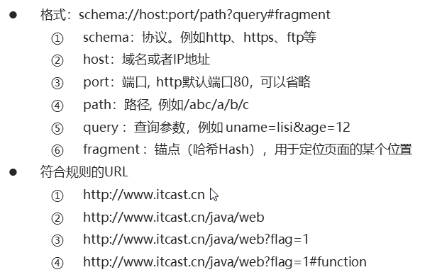

2. Restful形式的url

   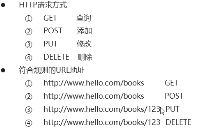

   - Restful是定义url的一种规则
   - 根据请求方式，来确定具体操作是增删改查哪种
   - 上图第一个url和第二个url是一样的，但是请求方式不一样
     - get代表获取图书列表
     - post代表新增图书数据，并且会通过请求体传递新增图书的数据
   - 上图第三个url代表要更新id为123的图书信息，更新的图书数据通过请求体传递
   - Restful形式的url，如果要通过url传递参数，不是？拼接，而是直接以/拼接即可
   - 目前公司内部使用Restful设计风格的url比较多

## 2. Promise用法

### 2.1异步调用

- 如果是要发起请求，访问接口获取数据，因为这个过程是比较耗时的，所以需要异步

#### 2.1.1 异步效果分析（以下均是异步）

- 定时任务

- Ajax

- 事件函数

- 只要是回调函数就是异步：（函数作为参数传递的都是回调函数）

  - 事件函数代码：

    ```js
    xxx.addEventListener('click',function(){})
    xxx.onclick=function(){} // 即使这里的function不是回调函数，但也是异步
    ```

  - 定时任务代码：

    ```js
    setTimeout(function(){},10000)
    ```

- Ajax异步效果代码回顾：

```html
<body>
  <div>前后端交互</div>
  <script type="text/javascript" src="js/jquery.js"></script>
  <script type="text/javascript">
    /*
      前后端交互-异步编程与Promise概述
    */
    var ret = '---';
    $.ajax({
      url: 'http://localhost:3000/data',//接口返回HelloWorld
      success: function(data) {
        ret = data;
        console.log(ret)//这里可以拿到HelloWorld
      }
    });
    console.log(ret)//这里是没有办法拿到HelloWorld，因为ajax发起请求是异步的
    </script>
 <body>
```

- 运行node

  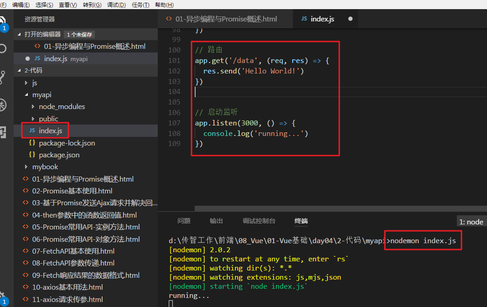

  - index.js中有/data路由，并且返回Hello World!数据
  - 服务运行在3000端口
  - 终端进入myapi目录之后，运行nodemon index.js
  - nodemon可以检测代码修改，自动重启服务

- 然后访问界面

  

#### 2.1.2 多次异步调用的依赖分析

- 多次异步调用的结果顺序不确定

  - 代码回顾：发起三次请求，观察结果：

    ```js
    $.ajax({
         url: 'http://localhost:3000/data',
         success: function(data) {
             console.log(data)
         }
     });
    $.ajax({
        url: 'http://localhost:3000/data1',
        success: function(data) {
            console.log(data)
        }
    });
    $.ajax({
        url: 'http://localhost:3000/data2',
        success: function(data) {
            console.log(data)
        }
    });
    ```

  - 修改后台：增加data1和data2路由

  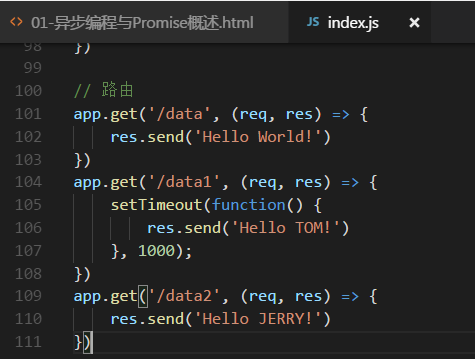

  - 效果

    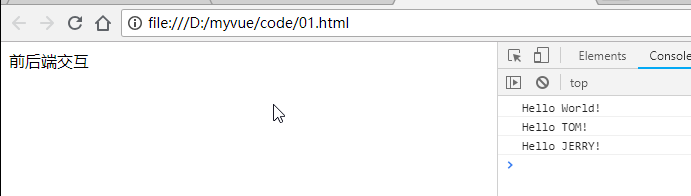

    - 这个打印的顺序不不固定的，而是根据网络状态而定
    - 虽然这次看到的结果，跟咱们发起请求的代码顺序一致，但是下次就可能不一定了

- 异步调用结果如果存在依赖需要嵌套

- 如果我们需要在data请求成功之后再请求data1，然后需要在data1请求成功之后再请求data2，代码如下：

  ```js
   $.ajax({
       url: 'http://localhost:3000/data',
       success: function(data) {
           console.log(data)
           $.ajax({
               url: 'http://localhost:3000/data1',
               success: function(data) {
                   console.log(data)
                   $.ajax({
                       url: 'http://localhost:3000/data2',
                       success: function(data) {
                           console.log(data)
                       }
                   });
               }
           });
       }
   });
  ```

  - 上述代码的层级太深，可读性比较糟糕
  - 我们用Promise来解决

#### 2.1.3 Promise概述

- 介绍：

  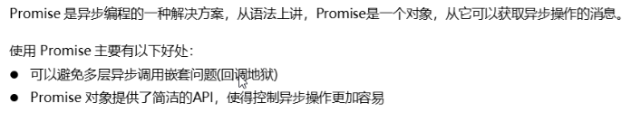

- 网址：

  <https://developer.mozilla.org/zh-CN/docs/Web/JavaScript/Reference/Global_Objects/Promise> 

- **Promise总结**：就是处理异步逻辑的一个工具

### 2.2 Promise基本用法 ***

- 介绍

  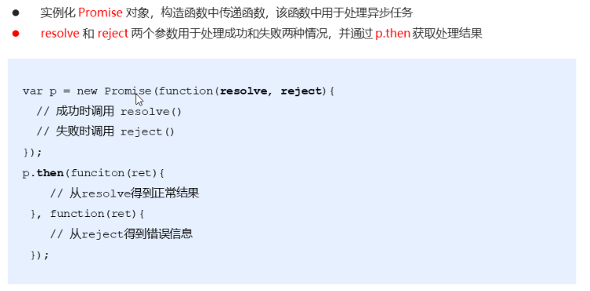

  - resolve：解决，理解：解决了，就是成功了
  - reject：拒绝，理解：被决绝了，就是失败了
  - then：请求结束之后，不管成功失败都会调用then方法
    - 它最多需要有两个参数：Promise 的成功和失败情况的回调函数
    - then：然后，接下来。理解：请求结束，接下来处理结果

- 代码：我们先让Promise处理一下setTimeout这种异步逻辑：

  ```html
  <body>
    
    <script type="text/javascript">
      /*
        Promise基本使用
      */
      // console.log(typeof Promise)
      // console.dir(Promise);
  
      var p = new Promise(function(resolve, reject){
        // 这里用于实现异步任务
        setTimeout(function(){
          var flag = false;
          if(flag) {
            // 正常情况
            resolve('hello');
          }else{
            // 异常情况
            reject('出错了');
          }
        }, 100);
      });
      p.then(function(data){//data接收resolve传递过来的hello
        console.log(data)//如果flag为true，输出hello
      },function(info){//info接收reject传递过来的出错了
        console.log(info)//如果flag为false，输出出错了
      });
    </script>
  </body>
  ```

### 2.3 Promise发送Ajax请求并处理回调地狱问题

- setTimeout这种异步处理过之后，我们来看如何处理原生Ajax这种异步逻辑
- XMLHttpRequest是Ajax的核心，Ajax内部就是通过XMLHttpRequest来发起请求的
- 我们这里是学习下Promise如何处理XMLHttpRequest这个异步逻辑

- 介绍：

  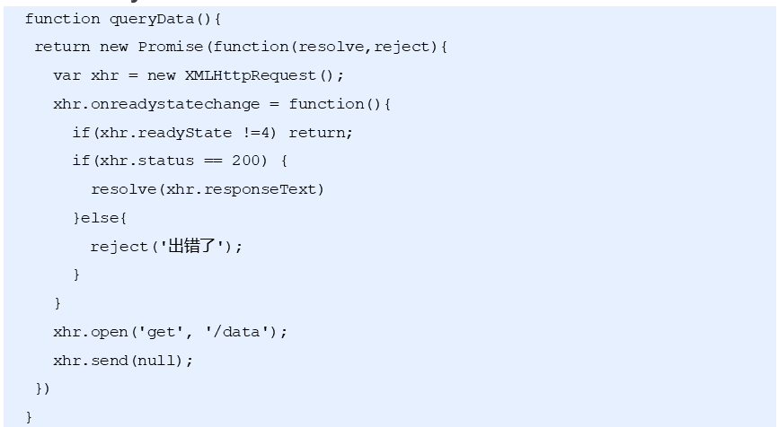

  - onreadystatechange是捕获请求的状态码，只要状态码发生变化就会调用
    - 我们不关心状态不为4的，所以如果readyState不等于4直接返回
    - 4是请求操作已经完成，意思就是请求完成之后，在执行以下逻辑
    - status：是响应状态码，如果为200说明成功
    - responseText是收到的响应数据
  - open初始化请求：请求方式，url
  - send：发起请求，null代表请求体（get不需要请求体）

- 多次请求

  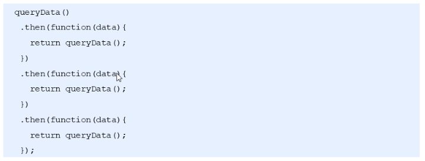

  - queryData返回了一个Promise对象，所以可以调用then方法
  - then方法又返回了queryData方法的调用，相当于又返回了一个Promise对象，所以可以接着调用then方法

- 代码：

  ```html
  <body>
    
    <script type="text/javascript">
      /*
        基于Promise发送Ajax请求
      */
      function queryData(url) {
        var p = new Promise(function(resolve, reject){
          var xhr = new XMLHttpRequest();
          xhr.onreadystatechange = function(){
            if(xhr.readyState != 4) return;//请求状态不等于4，说明异常
            if(xhr.readyState == 4 && xhr.status == 200) {
              // 处理正常的情况
              resolve(xhr.responseText);
            }else{
              // 处理异常情况
              reject('服务器错误');
            }
          };
          xhr.open('get', url);//初始化请求
          xhr.send(null);//发送请求
        });
        return p;
      }
      // queryData('http://localhost:3000/data')
      //   .then(function(data){
      //     console.log(data);
      //   },function(info){
      //     console.log(info)
      //   });
      // ============================
      // 发送多个ajax请求并且保证顺序
      queryData('http://localhost:3000/data')
        .then(function(data){//data请求结束之后调用
          console.log(data)
          return queryData('http://localhost:3000/data1');//然后查询data1
        })
        .then(function(data){//data1请求结束之后调用
          console.log(data);
          return queryData('http://localhost:3000/data2');//最后查询data2
        })
        .then(function(data){//data2请求结束之后调用
          console.log(data)
        });
    </script>
  </body>
  ```

- 总结：想要确保**发送多个ajax请求并且保证顺序**，就需要**在上一个请求结束之后的then中发送第二个请求**

### 2.4 Promise的then方法参数中的函数的返回值

- then方法的参数是一个回调函数，而这个回调函数是有返回值的
- 返回值有两种情况：

- 介绍：

  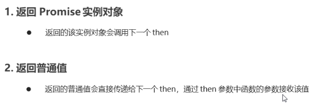

  - 返回值如果是普通值，then会默认添加一个Promise对象，并通过resolve处理这个普通值
    - 其实是调用了这个方法：`Promise.resolve`
    - resolve是Promise类的方法，他可以将一个普通值，转换为Promise对象，并且通过resolve处理这个普通值
  - 所以即使返回普通值，也可以继续调用then

- 代码：

  ```html
  <body>
    
    <script type="text/javascript">
      /*
        then参数中的函数返回值
      */
      function queryData(url) {
        return new Promise(function(resolve, reject){
          var xhr = new XMLHttpRequest();
          xhr.onreadystatechange = function(){
            if(xhr.readyState != 4) return;
            if(xhr.readyState == 4 && xhr.status == 200) {
              // 处理正常的情况
              resolve(xhr.responseText);
            }else{
              // 处理异常情况
              reject('服务器错误');
            }
          };
          xhr.open('get', url);
          xhr.send(null);
        });
      }
      queryData('http://localhost:3000/data')
        .then(function(data){
          return queryData('http://localhost:3000/data1');
        })
        .then(function(data){
          return new Promise(function(resolve, reject){
            setTimeout(function(){
              resolve(123);//返回成功数据123
            },1000)
          });
        })
        .then(function(data){//这个then是由上个then的返回值Promise调用。data是123
          return 'hello';//如果返回一个具体值，then会默认添加一个Promise对象，并将值通过resolve返回
           //相当于以下代码
          // return new Promise(function(resolve, reject) {
          //     resolve('hello');
          // });
        })
        .then(function(data){
          console.log(data)//data是hello
        })
  
    </script>
  </body>
  ```

- 一般我们不会写这么复杂的逻辑，很少会连续发起多次请求，一般最多也就连续调用俩then

### 2.5 Promise常用的API-实例方法

- 方法如下：
  - p.then()：得到异步任务的结果
  - p.catch()：获取异常信息
  - p.finally()：成功与否都会执行（不是正式标准） 

- 代码：

```html
  
  <script type="text/javascript">
    /*
      Promise常用API-实例方法
    */
    // console.dir(Promise);
    function foo() {
      return new Promise(function(resolve, reject){
        setTimeout(function(){
          // resolve(123);
          reject('error');
        }, 100);
      })
    }
    // foo()
    //   .then(function(data){//then的第一个回调是获取请求成功的数据
    //     console.log(data)
    //   })
    //   .catch(function(data){//如果是reject了，那么就会有异常信息，通过catch也可以获取（then的第二个回调函数也可以获取异常信息）
    //     console.log(data)
    //   })
    //   .finally(function(){
    //     console.log('finished')
    //   });

    // --------------------------
    // 两种写法是等效的
    foo()
      .then(function(data){
        # 得到异步任务正确的结果
        console.log(data)
      },function(data){
        # 获取异常信息
        console.log(data)
      })
      # 成功与否都会执行（不是正式标准） 
      .finally(function(){
        console.log('finished')
      });
  </script>
```

### 2.6 Promise常用的API-对象方法

- 对象方法，其实准确来说应该是静态方法，直接通过Promise构造函数（类）调用

  - Promise.all() 并发处理多个异步任务，所有任务都执行完成才能得到结果
  - Promise.race()并发处理多个异步任务，只要有一个任务完成就能得到结果
  - **理解**：
    - all，全部，所有任务处理完成才得到结果
    - race，赛跑，一个人跑赢就返回结果，一个任务完成就得到结果

- 语法：

  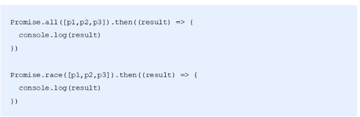

  - `Promise.all`方法接受一个数组作参数，数组中的对象（p1、p2、p3）均为promise实例（如果不是一个promise，该项会被用`Promise.resolve`转换为一个promise)。它的状态由这三个promise实例决定
    - `Promise.resolve`会将一个值，变为一个Promise对象，并且通过resolve方法处理这个值
  - `Promise.race`方法同样接受一个数组作参数。当p1, p2, p3中有一个实例的状态发生改变（成功resolve或失败reject），`Promise.race`的状态就跟着改变。并把第一个改变状态的参数中的promise的返回值，传给`Promise.race`的回调函数

- 代码：

```html
  <script type="text/javascript">
    /*
      Promise常用API-对象方法
    */
    // console.dir(Promise)
    function queryData(url) {
      return new Promise(function(resolve, reject){
        var xhr = new XMLHttpRequest();
        xhr.onreadystatechange = function(){
          if(xhr.readyState != 4) return;
          if(xhr.readyState == 4 && xhr.status == 200) {
            // 处理正常的情况
            resolve(xhr.responseText);
          }else{
            // 处理异常情况
            reject('服务器错误');
          }
        };
        xhr.open('get', url);
        xhr.send(null);
      });
    }

    var p1 = queryData('http://localhost:3000/a1');
    var p2 = queryData('http://localhost:3000/a2');
    var p3 = queryData('http://localhost:3000/a3');
     Promise.all([p1,p2,p3]).then(function(result){
     //all 中的参数[p1,p2,p3]和 返回的结果一 一对应["HELLO TOM", "HELLO JERRY", "HELLO SPIKE"]
       console.log(result) //["HELLO TOM", "HELLO JERRY", "HELLO SPIKE"]
     })
    Promise.race([p1,p2,p3]).then(function(result){
      // 由于p1执行较快，Promise的then()将获得p1的结果。p2,p3仍在继续执行，但执行结果将被丢弃。
      console.log(result) // "HELLO TOM"
    })
  </script>
```

## 3. 接口调用-fetch用法

### 3.1 概述与基本使用

#### 3.1.1 概述

- 基本特性

  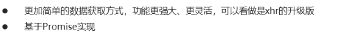

  - xhr就是XMLHttpRequest

- 语法结构

  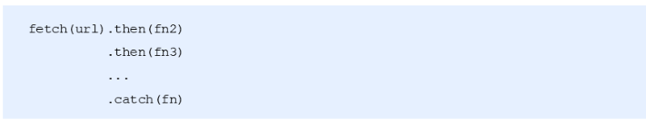

- 网址

  <https://developer.mozilla.org/zh-CN/docs/Web/API/Fetch_API/Using_Fetch> 

#### 3.1.2 基本使用

- 介绍

  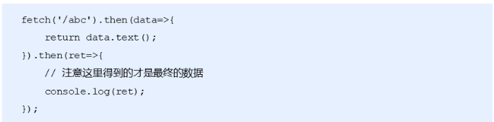

  - fetch的参数：url

  - fetch方法返回一个包含了响应结果的Promise对象，所以可以调用then方法

    - 包含的响应结果是一个Response对象

    - Response对象传递给then的data参数

    - Response对象有一个方法：text()，此方法返回包含了**文本**结果的Promise对象

    - text语法：

      ```
      response.text().then(function (text) {
        // do something with the text response 
      });
      ```

- 代码

  ```html
  <body>
    <script type="text/javascript">
      /*
        Fetch API 基本用法
      */
      fetch('http://localhost:3000/fdata').then(function(data){
        // text()方法属于fetchAPI的一部分，它返回一个Promise实例对象，用于获取后台返回的数据
        return data.text();
      }).then(function(data){//这个data就是text()返回的Promise对象中resolve处理的数据
        console.log(data);
      })
    </script>
  </body>
  ```

- 总结：fetch里传递的参数是根据情况而定，其他的基本上是固定写法：

  ```js
  fetch('xxx').then(function(data){
      return data.text();//这里调用的text也会根据情况而定
  }).then(function(data){
      console.log(data);
  })
  ```

### 3.2 GET和DELETE请求传参

- fetch方法还可以传递第二个参数，配置参数，一个对象

- 常用配置选项

  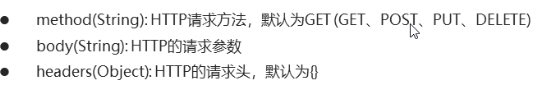

- 语法：

  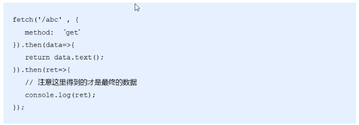

- GET请求方式的参数传递

  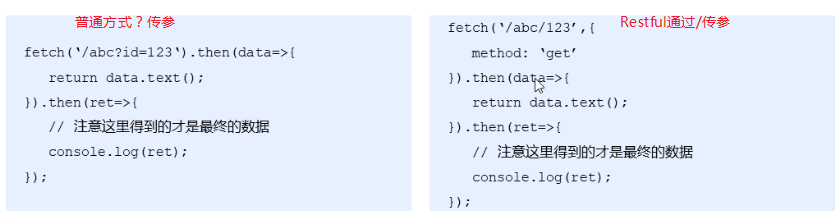

  - 普通方式：？参数名1=参数值1&参数名2=参数值2
  - Restful方式：/参数值1/参数值2 （不需要参数名，他是根据位置匹配的）
  - 普通方式没有Restful更流行，后续的请求方式不再介绍普通方式传参，只介绍Restful
  - 左上图：fetch没有传递第二个参数，配置请求方式，其实默认就是get，右上图也可省略

- DELETE请求方式传参

  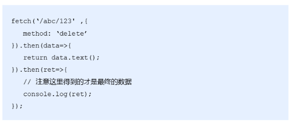

- 代码：

  ```html
  <script type="text/javascript">
      /*
        Fetch API 调用接口传递参数
          */
      #1.1 GET参数传递 - 传统URL  通过url  ？ 的形式传参 
      fetch('http://localhost:3000/books?id=123', {
          # get 请求可以省略不写 默认的是GET 
          method: 'get'
      })
          .then(function(data) {
          # 它返回一个Promise实例对象，用于获取后台返回的数据
          return data.text();
      }).then(function(data) {
          # 在这个then里面我们能拿到最终的数据  
          console.log(data)
      });
  
      #1.2  GET参数传递  restful形式的URL  通过/ 的形式传递参数  即  id = 456 和id后台的配置有关   
      fetch('http://localhost:3000/books/456', {
          # get 请求可以省略不写 默认的是GET 
          method: 'get'
      })
          .then(function(data) {
          return data.text();
      }).then(function(data) {
          console.log(data)
      });
  
      #2.1  DELETE请求方式参数传递      删除id  是  id=789
      fetch('http://localhost:3000/books/789', {
          method: 'delete'
      })
          .then(function(data) {
          return data.text();
      }).then(function(data) {
          console.log(data)
      });
    
  </script>
  ```

### 3.3 POST和PUT请求传参

- post传参：

  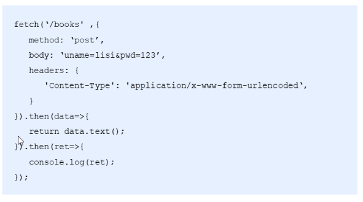

  - post请求方式，通过body传递参数
  - 语法：参数名1=参数值1&参数名2=参数值2
  - Content-Type：请求数据类型
    - application/x-www-form-urlencoded是浏览器默认的编码格式

- put传参：

  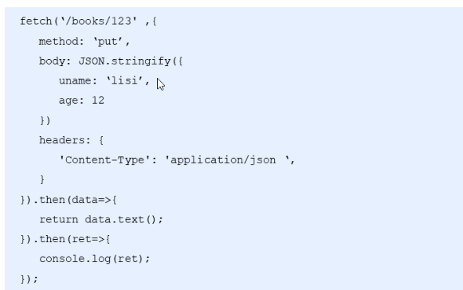

  - put一般用于修改数据，所以需要传两份数据
    - 1.修改的id，通过url传递 books/**123**
    - 2.修改的具体数据，通过body传递
  - 这里的Content-Type指定的是：application/json
    - 因为body里的数据转换为了json格式
    - 如果是json数据，那么他的类型就是：application/json
  - 到底数据是啥类型，我们根据后端提供的接口文档确定

- 代码：

  ```html
  <script> 
  	#3 POST请求传参
      fetch('http://localhost:3000/books', {
          method: 'post',
          # 3.1  传递数据 
          body: 'uname=lisi&pwd=123',//直接传递字符串形式
          #  3.2  设置请求头 
          headers: {
          'Content-Type': 'application/x-www-form-urlencoded'
     		 }
       })
          .then(function(data) {
          return data.text();
      }).then(function(data) {
          console.log(data)
      });
  
      # POST请求传参
      fetch('http://localhost:3000/books', {
          method: 'post',
          body: JSON.stringify({//传递对象，但是需要将对象转换为字符串（一般都是这种形式）
              uname: '张三',
              pwd: '456'
          }),
          headers: {
              'Content-Type': 'application/json'
          }
      })
          .then(function(data) {
          return data.text();
      }).then(function(data) {
          console.log(data)
      });
  
      # PUT请求传参     修改id 是 123 的 
      fetch('http://localhost:3000/books/123', {
          method: 'put',
          body: JSON.stringify({
              uname: '张三',
              pwd: '789'
          }),
          headers: {
              'Content-Type': 'application/json'
          }
      })
          .then(function(data) {
          return data.text();
      }).then(function(data) {
          console.log(data)
      });
  </script>
  ```

- 问题，如果在执行上述代码出现了如下问题：

  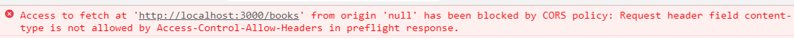

- 解决：修改index.js中的代码：屏蔽如下：

  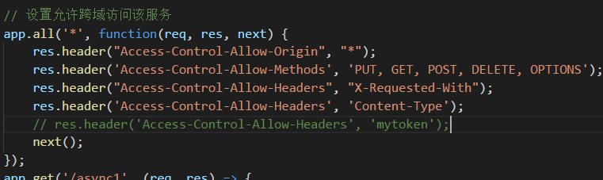

### 3.4 响应数据格式

- 响应数据格式：

  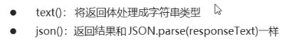

  - json()用的更多

- 语法：

  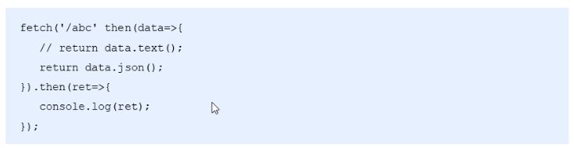

- 代码：

  ```html
  <script type="text/javascript">
      /*
        Fetch响应结果的数据格式
      */
      fetch('http://localhost:3000/json').then(function(data){
        // return data.json();
        return data.text();
      }).then(function(data){
        // console.log(data.uname)//如果是data.json()，就可以直接通过data获取uname
        // console.log(typeof data)
        var obj = JSON.parse(data);//如果是data.text()，需要先parse，才能获取uname
        console.log(obj.uname,obj.age,obj.gender)
      })
    </script>
  //parse是将字符串，转换为对象
  ```

## 4. 接口调用-axios用法 ***

### 4.1 axios概述与基本用法

- 介绍：

  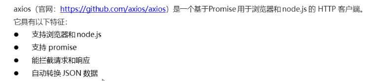

- 基本用法：

  

  - get方法是指发起get请求，
    - 参数：url
    - 返回一个包含了结果的Promise对象

- 代码：

  ```html
    <script type="text/javascript" src="js/axios.js"></script>
    <script type="text/javascript">
      axios.get('http://localhost:3000/adata').then(function(ret){
        // 注意data属性是固定的用法，用于获取后台的实际数据
        // console.log(ret.data)
        console.log(ret)
      })
    </script>
  ```

- 补充：ret是个axios封装的一个响应对象

  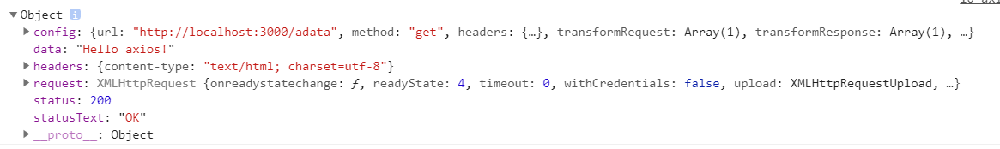

### 4.2 axios的GET和DELETE请求传参

- axios常用API

  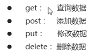

  - 这些方法都返回一个Promise对象

- GET请求传参，两种方式：

  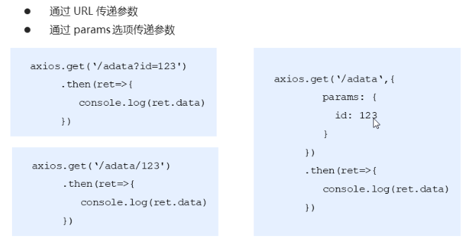

- DELETE请求传参也是两种方式：url或params

  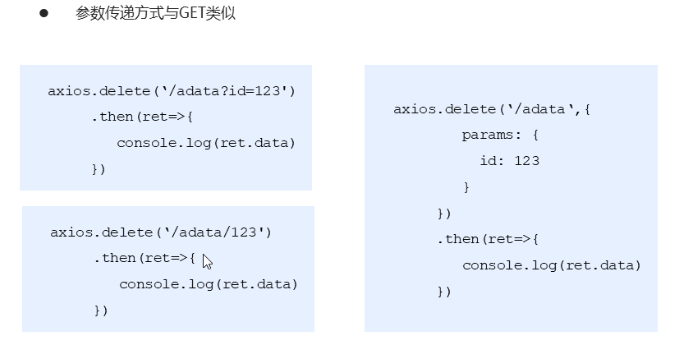

- 代码：

  ```html
  <script>
  # 1. 发送get 请求 
  	axios.get('http://localhost:3000/adata').then(function(ret){ 
        #  拿到 ret 是一个对象      所有的数据都存在 ret 的data 属性里面
        // 注意data属性是固定的用法，用于获取后台的实际数据
        // console.log(ret.data)
        console.log(ret)
      })
  	# 2.  get 请求传递参数
      # 2.1  通过传统的url  以 ? 的形式传递参数
  	axios.get('http://localhost:3000/axios?id=123').then(function(ret){
        console.log(ret.data)
      })
      # 2.2  restful 形式传递参数 
      axios.get('http://localhost:3000/axios/123').then(function(ret){
        console.log(ret.data)
      })
  	# 2.3  通过params  形式传递参数 
      axios.get('http://localhost:3000/axios', {
        params: {
          id: 789
        }
      }).then(function(ret){
        console.log(ret.data)
      })
  	#3 axios delete 请求传参     传参的形式和 get 请求一样
      axios.delete('http://localhost:3000/axios', {
        params: {
          id: 111
        }
      }).then(function(ret){
        console.log(ret.data)
      })
  </script> 
  ```


### 4.3 axios的POST和PUT请求传参

- post：

  - 以对象，key:value传参  （常用）

  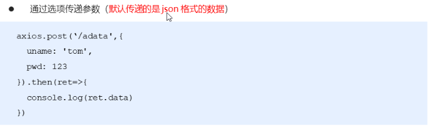

  - 以URLSearchParams传参

  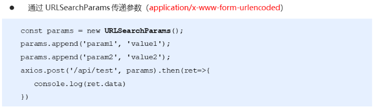

- put：

  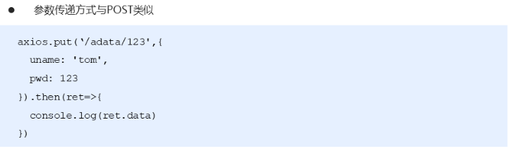

- 代码：

  ```html
  <script>
  # 4  axios 的 post 请求
      # 4.1  通过选项传递参数
      axios.post('http://localhost:3000/axios', {
        uname: 'lisi',
        pwd: 123
      }).then(function(ret){
        console.log(ret.data)
      })
  	# 4.2  通过 URLSearchParams  传递参数 
      var params = new URLSearchParams();
      params.append('uname', 'zhangsan');
      params.append('pwd', '111');
      axios.post('http://localhost:3000/axios', params).then(function(ret){
        console.log(ret.data)
      })
  
   	#5  axios put 请求传参   和 post 请求一样 
      axios.put('http://localhost:3000/axios/123', {
        uname: 'lisi',
        pwd: 123
      }).then(function(ret){
        console.log(ret.data)
      })
  </script>
  ```

### 4.4 axios响应结果和全局配置

- 响应结构的主要属性

  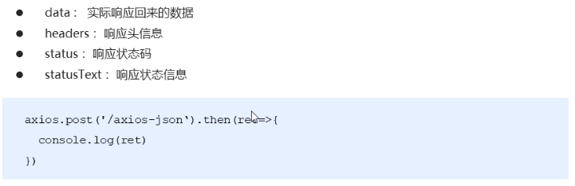

- 全局配置：

  ```js
  #  配置公共的请求头 
  axios.defaults.baseURL = 'https://api.example.com';
  #  配置 超时时间
  axios.defaults.timeout = 2500;
  #  配置公共的请求头
  axios.defaults.headers.common['Authorization'] = AUTH_TOKEN;
  # 配置公共的 post 的 Content-Type
  axios.defaults.headers.post['Content-Type'] = 'application/x-www-form-urlencoded';
  ```

- 代码：

  ```html
    <script type="text/javascript">
      /*
        axios 响应结果与全局配置
      */
      // axios.get('http://localhost:3000/axios-json').then(function(ret){
      //   console.log(ret.data.uname)
      // })
  
      // 配置请求的基准URL地址
      axios.defaults.baseURL = 'http://localhost:3000/';
      // 配置请求头信息
      axios.defaults.headers['mytoken'] = 'hello';
      axios.get('axios-json').then(function(ret){//axios-json自动拼接baseURL
        console.log(ret.data.uname)
      })
  
    </script>
  ```

- 总结：axios将服务器返回的json数据，直接转换为对应的对象data，我们直接从data可以获取对象中的内容

  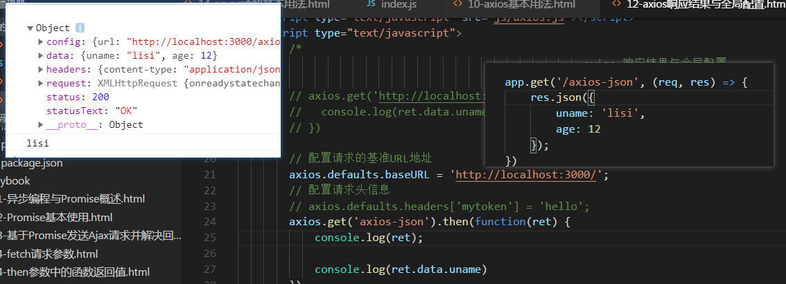

### 4.5 axios拦截器用法

- 请求拦截器

  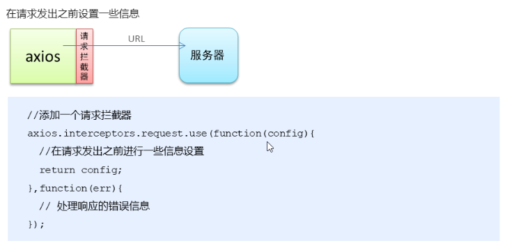

  - 请求拦截器：不是真正的将请求拦截下来，不再继续发送。其实只是拦截到所有请求之后，做了统一处理之后再继续发送请求
  - 请求拦截器的作用是在请求发送前进行一些操作
    - 很多时候，我们希望给所有的请求都添加一个统一的逻辑，这时候如果一个一个请求添加，太麻烦，可以通过请求拦截器一次性给所有的请求添加
    - 例如在每个请求体里加上token，统一做了处理如果以后要改也非常容易
  - config是一个请求相关的对象
  - err代表错误信息

- 响应拦截器

  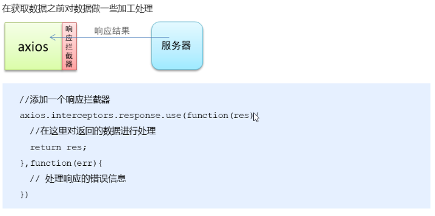

  - 响应拦截器的作用是在接收到响应后进行一些操作
    - 例如在服务器返回登录状态失效，需要重新登录的时候，跳转到登录页
  - 响应拦截器原理和应用与请求拦截器基本一致
    - 拦截到所有请求之后，统一处理，然后继续执行下去
    - 给响应统一处理一些逻辑，一个一个处理麻烦
  - res是响应相关的一个对象

- 代码：

  ```js
  # 1. 请求拦截器 
  axios.interceptors.request.use(function(config) {
      console.log(config.url)
      # 1.1  任何请求都会经过这一步   在发送请求之前做些什么   
      config.headers.mytoken = 'nihao';
      # 1.2  这里一定要return   否则配置不成功  
      return config;
  }, function(err){
      #1.3 对请求错误做点什么    
      console.log(err)
  })
  #2. 响应拦截器 
  axios.interceptors.response.use(function(res) {
      #2.1  在接收响应做些什么  
      var data = res.data;
      return data;//这里返回的数据跟最后请求成功的数据一样
  }, function(err){
      #2.2 对响应错误做点什么  
      console.log(err)
  })
  axios.get('http://localhost:3000/adata').then(function(data){
      console.log(data)//这个跟.response.use返回的data一样
  })
  ```

- 请求拦截器效果

  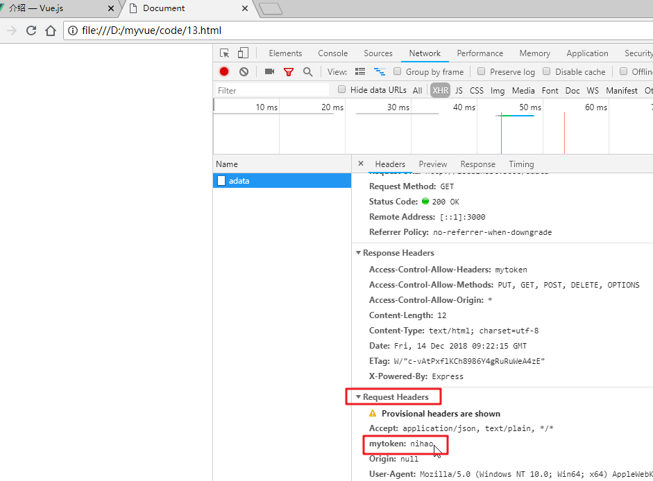

- 响应拦截器效果

  - .response.use不返回res.data的结果

  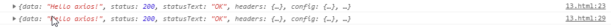

  - 返回res.data的结果

    

## 5. 接口调用-async/await用法 ***

### 5.1 async基本用法

- Promise如果要按照顺序发起多次请求，我们发现还是比较麻烦的，需要通过链式调用then

- 那么接下来，我们来看一种新语法：async/await

- async/await用法介绍

  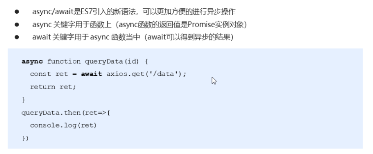

  - async作为一个关键字放到函数前面
    - 任何一个`async`函数都会隐式返回一个`promise`

  - `await`关键字只能在使用`async`定义的函数中使用
    - await后面可以直接跟一个 Promise实例对象

    - await用于修饰，耗时操作，比如网络请求

      -  理解：await：等候，等着耗时操作完成，获取结果

    - await函数不能单独使用

    - 原本axios.get的结果需要then才能拿到

      ```js
      axios.get('adata').then(function(ret) {
          console.log(ret.data)//Hello axios!
      })
      ```

    -  现在直接使用await即可

       ```js
       async function queryData() {
           var ret = await axios.get('adata');
           console.log(ret.data);//Hello axios!
           return ret.data;
       }
       //async会封装一个Promise对象，将返回的内容交给resolve处理
       //所以可以调用then，then的回调函数的参数获取Promise成功返回的数据
        queryData().then(function(data) {//其实这里我们可以不用在调用then了，我们只是为了验证async返回了一个Promise对象
            console.log(data);//Hello axios!
        })
       ```

  - 代码：

  ```js
  <body>
    <script type="text/javascript" src="js/axios.js"></script>
    <script type="text/javascript">
      /*
        async/await 处理异步操作：
        async函数返回一个Promise实例对象
        await后面可以直接跟一个 Promise实例对象
      */
      axios.defaults.baseURL = 'http:localhost:3000';
      //1. 普通的axios（需要then获取结果）
      // axios.get('adata').then(function(ret){
      //   console.log(ret.data)
      // })
  	//2. async+axios（不需要then直接可以await等待一会获取结果）
      // async function queryData() {
      //   var ret = await axios.get('adata');//awiat可直接获取异步结果
      //   console.log(ret.data);
      // }
  	//queryData();
  	//3.  async返回数据+axios
      // async function queryData() {
      //   var ret = await axios.get('adata');
      //   return ret.data;
      // }
  	queryData().then(function(data){//async函数隐式返回Promise对象，所以可以then(这里可以不用再调用then)
        console.log(data)
      })
  	//4. async+ Promise
      async function queryData() {
        var ret = await new Promise(function(resolve, reject){//await后可以跟promise实例
          setTimeout(function(){
            resolve('nihao')
          },1000);
        })
        return ret;//nihao
      }
      queryData().then(function(data){//这里可以不用再调用then
        console.log(data);////nihao
      })
    </script>
  </body>
  ```

### 5.2 处理多个异步请求

- 接下来我们来看一下经过async+await处理的多个请求，多么简单

- 介绍：

  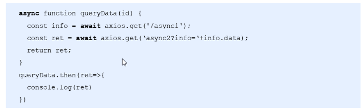

  - 因为await会等待每个请求的结果
  - 所以紧接着就可以发起第二个请求，因为想执行第二个请求，第一个请求肯定执行完了
  - 所以这里的async+await，是的异步代码看起来更像同步代码
  - **总结**：**async/await 让异步代码看起来、表现起来更像同步代码**

- 代码：

  ```js
  #2.  async    函数处理多个异步函数
  axios.defaults.baseURL = 'http://localhost:3000';
  
  async function queryData() {
      #2.1  添加await之后 当前的await 返回结果之后才会执行后面的代码   
      var info = await axios.get('async1');
      #2.2  让异步代码看起来、表现起来更像同步代码
      var ret = await axios.get('async2?info=' + info.data);
      return ret.data;
  }
  
  queryData().then(function(data){
      console.log(data)
  })
  ```


## 6. 基于接口的案例-图书列表案例

### 0. 业务需求

- 效果图：

  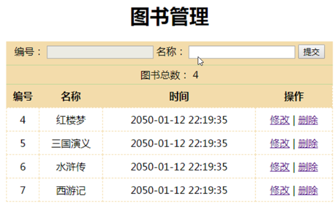

- 分析：

  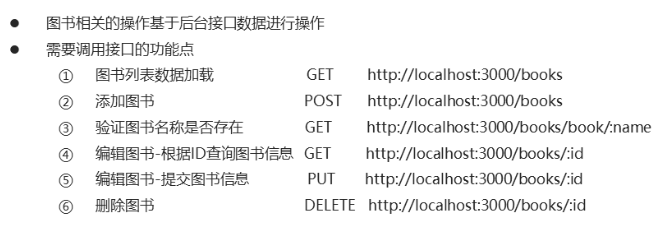

### 1. 基于接口案例-获取图书列表

- 文档：

  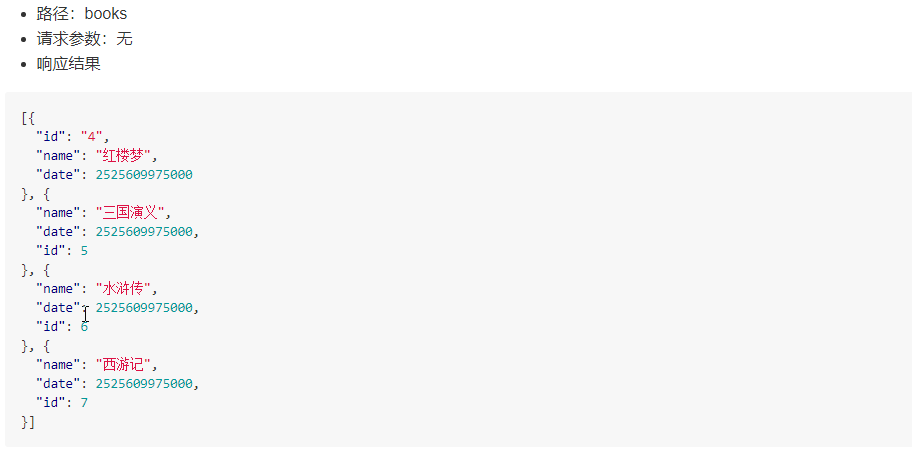

- 步骤：
  - 导入axios  用来发起请求
  - 把获取到的数据渲染到页面上 
- 代码：

```html
  <div id="app">
        <div class="grid">
            <table>
                <thead>
                    <tr>
                        <th>编号</th>
                        <th>名称</th>
                        <th>时间</th>
                        <th>操作</th>
                    </tr>
                </thead>
                <tbody>
                    <!-- 5.  把books  中的数据渲染到页面上   -->
                    <tr :key='item.id' v-for='item in books'>
                        <td>{{item.id}}</td>
                        <td>{{item.name}}</td>
                        <td>{{item.date }}</td>
                        <td>
                            <a href="">修改</a>
                            <span>|</span>
                            <a href="">删除</a>
                        </td>
                    </tr>
                </tbody>
            </table>
        </div>
    </div>
    <script type="text/javascript" src="js/vue.js"></script>
	# 1.  导入axios   
    <script type="text/javascript" src="js/axios.js"></script>
    <script type="text/javascript">
        /*
             图书管理-添加图书
         */
        # 2   配置公共的url地址  简化后面的调用方式
        axios.defaults.baseURL = 'http://localhost:3000/';
        axios.interceptors.response.use(function(res) {
            return res.data;
        }, function(error) {
            console.log(error)
        });

        var vm = new Vue({
            el: '#app',
            data: {
                flag: false,
                submitFlag: false,
                id: '',
                name: '',
                books: []
            },
            methods: {
                # 3 定义一个方法 用来发送 ajax 
                # 3.1  使用 async  来 让异步的代码  以同步的形式书写 
                queryData: async function() {
                    // 调用后台接口获取图书列表数据
                    // var ret = await axios.get('books');
                    // this.books = ret.data;
					# 3.2  发送ajax请求  把拿到的数据放在books 里面   
                    this.books = await axios.get('books');
                }
            },

            mounted: function() {
				#  4 mounted  里面 DOM已经加载完毕  在这里调用函数  
                this.queryData();
            }
        });
    </script>
```

### 2.  添加图书

- 文档：

  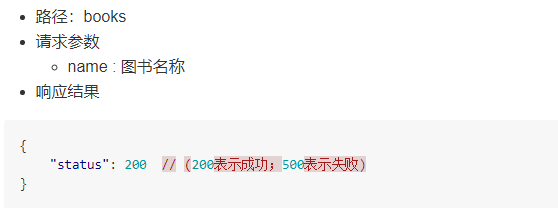

- 步骤：
  - 获取用户输入的数据   发送到后台
  - 渲染最新的数据到页面上

- 代码：

```js
 methods: {
    handle: async function(){
          if(this.flag) {
            // 编辑图书
            // 就是根据当前的ID去更新数组中对应的数据
            this.books.some((item) => {
              if(item.id == this.id) {
                item.name = this.name;
                // 完成更新操作之后，需要终止循环
                return true;
              }
            });
            this.flag = false;
          }else{
            # 1.1  在前面封装好的 handle 方法中  发送ajax请求  
            # 1.2  使用async  和 await 简化操作 需要在 function 前面添加 async   
            var ret = await axios.post('books', {
              name: this.name
            })
            # 1.3  根据后台返回的状态码判断是否加载数据 
            if(ret.status == 200) {
             # 1.4  调用 queryData 这个方法  渲染最新的数据 
              this.queryData();
            }
          }
          // 清空表单
          this.id = '';
          this.name = '';
        },        
 }         
```

### 3.  验证图书名称是否存在

- 文档：

  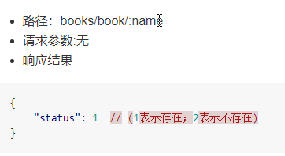

- 步骤：
  - 添加图书之前发送请求验证图示是否已经存在
  - 如果不存在 往后台里面添加图书名称
    - 图书存在与否只需要修改submitFlag的值即可

- 代码：

```js
 watch: {
        name: async function(val) {
          // 验证图书名称是否已经存在
          // var flag = this.books.some(function(item){
          //   return item.name == val;
          // });
          var ret = await axios.get('/books/book/' + this.name);
          if(ret.status == 1) {
            // 图书名称存在
            this.submitFlag = true;
          }else{
            // 图书名称不存在
            this.submitFlag = false;
          }
        }
},
```

### 4.  编辑图书

- 文档：

  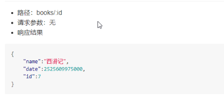

- 步骤：
  - 根据当前书的id 查询需要编辑的书籍
  - 需要根据状态位判断是添加还是编辑 

- 代码：

```js
 methods: {
        handle: async function(){
          if(this.flag) {
            #4.3 编辑图书   把用户输入的信息提交到后台
            var ret = await axios.put('books/' + this.id, {
              name: this.name
            });
            if(ret.status == 200){
              #4.4  完成添加后 重新加载列表数据
              this.queryData();
            }
            this.flag = false;
          }else{
            // 添加图书
            var ret = await axios.post('books', {
              name: this.name
            })
            if(ret.status == 200) {
              // 重新加载列表数据
              this.queryData();
            }
          }
          // 清空表单
          this.id = '';
          this.name = '';
        },
        toEdit: async function(id){
          #4.1  flag状态位用于区分编辑和添加操作
          this.flag = true;
          #4.2  根据id查询出对应的图书信息  页面中可以加载出来最新的信息
          # 调用接口发送ajax 请求  
          var ret = await axios.get('books/' + id);
          this.id = ret.id;
          this.name = ret.name;
        },
```

###   5. 删除图书

- 文档：

  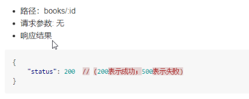

- 步骤：
  - 把需要删除的id书籍 通过参数的形式传递到后台

- 代码：

```js
   deleteBook: async function(id){
          // 删除图书
          var ret = await axios.delete('books/' + id);
          if(ret.status == 200) {
            // 重新加载列表数据
            this.queryData();
          }
   }
```

