# Day01

##今日目标

1.能够说出什么是路由 

2.能够说出前端路由的实现原理

3.能够使用Vue-Router实现前端路由

4.能够实现嵌套路由，动态路由  

5.能够实现命名路由以及编程式导航 

6.理解并实现后台管理案例

## 1. 路由的基本概念与原理

### 1.1 路由

- 介绍

  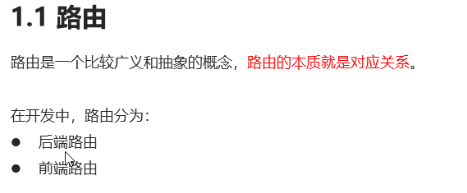

- 详情介绍：

  - 路由的本质就是**一种对应关系**，比如说我们在url地址中输入我们要访问的url地址之后，浏览器要去请求这个url地址对应的资源。
  - 那么**url地址和真实的资源之间就有一种对应的关系**，就是**路由**。

  - 路由分为前端路由和后端路由

    1). 后端路由是由服务器端进行实现，并完成资源的分发  （url与资源/数据的对应关系）

    2). 前端路由是依靠hash值(锚点链接)的变化进行实现   （锚点与组件之间的关系）
  - 后端路由性能相对前端路由来说较低，所以，我们接下来主要学习的是前端路由
  - 前端路由的基本概念：**根据不同的事件来显示不同的页面内容**，即**事件与事件处理函数之间的对应关系**
  - 前端路由主要做的事情就是监听事件并分发执行事件处理函数

### 1.2 后端路由

- 介绍：

  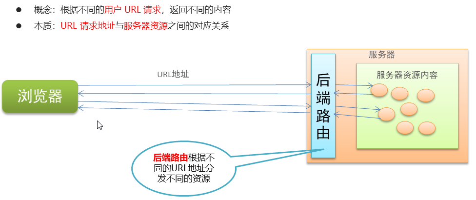

### 1.3 SPA

- 介绍：

  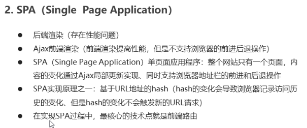

- **总结**：

  - 后端渲染界面，只要有一处修改，就需要刷新整个界面，存在性能问题
  - Ajax可以局部刷新，但是不支持前进后退
  - spa可以局部刷新，也支持前进后退

### 1.4 前端路由

- 介绍：

  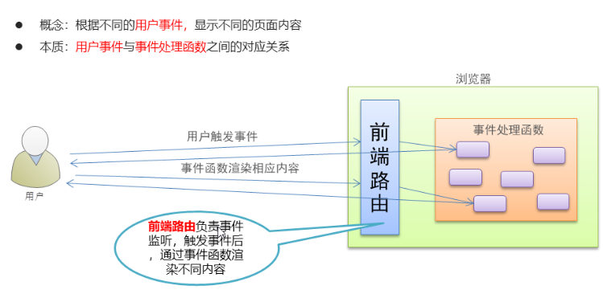

### 1.5 总结

- 路由：表示一种对应关系，某些事物的一 一对应的关系
- 后端路由：url与后端资源的一 一对应的关系
- 前端路由：用户事件与事件处理函数一 一对应的关系

### 1.6 实现简易前端路由

- 介绍

  - 前端路由是基于hash值的变化进行实现的

    - 这里的hash值指的是url的hash值，也就是界面的锚点

  - 比如点击页面中的菜单或者按钮改变URL的hash值，根据hash值的变化来控制组件的切换

  - 核心实现依靠一个事件，即监听hash值变化的事件

    ```js
    window.onhashchange = function(){
        //location.hash可以获取到最新的hash值
        location.hash
    }
    ```

- 代码：

```html
    <!DOCTYPE html>
    <html lang="en">
    <head>
        <meta charset="UTF-8" />
        <meta name="viewport" content="width=device-width, initial-scale=1.0" />
        <meta http-equiv="X-UA-Compatible" content="ie=edge" />
        <title>Document</title>
        <!-- 导入 vue 文件 -->
        <script src="./lib/vue_2.5.22.js"></script>
    </head>
    <body>
        <!-- 被 vue 实例控制的 div 区域 -->
        <div id="app">
        <!-- 切换组件的超链接 -->
        <a href="#/zhuye">主页</a> 
        <a href="#/keji">科技</a> 
        <a href="#/caijing">财经</a>
        <a href="#/yule">娱乐</a>

        <!-- 根据 :is 属性指定的组件名称，把对应的组件渲染到 component 标签所在的位置 -->
        <!-- 可以把 component 标签当做是【组件的占位符】 -->
        <component :is="comName"></component>
        </div>

        <script>
        // #region 定义需要被切换的 4 个组件
        // 主页组件
        const zhuye = {
            template: '<h1>主页信息</h1>'
        }

        // 科技组件
        const keji = {
            template: '<h1>科技信息</h1>'
        }

        // 财经组件
        const caijing = {
            template: '<h1>财经信息</h1>'
        }

        // 娱乐组件
        const yule = {
            template: '<h1>娱乐信息</h1>'
        }
        // #endregion

        // #region vue 实例对象
        const vm = new Vue({
            el: '#app',
            data: {
            comName: 'zhuye'
            },
            // 注册私有组件
            components: {
            zhuye,
            keji,
            caijing,
            yule
            }
        })
        // #endregion

        // 监听 window 的 onhashchange 事件，根据获取到的最新的 hash 值，切换要显示的组件的名称
        window.onhashchange = function() {
            // 通过 location.hash 获取到最新的 hash 值
            console.log(location.hash);
            switch(location.hash.slice(1)){
            case '/zhuye':
                vm.comName = 'zhuye'
            break
            case '/keji':
                vm.comName = 'keji'
            break
            case '/caijing':
                vm.comName = 'caijing'
            break
            case '/yule':
                vm.comName = 'yule'
            break
            }
        }
        </script>
    </body>
    </html>
```

- 案例效果图：


- 点击每个超链接之后，会进行相应的内容切换，如下：


- 核心思路：
  - 在页面中有一个vue实例对象，vue实例对象中有四个组件，分别是tab栏切换需要显示的组件内容
  - 在页面中有四个超链接，如下：

```htm
<a href="#/zhuye">主页</a> 
<a href="#/keji">科技</a> 
<a href="#/caijing">财经</a>
<a href="#/yule">娱乐</a>
```

- 当我们点击这些超链接的时候，就会改变url地址中的hash值，当hash值被改变时，就会触发onhashchange事件
- 在触发onhashchange事件的时候，我们根据hash值来让不同的组件进行显示：

```js
window.onhashchange = function() {
    // 通过 location.hash 获取到最新的 hash 值
    console.log(location.hash);
    switch(location.hash.slice(1)){
        case '/zhuye':
        //通过更改数据comName来指定显示的组件
        //因为 <component :is="comName"></component> ，组件已经绑定了comName
        vm.comName = 'zhuye'
        break
        case '/keji':
        vm.comName = 'keji'
        break
        case '/caijing':
        vm.comName = 'caijing'
        break
        case '/yule':
        vm.comName = 'yule'
        break
    }
}
```

## 2. vue-router的基本使用  ***

### 2.1 基本使用

- 介绍

  - 它是一个Vue.js官方提供的**路由管理器**。是一个功能更加强大的前端路由器，推荐使用
  - Vue Router和Vue.js非常契合，可以一起方便的实现SPA(single page web application,单页应用程序)应用程序的开发
  - Vue Router依赖于Vue，所以需要先引入Vue，再引入Vue Router
  - 官网：<https://router.vuejs.org/zh/> 

- Vue Router的特性：

  - 支持H5历史模式或者hash模式
  - 支持嵌套路由
  - 支持路由参数
  - 支持编程式路由
  - 支持命名路由
  - ....

- 基本使用步骤

  - 1.导入js文件
  - 2.添加路由链接
  - 3.添加路由占位符(最后路由展示的组件就会在占位符的位置显示)
  - 4.定义路由组件
  - 5.配置路由规则并创建路由实例
  - 6.将路由挂载到Vue实例中

- 1.导入js文件

  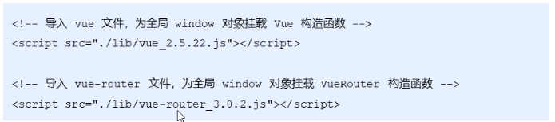

- 2.添加路由链接

  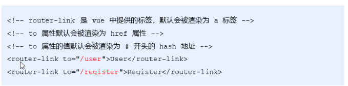

- 3.添加路由占位符(最后路由展示的组件就会在占位符的位置显示)

  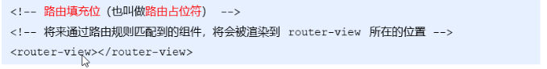

  - router-view：路由-视图，显示用户点击的路由链接对应的组件
    - 视图：组件可以显示出具体内容，可以理解为视图
    - 例如：用户点击User路由链接，就会将User组件显示到这里

- 4.定义路由组件

  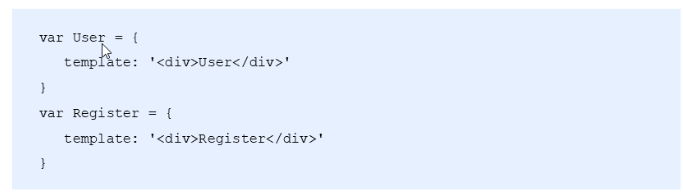

- 5.创建路由实例，并配置路由规则

  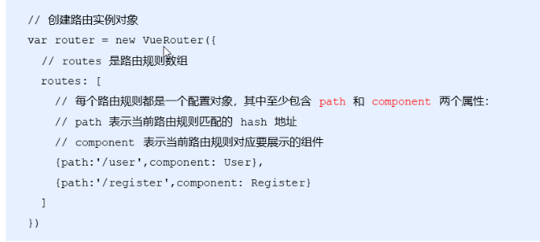

- 6.将路由挂载到Vue实例中

  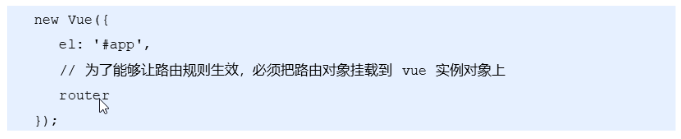

  - router是：router:router的简写
  - 如果VueRouter的实例名是xxx，那挂载时，就需要写：router:xxx
  - Vue实例化时，参数el，data，methods，router都是固定的

- 代码：

```html
<!DOCTYPE html>
<html lang="en">
  <head>
    <meta charset="UTF-8" />
    <meta name="viewport" content="width=device-width, initial-scale=1.0" />
    <meta http-equiv="X-UA-Compatible" content="ie=edge" />
    <title>Document</title>
    <!--1. 导入 vue 文件 -->
    <script src="./lib/vue_2.5.22.js"></script>
    <script src="./lib/vue-router_3.0.2.js"></script>
  </head>
  <body>
    <!--2. 添加路由链接：to渲染成href。to的值渲染成#hash值（锚点）-->
    <!-- 被 vm 实例所控制的区域 -->
    <div id="app">
      <router-link to="/user">User</router-link><!--<a href="#/user"> User</a>-->
      <router-link to="/register">Register</router-link>

      <!-- 3.路由占位符 -->
      <router-view></router-view>
    </div>

    <script>
     //4.定义路由组件
      const User = {
        template: '<h1>User 组件</h1>'
      }

      const Register = {
        template: '<h1>Register 组件</h1>'
      }
	//5. 配置路由规则，并创建路由实例
      // 创建路由实例对象
      const router = new VueRouter({
        // 所有的路由规则
        routes: [
          { path: '/user', component: User },
          { path: '/register', component: Register }
        ]
      })

      // 创建 vm 实例对象
      const vm = new Vue({
        // 指定控制的区域
        el: '#app',
        data: {},
        //6.挂载路由实例对象
        // router: router
        router
      })
    </script>
  </body>
</html>

```

- 效果：(点击可以切换)

  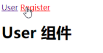

- 渲染结果：

  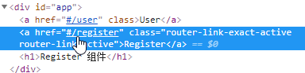

### 2.2 路由重定向

- 介绍

  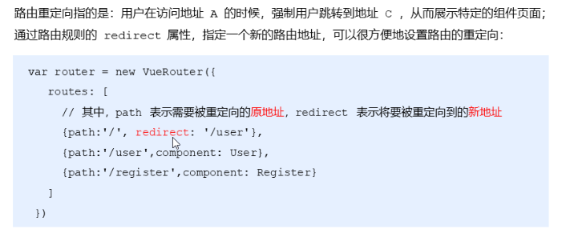

  - rediret：重定向
  - 普通的路由是定义path和component，访问url显示对应组件
  - 重定向路由是定义path和redirect，访问url跳转到另一个url

- 举例：何时用到路由重定向

  - 打开界面，默认如下：默认访问的是#/根地址

    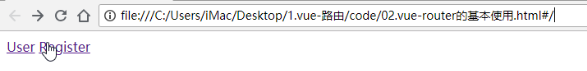

  - 我们希望，在打开界面的时候能访问：#/user，user锚点位置

  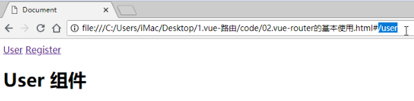

- 代码：

  ```js
  //将上一个案例的路由规则增加一个重定向：
  // 创建路由实例对象
  const router = new VueRouter({
      // 所有的路由规则
      routes: [
          { path: '/', redirect: '/user'},//增加这一行代码，如果访问跟路径/，则重定向到/user
          { path: '/user', component: User },
          { path: '/register', component: Register }
      ]
  })
  ```

- 效果：

  - 再访问：03.路由重定向.html
  - 会跳转：03.路由重定向.html#/user

## 3. vue-router嵌套路由  ***

- 通过路由嵌套，可以处理复杂的界面

- 嵌套路由功能分析：如下图：点击Register之后发现Register组件中嵌套了另一块内容

  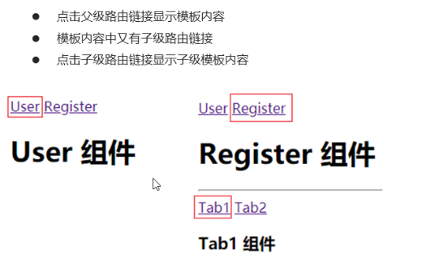

- 步骤：

  1. 父路由组件模板

  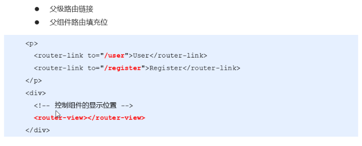

  2. 子级路由模板

     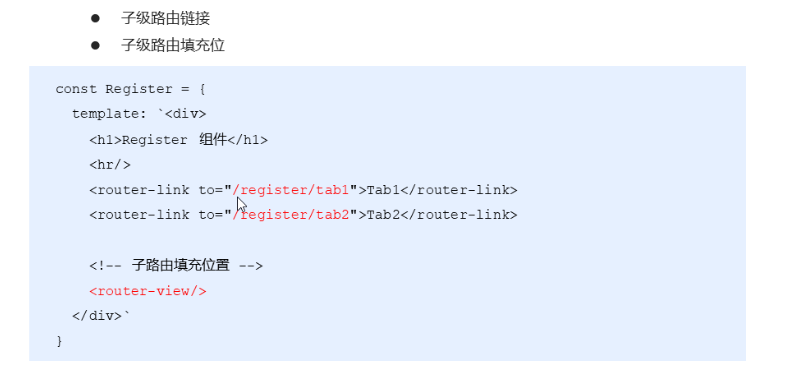

     - 因为子级模板是哎register组件内显示的，所以应该定义在register组件的template中
     - 在template添加路由连接，子url是/register开头
     - 在template添加router-view，给子组件占位

  3. 路由嵌套配置

     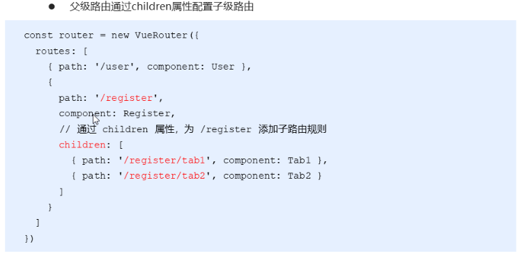

     - 作为register的子组件，那么就需要在register的children属性中定义路由规则

- 代码

  ```html
  <head>
      <meta charset="UTF-8" />
      <meta name="viewport" content="width=device-width, initial-scale=1.0" />
      <meta http-equiv="X-UA-Compatible" content="ie=edge" />
      <title>Document</title>
      <!-- 导入 vue 文件 -->
      <script src="./lib/vue_2.5.22.js"></script>
      <script src="./lib/vue-router_3.0.2.js"></script>
    </head>
    <body>
      <!-- 被 vm 实例所控制的区域 -->
      <div id="app">
        <router-link to="/user">User</router-link>
        <router-link to="/register">Register</router-link>
  
        <!-- 路由占位符 -->
        <router-view></router-view>
      </div>
  
      <script>
        const User = {
          template: '<h1>User 组件</h1>'
        }
  
        const Register = {
          template: `<div>
            <h1>Register 组件</h1>
            <hr/>
  
            <!-- 子路由链接 -->
            <router-link to="/register/tab1">tab1</router-link>
            <router-link to="/register/tab2">tab2</router-link>
  
            <!-- 子路由的占位符 -->
            <router-view />
          <div>`
        }
  
        const Tab1 = {
          template: '<h3>tab1 子组件</h3>'
        }
  
        const Tab2 = {
          template: '<h3>tab2 子组件</h3>'
        }
  
        // 创建路由实例对象
        const router = new VueRouter({
          // 所有的路由规则
          routes: [
            { path: '/', redirect: '/user'},
            { path: '/user', component: User },
            // children 数组表示子路由规则
            { path: '/register', component: Register, children: [
              { path: '/register/tab1', component: Tab1 },
              { path: '/register/tab2', component: Tab2 }
            ] }
          ]
        })
  
        // 创建 vm 实例对象
        const vm = new Vue({
          // 指定控制的区域
          el: '#app',
          data: {},
          // 挂载路由实例对象
          // router: router
          router
        })
      </script>
    </body>
  ```

- **总结：**

  - 关于router-view和router-link的书写位置：
    - **路由规则在哪定义的，router-view和router-link就写在谁的模板中**
    - Register和User定义在vm中，那么他们的router-view和router-link就定义在app中
      - app这个div就可以理解为vm的模板
      - Register和User可以理解为vm的子组件
    - Tab1和Tab2定义在Register中，那么他们的router-view和router-link就定义Register中的模板中
    - **路由规则在哪定义的，决定了自己的父组件是谁**，那么**子组件的router-view和router-link就定义在父组件的模板中**

- 分析图

  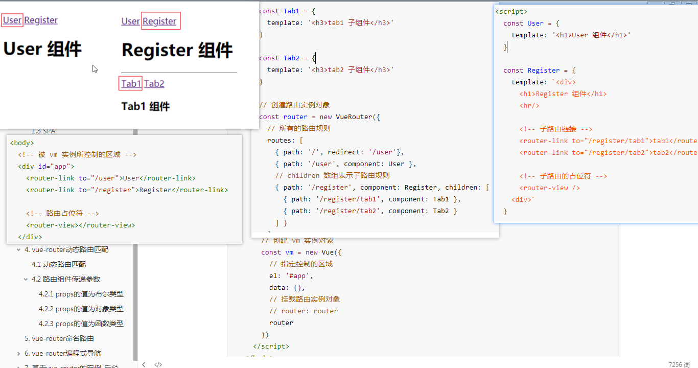

## 4. vue-router动态路由匹配

### 4.1 动态路由匹配 ***

- 需求：点击不同的用户连接，显示对应的用户信息

- 定义如下路由链接和路由规则，是否可行？

  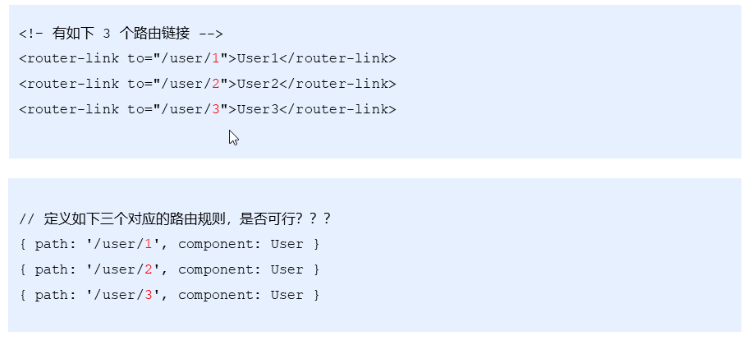

  - 数字1,2,3代表用户id，点击User1链接，User组件显示用户1对应的信息，这样可以么？
  - 这样处理肯定不行，因为如果有100个学生，路由规则定义起来太费劲

- 动态路由匹配介绍：

  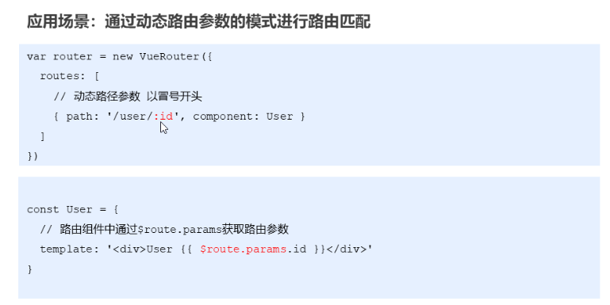

  - 匹配规则定义时，动态路由语法为**：参数名**，以冒号开头，就代表是动态匹配

  - 路由组件定义时，获取路由参数为：**{{$route.params.参数名}}**

  - **$route**.params.是固定写法

  - Vue实例的属性，都是\$开头，比如\$el

    ```js
    // 创建 vm 实例对象
    const vm = new Vue({
        // 指定控制的区域
        el: '#app',
        data: {},
        // 挂载路由实例对象
        // router: router
        router
    })
    ```

    - 创建Vue实例时，传递的参数有：el,data,router
    - 那么vm有了\$el，\$data，\$router属性
    - 但是获取动态参数，是**{{$route.params.参数名}}**

- 代码：

  ```html
  <head>
      <meta charset="UTF-8" />
      <meta name="viewport" content="width=device-width, initial-scale=1.0" />
      <meta http-equiv="X-UA-Compatible" content="ie=edge" />
      <title>Document</title>
      <!-- 导入 vue 文件 -->
      <script src="./lib/vue_2.5.22.js"></script>
      <script src="./lib/vue-router_3.0.2.js"></script>
    </head>
    <body>
      <!-- 被 vm 实例所控制的区域 -->
      <div id="app">
        <router-link to="/user/1">User1</router-link>
        <router-link to="/user/2">User2</router-link>
        <router-link to="/user/3">User3</router-link>
        <router-link to="/register">Register</router-link>
  
        <!-- 路由占位符 -->
        <router-view></router-view>
      </div>
  
      <script>
        const User = {
          template: '<h1>User 组件 -- 用户id为: {{$route.params.id}}</h1>'
        }
  
        const Register = {
          template: '<h1>Register 组件</h1>'
        }
  
        // 创建路由实例对象
        const router = new VueRouter({
          // 所有的路由规则
          routes: [
            { path: '/', redirect: '/user'},
            { path: '/user/:id', component: User },
            { path: '/register', component: Register }
          ]
        })
  
        // 创建 vm 实例对象
        const vm = new Vue({
          // 指定控制的区域
          el: '#app',
          data: {},
          // 挂载路由实例对象
          // router: router
          router
        })
      </script>
    </body>
  ```

### 4.2 路由组件传递参数  ***

- 介绍

  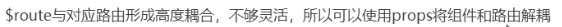

  - 就是在组件中想要获取路由参数，需要通过{{$route.params.id}}来获取，比较麻烦

#### 4.2.1 props的值为布尔类型

- 语法：

  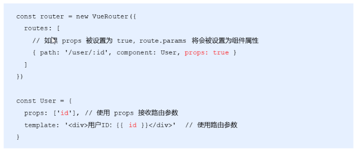

  - 路由定义规则中：props:true，代表给动态参数id，开启props传参（其实就是通过props方式传递参数）

  - 路由组件定义中：通过props接收参数

  - 这样就不用通过{{$route.params.id}}获取

  - 其实这个跟之前的组件通过属性传递数据是类似的：

    ```html
    <User id='1'></User>
    这个1就会传递给User组件的props属性id
    ```

- 代码：

  ```html
  <body>
      <!-- 被 vm 实例所控制的区域 -->
      <div id="app">
        <router-link to="/user/1">User1</router-link>
        <router-link to="/user/2">User2</router-link>
        <router-link to="/user/3">User3</router-link>
        <router-link to="/register">Register</router-link>
  
        <!-- 路由占位符 -->
        <router-view></router-view>
        <User id='1'></User>
      </div>
  
      <script>
        const User = {
          props: ['id'],
          template: '<h1>User 组件 -- 用户id为: {{id}}</h1>'
        }
  
        const Register = {
          template: '<h1>Register 组件</h1>'
        }
  
        // 创建路由实例对象
        const router = new VueRouter({
          // 所有的路由规则
          routes: [
            { path: '/', redirect: '/user'},
            { path: '/user/:id', component: User, props: true },
            { path: '/register', component: Register }
          ]
        })
  
        // 创建 vm 实例对象
        const vm = new Vue({
          // 指定控制的区域
          el: '#app',
          data: {},
          // 挂载路由实例对象
          // router: router
          router
        })
      </script>
    </body>
  ```

- 内部原理：

  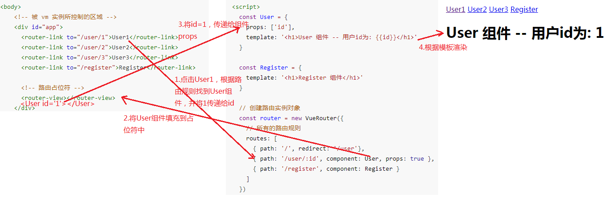

#### 4.2.2 props的值为对象类型

- 介绍：

  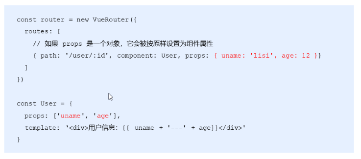

  - uname的lisi传递给User组件中props的uname，age的12传递给User组件中props的age
  - 这时的id就无法获取了，所以id在这种方式中就废了
  - 只有props为true时，才会将:id作为参数传递给User

- 代码：

  ```html
  <body>
      <!-- 被 vm 实例所控制的区域 -->
      <div id="app">
        <router-link to="/user/1">User1</router-link>
        <router-link to="/user/2">User2</router-link>
        <router-link to="/user/3">User3</router-link>
        <router-link to="/register">Register</router-link>
        <!-- 路由占位符 -->
        <router-view></router-view>
      </div>
  
      <script>
        const User = {
          props: ['id', 'uname', 'age'],
          //这个id其实是拿不到值的
          template: '<h1>User 组件 -- 用户id为: {{id}} -- 姓名为:{{uname}} -- 年龄为：{{age}}</h1>'
        }
  
        const Register = {
          template: '<h1>Register 组件</h1>'
        }
  
        // 创建路由实例对象
        const router = new VueRouter({
          // 所有的路由规则
          routes: [
            { path: '/', redirect: '/user'},
            { path: '/user/:id', component: User, props: { uname: 'lisi', age: 20 } },
            { path: '/register', component: Register }
          ]
        })
  
        // 创建 vm 实例对象
        const vm = new Vue({
          // 指定控制的区域
          el: '#app',
          data: {},
          // 挂载路由实例对象
          // router: router
          router
        })
      </script>
    </body>
  ```

- 效果：无法获取到id

  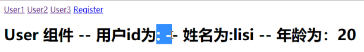

#### 4.2.3 props的值为函数类型

- 介绍：

  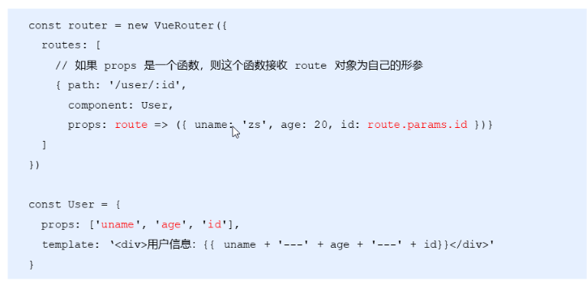

  - props指定了一个箭头函数：相当于如下代码

    ```js
    props:function (route){
        return {uname:'zs',age:20,id:route.params.id}
    }
    ```

  - 箭头函数返回了一个对象，对象中的数据，就是要传递的数据

  - uname和age是定死的值

  - router是箭头函数的形参，系统在调用时会将$route传递进去

  - id是通过route.params.id动态获取到id参数的值

- 代码：

  ```html
  <body>
      <!-- 被 vm 实例所控制的区域 -->
      <div id="app">
        <router-link to="/user/1">User1</router-link>
        <router-link to="/user/2">User2</router-link>
        <router-link to="/user/3">User3</router-link>
        <router-link to="/register">Register</router-link>
  
        <!-- 路由占位符 -->
        <router-view></router-view>
      </div>
  
      <script>
        const User = {
          props: ['id', 'uname', 'age'],
          template: '<h1>User 组件 -- 用户id为: {{id}} -- 姓名为:{{uname}} -- 年龄为：{{age}}</h1>'
        }
  
        const Register = {
          template: '<h1>Register 组件</h1>'
        }
  
        // 创建路由实例对象
        const router = new VueRouter({
          // 所有的路由规则
          routes: [
            { path: '/', redirect: '/user' },
            {
              path: '/user/:id',
              component: User,
              props: route => ({ uname: 'zs', age: 20, id: route.params.id })
            },
            { path: '/register', component: Register }
          ]
        })
  
        // 创建 vm 实例对象
        const vm = new Vue({
          // 指定控制的区域
          el: '#app',
          data: {},
          // 挂载路由实例对象
          // router: router
          router
        })
      </script>
    </body>
  ```

- 效果：

  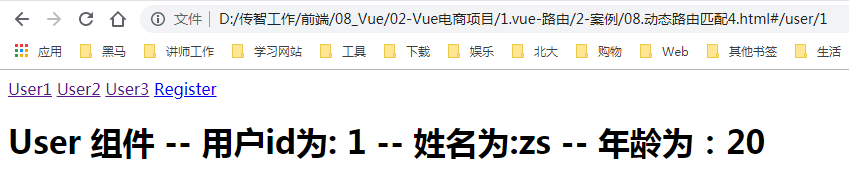

## 5. vue-router命名路由

- 介绍：

  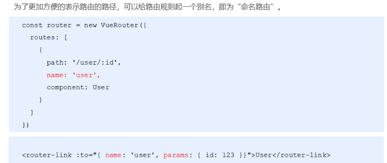

  - 这样就不用在定义路由链接得时候，在to中写具体的path了

  - **有时候path比较复杂，用名字代替会更好一点**

  - 如果path中有参数，那么在to中就通过params来确定参数的值

  - **相当于**：

    ```html
    <router-link to="/user/123">User2</router-link>
    ```

- 代码：

  ```html
  <body>
      <!-- 被 vm 实例所控制的区域 -->
      <div id="app">
        <router-link to="/user/1">User1</router-link>
        <router-link to="/user/2">User2</router-link>
        <router-link :to="{ name: 'user', params: {id: 3} }">User3</router-link>
        <!--原来写法，可能你会更喜欢原来的写法，但是如果path比较复杂时，用命名路由会更好-->
        <router-link to="/user/3">User2</router-link>
        <router-link to="/register">Register</router-link>
  
        <!-- 路由占位符 -->
        <router-view></router-view>
      </div>
  
      <script>
        const User = {
          props: ['id', 'uname', 'age'],
          template: '<h1>User 组件 -- 用户id为: {{id}} -- 姓名为:{{uname}} -- 年龄为：{{age}}</h1>'
        }
  
        const Register = {
          template: '<h1>Register 组件</h1>'
        }
  
        // 创建路由实例对象
        const router = new VueRouter({
          // 所有的路由规则
          routes: [
            { path: '/', redirect: '/user' },
            {
              // 命名路由
              name: 'user',
              path: '/user/:id',
              component: User,
              props: route => ({ uname: 'zs', age: 20, id: route.params.id })
            },
            { path: '/register', component: Register }
          ]
        })
  
        // 创建 vm 实例对象
        const vm = new Vue({
          // 指定控制的区域
          el: '#app',
          data: {},
          // 挂载路由实例对象
          // router: router
          router
        })
      </script>
    </body>
  ```

## 6. vue-router编程式导航  ***

### 6.1 页面导航的两种方式

- 介绍

  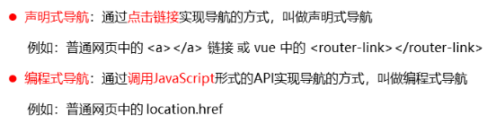

- 声明式导航，其实就是html实现导航

- 编程时导航，其实就是js代码实现导航（location.href就是js代码）

- 页面导航，其实就是页面跳转

### 6.2 编程导航

- 基本用法

  

  - push跳转锚点
  - go前进后退，参数n一个数字，代表前进后退几个界面
    - n，代表前进n个界面
    - -n，代表后退n个界面

- 代码：

  ```html
  <body>
      <!-- 被 vm 实例所控制的区域 -->
      <div id="app">
        <router-link to="/user/1">User1</router-link>
        <router-link to="/user/2">User2</router-link>
        <router-link :to="{ name: 'user', params: {id: 3} }">User3</router-link>
        <router-link to="/register">Register</router-link>
  
        <!-- 路由占位符 -->
        <router-view></router-view>
      </div>
  
      <script>
        const User = {
          props: ['id', 'uname', 'age'],
          template: `<div>
            <h1>User 组件 -- 用户id为: {{id}} -- 姓名为:{{uname}} -- 年龄为：{{age}}</h1>
            <button @click="goRegister">跳转到注册页面</button>
          </div>`,
          methods: {
            goRegister() {
              this.$router.push('/register')//跳转到注册页面（锚点），可以看下效果
            }
          },
        }
  
        const Register = {
          template: `<div>
            <h1>Register 组件</h1>
            <button @click="goBack">后退</button>
          </div>`,
          methods: {
            goBack() {
              this.$router.go(-1)//-1：后退1个界面
            }
          }
        }
  
        // 创建路由实例对象
        const router = new VueRouter({
          // 所有的路由规则
          routes: [
            { path: '/', redirect: '/user' },
            {
              // 命名路由
              name: 'user',
              path: '/user/:id',
              component: User,
              props: route => ({ uname: 'zs', age: 20, id: route.params.id })
            },
            { path: '/register', component: Register }
          ]
        })
  
        // 创建 vm 实例对象
        const vm = new Vue({
          // 指定控制的区域
          el: '#app',
          data: {},
          // 挂载路由实例对象
          // router: router
          router
        })
      </script>
    </body>
  ```

- 效果

  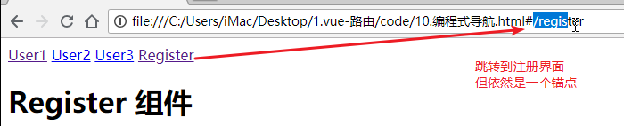

### 6.3 push参数  (了解)

- 介绍

  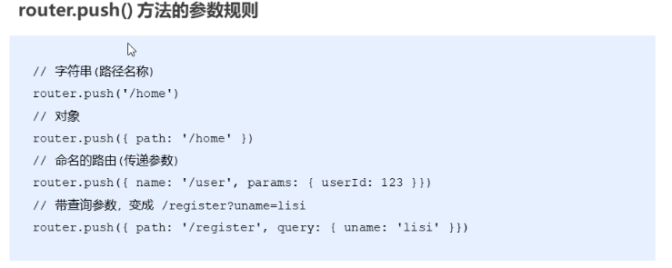

  - 跟route-link是一样的作用，都是实现页面跳转

  - 所以push中可以直接写path路径（路由），也可以写命名路由

  - 相当于：

    ```html
    <!--前两个对应这个  -->
    <router-link to="/home">User1</router-link>
    <!--#push中的name应该也不带斜杠才对-->
    <router-link :to="{ name: 'user', params: {userId: 123} }">User123</router-link>
    <router-link to="/register?uname=lisi">Register</router-link>
    ```


## 7. 基于vue-router的案例-后台管理案例

### 7.1 01抽离并渲染App根组件

- 案例效果：

  

- 案例功能描述：

  - 点击左侧的"用户管理","权限管理","商品管理","订单管理","系统设置"都会出现对应的组件并展示内容

    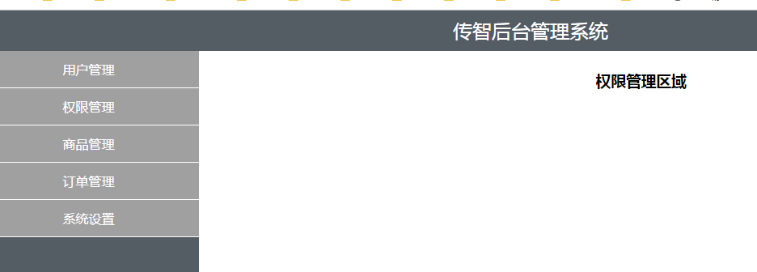

    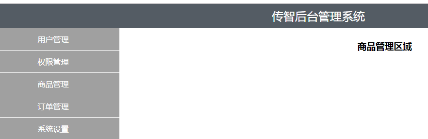

  - 其中"用户管理"组件展示的效果如上图所示，在用户管理区域中的详情链接也是可以点击的，点击之后将会显示用户详情信息。

    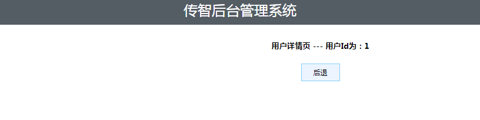

- 技术要点：

  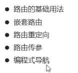

- 案例分析：

  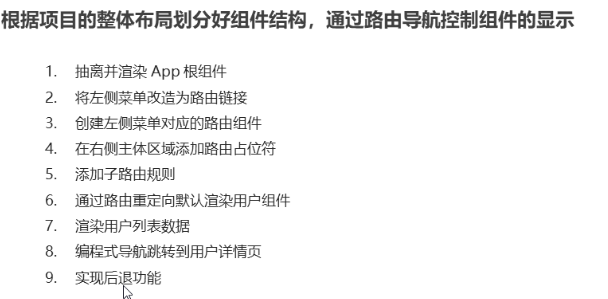

- 技术要点：

  

- 代码：抽离并渲染App根组件

  ```html
  <head>
  	//样式省略
      <script src="./lib/vue_2.5.22.js"></script>
      <script src="./lib/vue-router_3.0.2.js"></script>
  </head>
  <body>
      <!-- 要被 vue 实例所控制的区域 -->
      <div id="app">
          <!-- 4.路由占位符 -->
          <router-view></router-view>
      </div>
      <script>
          //1. 定义 APP 根组件
          const App = {
              template: `<div>
            <!-- 头部区域 -->
            <header class="header">传智后台管理系统</header>
            <!-- 中间主体区域 -->
            <div class="main">
              <!-- 左侧菜单栏 -->
              <div class="content left">
                <ul>
                  <li>用户管理</li>
                  <li>权限管理</li>
                  <li>商品管理</li>
                  <li>订单管理</li>
                  <li>系统设置</li>
                </ul>
              </div>
              <!-- 右侧内容区域 -->
              <div class="content right"><div class="main-content">
               添加用户表单
              </div></div>
            </div>
            <!-- 尾部区域 -->
            <footer class="footer">版权信息</footer>
          </div>`
          }
  
          //2. 创建路由对象
          const router = new VueRouter({
              routes: [{
                  path: '/',
                  component: App
              }]
          })
  
  	   //3. 添加路由到vue实例
          const vm = new Vue({
              el: '#app',
              router
          })
      </script>
  </body>
  
  ```

- 效果：

  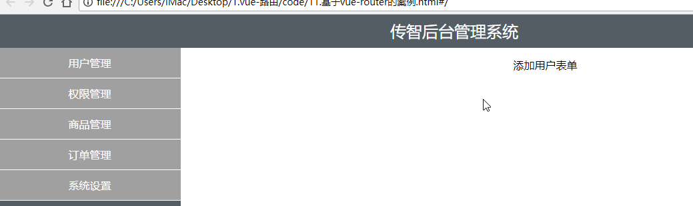

### 7.2 02将左侧菜单改造为路由链接

- 代码：

  ```js
  //02修改菜单为router-link即可
  // 定义 APP 根组件
  const App = {
      template: `<div>
  <!-- 头部区域 -->
  <header class="header">传智后台管理系统</header>
  <!-- 中间主体区域 -->
  <div class="main">
  <!-- 左侧菜单栏 -->
  <div class="content left">
  <ul>
  <li><router-link to="/users">用户管理</router-link></li>
  <li><router-link to="/rights">权限管理</router-link></li>
  <li><router-link to="/goods">商品管理</router-link></li>
  <li><router-link to="/orders">订单管理</router-link></li>
  <li><router-link to="/settings">系统设置</router-link></li>
  </ul>
  </div>
  <!-- 右侧内容区域 -->
  <div class="content right"><div class="main-content">
  添加用户表单
  </div></div>
  </div>
  <!-- 尾部区域 -->
  <footer class="footer">版权信息</footer>
  </div>`
  }
  ```

- 效果：点击左侧菜单，会跳转到对应连接，但是没有内容，比如点击用户管理

  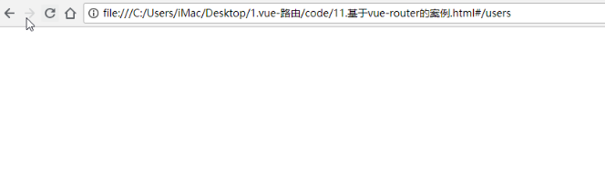

### 7.3 03创建左侧菜单对应的路由组件并添加路由占位符

- 代码：

  ```html
  <body>
      <!-- 要被 vue 实例所控制的区域 -->
      <div id="app">
          <!-- 路由占位符 -->
          <router-view></router-view>
      </div>
      <script>
          // 定义 APP 根组件
          const App = {
              template: `<div>
            <!-- 头部区域 -->
            <header class="header">传智后台管理系统</header>
            <!-- 中间主体区域 -->
            <div class="main">
              <!-- 左侧菜单栏 -->
              <div class="content left">
                <ul>
                  <li><router-link to="/users">用户管理</router-link></li>
                  <li><router-link to="/rights">权限管理</router-link></li>
                  <li><router-link to="/goods">商品管理</router-link></li>
                  <li><router-link to="/orders">订单管理</router-link></li>
                  <li><router-link to="/settings">系统设置</router-link></li>
                </ul>
              </div>
              <!-- 右侧内容区域 -->
              <div class="content right"><div class="main-content">
             <!-- 03-2添加路由 -->
                <router-view />
              </div></div>
            </div>
            <!-- 尾部区域 -->
            <footer class="footer">版权信息</footer>
          </div>`
          }
          //03-1左侧菜单对应组件
          const Users = {
              template: `<div> <h3>用户管理区域</h3> </div>`
          }
          const Rights = {
              template: `<div> <h3>权限管理区域</h3> </div>`
          }
          const Goods = {
              template: `<div> <h3>商品管理区域</h3>  </div>`
          }
          const Orders = {
              template: `<div>  <h3>订单管理区域</h3>  </div>`
          }
          const Settings = {
              template: `<div> <h3>系统设置区域</h3>  </div>`
          }
          // 创建路由对象
          const router = new VueRouter({
              routes: [{
                  path: '/',
                  component: App
              }]
          })
          const vm = new Vue({
              el: '#app',
              router
          })
      </script>
  </body>
  
  </html>
  ```

### 7.4 04添加子路由规则并实现根路由重定向

- 代码：

  ```js
  // 创建路由对象
  const router = new VueRouter({
      routes: [
          {
              path: '/',
              component: App,
              redirect: '/users',//04-2跟路由重定向
              children: [
                  //04-1：添加子路由规则
                  { path: '/users', component: Users },
                  { path: '/rights', component: Rights },
                  { path: '/goods', component: Goods },
                  { path: '/orders', component: Orders },
                  { path: '/settings', component: Settings }
              ]
          }
      ]
  })
  ```

- 效果：点击左侧菜单右侧可以切换

  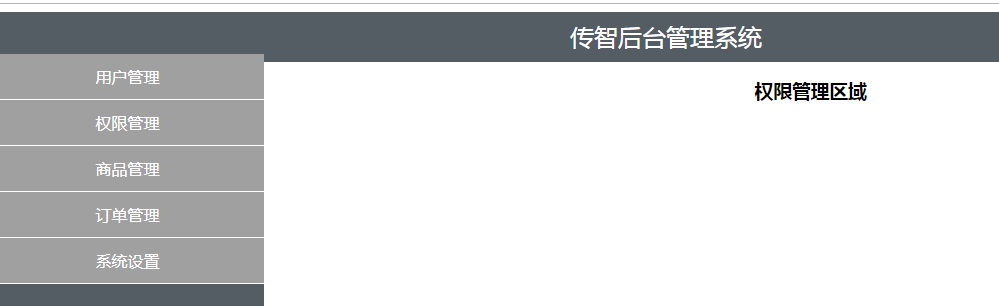

### 7.5 05渲染用户列表数据

- 代码：

  ```js
  const Users = {
      //05-1处理数据
      data() {
          return {
              userlist: [{
                  id: 1,
                  name: '张三',
                  age: 10
              }, {
                  id: 2,
                  name: '李四',
                  age: 20
              }, {
                  id: 3,
                  name: '王五',
                  age: 30
              }, {
                  id: 4,
                  name: '赵六',
                  age: 40
              }]
          }
      },
      template: `<div>
  <h3>用户管理区域</h3>
  <!-- 05-2渲染列表数据-->
  <table>
  <thead>
  <tr><th>编号</th><th>姓名</th><th>年龄</th><th>操作</th></tr>
  </thead>
  <tbody>
  <tr v-for="item in userlist" :key="item.id">
  <td>{{item.id}}</td>
  <td>{{item.name}}</td>
  <td>{{item.age}}</td>
  <td>
  <a href="javascript:;" @click="goDetail(item.id)">详情</a>
  </td>
  </tr>
  </tbody>
  </table>
  </div>`
  }
  ```

- 效果：

  

### 7.6 06编程式导航跳转到详情页并实现后退功能

- 代码：

  ```html
  <body>
      <!-- 要被 vue 实例所控制的区域 -->
      <div id="app">
          <!-- 路由占位符 -->
          <router-view></router-view>
      </div>
  
      <script>
          // 定义 APP 根组件
          const App = {
              template: `<div>
            <!-- 头部区域 -->
            <header class="header">传智后台管理系统</header>
            <!-- 中间主体区域 -->
            <div class="main">
              <!-- 左侧菜单栏 -->
              <div class="content left">
                <ul>
                  <li><router-link to="/users">用户管理</router-link></li>
                  <li><router-link to="/rights">权限管理</router-link></li>
                  <li><router-link to="/goods">商品管理</router-link></li>
                  <li><router-link to="/orders">订单管理</router-link></li>
                  <li><router-link to="/settings">系统设置</router-link></li>
                </ul>
              </div>
              <!-- 右侧内容区域 -->
              <div class="content right"><div class="main-content">
                <router-view />
              </div></div>
            </div>
            <!-- 尾部区域 -->
            <footer class="footer">版权信息</footer>
          </div>`
          }
  
          const Users = {
              data() {
                  return {
                      userlist: [{
                          id: 1,
                          name: '张三',
                          age: 10
                      }, {
                          id: 2,
                          name: '李四',
                          age: 20
                      }, {
                          id: 3,
                          name: '王五',
                          age: 30
                      }, {
                          id: 4,
                          name: '赵六',
                          age: 40
                      }]
                  }
              },
              //06-4 详情方法
              methods: {
                  goDetail(id) {
                      console.log(id)
                      this.$router.push('/userinfo/' + id) //编程式链接
                  }
              },
              template: `<div>
          <h3>用户管理区域</h3>
          <table>
            <thead>
              <tr><th>编号</th><th>姓名</th><th>年龄</th><th>操作</th></tr>
            </thead>
            <tbody>
              <tr v-for="item in userlist" :key="item.id">
                <td>{{item.id}}</td>
                <td>{{item.name}}</td>
                <td>{{item.age}}</td>
                <td>
                <!--06-03 详情超链接事件-->
                  <a href="javascript:;" @click="goDetail(item.id)">详情</a>
                </td>
              </tr>
            </tbody>
          </table>
        </div>`
          };
          //06-1定义详情组件
          const UserInfo = {
              props: ['id'],
              //06-5 响起后退功能
              template: `<div>
            <h5>用户详情页 --- 用户Id为：{{id}}</h5>
            <button @click="goback()">后退</button>
          </div>`,
              methods: {
                  goback() {
                      // 实现后退功能
                      this.$router.go(-1)
                  }
              }
          };
  
          const Rights = {
              template: `<div>
          <h3>权限管理区域</h3>
        </div>`
          }
          const Goods = {
              template: `<div>
          <h3>商品管理区域</h3>
        </div>`
          }
          const Orders = {
              template: `<div>
          <h3>订单管理区域</h3>
        </div>`
          }
          const Settings = {
              template: `<div>
          <h3>系统设置区域</h3>
        </div>`
          };
  
          // 创建路由对象
          const router = new VueRouter({
              routes: [{
                  path: '/',
                  component: App,
                  redirect: '/users',
                  children: [{
                      path: '/users',
                      component: Users
                  }, { //06-2 定义详情路由规则
                      path: '/userinfo/:id',
                      component: UserInfo,
                      props: true
                  }, {
                      path: '/rights',
                      component: Rights
                  }, {
                      path: '/goods',
                      component: Goods
                  }, {
                      path: '/orders',
                      component: Orders
                  }, {
                      path: '/settings',
                      component: Settings
                  }]
              }]
          });
  
          const vm = new Vue({
              el: '#app',
              router
          })
      </script>
  </body>
  ```

- 效果：

  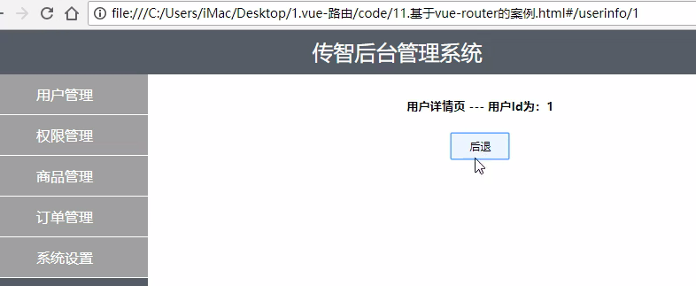

### 7.8 完整代码

```html
<!DOCTYPE html>
<html lang="en">
  <head>
    <meta charset="UTF-8" />
    <title>基于vue-router的案例</title>
    <style type="text/css">
      html,
      body,
      #app {
        margin: 0;
        padding: 0px;
        height: 100%;
      }
      .header {
        height: 50px;
        background-color: #545c64;
        line-height: 50px;
        text-align: center;
        font-size: 24px;
        color: #fff;
      }
      .footer {
        height: 40px;
        line-height: 40px;
        background-color: #888;
        position: absolute;
        bottom: 0;
        width: 100%;
        text-align: center;
        color: #fff;
      }
      .main {
        display: flex;
        position: absolute;
        top: 50px;
        bottom: 40px;
        width: 100%;
      }
      .content {
        flex: 1;
        text-align: center;
        height: 100%;
      }
      .left {
        flex: 0 0 20%;
        background-color: #545c64;
      }
      .left a {
        color: white;
        text-decoration: none;
      }
      .right {
        margin: 5px;
      }
      .btns {
        width: 100%;
        height: 35px;
        line-height: 35px;
        background-color: #f5f5f5;
        text-align: left;
        padding-left: 10px;
        box-sizing: border-box;
      }
      button {
        height: 30px;
        background-color: #ecf5ff;
        border: 1px solid lightskyblue;
        font-size: 12px;
        padding: 0 20px;
      }
      .main-content {
        margin-top: 10px;
      }
      ul {
        margin: 0;
        padding: 0;
        list-style: none;
      }
      ul li {
        height: 45px;
        line-height: 45px;
        background-color: #a0a0a0;
        color: #fff;
        cursor: pointer;
        border-bottom: 1px solid #fff;
      }

      table {
        width: 100%;
        border-collapse: collapse;
      }

      td,
      th {
        border: 1px solid #eee;
        line-height: 35px;
        font-size: 12px;
      }

      th {
        background-color: #ddd;
      }
    </style>
    <script src="./lib/vue_2.5.22.js"></script>
    <script src="./lib/vue-router_3.0.2.js"></script>
  </head>
  <body>
    <!-- 要被 vue 实例所控制的区域 -->
    <div id="app">
      <!-- 路由占位符 -->
      <router-view></router-view>
    </div>

    <script>
      // 定义 APP 根组件
      const App = {
        template: `<div>
          <!-- 头部区域 -->
          <header class="header">传智后台管理系统</header>
          <!-- 中间主体区域 -->
          <div class="main">
            <!-- 左侧菜单栏 -->
            <div class="content left">
              <ul>
                <li><router-link to="/users">用户管理</router-link></li>
                <li><router-link to="/rights">权限管理</router-link></li>
                <li><router-link to="/goods">商品管理</router-link></li>
                <li><router-link to="/orders">订单管理</router-link></li>
                <li><router-link to="/settings">系统设置</router-link></li>
              </ul>
            </div>
            <!-- 右侧内容区域 -->
            <div class="content right"><div class="main-content">
              <router-view />
            </div></div>
          </div>
          <!-- 尾部区域 -->
          <footer class="footer">版权信息</footer>
        </div>`
      }
	//user组件
      const Users = {
        data() {//这是一个方法定义，不需要function
          return {
            userlist: [
              { id: 1, name: '张三', age: 10 },
              { id: 2, name: '李四', age: 20 },
              { id: 3, name: '王五', age: 30 },
              { id: 4, name: '赵六', age: 40 }
            ]
          }
        },
        methods: {
          goDetail(id) {//这是一个方法定义，不需要function
            console.log(id)
            this.$router.push('/userinfo/' + id)
          }
        },
        template: `<div>
        <h3>用户管理区域</h3>
        <table>
          <thead>
            <tr><th>编号</th><th>姓名</th><th>年龄</th><th>操作</th></tr>
          </thead>
          <tbody>
            <tr v-for="item in userlist" :key="item.id">
              <td>{{item.id}}</td>
              <td>{{item.name}}</td>
              <td>{{item.age}}</td>
              <td>
                <a href="javascript:;" @click="goDetail(item.id)">详情</a>
              </td>
            </tr>
          </tbody>
        </table>
      </div>`
      }
	//用于管理组件
      const UserInfo = {
        props: ['id'],
        template: `<div>
          <h5>用户详情页 --- 用户Id为：{{id}}</h5>
          <button @click="goback()">后退</button>
        </div>`,
        methods: {
          goback() {
            // 实现后退功能
            this.$router.go(-1)
          }
        }
      }
	//权限组件
      const Rights = {
        template: `<div>
        <h3>权限管理区域</h3>
      </div>`
      }
      const Goods = {
        template: `<div>
        <h3>商品管理区域</h3>
      </div>`
      }
      const Orders = {
        template: `<div>
        <h3>订单管理区域</h3>
      </div>`
      }
      const Settings = {
        template: `<div>
        <h3>系统设置区域</h3>
      </div>`
      }

      // 创建路由对象
      const router = new VueRouter({
        routes: [
          {
            path: '/',
            component: App,//App根组件
            redirect: '/users',//默认显示用户管理
            children: [
              { path: '/users', component: Users },
              { path: '/userinfo/:id', component: UserInfo, props: true },
              { path: '/rights', component: Rights },
              { path: '/goods', component: Goods },
              { path: '/orders', component: Orders },
              { path: '/settings', component: Settings }
            ]
          }
        ]
      })

      const vm = new Vue({
        el: '#app',
        router
      })
    </script>
  </body>
</html>

```

