## Day02

##今日目标

1.能够了解模块化的相关规范 

2.了解webpack

3.了解使用Vue单文件组件

4.能够搭建Vue脚手架  

5.掌握Element-UI的使用 

## 1. 前端工程化

### 1.1 模块化的相关规范

#### 1.1.1 模块化概述

- 传统开发模式的主要问题

  

  - 命名冲突：多个js文件中的同名变量会冲突
  - 文件依赖：js文件之间无法相互引用问题

- 通过模块化解决上述问题

  

#### 1.1.2 浏览器模块化规范

- 介绍

  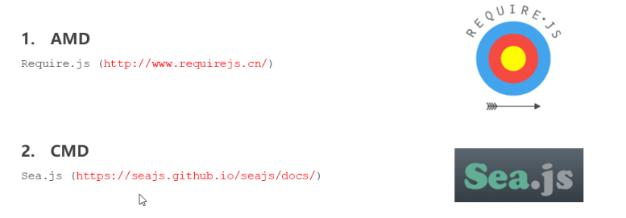

- 这两个模块化规范，已经落伍，我们不再学习

#### 1.1.3 服务器端模块化规范

- 介绍：

  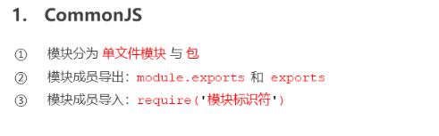

  - 浏览器和服务器都有各自的模块化规范
  - 但是还不统一，我们重点看统一的规范

#### 1.1.4 大一统的模块化规范-ES6模块化

- 介绍：

  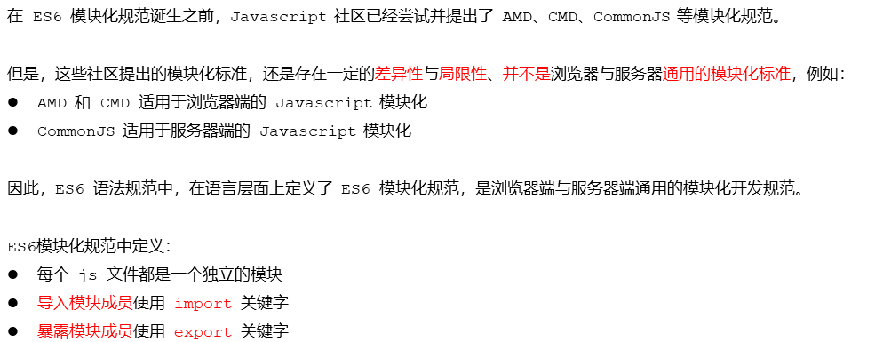

- 我们重点学习ES6模块化

### 1.2 Node.js中通过babel体验ES6模块化

- node默认支持commonjs这种服务器端的模块化
- 但是对于ES6模块化支持的不是太好，所以需要使用第三方工具babel
- babel是一个语法转换工具，可以将高级的有兼容问题的代码，转换为低级的无兼容问题的代码
- node正好不兼容ES6模块化的新语法，所以通过babel来进行转换，做兼容处理

1. 安装babel

   ```cmd
   打开终端，输入命令：npm install --save-dev @babel/core @babel/cli @babel/preset-env @babel/node
   安装完毕之后，再次输入命令安装：npm install --save @babel/polyfill
   注意：如果npm安装上诉包不成功，就使用cnpm
   但是需要安装cnpm：
   npm install -g cnpm --registry=https://registry.npm.taobao.org
   ```

2. 配置babel

   ```js
   在项目目录中创建babel.config.js文件。
   编辑js文件中的代码如下：
   const presets = [
       ["@babel/env",{
           targets:{
               edge:"17",
               firefox:"60",
               chrome:"67",
               safari:"11.1"
           }
       }]
   ]
   //暴露
   module.exports = { presets }
   ```

3. 创建index.js文件

   ```
   在项目目录中创建index.js文件作为入口文件
   在index.js中输入需要执行的js代码，例如：
       console.log("ok");
   ```

4. 使用npx执行文件

   ```cmd
   打开终端，输入命令：npx babel-node ./index.js
   ```

5. 效果：

   

## 2.ES6模块化语法

### 2.1 默认导出与默认导入

- 模块化中有很多数据是需要导入或导出的，我们来看一下如何导入导出

- 语法：

  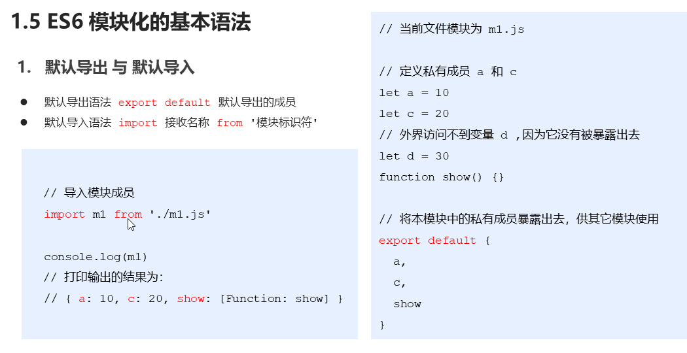

  - a和c暴露出去，d没有暴露
  - 所以在另一个文件中，导入m1之后，只能使用a和c
  - export：导出
  - import：导入

- 代码：

  ```js
  //m1.js
  let a = 10
  let c = 20
  let d = 30
  
  function show() {
    console.log('1111111111111')
  }
  
  export default {
    a,
    c,
    show
  }
  //index.js
  import m1  from './m1.js'
  
  console.log(m1)
  ```

- 效果：看不到d，因为我们并没有导出d（暴露d）

  

- 注意：

  每个模块中，只允许使用唯一的一次 export default，否则会报错

- 例如：

  ```js
  //m1中增加如下代码：
  export default {
    d
  }
  ```

  - 运行：

  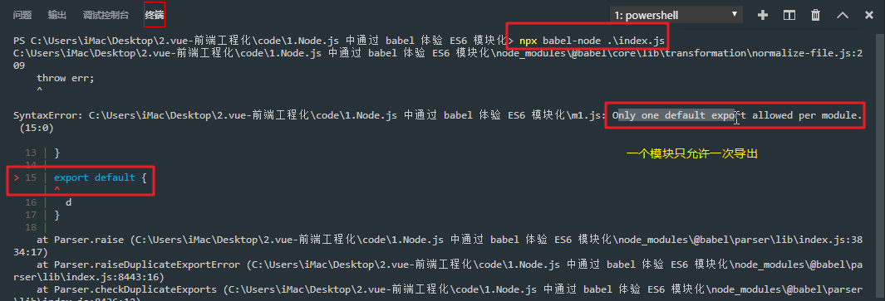

- 注意：如果m1中没有导出，index.js还是导入并且打印m1，是不会报错的，会输出一个空对象：{}

### 2.2 按需导出与按需导入

- 介绍

  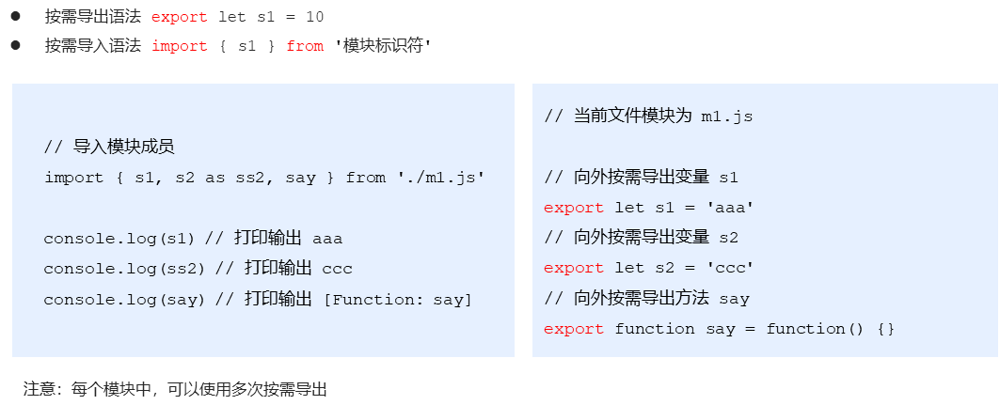

  - as 是起别名，起过别名，在使用的时候就只能使用别名
  - 按需导入，需要添加{}

- 代码：

  ```js
  //m1
  let a = 10
  let c = 20
  let d = 30
  
  function show() {
    console.log('1111111111111')
  }
  
  export default {
    a,
    c,
    show
  }
  export let s1 = 'aaa'
  export let s2 = 'ccc'
  export function say() {
    console.log('ooooooooo')
  }
  //index
  import m1, { s1, s2 as ss2, say } from './m1.js'
  
  console.log(m1)
  console.log(s1)
  console.log(ss2)
  console.log(say)
  ```

  - 注意：
    - import m1，只会导入export default，也就是默认导入的数据
    - 按需导出的，只能通过按需导入来使用

- 效果：

  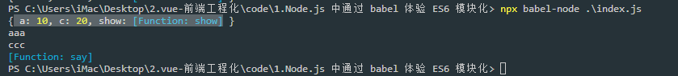

### 2.3 直接导入并执行模块代码

- 介绍

  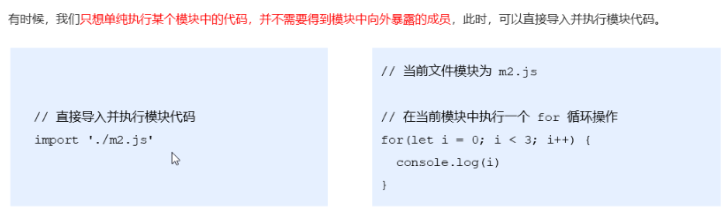

  - m2并没有导出任何内容，只是定义了一段代码
  - index直接导入了m2整个文件，并没有导入某个，某些数据

- 代码：

  ```js
  //m2
  for (let i = 0; i < 3; i++) {
    console.log(i)
  }
  
  //index
  import './m2.js'
  ```

- 效果：

  

## 3. webpack

### 3.1 介绍webpack的作用

- 当前web开发面临的困境

  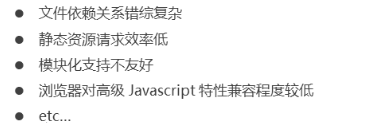

- webpack介绍：

  - webpack是一个流行的**前端项目构建工具（打包工具）**，可以解决目前web开发的困境。
  - webpack提供了**友好的模块化支持**，**代码压缩混淆**，解决**js兼容问题**，**性能优化**等特性，提高了开发效率和项目的可维护性
  - webpack，pack：包裹，包装。理解为web打包工具

  

### 3.2 创建列表隔行变色项目

- 步骤

  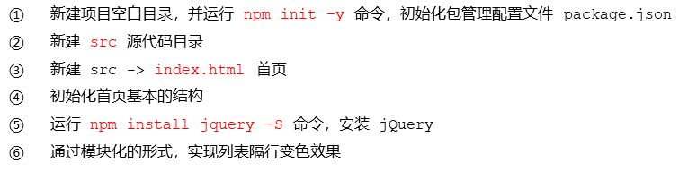

- 第一步项目名称：webpack_study

  - -y 的含义：yes的意思，在init的时候省去了敲回车的步骤，生成的默认的package.json 

- 第四步：页面基本结构：index.html代码

  ```html
  <body> 
      <ul>
        <li>这是第1个li</li>
        <li>这是第2个li</li>
        <li>这是第3个li</li>
        <li>这是第4个li</li>
        <li>这是第5个li</li>
        <li>这是第6个li</li>
        <li>这是第7个li</li>
        <li>这是第8个li</li>
        <li>这是第9个li</li>
      </ul> 
    </body>
  ```

- 第五步：

  - -S：--save，缩写为-S，表示安装的包将写入package.json里面的dependencies
  - -D：--save-dev，缩写为-D，表示将安装的包将写入packege.json里面的devDependencies
  - -g ：--global，缩写为-g，表示安装包时，视作全局的包。安装之后的包将位于系统预设的目录之下，一般来说 

- 第六步：模块化

  ```js
  //新建index.js
  //index.html导入index.js
  <script src="./index.js"></script>
  //index.js代码
  import $ from 'jquery'
  $(function() {
    $('li:odd').css('backgroundColor', 'blue')
    $('li:even').css('backgroundColor', 'lightblue')
  })
  ```

- 最后直接打开index.html，发现index.js第一行代码报错了

- import是ES6新语法，浏览器不兼容，所以报错，

- 那怎么办呢？需要借助webpack

- 接下来，我们就是来学习webpack

### 3.3 在项目中安装和配置webpack

- webpack可以支持部分的ES6新语法的转换，如果想支持所有的还需要babel的支持（3.5.7会讲）

  - 这里的部分，包含import语法
  - babel会处理webpack处理不了的新语法

- 步骤

  

- 第三步：mode有两种：

  - development：开发模式，打包的代码不会压缩和混淆
  - production：生产模式（正式上线模式），打包的代码会压缩和混淆

- 第五步：打包结果：

  

- 修改导入的js文件

  ```js
  //index.html中导入main.js
  <!-- <script src="./index.js"></script> -->  //屏蔽index.js
   <script src="../dist/main.js"></script>
  ```

- 效果

  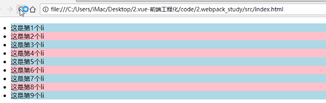

  

### 3.4 配置

#### 3.4.1 配置打包的入口与出口

- 默认的打包入口和出口

  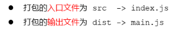

- 修改默认：

  - 如果不想使用默认的入口/出口js文件，我们可以通过改变 webpack.config.js 来设置入口/出口的js文件，如下：

    ```js
    const path = require("path");
    module.exports = {
        mode:"development",
        //设置入口文件路径
        entry: path.join(__dirname,"./src/xx.js"),
        //设置出口文件
        output:{
            //设置路径
            path:path.join(__dirname,"./dist"),
            //设置文件名
            filename:"res.js"
        }
    }
    ```

  - __dirname为项目根路径

  - output的filename：老师改为了bundle.js

#### 3.4.2 配置webpack的自动打包功能

- 为啥需要自动打包

  - 因为修改代码之后，需要重新打包才能看到效果
  - 但是如果每次修改代码，都手动执行：npm run dev，太麻烦了

- 自动打包步骤

  

- 第三步：buldle.js是视频老师配置的打包出口文件

  - 根据自己的情况处理 ，自己配置的output的filename如果是res.js那么这里就修改为/res.js
  - 并且注意是根路径（为啥后边解释）

- 第四步：打包效果

  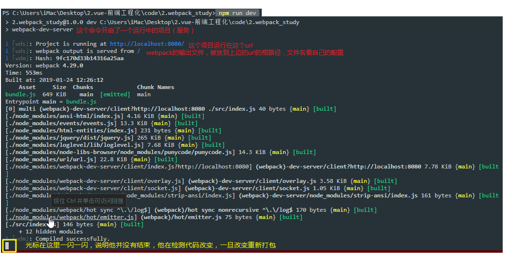

  - 需要注意，打包之后，输出文件bundle.js默认被放到了根路径下

    

  - 而bundle.js这个文件，只能通过上述url看到，实际的项目根路径是看不到的，他并没有放到实际的硬盘上

- **注意**，使用了webpack-dev-server命令打包之后，只能通过localhost:8080这样的地址访问，直接访问index.html是不行的

- 访问如下：访问src，自动显示index.html

  

- 如果直接访问：

  

#### 3.4.3 配置html-webpack-plugin生成预览页面

- 访问8080：看到的是项目中根路径下的所有内容

  

- 我们需要点击src才能看到index.html（访问src，默认访问到index.html）

  

- 我们现在想访问localhost:8080之后直接看到index.html，怎么办？

- 预览界面设置：html-webpack-plugin就是生成预览界面的插件

  

- 具体配置代码（可以复制）

  ```js
  A.安装默认预览功能的包:html-webpack-plugin
  	npm install html-webpack-plugin -D
  B.修改webpack.config.js文件，如下：
      //导入包
      const HtmlWebpackPlugin = require("html-webpack-plugin");
      //创建对象
      const htmlPlugin = new HtmlWebpackPlugin({
          //设置生成预览页面的模板文件
          template:"./src/index.html",
          //设置生成的预览页面名称
          filename:"index.html"
      })
  C.继续修改webpack.config.js文件，添加plugins信息：
      module.exports = {
          ......
          plugins:[ htmlPlugin ]
      }
  ```

- 访问网址：localhost:8080，访问的就是生成的存在于内存的index.html

  

  - **注意**：其实这里的index.html会自动引入内存中根目录的bundle.js，所以可以给index.html的引入bundle.js屏蔽了
  - 内存中的根目录的bundle.js是在webpack自动打包时生成的

#### 3.4.4 配置自动打包相关的参数

- 问题：当我们执行完打包命令，需要手动访问localhost:8080才能看到首页，太麻烦

- 配置参数：以下配置为自动打开浏览器访问首页

  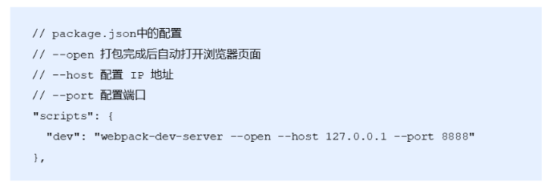

  - ip一般是127.0.0.1，localhost
  - port默认是8080，可以修改为8888

### 3.5 加载器

#### 3.5.1 介绍加载器以及加载器的调用过程

- 通过loader打包非js文件

  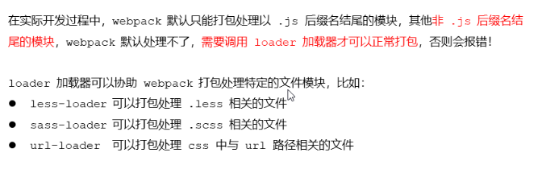

- loader调用过程

  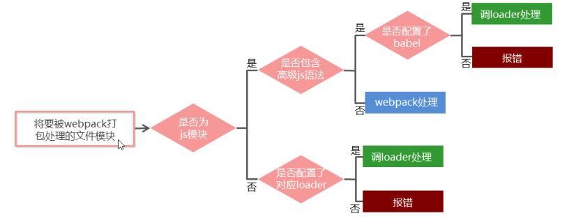

  

#### 3.5.2 打包处理css文件

- 我们会依次介绍如何打包常见文件，常见文件如下：

  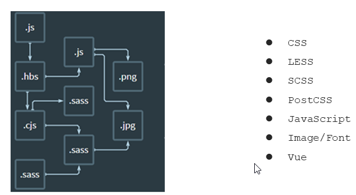

- 演示：

  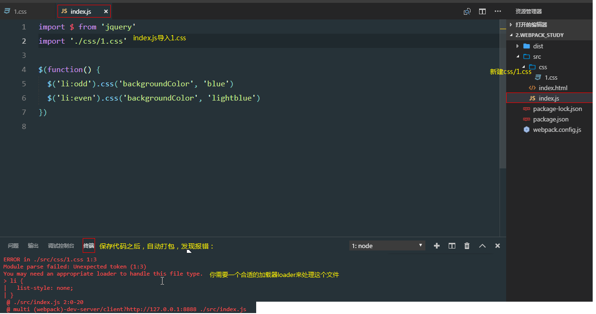

  - css中：去掉li的小圆点：list-style:none
  - index.js为啥要引入1.css？因为默认打包的是index.js，所以需要把1.css加入进去

- 为啥会报错，因为webpack默认只能打包js文件，要想打包其他文件，需要loader

- 如何打包css？

  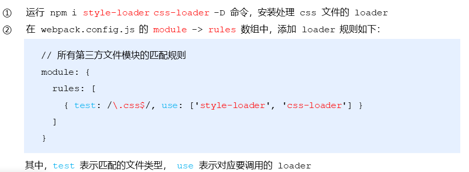

  - rules：存放所有的loader规则
  - test接收一个正则表达式//，这个正则表达式只需要匹配文件的后缀即可
  - \\.代表点，css$表示以css结尾，其实就是以.css结尾
  - use接收一个数组，打包css文件，需要style-loader，和css-loader

- 配置之后，重新打包，最后访问：

  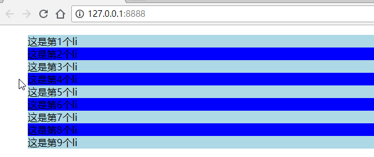

#### 3.5.3 打包处理less文件

- 步骤

  

  - less文件打包除了需要less-loader，也需要依赖style-loader,css-loader

- 代码：

  ```js
  //新建css/1.less
  body {
    margin: 0;
    padding: 0;
    ul {
      padding: 0;
      margin: 0;
    }
  }
  //index.js
  import './css/1.less'
  ```

- 重新编译之后效果：

  

#### 3.5.4 打包处理scss文件

- 步骤：

  

- 代码：

  ```js
  //新建css/1.scss
  ul {
    font-size: 12px;
    li {
      line-height: 30px;
    }
  }
  //index.js引入
  import './css/1.scss'
  ```

- 效果：

  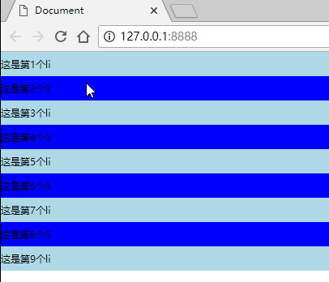

#### 3.5.5 配置postCSS

- 配置postCSS自动添加css的兼容前缀

  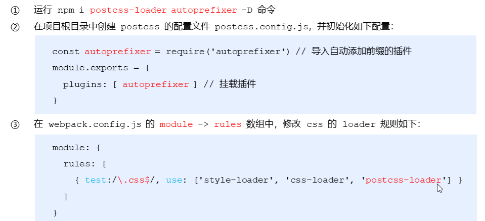

- 代码：

  ```html
  <!--index.htmlbody第一行添加-->
  <input type="text" placeholder="ceshi" />
  <!--1.css中添加样式-->
  ::placeholder {
    color: red;
  }
  ```

- 效果：在谷歌和ie上都可以让 ceshi  文字变红

- 按理说，我们需要自己添加浏览器前缀，但是配置过postCSS之后，他会帮助我们添加浏览器前缀

#### 3.5.6 打包样式表中的图片和字体文件

- 先来看一个问题：

  - 代码中添加一张图片

    ```js
    #index.html
    <div id="box"></div>
    #1.css
    #box {
      width: 580px;
      height: 340px;
      background-color: pink;
      background: url('../images/1.jpg');
    }
    #增加图片：src/images/1.jpg
    
    ```

  - 访问页面，之前的样式全部丢失，说明打包失败

    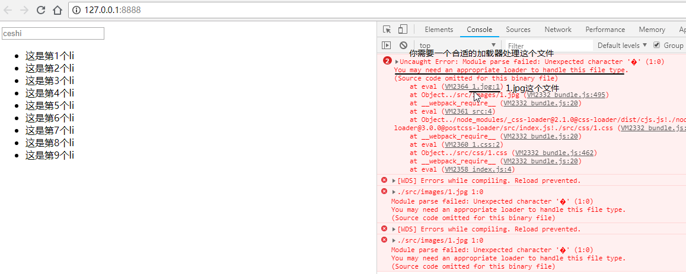

- 打包图片

  

  - use：可以接收loader数组，也可以接收一个loader名称（字符串）
  - 图片大小，可以看一下1.jpg的属性

- 如果设置的limit大小与图片大小一样：图片路径就不会base64编码（limit大于等于图片大小不会编码）

  

- 如果设置为16941：图片url就会base64编码（limit小于图片大小会编码）

  

#### 3.5.7 打包处理js文件中的高级语法

- webpack只执行一部分的ES6新语法，他需要配合babel才可以完全支持ES6新语法

- 先来看问题：

  - 代码：

    ```js
    #index.js
    class Person {
      static info = 'aaa'
    }
    
    console.log(Person.info)
    ```

  - 效果：webpack不能处理class这种ES6新特性

    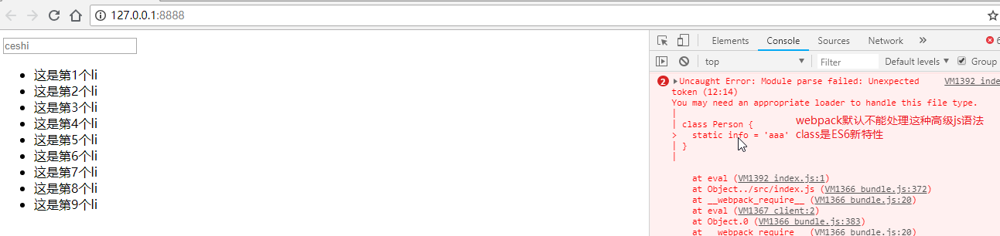

- 打包高级js语法

  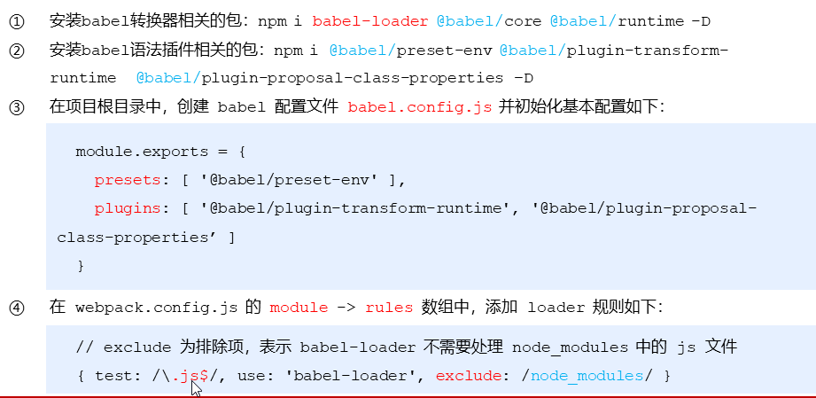

  - node_modules是第三方提供的js代码，这些代码不需要webpack打包
  - webpack只打包程序员自己的代码

- 效果：

  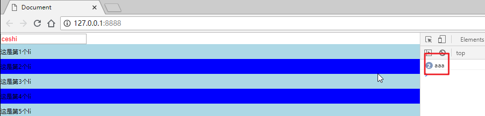

- 问题：为啥会打印两次aaa?

  - 这是因为内存中的这个index.html会**自动引入**bundle.js
  - 所以我们需要将index.html中的引入bundle.js给屏蔽掉，重新npm run dev即可

## 4. 单文件组件

### 4.1 单文件组件的组成结构

- 传统组件问题和解决方案

  

- 单文件组件的用法

  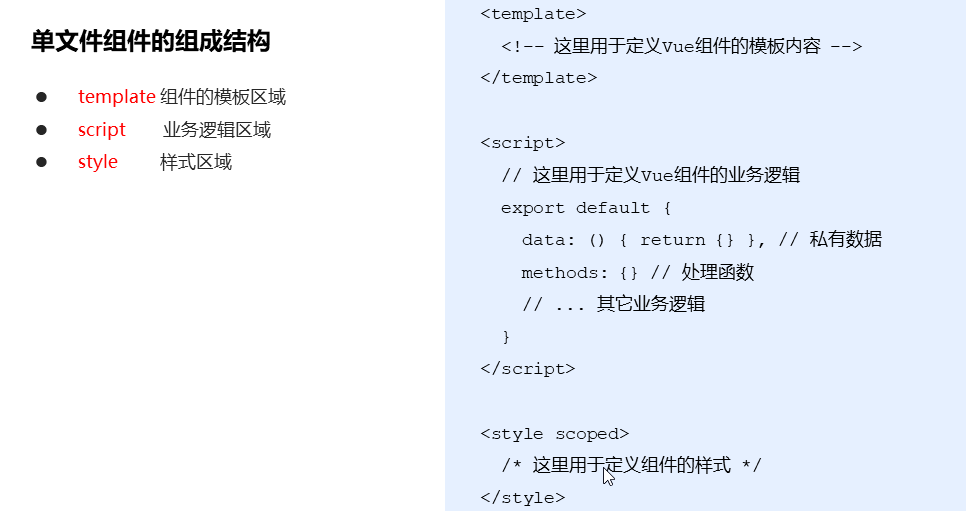

  - export default暴露对象数据
  - scoped：防止组件样式之间的冲突问题
    - scope：区域，局部的意思
    - style添加scoped就是私有样式，局部样式

- 代码：src/components/App.vue

  ```vue
  <template>
    <div>
      <h1>这是 App 根组件</h1>
    </div>
  </template>
  
  <script>
  export default {
    data() {
      return {};
    },
    methods: {}
  };
  </script>
  
  <style scoped>
  h1 {
    color: red;
  }
  </style>
  ```

- vue文件的代码提示，可以在vscode中安装Vetur

  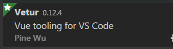

### 4.2 配置.vue文件的loader加载器

- 先来看问题

  - 代码

  ```
  #index.js
  // 导入单文件组件
  import App from './components/App.vue'
  ```

  - 效果：

    

- 配置vue组件的加载器

  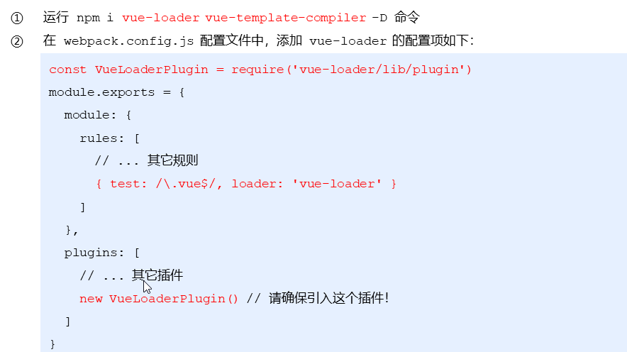

- 安装之后，代码就不会报错，但是也没有任何效果，因为我们还没有正式使用vue代码

### 4.3 在webpack项目中使用vue

- 步骤

  

- render: h => h(App)

  

- 代码：

  ```js
  #index.js最后添加如下代码
  // -----------------------------------------------
  import Vue from 'vue'
  // 导入单文件组件
  import App from './components/App.vue'
  
  const vm = new Vue({
    el: '#app',
    render: h => h(App)
  })
  #index.html最后添加如下代码
  <hr />
  <!-- 将来要被 vue 控制的区域 -->
  <div id="app"></div>
  
  ```

- 效果：

  

### 4.4 webpack打包发布

- 配置

  

  - -p：打包参数，package：打包

- 删除dist目录(打包发布之后，会生成dist目录)

- 执行命令：npm run build

  - 执行build命令，会执行webpack -p进行打包，而打包会参照webpack.config.js配置文件，查看入口和出口文件等等配置项
  - 打包成功之后，会生成dist目录，bundle.js与index.html文件

- 我们访问dist/index.html效果：

  

## 5. vue脚手架

### 5.1 介绍并安装3.x版本的vue脚手架

- 脚手架基本用法介绍

  - Vue脚手架： **用于快速生成 Vue 项目基础架构**
  - **理解**：Vue脚手架，就是用于快速创建Vue项目的工具
  - 官网：<https://cli.vuejs.org/zh/guide/> 

- 安装

  - 安装3.x版本的Vue脚手架

    ```cmd
    npm install -g @vue/cli
    ```

  - 检验安装成功

    ```cmd
    vue -V
    #如果能提示脚手架的版本，则说明安装成功，例如版本为 3.3.0
    ```

### 5.2 基于交互式命令行创建新版vue项目

- 脚手架创建vue项目方式

  

  - 重点掌握前两种，第三种是基于2.x创建旧版vue项目（图形化界面方式用的更多）
  - my-project为项目名称，项目名称不能出现中文

- 创建项目步骤

  1. 创建项目

     ```
     1.打开cmd
     2.执行：vue create vue-proj_01
     ```

  2. 选择创建项目方式

     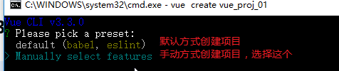

     - 这个界面是vue手脚架提供的项目初始化配置的界面（也就是交互式命令行界面）
     - 上下键选择，回车确定

  3. 选择安装的功能

     

  4. 传智路由模式

     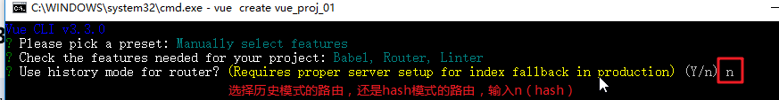

  5. 选择linter模式

     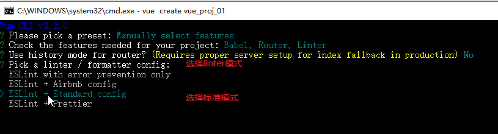

  6. 校验lint语法方式

     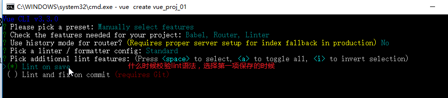

  7. 选择配置文件

     

  8. 是否保存模板

     

  9. 创建项目

     

- 启动项目

  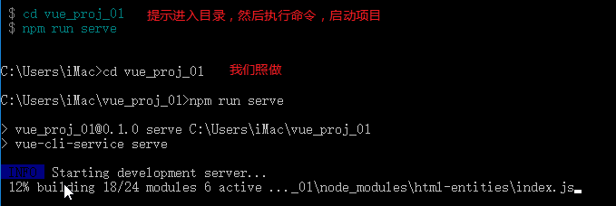

- 启动成功

  

- 访问：(这个界面是vue脚手架默认提供的首页)

  

- main.js中的代码（通过脚手架创建项目之后默认生成的代码）

  ```js
  Vue.config.productionTip = false
  new Vue({
    router,
    render: h => h(App)
  }).$mount('#app')
  ```

  - productionTip说明

    

  - $mount('#app')

    - 这个其实相当于el:'#app'
    - mount挂载，将vue挂载到id为app的标签上

### 5.3 基于图形化界面创建新版vue项目  ***

- 基于图形化界面创建项目步骤

  1. 执行命令：

     ```
     #进入cmd
     执行：vue ui
     ```

  2. 创建项目

     

  3. 选择目录

     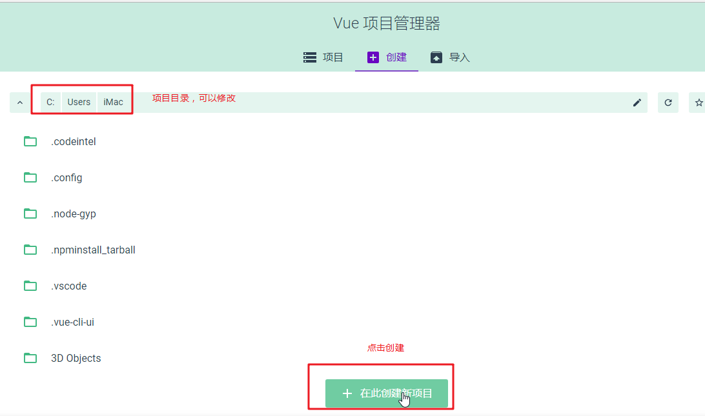

  4. 输入项目名称

     

  5. 配置选择

     

  6. 选择安装的功能

     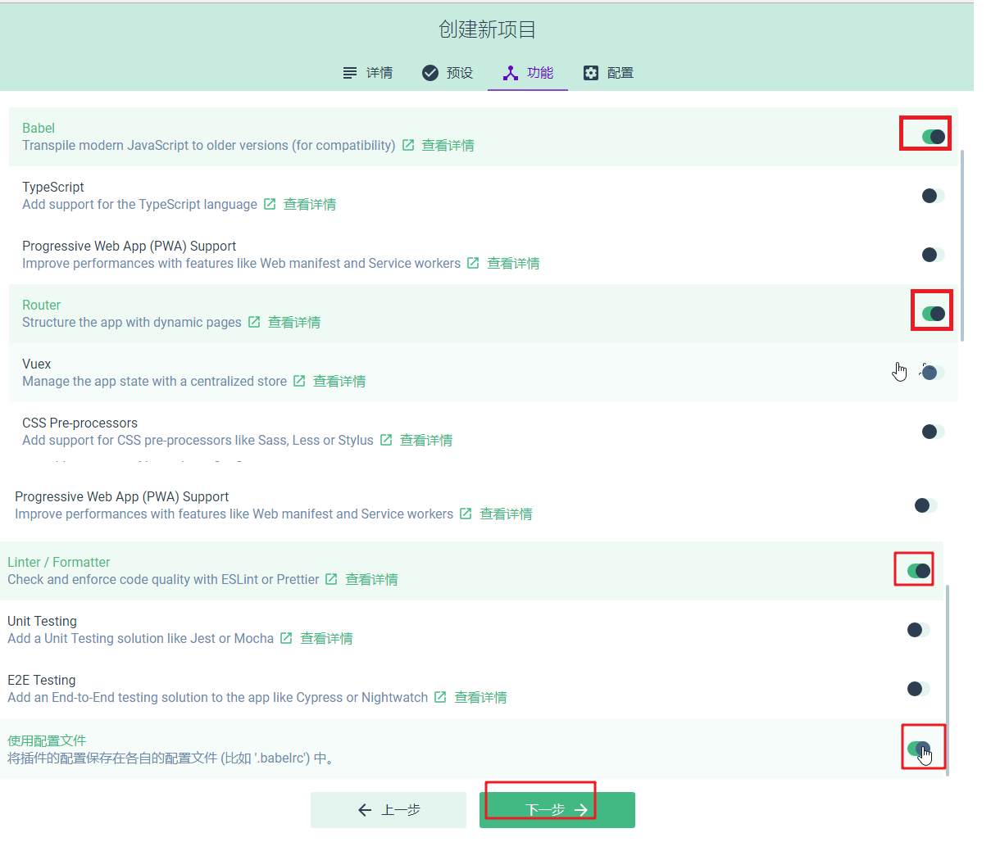

     - Linter/Formatter
       -  用ESLINT或Prettier检查和加强代码质量
       - 其实就是： 代码风格、格式校验 

  7. 配置项

     

     - lint 在保存时校验格式

  8. 保存配置信息

     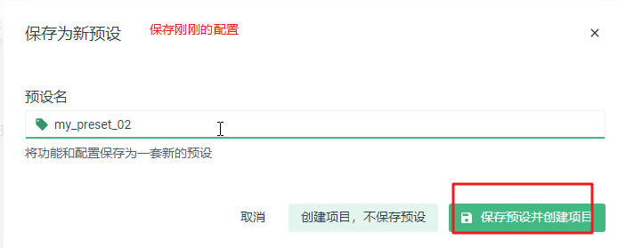

  9. 创建成功（看到项目管理界面）

     

  10. 项目管理器

    

  11. 任务

      

      - 其他的功能，大家可以自己点击看看
      - 可以在插件功能中管理插件
      - 可以在配置功能中进行配置

  12. 查看项目首页（点击上图中的：启动app，按钮进入）

      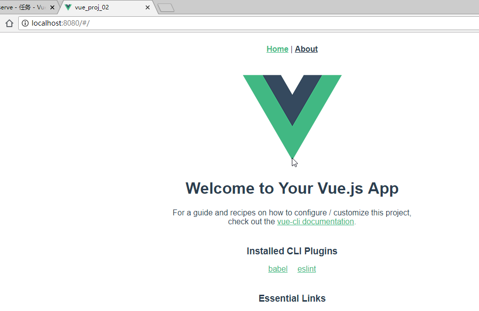

  13. 说明：vue-cli脚手架是整合了webpack打包工具

      ```js
      package.json中默认有启动项目的命令
      "scripts": {
          "serve": "vue-cli-service serve",
          "build": "vue-cli-service build",
          "lint": "vue-cli-service lint"
        },
       之前的使用了webpack的项目的启动命令
        "scripts": {
          "test": "echo \"Error: no test specified\" && exit 1",
          "dev": "webpack-dev-server --open --host 127.0.0.1 --port 8888",
          "build": "webpack -p"
        },
      ```

      

### 5.4 基于2.x的旧模板创建旧版vue项目

- 旧版方式不在详细说明（如在公司碰到，可观看视频）

### 5.5 分析项目结构

- 目录结构

  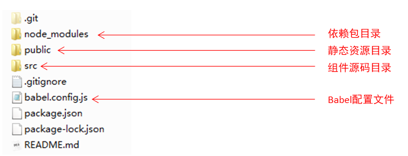

- 真实目录

  

  - assets和public都是存放静态文件，习惯在assets中存放字体图标和图片
  - component：组件
  - views：视图代码
  - App.vue：根组件
  - main.js：打包入口文件
  - router.js：路由文件
  - eslintrc.js：eslint配置文件
  - .gitignore：git忽略文件
  - babel.config.js：babel配置文件
  - package.json：包管理配置文件
  - postcss.config.js：postcss配置文件

- **问题**：大家在新建项目之后，会发现没有router.js文件，而是有一个router文件夹，下边有一个index.js。这是因为vue和vue-router的版本不一致的原因

### 5.6 对vue脚手架项目进行自定义配置的两种方式

- 脚手架帮助我们做了很多配置

- 程序员有时候需要自定义配置

- 自定义配置两种方式

  1. 通过package.json配置项目（port端口，open打包完成之后自动打开浏览器）（不推荐方式）

  

  2. 单独配置文件配置项目（推荐方式）（意思就是要将自定义的配置要单独存放）  ***

     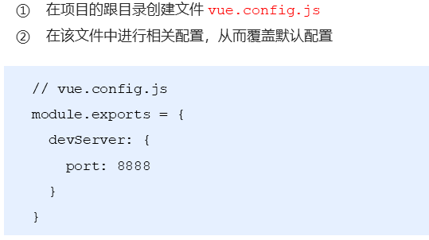

## 6. 组件库

### 6.1 介绍element-ui并基于命令行方式手动安装

- 介绍

  - Element-UI：一套为开发者、设计师和产品经理准备的基于Vue 2.0的桌面端**组件库**
  - 官网：<https://element.eleme.cn/#/zh-CN> 
  - **Element-UI提供了丰富的组件，设计非常美观，我们可以直接拿来用，这样可以省去很多样式编写时间，让我们更加专注逻辑代码**

- 命令行手动安装

  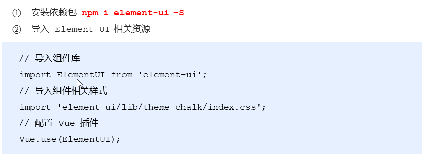

  - 将导入的ElementUI安装到Vue中，这样Vue才可以使用Element-UI
  - 上述代码，写到打包入口文件：main.js

- 代码：

  ```js
  #main.js
  import Vue from 'vue'
  import App from './App.vue'
  import router from './router'
  
  // 手动配置 element-ui
  import ElementUI from 'element-ui'
  import 'element-ui/lib/theme-chalk/index.css'
  Vue.use(ElementUI)
  
  Vue.config.productionTip = false
  
  new Vue({
    router,
    render: h => h(App)
  }).$mount('#app')
  
  #App.vue
  <template>
    <div id="app">
      <!--增加如下代码，从Element-UI随便copy一些点代码（组件-Button中找如下代码）-->
      <el-row>
        <el-button>默认按钮</el-button>
        <el-button type="primary">主要按钮</el-button>
        <el-button type="success">成功按钮</el-button>
        <el-button type="info">信息按钮</el-button>
        <el-button type="warning">警告按钮</el-button>
        <el-button type="danger">危险按钮</el-button>
      </el-row>
      
      <div id="nav">
        <router-link to="/">Home</router-link> |
        <router-link to="/about">About</router-link>
      </div>
      <router-view/>
    </div>
  </template>
  ```

- 效果：

  

### 6.2 基于图形化界面自动安装element-ui

- 步骤：

  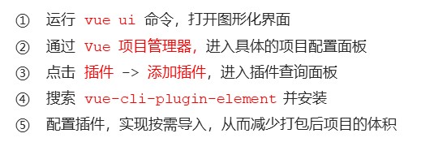

- 打开图形化界面之后，创建项目，然后选择之前的配置模板

  

- 进入插件---添加插件，然后搜索，进行安装

  

  - 选中vue-cli-plugin-element(单击即可)，然后点击右下角安装

- 安装成功之后，出现如下配置界面

  

  - import on demand：按需导入
  - demand：要求

- 文件改动（直接点击继续）

  

- 安装成功

  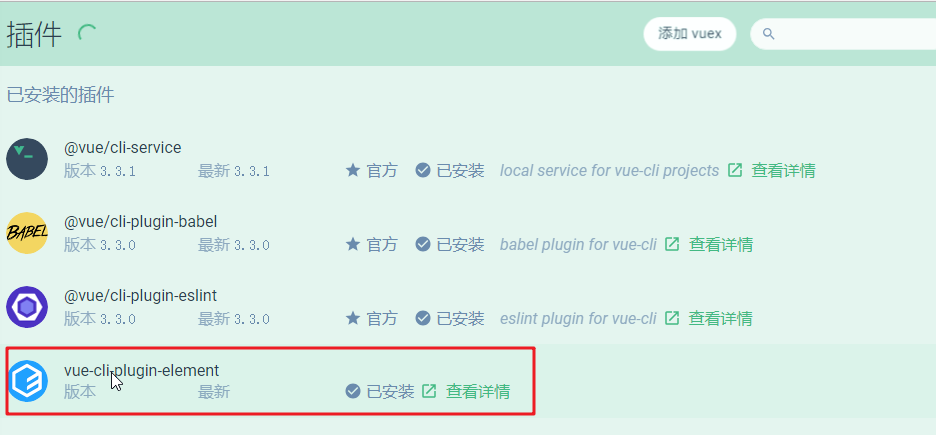

- 通过vscode打开项目

  

- main.js中导入了element.js（自动生成代码）

  ```js
  import './plugins/element.js'
  ```

- element.js中导入了Element-UI（自动生成代码）

  ```js
  import Vue from 'vue'
  import { Button,Row } from 'element-ui'
  
  Vue.use(Button)
  Vue.use(Row)
  ```
  - 老师的Element-UI插件版本与我们的不一致，所以他的没有注册Row不报错，咱们的就报错

  - 报错如下：

    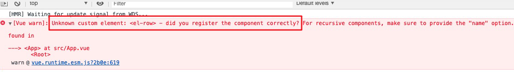

- App.vue中添加Element-UI代码（自己添加）

  ```html
  <template>
    <div id="app">
      <!--添加如下代码-->
      <el-row>
        <el-button>默认按钮</el-button>
        <el-button type="primary">主要按钮</el-button>
        <el-button type="success">成功按钮</el-button>
        <el-button type="info">信息按钮</el-button>
        <el-button type="warning">警告按钮</el-button>
        <el-button type="danger">危险按钮</el-button>
      </el-row>
     ....
  ```

- 效果：

  