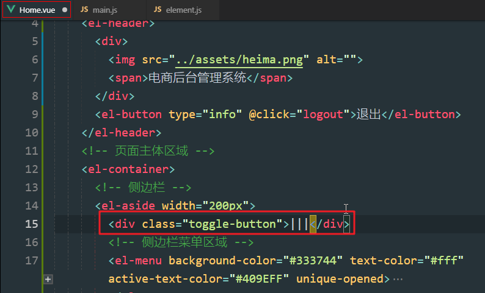
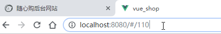
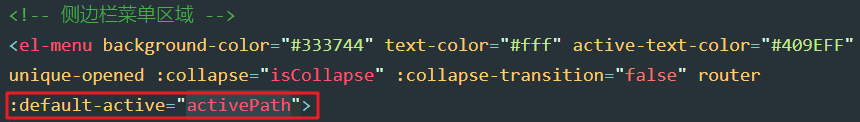
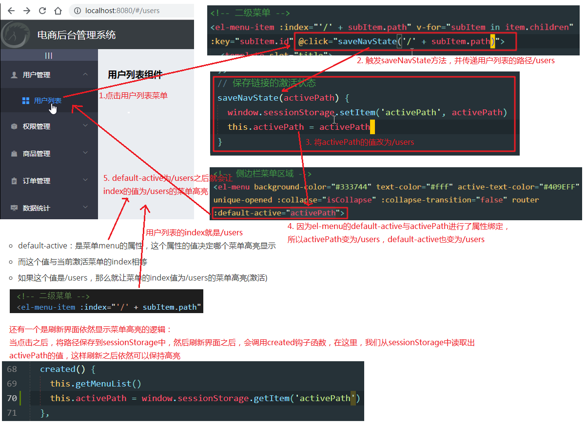
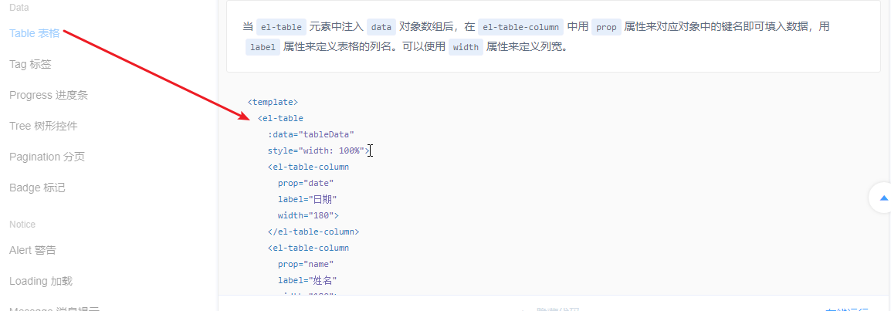
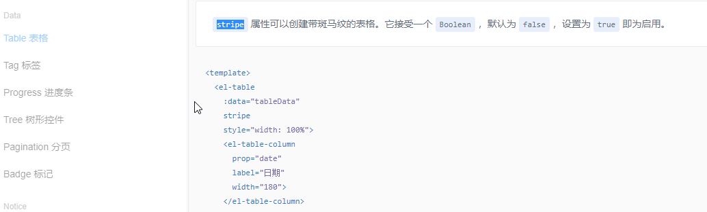
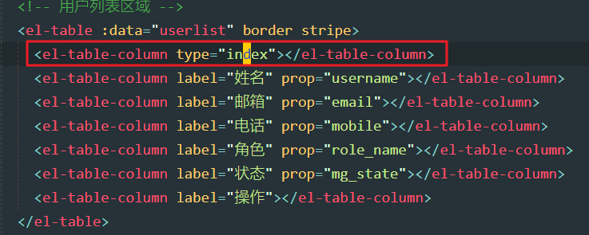
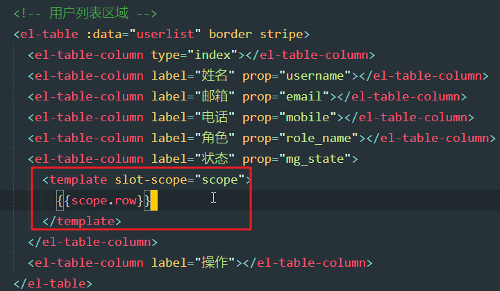
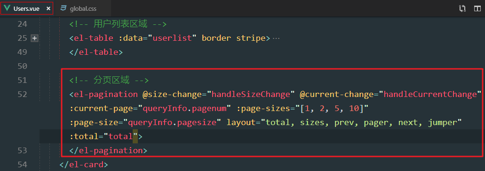
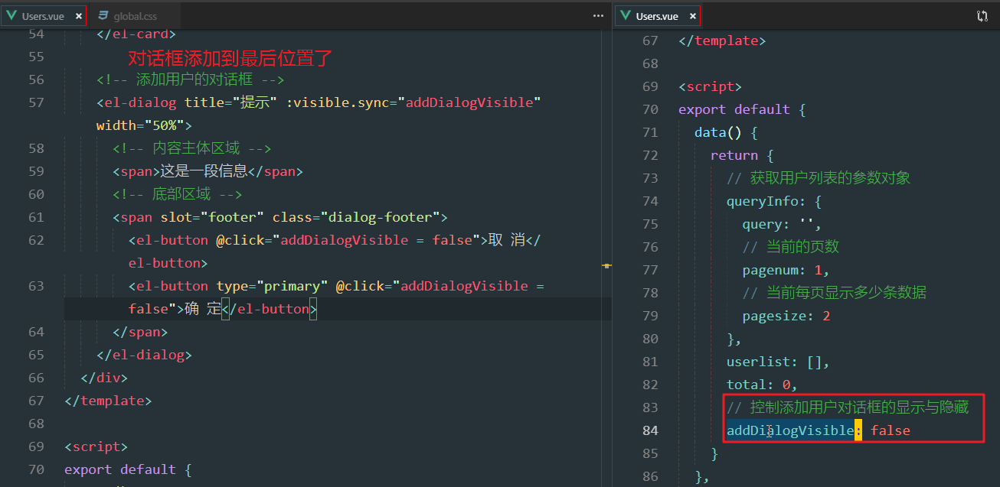

# Day02

## 0. 今日目标

1.实现后台首页的基本布局

2.实现左侧菜单栏

3.实现用户列表展示

4.实现添加用户

## 1. 主页

### 1.1 实现基本的主页布局

1. 主页布局分析

   

2. home增加如下结构（这个是直接从Element-UI--组件----Container布局容器复制过来的）

   

   - 所以大家可以自己复制

   ```html
   <el-container class="home-container">
     <!-- 头部区域 -->
     <el-header>Header<el-button type="info" @click="logout"> 退出 </el-button></el-header>
     <!-- 页面主体区域 -->
     <el-container>
       <!-- 侧边栏 -->
       <el-aside width="200px">Aside</el-aside>
       <!-- 主体结构 -->
       <el-main>Main</el-main>
     </el-container>
   </el-container>
   ```
   - container：容器
   - header：头部区域
   - aside：侧边栏区域
   - main：主体区域

3. 导入刚刚使用的组件

   

4. 添加样式（Element-UI的组件都有一个与组件名同名的类名，所以直接如下操作）

   

5. 为了让整个布局高度占满全屏，给el-container添加一个自定义类名

   

6. 类样式

   

   - **问题**，为啥在控制el-contianer的时候要自定义类名？
   - 这是因为这个界面有俩el-contianer，那个el-contianer不需要高度百分百

7. 效果

   

### 1.2 美化主页的header区域

1. header效果如下

   

2. header结构

   

   - heima.png在今日素材中，复制一份放到assets中

3. header样式

   

4. 效果

   


### 1.3 实现导航菜单的基本结构

1. 菜单分析

   

   - el-menu：是整个菜单的容器，菜单必须由这个容器包裹
   - el-submenu：submenu是子菜单的意思，但是这里他表示一级菜单
     - 这里的子菜单，理解为el-submenu是el-menu的子菜单
   - el-menu-item：是el-submenu的菜单项，那么一级菜单的菜单项，就是二级菜单
   - 如果需要三级菜单：el-menu---->el-submenu(1)---->el-submenu(2)---->el-menu-item(3)
   - 如果需要四级级菜单：el-menu---->el-submenu(1)---->el-submenu(2)---->el-submenu(3)---->el-menu-item(4)
   - 都是子菜单嵌套子菜单，一般最后一级菜单是el-menu-item

2. 在Element-ui---组件----导航菜单，找到如下模板代码（可直接复制）

   ```html
   <el-menu
            default-active="2"
            class="el-menu-vertical-demo"
            @open="handleOpen"
            @close="handleClose"
            background-color="#545c64"
            text-color="#fff"
            active-text-color="#ffd04b">
       <el-submenu index="1">
           <template slot="title">
               <i class="el-icon-location"></i>
               <span>导航一</span>
           </template>
           <el-menu-item-group>
               <template slot="title">分组一</template>
               <el-menu-item index="1-1">选项1</el-menu-item>
               <el-menu-item index="1-2">选项2</el-menu-item>
           </el-menu-item-group>
           <el-menu-item-group title="分组2">
               <el-menu-item index="1-3">选项3</el-menu-item>
           </el-menu-item-group>
           <el-submenu index="1-4">
               <template slot="title">选项4</template>
               <el-menu-item index="1-4-1">选项1</el-menu-item>
           </el-submenu>
       </el-submenu>
       <el-menu-item index="2">
           <i class="el-icon-menu"></i>
           <span slot="title">导航二</span>
       </el-menu-item>
       <el-menu-item index="3" disabled>
           <i class="el-icon-document"></i>
           <span slot="title">导航三</span>
       </el-menu-item>
       <el-menu-item index="4">
           <i class="el-icon-setting"></i>
           <span slot="title">导航四</span>
       </el-menu-item>
   </el-menu>
   ```

3. 修改结构

   

4. 导入menu组件（下图中的MenuItemGroup需要删掉，没有用到）

   

5. 效果

   

   - 这里的菜单结构有了，但是我们需要获取菜单数据，然后渲染真正的菜单

### 1.4 通过axios拦截器添加token验证

- 菜单的数据，需要从后台获取

- 但是获取之前，我们先来处理一个逻辑

- 除了登陆接口，其他的接口，在访问的时候，都需要传递一个授权的token

  

- 那意思就是之后所有的请求，我们都需要添加一个请求头，这样太麻烦了

- 能不能一次性添加？

- 可以通过拦截器

  - 拦截器介绍

    

    - 这个config对象中有请求头，通过headers获取

  - 具体添加

    

- 问题：之前不是好像处理过类似的逻辑么？

  

  - 之前处理的是路由权限，当用户直接访问登陆之外的url，我们判断是否有token，如果有放行，如果没有则禁行，**这个是前端的校验。**

  - 跟现在处理的是不一样的，现在这个是接口服务器要求传递这个请求头，它会判断，是否有这个请求头，如果有则认为是登陆过的，有权限的。**这个是后端的校验**。

  - 拦截器分析图：

    

### 1.5 获取左侧菜单数据

- 接口如下

  

- 获取菜单数据逻辑如下

  

  - 当界面一加载就需要显示菜单数据，所以在created生命周期调用，getMenuList方法

    - 只要是界面一加载就需要获取的数据，就在created中调用获取数据的方法
    - created是创建完vue对象之后调用的，此时的data数据已经初始化过了，所以一般在这里获取网络数据
    - data初始化之后，menulist就有了，那么接下来getMenuList就可以给menulist赋值了

  - 大家记住，res就是接口中的响应的数据

  - 如果给res打印出来，结果如下，所以可以通过res.meta.status获取响应码

    

### 1.6 通过双层for循环渲染左侧菜单

- 代码如下

  

  - index：是控制菜单的展开和折叠的，不同的菜单需要不一样，所以也指定菜单的id
  - **注意**：而菜单的这个index属性，只接收字符串，所以转换了一下

- 效果：

  

- 分析

  

### 1.7 为选中项设置字体颜色并添加分类图标

1. 菜单选中效果，并且二级菜单一级菜单的图标也需要处理

   

2. 修改颜色：菜单选中文字颜色

   

   - active-text-color：激活的文本字体颜色，激活就代表选中

3. 二级菜单都一样，比较简单，先来处理 （这个icon样式是Element-ui提供的：el-icon-xxx）

   

4. 一级菜单都不一样，我们需要准备数据

   

   - 125是一级菜单的id，一级菜单的图标，Element-UI没有提供，我们还是使用之前使用的那个第三方iconfont
   - **理解**：因为菜单是循环显示出来的，我们想给每一个菜单添加不同的图标，添加不同的样式，就需要准备一个对象，对象中有当前菜单id与他对应的样式

5. 循环时，动态获取对应的icon图标

   

   - 根据item.id菜单id，从对象中获取到对应的样式
   - 对class属性做了属性绑定，这是因为属性值是js代码
   - 对属性进行绑定之后，属性值可以是data中的属性，也可以是js代码

6. 修改文字和图标的间距

   

7. 效果

   

### 1.8 每次只能打开一个菜单项并解决边框问题

1. 菜单可以打开多个

   

2. 但是一般都是打开第二个的时候，第一个自动关闭了。官网说明如下：

   

   - unique-opened：是否唯一打开。true就是，默认为false

3. 添加属性

   

   - 注意：这里不写就是false，写上就是true
   - 还可以写 `:unique-opened="true"`，这里需要进行属性绑定，因为如果不绑定，true就是普通字符串。绑定之后，true就是boolean类型的真。

4. 边框对不齐效果如下：

   

5. 这是因为边框的样式问题

   

6. 效果

   

### 1.9 实现侧边栏的折叠与展开效果

1. 效果如下：点击之后，可以切换左侧菜单的折叠和展开效果

   

2. 添加切换折叠菜单的元素，一个div

   

3. 样式如下

   

4. 样式结构搞定之后，我们应该了解一下，这个菜单如果折叠，查询官网如下：

   

   - 发现官网有一个Menu的属性collapse，这个是可以控制菜单的折叠的，默认false不折叠

5. 折叠控件添加点击事件：

   

   - 我们只需要在这个事件中控制collapse这个属性即可

6. 折叠事件代码如下：

   

   - 这里是控制了一个属性的改变，执行一次这个方法，这个属性取反

7. isCollapse属性如下：

   

   - 默认为false，因为菜单默认就是展开的，不是折叠的

8. 菜单绑定折叠属性

   

   - 折叠方法是控制isCollapse变为true，false。
   - 而el-menu中是通过collapse为true时折叠，为false时展开
   - 所以要在el-menu这里绑定collapse与isCollapse

9. 问题：上述代码处理完之后，发现折叠之后好像有点卡，这是因为他的动画导致的，我们看下动画：

   

10. 只需要给collapse-transition改为false，就没有动画了

   

   - 但是这里用到了属性绑定，因为如果不绑定，他会认为是字符串，需要绑定之后才变为boolean值

11. 效果：还是有一个问题，折叠之后宽度竟然还是这么宽

    

12. 为啥有上述宽度问题呢？因为侧边栏咱们给宽度写死了

    

13. 修改如下：

    

    - width应该跟随isCollapse的变化而变化
    - 如果是true，说明折叠，那么就是64px
    - width也需要绑定，因为值是js代码

### 1.10 实现首页路由的重定向效果

1. 效果如下：我们需要在home界面的main区域显示一个welcome界面

   

   - 这里涉及到子组件
   - welcome是home的子组件

2. 新建Welcome.vue组件：components目录下

   

3. 注册组件路由

   

   - 当访问home的时候，直接重定向到welcome

4. welcome组件占位

   

   - 将home中的main主体放置路由占位符
   - 问题：当访问/home的时候重定向到/welcome，那不是只显示个welcome文字？
   - 其实不是，因为welcome是home的子组件，所以即使重定向到welcome，也不仅仅显示welcome
   - welcome是属于home的一部分（main右侧区域）
   - 所以要显示子组件，肯定是连着父组件一起显示
   - 所以welcome要显示，肯定home也会显示
   - 那么访问/home的时候重定向/welcome，只是让显示home的时候，main区域默认显示welcome。

5. 效果

   

   - 访问home的时候，自动重定向到welcome（看路径）

### 1.11 实现侧边栏路由链接的改造

1. 点击二级菜单，切换对应界面

   

   - 如何实现呢？通过路由链接
   - 那我们要给每个菜单都添加router-link么，不需要，使用router属性

2. router属性

   

   - **注意**：启用vue-router之后，会在激活导航时，以index作为path进行路由跳转
   - **意思**就是启用了这个路由模式，就会在点击菜单的时候，以当前菜单的index属性的值，作为跳转路由

3. 我们之前给二级菜单添加有index属性：只不过属性值是id（Home.vue）

   

4. 我们添加router属性，来试一下（Home.vue）

   

   - router是简写：`:router="true"`

5. 效果（点击用户列表）

   

6. 用户列表id为：

   

   - 但是这里跳转到/110，感觉有点别扭
   - 数据中还有一个属性path，这个可以用。

7. 修改index的值

   

   - 问题：刚刚是subItem.index的时候就没有添加斜杆，但是还是跳转到了/110
   - 那么这里是不是也可以不添加斜杠了？
   - 目前不加没问题，但是到后期的商品添加的时候就会出现问题，所以建议添加上斜杠
   - 从商品添加，再次点击商品列表，会发现跳转不回来（后边的功能）

8. 效果：点击的是用户列表

   

## 2. 用户列表

### 2.1 通过路由的形式展示用户列表组件

1. 点击用户列表，应该在右侧显示users界面（下图），而不是单独显示（上图）

   

2. 新建Users.vue：目录components/user/Users.vue

   

3. 注册路由

   

   - Users与welcome显示位置相同，都是home的main区域
   - 所以也作为home的子组件存在

4. 效果

   

### 2.2 在sessionStorage中保存左侧菜单的激活状态

1. 菜单高亮（激活）效果

   

2. 菜单高亮官网属性

   

   - default-active：是菜单menu的属性，这个属性的值决定哪个菜单高亮显示
   - 而这个值与当前激活菜单的index相等
   - 如果这个值是/users，那么就让菜单的index值为/users的菜单高亮(激活)
   - 思路：
     - 当点击某个二级菜单时，保存当前菜单的index值
     - default-active与保存的这个值进行绑定，这样就可以动态控制哪个菜单高亮

3. 二级菜单添加点击事件，传递当前菜单的index的值

   

4. 菜单添加default-active属性，与activePath属性进行绑定

   

   - 我们只需要在saveNavState中控制activePath的值即可

5. activePath属性定义

   

   - 默认值为空，因为不确定默认是哪个

6. activePath初始值

   

   - 当界面加载的时候，需要给activePath一个初始值
   - 场景：如果选中用户列表之后，刷新界面，我们还需要让用户列表高亮

7. 保存激活链接事件方法

   

   - 通过sessionStorage保存：激活链接路径（为了刷新界面的时候，取出，然后再次高亮）
   - 给activePath属性赋值，是为了让el-menu中的default-active属性值变化，进而高亮菜单

8. 效果（选中用户列表，刷新之后依然高亮。切换其他二级菜单，也可以实现高亮切换）

   

9. 逻辑分析

   

### 2.3 绘制用户列表组件的基础布局结构

#### 2.3.1 面包屑导航

1. 菜单导航（面包屑导航）

   

2. 面包屑官网 

   

3. 面包屑结构

   

   - breadcurmb：面包屑
   - separator-class：分隔样式
   - to属性：是点击面包屑导航之后，跳转的链接

4. 导入面包屑

   

5. 效果

   

#### 2.3.2 卡片

1. 卡片效果

   

2. 卡片视图官网

   

3. 卡片结构

   

4. 导入card

   

5. 卡片效果（发现有样式问题，导航被卡片压住了）

   

6. 我们给面包屑加个下外边距，顺便改下文字大小

   

   - 我们希望所有的面包屑的样式都做如上处理，所以写在了global.css中

7. 修复效果（但是这里的阴影效果不太好）

   

8. 修改卡片阴影效果

   

   - 我们希望所有的卡片都具有阴影效果，所以就在global.css中添加

9. 最终效果

   

#### 2.3.3 搜索区域

1. 搜索区域效果

   

2. 搜索框官网

   

3. 搜索结构

   

   - slot="append"，slot有插槽，还有位置的意思，这个属性的作用是：将button追加到input的后边
   - 如果是slot="prepend"，那么就会将button放到input的前边

4. 搜索框效果

   

   - 但是发现搜索框占满了，我们可以调整他的宽度
   - 这里我们使用Element-UI的栅格系统

5. 栅格效果官网

   

   - el-row行，el-clo列

   - gutter，代表列与列直接的间隔距离
     - gutter：[ˈgʌtə(r)]，(路边)排水沟; （屋顶的）天沟; 贫民窟;

     - 理解为：沟壑，间隙

       

       - **类型为number类型，所以在使用的时候需要属性绑定**
       - 因为只有绑定了之后:gutter="10"，属性值才会被认为是数字10，要不然就是字符串"10"

   - span代表的是每列平分份数：**一行总共列数为24列**

     

     - **类型为number类型，所以在使用的时候需要属性绑定**

6. 栅格结构（将搜索放到第一列中）

   

7. 栅格导入

   

8. 栅格效果

   

9. 添加用户（并且调整两列之间的间距为20：gutter="20"）

   

10. 栅格最终效果

   

### 2.4 获取用户列表数据

1. 用户列表接口

   

   - 响应参数中的totalpage应该是total（如下）

   

2. 用户用户列表的点

   

   - queryInfo：是请求参数对象

   - userlist和total用于接收请求回来的用户列表数据和总条目数

   - 当界面一加载，就调用getUserList方法获取用户列表数据

     - 只要是界面一加载就需要获取的数据，就在created中调用获取数据的方法
     - created是创建完vue对象之后调用的，此时的data数据已经初始化过了，所以一般在这里获取网络数据

   - getUserList代码如下

     

3. res打印结果如下（）

   

   - res数据与接口文档中的响应数据是一样的
   - res.data.users可以获取用户列表
   - res.data.total获取到总条目数

### 2.5 使用el-table组件渲染基本的用户列表

1. 用户列表如下，我们要渲染用户列表

   

2. table官网

   

   - data是表格的数据来源
   - el-table-column是表格的每一列
   - **问题**：你会发现这个表格没有行，这是因为直接根据data数据源去确定几行，而我们只管确定行内的列即可
   - el-table-column中的prop：指定当前一列显示哪个数据

3. 用户列表结构

   

   - 上述逻辑说明：

     - 我们只需要给el-table一个数组的数据源
     - 接着直接给每一列添加当前遍历出来的对象中的属性即可
     - el_table自动帮助我们遍历数据源，添加行
     - 我们只需要负责给行内的每一列添加数据属性即可

   - 这里的属性都是哪来的？如下，看users里的每一个对象中的属性

     

4. 导入table

   

5. 效果

   

6. 增加边框：官网

   

7. border添加

   

8. border效果

   

9. 增加隔行变色：官网

   

10. 隔行变色添加

  

  - stripe：[straɪp] 条纹

11. 隔行变色效果

    

12. 调整一些样式（global.css中增加）

    

13. 用户列表最终效果

    

### 2.6 为表格添加索引列

1. 索引列效果

   

2. 增加索引列

   

   - 给el-table-column增加一个type为index，就是一个索引列

### 2.7 自定义状态列的显示效果

1. 状态应该显示如下：

   

   - 原来给状态的prop为mg_state，这是一个boolean类型的值

   - 所以就没有显示出来（prop无法显示boolean类型的值）

     

2. 这里需要使用作用域槽

   

   - 我们需要在状态这一列，根据mg_state的值，显示一个开关
   - 而不是直接显示mg_state的值
   - 那么这里就需要使用插槽（具体用法/解释看下边）

3. scope.row显示如下：（所以我们通过scope.row获取当前行的所有数据）

   

4. switch官网

   

5. switch应用

   

   - 这里涉及到某一列中是一个可变的控件
   - 我们需要通过这列中的数据，去控制这个控件
   - 这种情况下，在Element-UI中需要用到插槽
   - **作用域插槽应用场景**：只要是在表格的列中，需要嵌套其他组件，就需要使用插槽

6. switch注册

   

7. 状态效果

   

8. 作用域插槽分析

   

### 2.8 通过作用域插槽渲染操作列

1. 操作效果

   

   - 在操作这一列，显示三个操作按钮
   - 这里又是，表格列嵌套其他组件，所以又需要使用插槽

2. 操作按钮官网

   

3. 操作结构

   

   - 这里的代码，如果将eslint关闭掉，就没有错
   - 但是如果没有关闭，会报一个错误，scope定义了，但是从未使用。
   - 要么，先删除scope，等用到了再加
   - 要么，关闭eslint
   - 因为咱们的eslint版本与老师的版本不一致，所以老师的并没有报错，只是一个警告

4. 效果

   

5. 最后一个按钮，需要提升（前两个一般都知道）

   

6. 文字提示官网

   

7. tooltip使用

   

   - effect：提示框的背景颜色   （effect：效果）
   - content：提示框的内容
   - placement：提示框的位置

8. 注册tooltip

   

9. 提示效果

   

10. 问题：在第二行的按钮弹出提示框之后，鼠标无法移入第一行的按钮（提示框不会隐藏）

  

11. 隐藏官网

    

    - enter：回车，进入
    - able：是否，能够

12. 隐藏使用

    

### 2.9 实现分页效果

1. 分页效果

   

2. 分页官网

   

3. 分页结构

   

   - size-change：每页显示条数改变事件

   - current-change：当前页改变事件

   - current-page：当前页，指定的值为queryInfo.pagenum

     

   - page-sizes：显示的可切换的每页条目数

   - page-size：当前每页条目数，，指定的值为queryInfo.pagesize

   - layout：页面显示哪些功能

     

   - total：总条目数：指定的值为total

4. pagesize改变事件

   

   - 当前页面显示条目数改变之后：改变pagesize，重新调用getUserList

   - 效果：（因为总共4条数据，所以没显示够5条）

     

5. 页码改变

   

   - 当页码改变，改变pagenum，重新获取数据

   - 效果：（以下为切换第二页数据）

     

     - 这里还可以输入页码，然后回车
     - 点击页码，和输入页码，都会触发current-change事件

6. 分页样式

   

7. 分页效果

   

8. 分页分析

   

### 2.10 修改用户状态

1. 用户状态修改

   

2. switch切换事件

   

   - 我们需要监听到switch的切换事件
   - 一旦切换，就修改用户的状态数据

3. 事件添加

   

   - 修改谁，需要传参，所以我们需要把当前行数据传递过去

4. 如果修改真正数据呢，需要发起请求

   

   - put请求方式，用于更新/修改数据

5. 改变状态事件代码

   

   - 上述代码中的url需要传递动态数据${userinfo.id}，所以需要用反引号包裹： `
   - 在反引号中可以通过${}包裹代码，然后与字符串拼接
   - 操作结果，需要通过message提示用户

6. 用户状态效果

   

### 2.11 实现搜索功能

1. 搜索用户

   

   - 实现步骤：
     - 搜索文本框绑定搜索关键字
     - 搜索按钮添加点击事件，触发获取用户数据的方法

2. 搜索关键字绑定

   

3. 搜索按钮添加点击事件，重新获取数据

   

   - getUserList传递的参数是queryInfo
   - 所以一旦搜索关键字改变，那么queryInfo里的query就会改变
   - 那么再次搜索的时候，传递的就是新的搜索关键字

4. 搜索结果

   

   - **问题**：搜索出来之后，如果想看所有用户，还需要手动删除关键字，然后再次点击搜索按钮
   - 太麻烦了

5. 可清空文本(添加一个属性，就可以有删除按钮)

   

6. 添加清空属性

   

7. 清空效果

   

   - 添加属性，就有了删除按钮，点击就可以清空文本框
   - 但是还得再点击一次搜索按钮，还是麻烦

8. 清空事件：点击清空按钮，会触发clear事件

   

9. 添加清空事件，重新获取用户数据

   

10. 这样就实现了，点击删除按钮，会自动清空文本框，并且自动重新获取用户数据

## 3. 添加用户

### 3.1 渲染添加用户的对话框

1. 点击添加按钮，出现添加用户的对话框

   

2. 对话框官网

   

3. 对话框结构

   

   - visible属性是控制对话框显示隐藏的关键，true显示，false隐藏

   - 所以我们绑定了个属性：addDialogVisible

   - 点击取消，点击确定，都应该隐藏对话框

     

   - sync修饰符介绍：一个组件需要提供多个双向绑定的属性时使用，只能选用一个属性来提供 v-model 功能，但如果有其他属性也要提供双向绑定，就需要.sync 

   - 参考链接：<https://www.cnblogs.com/qdwz/p/11969167.html> 

   - **这里咱们只需要知道，如果没有添加.sync，那么点击右上角关闭按钮时，对话框关不掉**

4. 注册对话框

   

5. 点击添加用户按钮，出现对话框

   

6. 点击添加用户按钮，出现：

   

### 3.2 渲染添加用户的表单

1. 对话框表单

   

2. 表单官网

   

3. 添加表单

   

   - 表单属性：
     - form表单与addForm进行数据绑定，后期作为添加用户的数据
       - 用户名input控件绑定addForm.username
     - form表单绑定校验规则：addFormRules
       - form-item添加prop=username，确定用户名控件的校验规则是addFormRules中的username
     - form表单添加ref为addFormRef，后期在js代码中需要使用form对象

4. 用户名校验效果

   

5. 其他内容结构

   

6. 其他内容代码

   

7. 效果

   

### 3.3 自定义邮箱和手机号的校验规则

1. 校验效果，校验通过为绿框，校验失败为红框

   

2. 我们对于邮箱和手机进行了必填项的校验，但是这俩还需要进行特殊的格式校验

3. Element-UI中没有提供这些特殊校验规则，需要自定义，如下语法

   

   - 自定义规则定义成一个箭头函数
   - 参数：
     - rule：验证规则，这个是接收外部的校验规则，一般不用
     - value：校验的值
     - callback：通知校验通过或校验失败
     - 校验通过直接调用callback()，文本框会显示绿框
     - 校验失败传递Error实例：callback(new Error('错误信息'))，文本框会提示红框

4. 校验邮箱定义

   

5. 校验手机号定义

   

6. 验证规则添加

   

7. 全局配置

   

   - 老师直接输入reg，就可以提示如上内容

   - 这是全局代码片段

   - 如何配置？配置结果如下：（注意，如下配置会出现红色波浪线，但是可以用，没关系）

     

   - 步骤：

     - 首选项----用户代码片段 （或者直接搜索javascript.json（跟搜索settings.json一样））

     

     - 添加代码 ($1 代表不确定内容，生成之后，自己输入)

       ```js
       {
            "requiredfield": {
               "prefix": "required 必填校验",
               "body": [
                   "{ required: true, message: '$1', trigger: 'blur' },"
               ],
               "description": "必填校验"
           },
           "regemail": {
               "prefix": "reg 邮箱校验",
               "body": [
                   "const regEmail = /^([a-zA-Z0-9_-])+@([a-zA-Z0-9_-])+(\.[a-zA-Z0-9_-])+/"
               ],
               "description": "邮箱校验"
           },
           "regmoblie": {
               "prefix": "reg 手机号校验",
               "body": [
                   "const regMobile = /^(0|86|17951)?(13[0-9]|15[012356789]|17[678]|18[0-9]|14[57])[0-9]{8}$/"
               ],
               "description": "手机号校验"
           }
       }
       ```

### 3.4 实现添加表单的重置操作

1. 如果用户操作如下，并且点击了取消。再次点击添加用户，出现对话框时，还是上一次的输入内容。我们应该每次打开都是空白的，让用户重新输入

   

2. 添加关闭事件

   

### 3.5 实现添加用户前的表单预校验

1. 确定按钮，添加点击事件

   

2. 事件方法

   

### 3.6 调用API接口完成添加用户的操作

1. 添加用户的接口

   

2. 添加用户逻辑

   

3. 发起请求中的参数为addForm，直接已经添加过了，我们看一下：

   

4. 效果：

   