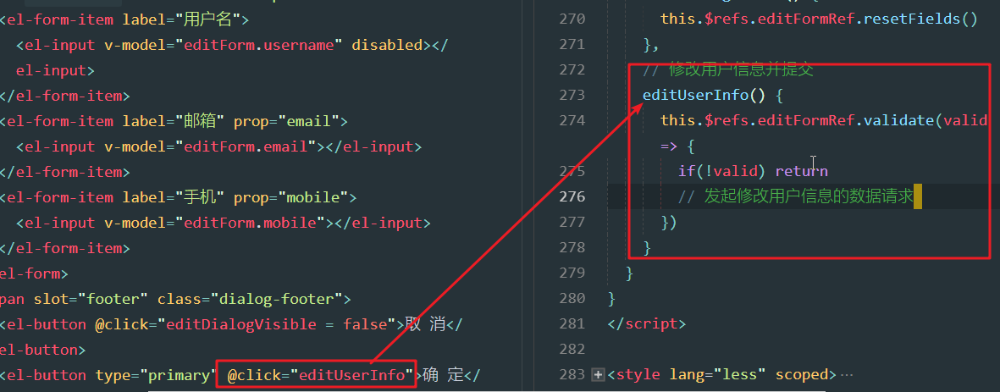
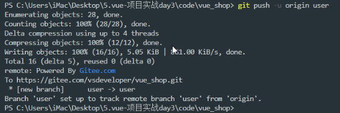
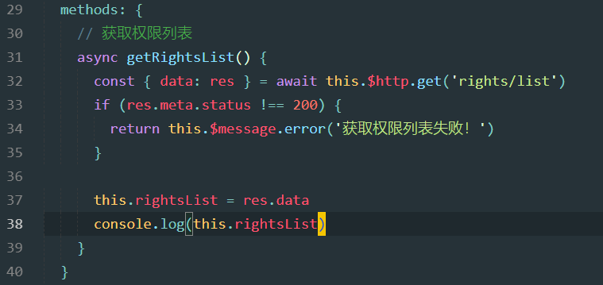
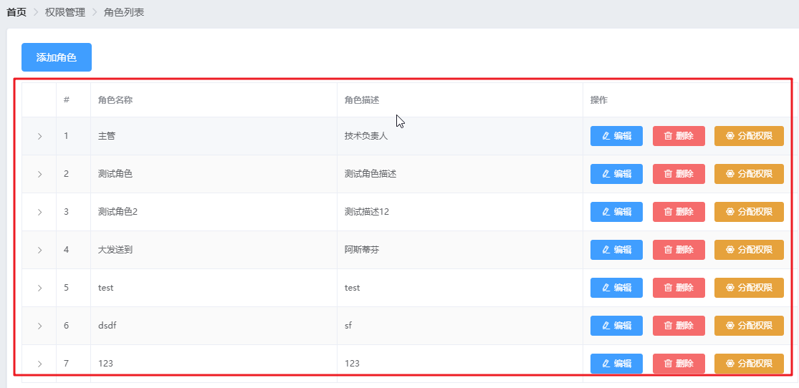
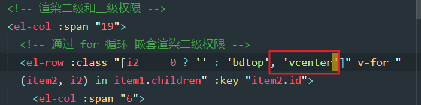
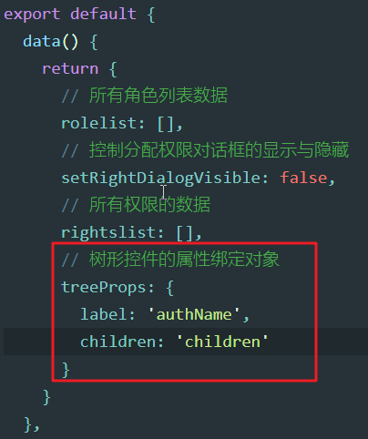
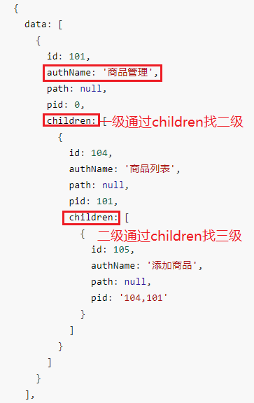
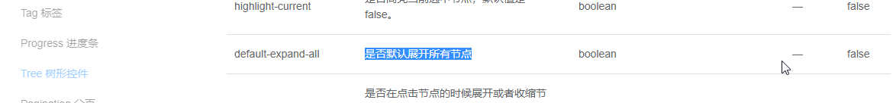

# Day03

##0. 今日目标

1.修改用户,删除用户 

2.推送代码到码云 

3.权限列表 

4.角色列表 

5.分配角色

## 1. 修改用户

### 1.1 展示修改用户的对话框

1. 修改用户效果，我们先来处理点击修改，弹出对话框

   

2. 修改按钮，点击事件

   

3. 修改对话框结构（放到Users.vue中template的最底部）

   

4. 用到的数据：添加到data中

   

5. 修改效果

   

### 1.2 根据Id查询对应的用户信息

1. 用户信息应该显示到弹出框中，所以我们需要点击修改按钮时，根据id查询用户信息

   

2. 获取用户信息接口

   

3. 获取用户信息

   

   - 这里需要将获取到的数据，存储起来，赋值给data中的editForm

4. editForm

   

   - editForm赋值之后，里边会有id，username，email，mobile，role_id属性

### 1.3 渲染修改用户的表单

1. 填充修改弹框，增加表单，增加校验规则

   

   - 这里的editForm里并没有添加username，email，mobile
   - 其实在上一步我们给editForm赋值的时候，他已经具备这些属性了

2. 修改用户弹框：可以自动填充数据，并且做校验

   

### 1.4 实现修改用户表单的重置操作

1. 重置逻辑

   

2. 演示：如果打开，然后原本不合法的手机号，经过失去焦点，有校验提示

   

3. 重新点开，验证内容已经被重置

   

   - 重置逻辑，可以将校验重置，也可以将文本框内容也进行重置（恢复默认）

### 1.5 完成提交修改之前的表单预验证

1. 点击确定，预验证效果

   

2. 逻辑如下

   

### 1.6 提交表单完成用户信息的修改

1. 修改用户逻辑

   

   2. 修改成功之后，对话框关闭，并且用户列表的数据也刷新

## 2. 删除用户

### 2.1 弹框询问用户是否确认删除数据

1. 删除效果

   

2. 弹框官网：

   

3. 删除逻辑

   

   - confirm方法返回了一个Promise对象，所以可以使用awiat
   - 当点击取消按钮时，confirm方法会抛出异常，所以需要调用catch，捕获错误

4. 注册MessageBox

   

   - 这里的MessageBox也是添加给Vue的原型对象了，跟Message一样

5. 效果：取消效果

   

### 2.2 调用API完成删除用户的操作

1. 删除用户api

   

2. 删除逻辑如下：

   

3. 效果：提示成功，并且列表中已经没有

   

### 2.3 创建user子分支并把代码推送到码云仓库中

1. 新建user分支

   

   - 老师这里的分支处于master（之前操作用户代码的时候，没有新建用户分支，而是直接在master上开发了）
   - 我们来修正一下

2. 在已经有修改的master分支上直接新建user分支，他会将所有修改都放入user分支中

   

3. 添加暂存区，提交本地仓库

   

4. 提交user分支

   

5. 切换master，合并user

   

6. 提交master

   

## 3. 权限列表

### 3.1 创建rights子分支并推送到码云

1. 创建rights分支

   

   - 为了避免接下来开发权限相关代码，还是继续在主分支上开发
   - 我们在开发之前，新建rights分支

### 3.2 通过路由展示权限列表组件

1. 权限列表

   

2. 新建界面：components/power/Rights.vue

   

3. 注册权限界面

   

4. 权限效果

   

### 3.3 绘制面包屑导航和卡片视图

1. 权限面包屑和卡片

   

2. 权限界面结构

   

3. 权限效果

   

   

### 3.4  调用API获取权限列表的数据

1. 获取权限接口

   

2. 权限列表代码

   

3. getRightsList方法

   

4. rightsList输出结果

   

### 3.5 渲染权限列表UI结构

1. 效果

   

2. 卡片结构：使用表格

   

3. 效果

   

4. 等级标签官网

   

5. 注册tag

   

6. 权限等级

   

   - 这里在做level判断的时候: level ==='0'，为啥是字符串0呢？

   - 引入level数据就是字符串的数字

     

7. 效果

   

### 3.6 用户-角色-权限 三者之间的关系

1. 权限管理分析

   

   - 角色：权限集合
   - 权限：每一个功能的增删改查，都可以认为是一个权限
   - 我们给用户赋予角色，他就拥有了这些角色下的权限

## 4. 角色列表

### 4.1  通过路由展示角色列表组件

1. 角色列表

   

2. 新建Roles.vue （同样在components/power中）

   

3. 注册roles

   

4. 角色效果

   

### 4.2 绘制基本布局结构并获取列表数据

1. 角色列表界面分析

   

2. 角色结构

   

3. 效果

   

4. 角色列表api

   

5. 角色列表逻辑

   

6. 角色列表数据

   

### 4.3 渲染角色列表数据

1. 角色列表

   

2. 角色列表结构

   

3. 效果

   

4. 展开列

   

   - type为expand就是展开列，expand：展开

5. 效果

   

### 4.4 说明角色列表需要完成的功能模块

1. 展开功能如下（添加，编辑，删除，不在处理，跟用户一样）

   

2. 分配权限

   

### 4.5 分析角色下权限渲染的实现思路

1. 展开功能

   

2. 打印数据：pre，以预览格式查看数据

   

3. 数据分析如下

   

### 4.6 通过第一层for循环渲染一级权限

1. 一级结构如下：

   

   - scope.row是当前角色数据，scope.row.children是当前角色下的一级权限数据
   - item1，是一级菜单数据对象，i1是一级菜单的索引

2. 一级效果

   

   - 数据如下：这里的一级权限与显示的一致，没有问题

     

### 4.7 美化一级权限的UI结构

1. 一级菜单样式

   

   - 只有第一行添加顶部边框
   - 其余的添加底部边框

2. 效果

   

3. icon官网

   

4. icon添加

   

5. 效果

   

### 4.8 通过第二层for循环渲染二级权限

1. 二级菜单结构

   

   - item1是一级权限，循环item1的children，就是二级权限，所以item2就是二级权限

2. 二级效果

   

   - 数据如下：商品管理下的二级权限为：商品列表，分类参数，商品分类，与上图显示一致，没问题

     

3. 二级添加样式

   

   - 除了第一个二级菜单，其他都添加一个顶部边框

4. 二级效果

   

### 4.9 通过第三层for循环渲染三级权限

1. 三级结构

   

   - 循环item2的children，那么就是三级权限了，所以item3就是三级权限

2. 三级效果

   

   - 数据如下：商品列表下的三级权限为商品修改，与上图一致，没问题

     

3. 问题

   

   - 在渲染一级权限的时候，分了两列，第一列显示一级权限，第二列显示二级和三级
   - 第一列占5份，第二列占19份（一行24份）
   - 然后在19份的列中，为了处理二级和三级，所有又增加了row，row里还是两个col
   - 这时候的第一列为6份，第二列为18份
   - 有同学问，6+18 != 19呀？这里大家需要注意每一行的分数都是24份
   - 在19份的这一列中又新增了一行，所以又将这19份分为了24份

4. 三级权限分析

   

### 4.10 美化角色下权限的UI结构

1. 菜单需要居中

   

2. 垂直居中样式

   

3. 一级菜单添加垂直居中

   

4. 二级也需要居中

   

5. 居中效果

   

### 4.11 点击删除权限按钮弹出确认提示框

1. 删除权限

   - 每个权限都有叉号

   

   - 点击之后，出现对话框

     

2. 先给三级角色添加，删除图标

   

   - el-tag标签添加closable属性之后，就可以显示关闭按钮

3. 关闭按钮效果

   

4. 点击删除图标，需要弹框，所以需要监听删除事件

   

5. 删除权限逻辑

   

6. 取消删除提示

   

### 4.12 完成删除角色下指定权限的功能

1. 删除权限逻辑

   - 传递参数

   

   - 当前这一行的数据scope.row，是角色数据，item3.id是三级权限的id
     - 删除权限，需要提供删除哪个角色下的权限，所以需要俩参数

   - 发起删除请求（**url依然是反引号包裹**）

     

2. 问题：删除之后，权限内容合上了

   

   - 这是因为，我们在删除成功之后，调用了getRolesList()，而这个方法，会导致整个用户列表重绘，而权限默认是合上的，所以就合上了

3. 修复bug

   

   - 我们不在重新获取数据

   - 直接将res.data重新给当前角色赋值即可

   - 因为删除成功之后，后台服务器又将新的角色数据返回了

   - 我们只需要给这个角色数据重新赋值，他只会渲染角色这部分的数据，所以不会合上

   - 后台返回数据如下：data就是删除成功之后，返回的当前角色新权限列表

     

4. 一级二级权限添加删除逻辑

   

5. 效果

   

6. 分析图如下：

   

## 5. 分配权限

### 5.1 弹出分配权限对话框并请求权限数据

1. 分配权限对话框

   

2. 对话框代码，添加到template末尾

   

3. 分配权限点击，点击之后能够显示对话框

   

4. 效果

   

5. 所有权限列表接口：这次我们需要获取树形权限列表，所以参数值为tree

   

6. 保存权限列表的属性，一会要用，先定义

   

7. 获取树形权限

   

### 5.2 初步配置并使用el-tree树形控件 ***

1. 树形控件

   

2. 树形结构

   

   - data是数据源，我们刚刚获取到的权限数据已经赋值给了rightsList

   - props：树形控件配置属性，通过这个属性确定树形控件显示什么内容，如何确定父子关系

     

     - label：确定树形结构显示的内容的属性，显示权限名：authName（权限名）

     - children：确定树形结构的父子级关系的属性，我们的数据中'children'属性是表示父子关系的属性

     - 如下图：下边有分析图

       

     - 分析如下：

       

3. 注册tree

   

4. 树形权限效果

   

   - 树形数据如下：

     

### 5.3 优化树形控件的展示效果

1. 增加复选框效果

   

2. 可选择的树形：增加show-checkbox即可

   

3. 添加复选框

   

4. 复选框效果

   

5. 增加node-key

   

   - 为啥要增加这个属性？
   - 当我们选中某个权限时，需要获取当前选中的权限的id
   - 菜单选中时，它会自己找node-key中的值是什么属性名，根据node-key的值来确定选中之后获取到的是哪个属性的值
   - 那么我们就通过node-key指定这个id属性即可

6. 添加nodekey

   

   - 注意，这里的node-key不需要属性绑定，我们只需要告诉他所以属性名字，他内部会找id属性的值
   - 这个后边会详细说（5.4），目前先知道不需要属性绑定即可

7. 再来看一个问题，打开之后，默认都是折叠的

   

8. 展开所有官网介绍

   

9. 添加展开

   

10. 展开效果

   

### 5.4 分析已有权限默认勾选的实现思路

1. 当打开分配权限之后，应该默认勾选当前角色所拥有的权限

   

2. 默认勾选属性

   

   - 我们只需要给tree增加default-checked-keys属性，并且给定值。就可以实现默认选中

3. 增加默认勾选属性，并增加测试数据：105，116

   - 增加属性

     

   - 增加数据

   

4. 效果

   

   - 当我们将商品列表剩下的三级权限勾选之后，商品列表就自动勾选

   - 当商品管理下的所有二级权限勾选之后，商品管理自动勾选

   - 所以我们只需要将当前角色下的三级权限的数据给default-checked-keys即可

   - 但是需要注意：如果没有指定node-key是不行的

     

     - default-checked-keys如果指定了105和116，那么他就会找，看哪个节点的key是105和116，找到了就让对应的节点选中
     - 所以我们如果添加node-key为id的话，那么节点的key就是权限的id，这样才能通过default-checked-keys让其勾选

5. 如下，只需要获取主管这个角色下的所有三级权限，然后给default-checked-keys即可

   

6. 接下来我们就处理三级权限

### 5.5 加载当前角色已有的权限  ***

- 同递归的方式，获取当前角色下所有的三级权限

1. 增加递归方法，在methods中定义

   

   - node：是当前遍历的权限对象
   - arr：存储三级权限id的数组
   - leaf:叶子，最末端的意思，我们这里最末端的是三级权限
   - getLeafKeys获取三级权限id

2. 代码修改

   

   - showSetRightDialog增加参数role：这个是角色对象

3. 默认勾选效果

   

4. **分析**

   

### 5.6 在关闭对话框时重置defKeys数组

1. 当我们打开测试角色的分配权限时，发现他应该只有商品管理和权限管理的权限，但是点击分配权限之后，进入有订单管理的权限

   

2. 这是因为，我们先点击了主管的分配权限，他有订单管理，然后给defKeys添加了这些权限

   

   - 所以再点击测试角色的分配权限时，多了主管的权限，因为我们没有情况defKeys

3. 解决：关闭分配权限对话框时，清空defKeys

   

### 5.7 调用API完成分配权限的功能

1. 处理确定分配

   

2. 角色授权api

   

   - 这里的参数，需要选中的权限的key，还有半选中的权限的key

   - 下图：横岗就是半选中，对勾就是选中

     

3. 获取选中，半选中的属性

   

   - 当

4. 定义属性：data中定义，这个后边要用

   

5. roleId赋值

   

6. 分配权限代码：

   

   - el-tree添加ref='treeRef'，右侧代码中需要用到el-tree引用对象

   - ...this.$refs.treeRef.getCheckedKeys，是进行数组拆包

     - 比如：[1,2,3]-----1,2,3

   - 分配权限接口，要求将选中的权限和半选中的权限，全部以逗号拼接到一起，所以这里按照上述代码处理了一下

   - 分析如下：

     

7. 分配成功

   

### 5.8 渲染分配角色的对话框并请求角色列表数据

1. 分配角色

   

   

2. 增加分配角色对话框

   

3. 分配角色属性

   

4. 分配角色对话框，需要显示用户信息，定义属性如下

   

5. 分配按钮事件：显示对话框，给userInfo赋值

   

   - 将参数userInfo赋值给data的属性userInfo，下边对话框中才可以通过插值表达式使用

6. 增加对话框信息

   

7. 效果

   

8. 还缺少一个角色的下拉列表框，这个需要用到角色列表属性，定义到data中：

   

9. 获取角色列表代码

   

10. 角色列表api如下

   

11. 界面显示角色下拉菜单，下一小节处理

### 5.9 渲染角色列表的select下拉菜单

1. 角色下拉菜单如下

   

2. 下拉菜单官网

   

3. 下拉列表代码：

   

   - label：下拉菜单每一项显示的内容：roleName角色名称
   - key和value都指定了：id角色id

   - rolesList的数据如下：每个角色对象都有id和roleName

     

4. 注册下拉列表

   

5. 角色列表下拉效果

   

### 5.10 完成分配角色的功能

1. 分配用户角色api

   

2. 更新角色代码

   

3. 更新成功

   

4. 更新成功之后，再次打开，发现下拉列表没有重置

   

5. 重置代码

   

6. 重置效果

   

### 5.11 提交本地代码到Git仓库并推送到码云

1. 提交right

   

2. 合并master

   

