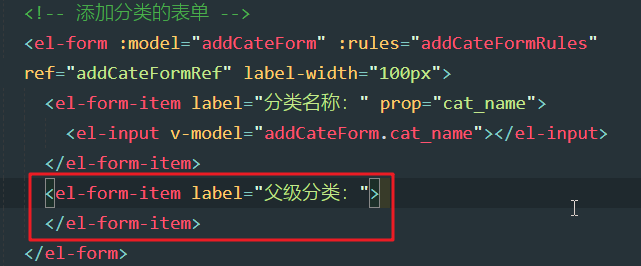
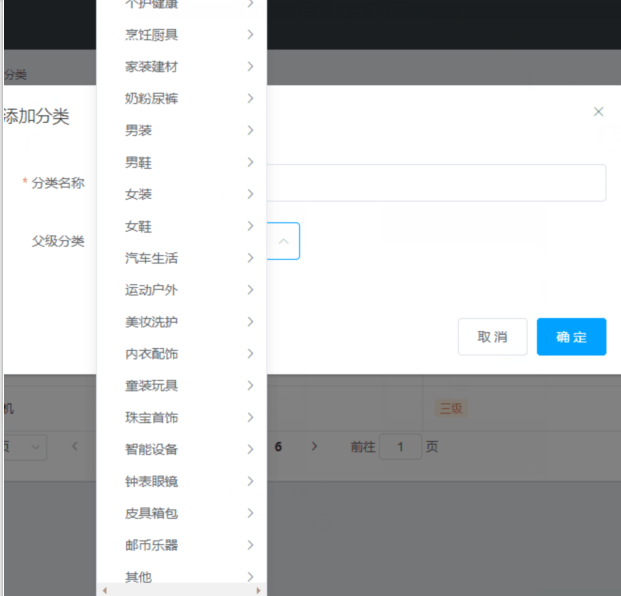
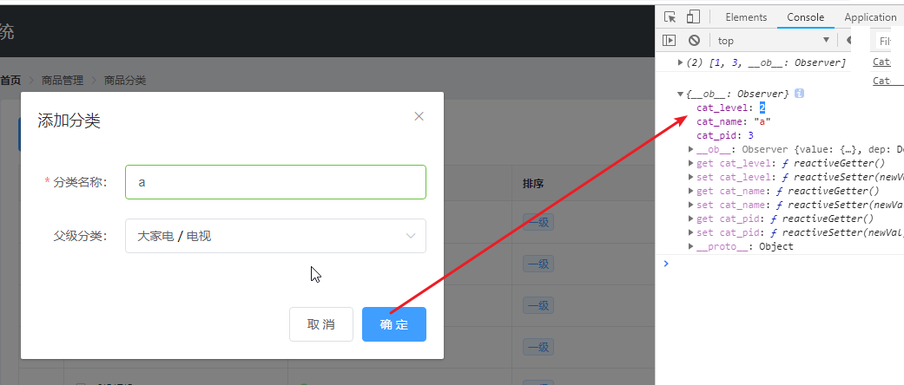
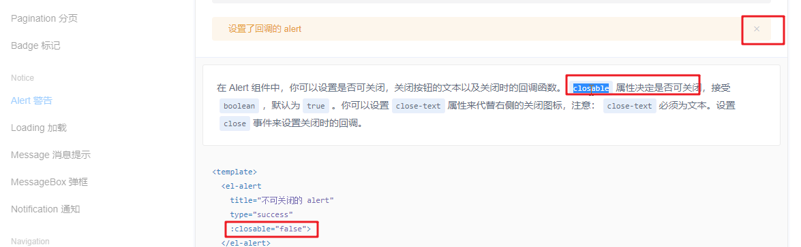
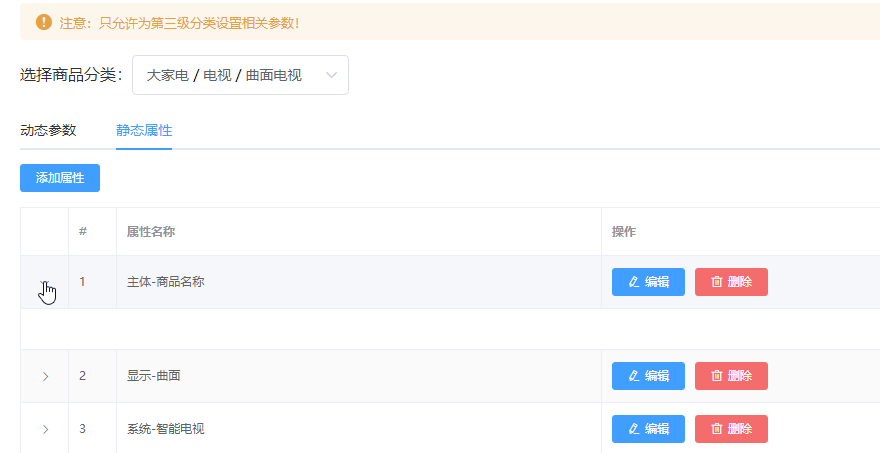
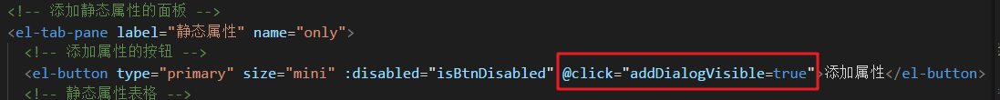
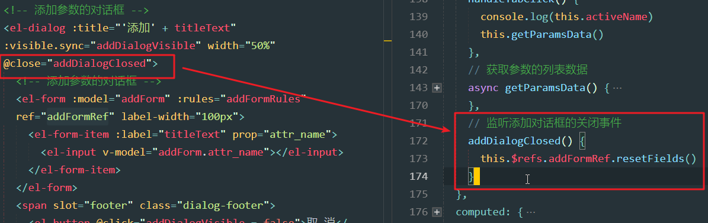

# Day04

## 0. 今日目标

1.完成商品分类 

2.完成参数管理 

## 1. 商品分类

### 1.1 介绍商品分类功能的作用

1. 概述

   

   - 此界面是前台界面，而我们处理的是后台管理界面

2. 功能介绍

   1. 商品分类列表：有列表，编辑，删除，分页

      

   2. 一级分类展开

      

   3. 二级分类展开

      

   4. 添加分类

      

### 1.2 创建goods_cate子分支并push到码云中

1. 创建分支

   

2. 推送分支

   

### 1.3 通过路由加载商品分类组件

1. 分类节目：添加商品分类界面，点击菜单可以跳转

   

2. cate界面：目录components/goods/Cate.vue

   

3. 导入cate

   

4. 效果

   

### 1.4 绘制商品分类组件的基本页面布局

1. 商品分类效果：处理基本布局：面包屑导航，卡片

   

2. 界面结构

   

3. 效果

   

### 1.5 调用API获取商品分类列表数据

1. 商品分类数据列表api

   

2. 定义数据（我们这里必须使用type为3请求数据）

   

   - type为3的话，会将一级二级三级所有数据返回（这个返回的数据，与接口里的数据不一样，是axios处理的，这里的data.result对应接口api中的data）

     

   - type为2的话，会将一级二级数据返回

     

   - type为1的话，会将一级数据返回

     

3. 定义getCateList方法

   

   - 这里为啥res.data可以获取result呢？如下

4. res.data打印结果

   

   

### 1.6 初步使用vue-table-with-tree-grid树形表格组件

1. 树形表格组件效果，Element-UI并没有，需要使用插件

   

2. 安装依赖

   

3. 导入插件

   

   - 这个插件TreeTable，作为Vue的一个自定义组件使用，所以通过Vue.component添加

4. 插件api

   

   - data：树形表格的数据来源
   - columns：列的配置

5. 具体列配置

   

6. 添加树形表格

   

   - 数据源data就是获取到的catelist，分类列表

   - 列，指定了label：列标题。指定了prop：对应列内容的属性

   - 我们将result给了catelist，所以table在循环catelist的时候，可以从cat_name取出菜单的名字

     

7. 效果

   

   

   - **问题**：大家会发现，这里只给tree-table指定了data和columns，然后这个树形表格就出来了，甚至二级分类，三级分类也能够显示出来？
   - 之前处理el-tree的时候，我们指定了children，而这里不需要指定，因为tree-table默认会将数据中名为children的属性作为父子关系属性，而我们的数据中children确实就是父子关系的属性。

8. 去掉复选框和展开列

   

9. 添加selection-type和expand-type

   

10. 效果

  

11. 添加索引

    

12. 添加索引代码：show-index和index-text俩属性

    

13. 添加序号效果

    

14. 添加border

    

15. 效果

    

16. 上图中，有鼠标停留高亮显示效果，我们去掉

    

17. 添加show-row-hover

    

18. 无悬浮效果

    

### 1.7 使用自定义模板列渲染表格数据

1. 接下来处理是否有效

   

   - 是否有效不是简单的显示内容，而是要显示控件，所以需要使用作用域插槽

2. 插件中使用插槽

   

   - 通过type为template表示这一列需要使用作用域插槽
   - template：likes，说明当前使用的作用域插槽模板是名字叫做likes的template

3. 是否有效结构

   

   - 这里的template起的名字是isok，是否有效
   - template通过slot起名字为isok（具名插槽）
   - template中传递数据依然使用slot-scope

4. 效果

   

   - 这里给对勾和×都显示了
   - 需要增加ifelse

5. 增加ifelse，并且增加样式

   

   - 这里用到了数据cat_deleted：分类已删除，false：没有删除，那么就是有效

     

6. 效果

   

### 1.8 渲染排序和操作对应的UI结构

1. 排序和操作

   

2. 定义排序列

   

3. 排序结构

   

   - 这里用到了cate_level属性

     

4. 排序效果

   

5. 增加操作列

   

6. 操作结构

   

7. 操作效果

   


### 1.9 实现分页功能

1. 分页效果

   

2. 分页结构：添加到tree-table下方

   

3. 上图中使用的数据如下：queryInfo和total

   

4. 分页事件

   

5. 效果：但是添加分类按钮离table太近了

   

6. 添加样式

   

   

7. 效果

   

### 1.10 渲染添加分类的对话框和表单

1. 添加分类对话框

   

2. 添加分类对话框结构

   

3. 添加分类点击事件

   

4. 分类对话框效果

   

5. 对话框添加表单

   

   - 这里的addCateForm中的属性命名：参照如下api

     

6. 效果

   

7. 添加父级分类

   

8. 父级分类效果

   

9. 父级分类最终效果：这里用到的组件涉及到级联，咱们后边再说

   

### 1.11 获取父级分类数据列表

1. 父级分类

   

   - 问题：不是有三级分类么？为啥这里的父级分类只有两级，因为三级分类是末级不能作为别人的父级。
   - 在对话框弹出时需要获取商品分类列表数据

2. 商品分类列表数据api

   

   - 这次请求，只需要获取前两级分类数据，所以type传递2
   - 而且不需要分页，需要获取所有数据，所以pagenum和pagesize不传递

3. 获取父级分类（一级和二级数据）

   

   - 将结果保存到parentCateList中，后期使用

4. data中增加数据：

   

5. showAddCateDialog中调用：

   

### 1.12 渲染级联选择器 ***

1. 级联选择官网

   - 效果

   

   - 代码

     

2. 导入级联

   

3. 级联结构

   

   - options：级联菜单数据源

   - props：控制级联菜单的属性

   - v-model：绑定的数据，这个是选中的数据

   - 官网介绍：

     

   - props中的参数

     

     - value：指定的是cat_id，选中之后所使用的值
     - label：指定的是cat_name，显示的内容
     - children：父子级关系属性，指定的是children

   - 相关数据的属性

     

4. 改变级联方法

   

5. 效果

   

6. 清空选项（上述处理了之后，选择分类，无法叉号清空）

   

7. 清空添加

   

8. 效果

   

9. 问题：一级没有办法选择（如果我们给三级分类添加父级，那么就需要选择一级）

   

10. 任意选择属性

  

11. 添加属性

    

12. 一级选中

    

13. 问题1 - 处理完之后，发现级联菜单过高

    

    - 分析：这个是因为Element-ui版本升级之后出现的问题

    - 解决：global.css增加如下样式即可：

      ```css
      .el-cascader-menu {
          height: 300px;
      }
      //增加的样式类名为.el-cascader-menu，而不是.el-cascader
      ```

      - 为啥样式名不一样呢？看如下分析图

        

    - 注意：有同学尝试在Cate.vue中增加这个样式

       ```css
       <style lang="less" scoped>
           .el-cascader-menu {
             height: 300px;
           }
       </style>
       ```

    - 但是发现不管用，这是为啥呢？

      - 这个跟scoped样式作用域有关系

      - 在vue文件中的style添加scoped是为了仅在当前vue文件中能使用这些样式，为了避免与其他vue文件的样式产生冲突

      - 但是这个scoped有个特性，如果给第三方组件添加样式的话，**只能给根组件添加样式**，**而不能给子组件添加样式**

      - 而el-cascader是根组件，下边的选项所在的el-cascader-menu是el-cascader的子组件

      - 这就是为啥我们给el-cascader添加的样式成功了，但是el-cascader-menu没有生效

        ```
        <style lang="less" scoped>
        .el-cascader {
          width: 100%;
        }
        .el-cascader-menu {
          height: 300px;
        }
        </style>
        ```

      - 至于scoped为啥只能给根组件添加样式，而不能给子组件添加样式，请看如下链接：

        <https://www.cnblogs.com/youhong/p/11637695.html> 

      - 或看如下截图

        

14. 问题2：新版本的element-ui中的el-cascader的用法有些改变

    

    - 提示expand-trigger和change-on-select已经被移除，不在使用

    - 而是使用props中的expandTrigger和checkStrictly

    - 解决，将如下的内容：

      

    - 改为：

      

    - checkStrictly：strictly：严格的，完全的.

      

      - 可通过 `props.checkStrictly = true` 来设置父子节点取消选中关联，从而达到选择任意一级选项的目的。 

    - 如果添加checkStrictly:true，那么级联的效果就会有单选按钮，意味着每一级都可以选择

      

15. 级联菜单，显示分析

    

### 1.13 根据父分类的变化处理表单中的数据

1. 接下来要分析父级分类改变之后的数据，我们先来看下添加分类的表的数据对象

   

   - cat_pid：默认的父级分类为0，也就是没有父级，代表一级分类
   - cat_level：默认是0，也就是一级分类（因为默认是没有选择父级分类的，没选就是一级）

2. 我们观察一下，父级分类改变之后selectedKeys的改变：

   

   - 如果选择大家电，打印1，数组长度为1。此时的分类级别为1（二级），父级id为1

   - 如果选择电视，打印1,3，数组长度为2。此时的分类级别为2（三级），父级id为3

   - **所以cat_level应该与数组selectedKeys的长度一样，cat_pid应该为数组的最后一位元素**

   - **selectedKeys分析**：他的意思是：选中项的key集合，那么这个selectedKeys是谁赋值的呢？

     

     - cascader的value始终与选中的选项（option）的value保持一致，而option的value是分类id

     - 所以当选择了海外购之后，比如海外购的分类id为12，那么cascader的value也为12
     - 而cascader中通过v-model与selectedKeys进行了双向数据绑定，而双向数据绑定其实是将value属性与selectedKeys进行了绑定，所以value为12，那么selectedKeys也为12

3. 修改改变事件代码

   

   - if中没必要return，执行if，肯定不会执行else，所以没必要return。

4. 添加，确定添加逻辑：确定方法中，打印一下addCateForm，来测试下刚刚的逻辑是否正确

   

5. 测试没有选择父级

   

6. 测试选择的父级为一级

   

7. 测试选择的父级为二级

   


### 1.14 在对话框的close事件中重置表单数据

1. 关闭对话框，或者取消之后，再次打开，还有上次的数据，我们需要清空

   

2. 监听关闭事件，重置字段

   

3. 发现父级分类没有清空，还需要重置这些：让所有的都恢复默认即可

   

### 1.15 完成添加分类的操作

1. 添加分类api

   

2. 添加分类逻辑：

   

   - 添加成功之后，重新获取分类列表数据，关闭对话框

3. 添加三个分类，分别为一级二级三级分类，效果如下

   

### 1.16 将goods_cate分支上的代码提交到Git仓库中

1. 提交

   

2. 推送

   

3. 合并

   

## 2. 分类参数

### 2.1 创建goods_params分支

1. 创建分支

   


### 2.2 介绍分类参数功能的作用

1. 商品参数介绍

   

   - 动态参数，是这个产品多样化的参数，是用户可以选择的版本，颜色，等这些参数
     - 用户可以选择不同的颜色和版本，所以这些参数是动态参数
   - 静态属性，是这个产品都一样的属性
     - 机身长度，宽度，厚度等这些都是静态属性，这些用户是没法选择的，这个产品生产出来这些属性是固定的，静态不变化的

2. 分类参数效果：

   

   - **需求**：
   - 只允许给三级分类，设置相关参数（一级二级无法选中）
   - 动态参数和静态属性，跟商品的三级分类有关
   - 只有选择了三级分类之后，才会有动态参数和静态属性

3. 动态参数：

   

4. 静态属性

   

### 2.3 通过路由加载分类参数组件页面

1. 新建界面：components/goods/Params.vue

   

2. 注册界面

   

3. 效果

   

### 2.4 渲染分类参数页面的基本UI结构

1. 处理布局

   

2. 需要用到警告，官网介绍

   

3. 布局结构

   

4. 警告区域默认有一个关闭叉号，通过cloasble控制，false为去掉

   

5. 添加一个叹号图标：show-icon

   

6. 效果

   

7. 添加商品分类区域

   

8. 样式

   

9. 效果

   

### 2.5 调用API获取商品分类列表数据

1. 商品分类api

   

2. 获取逻辑

   

3. 商品分类列表属性

   

### 2.6 渲染商品分类的级联选择框

1. 级联选择框

   

2. 添加级联结构

   

   - options：数据源
   - props：控制属性
   - v-model：选中的key，选中的分类的值

3. 级联对话框属性

   

4. 级联变化方法

   

5. 效果

   

### 2.7 控制级联选择框的选中范围

1. 不让选择一级二级分类，修改代码

   

   - 我们只需要在级联变化时，判断选择的是否是三级，如果不是，那么就置空selectedCateKeys，并且不执行下列逻辑（return）
   - 如果选中三级分类，那么selectedCateKeys中存储三个值（分别是当前的一级二级三级分类id），所以长度为3即为选中了三级分类

2. 无法选中：选择一级，二级之后，select框中无内容显示

   

### 2.8 渲染分类参数的Tabs页签

1. 页签效果

   

2. tabs官网

   

3. 注册tabs

   

4. 添加tabs

   

   - v-model绑定当前选中的页签的名字，如果是first那么动态参数选中，如果是second那么静态属性选中
   - tab-pane的name是当前页签的唯一名字

5. 选中页签的名字的属性

   

6. activeName为second，所以默认选中配置管理

   

### 2.9 渲染添加参数按钮并控制按钮的禁用状态

1. 如果没有选择三级分类，添加参数中和者静态参数中的按钮为禁用

   

2. 添加按钮，并且添加禁用逻辑

   

   - 这里用到了计算属性computed
   - isBtnDisabled，通过selectedCateKeys的长度来判断是否为三级分类，如果是返回true，否则返回false。
   - 新添加的俩按钮，的disabled属性绑定isBtnDisabled
   - 一旦selectedCateKeys变化，就会重新计算，重新调用isBtnDisabled，进而俩按钮会跟着变化

3. 效果

   

### 2.10 获取参数列表数据

1. 参数列表api

   

   - 这里的分类id，只能是三级分类id

2. 准备参数：分类id

   

   - 也是一个计算属性，一旦selectedCateKeys变化，我们就是需要获取当前的三级分类

3. 准备参数sel

   - 默认切换，监听到的值为first和second

   

   - 但是接口中需要many和only，修改如下（默认还是many，动态参数）

     

   - 效果

     

4. 获取分类参数请求：

   

5. 选择分类之后，打印结果（默认动态参数）

   

### 2.11 切换Tabs面板后重新获取参数列表数据

1. 问题：选择商品分类，可以发起获取参数列表的请求，有数据打印。但是切换tabs并没有重新请求

   

2. 抽取方法：getParamsData（获取参数数据），因为在商品分类改变，tabs切换时都需要调用，所以这段逻辑属于公共逻辑，需要抽取

   

   - 这里的cateId是计算属性，根据selectedCateKeys获取当前三级分类id
   - 商品分类切换，cateId会改变
   - tabs切换，activeName会改变
   - 所以这俩任何一个切换，上述代码都需要重新执行，所以抽取一个方法getParamsData

3. 分别调用

   

4. 效果

   

### 2.1 将获取到的参数数据挂载到不同的数据源上

1. 动态参数和静态属性的数据都是res.data，这样不好处理，我们区分一下：修改getParamsData方法

   

2. 属性

   

### 2.13 渲染动态参数和静态属性的Table表格

1. 动态表格

   

2. 动态表格结构

   

   - 这里的参数名称prop绑定的是attr_name属性，看如下api：返回的参数名称是attr_name

     

3. 动态表格效果

   

4. 静态表格结构

   

5. 静态表格效果

   

### 2.14 渲染添加参数的对话框

1. 静态和动态的对话框，非常类似，我们使用一个

   

   

2. 对话结构

   

   - 这里的title用到了一个动态的，所以使用到了一个titleText计算属性

3. 计算属性中增加：

   

4. 按钮添加点击事件

   

   

5. 效果

   

   

6. 添加表单

   

   - 这里的form-item的label绑定了计算属性titleText

7. 效果

   

   

8. 关闭对话框重置：

   

### 2.15 完成动态参数和静态属性的添加操作

1. 添加参数api

   

2. 添加参数方法

   

   - 这里的this.cateId依然是计算属性，获取当前选中的三级id

3. 绑定事件

   

4. 添加动态成功：添加对话框没截图

   

5. 静态成功效果

   

### 2.16 渲染修改参数的对话框

1. 修改对话框

   

2. 修改结构

   

3. 所涉及的属性

   

4. 所涉及的方法

   

5. 编辑添加点击事件：**注意**：动态和静态的编辑按钮，都需要添加 (因为一样，我只截了一个图)

   

6. 动态效果

   

7. 静态效果

   

### 2.17 完成修改参数的操作

1. 首先填充编辑界面数据

   

2. 查询参数api：点击编辑按钮，需要传递id，发起查询参数请求

   

3. 传递参数：**注意**（静态和动态的编辑都需要传递）

   

4. 修改显示编辑对话框逻辑，发起查询请求

   

5. 动态效果

   

6. 静态效果

   

7. 接下来确定编辑，先来看api

   

8. 修改editParams方法，发起请求

   

9. 动态成功

   

10. 静态成功

    

### 2.18 完成删除参数的业务逻辑

1. 删除对话框

   

2. 删除api

   

3. 删除逻辑

   

4. 删除按钮绑定事件：（注意：动态和静态都需要给删除添加事件）

   

5. 删除成功（颜色删除了）

   
