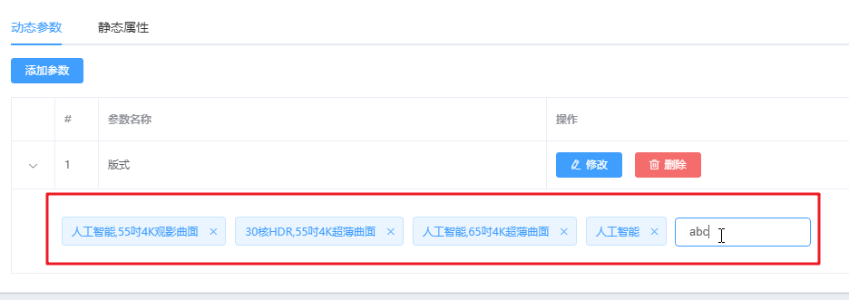
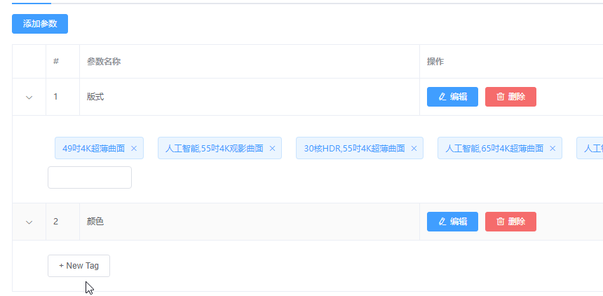
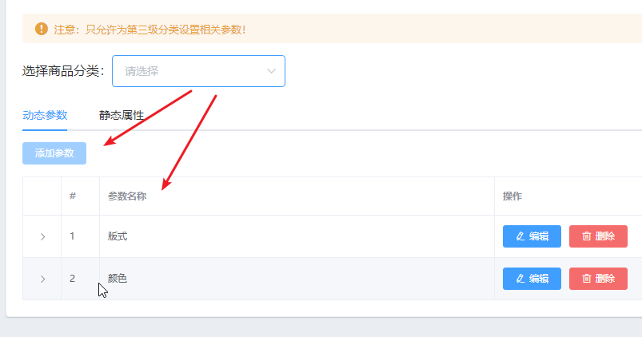
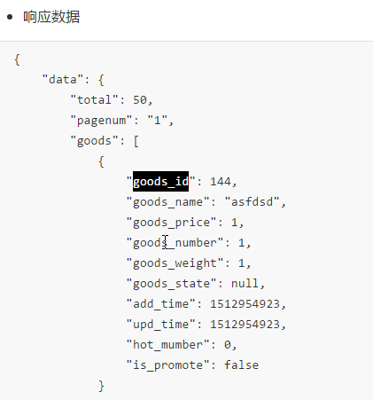
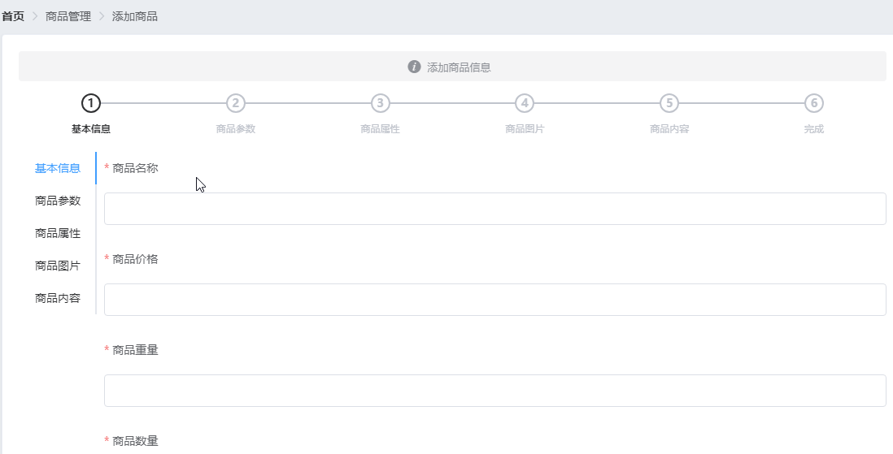
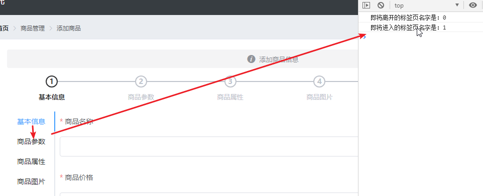
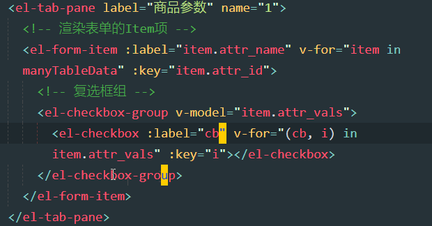

## Day05

### 0. 今日目标

1.完成参数管理 

2.推送代码到码云

3.制作商品列表页面

4.制作商品添加页面

## 1. 分类参数

### 1.1 渲染参数下的可选项

1. 展开列：显示当前参数的可选项

   

2. 可选项数据如下：attr_vals属性，可选项以逗号分隔

   

   - 我们需要将attr_vals中的可选项分开，然后进行遍历显示

3. 分开可选项

   

   - **注意**：视频中是以空格分隔，其实应该以逗号分隔：split(',')

4. 遍历

   

5. 效果如下（这里的效果还是有问题的，以逗号分隔才正确）

   

6. 逗号分隔结果

   

### 1.2 解决attr_vals为空字符串时候的小问题

1. 新加一个参数，发现展开之后，出现一个空白的可选项

   

2. 新加的参数，可选项是空字符串，**空字符串与任何一个字符进行split都得到一个空字符串数组**

   

3. 修复

   

4. 效果

   

### 1.3 控制按钮与文本框的切换显示

1. 点击New Tag

   

2. 出现文本框

   

3. 官网

   

   - 通过v-if判断inputVisible的值来切换input和button的显示隐藏
   - inputVisible为true，input显示，button隐藏
   - 反之，input隐藏，button显示
   - keyup.enter.native：回车键抬起事件

4. 添加tag和对应事件

   

   - 在第三方组件中使用键盘事件，都需要添加.native修饰符

   - .native修饰符介绍，native：本地的，天生的，程序中：原生

     ```
     官网：你可能想在某个组件的根元素上监听一个原生事件。可以使用 v-on 的修饰符 .native 。
     通俗点讲：就是在父组件中给子组件绑定一个原生的事件，就将子组件变成了普通的HTML标签，不加'. native'事件是无法触发的。
     ```

   - 现在我们是给el-input添加键盘监听事件，但是el-input渲染之后是div包裹一个input，我们要想通过el-input给里边的input添加键盘事件，就需要添加.native

     

5. 属性：添加到data中

   

6. 样式

   

7. 效果

   

### 1.4 为每一行数据提供单独的inputVisible和inputValue

1. 发现问题：第一个参数中新加选项，结果第二个也出现自动就出现文本框了，并且值也一样

   

2. 因为，每个参数中的input都共用了inputVisible和inputValue

   

3. 修改如下：

   

   - 让每个参数数据中都有inputVisible和inputValue（在getParamsData方法中修改上图右侧代码）
   - 然后自己使用自己的

4. 显示文本框方法，也需要修改代码

   

5. 效果

   

### 1.5 让文本框自动获得焦点 ***

1. 新建可选项之后，出现文本框，需要自动获取焦点

   

2. 官网

   

3. 代码

   

   - 上述代码写的有点奇怪，可以改成如下：

     ```js
     this.$nextTick(() => {//箭头函数无参数可以写()或者_
         this.$refs.saveTagInput.focus()
     })
     ```

   - nextTick官网介绍：

     ```js
     Vue 在更新 DOM 时是异步执行的，为了在数据变化之后等待 Vue 完成更新 DOM，可以在数据变化之后立即使用 Vue.nextTick(callback)。这样回调函数将在 DOM 更新完成后被调用。
     ```

   - 我们这里想确保，文本框渲染出来之后，再让其获取焦点

   - 理解：

     - 当我们执行：row.inputVisible = true 时，Vue会更新el-input让其显示
     - 但是显示（渲染）文本框是需要一定的时间的
     - 如果我们紧接着就写获取焦点的代码，此时的文本框可能还没有渲染到界面，所以会没效果
     - 那么我们就通过nextTick的回调函数，来处理获取焦点逻辑
     - 因为nextTick的回调函数，会在文本框渲染出来之后再去调用

   - saveTagInput是el-input的ref引用对象

     

4. 效果

   

### 1.6 实现文本框与按钮的切换显示

1. 失去焦点，需要再切换会 NewTag 的按钮，现在没实现

   

2. 失去焦点，回车抬起，改变状态：

   

3. 失去焦点回到按钮：

   

4. 空格问题：输入很多空格，按下回车，然后在切换文本框，竟然空格还在（我们不应该保存空格的）

   

5. 修复空格问题

   

### 1.7 完成参数可选项的添加操作

1. 提交参数可选项api

   

2. 修改逻辑

   

   - **注意**：空格拼接，需要改为逗号拼接：row.attr_vals.join(',‘)
   - 对于attr_vals的操作，大家需要统一
     - 如果刚开始是使用**空格**分隔之后显示可选项，那么提交的时候就需要安装**空格**拼接
     - 如果刚开始是使用**逗号**分隔之后显示可选项，那么提交的时候就需要安装**逗号**拼接

3. 效果：刷新界面依然存在，因为我们已经将数据提交到后台

   

### 1.8 删除参数下的可选项

1. 删除可选项

   

   - 删除一个可选项，与添加一个可选项的接口api是一样的，只不过就是attr_vals中少一个多一个的问题

     

2. 接口一样，那么发起请求的代码就一样，将之前的逻辑封装一个方法：

   

3. 删除事件

   

4. 删除逻辑

   

5. 修改handleInputConfirm调用saveAttrVals

   

6. 效果：提示的是修改参数项成功，删除一项也可以理解为修改（也可以自己修改为删除）

   

### 1.9 清空表格数据

1. 如果之前选择的三级分类，之后切换到二级分类，发现按钮禁用了，但是列表竟然在

   

   - 老师的操作是点击了二级分类之后，级联选择器对话框消失了
   - 其实这里我们在操作的时候，发现压根切换不到一级或二级分类（对话框不会消失），所以不会有这个问题

2. 切换分类之后，会重新获取数据，我们在获取数据时如果选择不是三级，就清空：

   

3. 修复效果

   

### 1.10 完成静态属性表格中的展开行效果

1. 静态属性表格的展开行效果和动态参数表格的展开行一样，所以直接复制即可

2. 复制动态参数的展开行代码（合并之后复制）

   

3. 替换静态的展开行

   

4. 效果

   

### 1.11 将本地goods_params分支的代码提交并推送到码云

1. 提交

   

2. 推送

   

3. 合并

   

## 2. 商品列表

### 2.1 创建goods_list子分支并推送到码云

1. 创建并提交

   

### 2.2 通过路由加载商品列表组件

1. 商品列表界面

   

2. 新建界面：components/goods/List.vue

   

3. 导入列表界面

   

4. 效果

   

5. 增加基本布局

   

6. 效果

   

### 2.3 获取商品列表数据

1. 列表api

   

2. 获取商品列表方法

   

3. 属性

   

4. created调用

   

5. res.data结果

   

### 2.4 渲染商品表格数据

1. 渲染列表

   

2. 列表使用表格，表格结构

   

3. 所用属性参照如下：

   

4. 效果

   

### 2.5 自定义格式化时间的全局过滤器

1. 显示时间时，格式有问题

   

2. 增加时间过滤器

   

   - 给vue添加过滤器，可以在任意组件使用
   - 反引号：模板字符串，替代字符串与变量的拼接
   - padStart(2,'0')，不满2位，补0

3. 使用过滤器，需要在插槽中使用

   

4. 效果

   

### 2.6 实现商品列表的分页功能

1. 分页

   

2. 分页结构：background是增加分页页码的背景

   

3. 分页方法

   

4. 效果

   

### 2.7 实现搜索与清空的功能

1. 搜索功能

   - 输入内容，点击搜索，出现新的列表

   

   - 清空搜索，立马获取新的数据（不需要再次点击搜索）

     

2. 搜索逻辑

   

   - clearable是增加搜索框内的叉号
   - clear事件是，点击叉号触发的事件，重新获取商品列表
   - 点击搜索按钮，也重新获取商品列表

3. 搜索结果

   

### 2.8 根据Id删除商品数据

1. 删除功能

   

2. 删除api

   

3. 删除逻辑

   

4. 调用逻辑

   

5. 用到了goods_id，商品列表接口返回的商品对象中，通过goods_id属性获取商品id

   

### 2.9 通过编程式导航跳转到商品添加页面

1. 商品添加界面

   - 点击添加商品

   

   - 跳转到：商品添加界面

     

2. 新建Add界面：components/goods/Add.vue

   

3. 注册Add界面

   

4. 添加点击事件

   

## 3. 商品添加

### 3.1 渲染添加页面的基本结构

1. 基本结构：先处理红框内的结构（商品的信息太多了，所以添加的时候进行了分步）

   

2. 步骤条

   

3. 注册

   

4. 添加界面结构

   

   - space：每个 step 的间距，不填写将自适应间距。支持百分比。
   - finish-status：设置结束步骤的状态，如果第一步完成，那么就会显示已完成（**当前步骤结束之后显示什么状态，如下图中，第二步是进行中，那么第一步就处于结束状态，而状态指定的是success，那么就显示已完成**）
   - 可选值：wait / process / finish / error / success 

5. 效果

   

### 3.2 美化步骤条组件

1. 优化步骤条

   

2. 代码如下

   

   - activeIndex是激活的索引，也就是哪一步高亮显示
   - el-step的索引从0开始
   - align-center：步骤的文字和图片居中对齐

3. 样式：global.css中添加（我们希望所有的step组件的样式都做如下修改）

   

4. 效果

   

### 3.3 渲染tab栏区域

1. 标签功能：这个标签是在左侧

   

2. 标签官网

   

3. 标签结构

   

   - 这里的tab-position可以设置tab标签的位置，left代表标签在左侧（如下图）

   - 这里的代码其实写的有点麻烦，可以改成如下：

     ```html
     <el-tabs tab-position="left" ></el-tabs>
     ```

4. 效果

   

### 3.4 实现步骤条和tab栏的数据联动效果

1. tab栏与步骤同步

   - 基本信息

   

   - 商品参数：商品参数就是动态参数，商品属性就是静态属性

     

2. 绑定逻辑

   

   - tab页签选中哪个之后，v-model绑定的属性值，会发生改变
     - 比如商品参数的tab页签选中，那么v-model绑定的属性activeIndex的值，就为‘1’（字符串）
     - 那么我们只需要让索引为1的step选中即可（所以steps和tabs组件绑定的数据都是activeIndex）
   - 但是steps的active绑定的属性的值，必须是数字，所以将activeIndex通过减去0，转换为数字

3. 效果

   - 基本信息

     

   - 商品参数

     

### 3.5 分析表单的组成部分

1. 添加商品，分为多步

   - 基本信息

   

   - 商品属性

     

   - 等等

   - 这些步骤，是为了将商品的信息分开来处理，因为商品信息太多了，分步处理更加清晰明了

   - 但是这些分步的信息，是要一次性提交的，所以需要一个表单即可

2. 添加表单

   

3. label的位置：指定的是top，就是label在文本框上方（看基本信息）

   

   - 最终效果（但是我们这里还没有添加input，所以大家看不到，这里截图只是告诉大家label在上方的效果）

     

4. 效果：效果并没有任何的变化，我们只是测试一下看有没有错误

   

### 3.6 绘制基本信息面板的UI结构

1. 基本信息表单面板如下：

   

2. 表单控件添加如下：

   

   - 删除了el-tabs的高度样式
   - 商品价格和商品种类，商品数量，都是number类型
   - 所绑定的addForm的属性名goods_name，goods_price，goods_weight，goods_number，都是与接口api一致的

3. 接口如下：

   

4. 相关属性与校验规则

   

5. 效果

   

### 3.7 获取商品分类数据

1. 商品分类

   

2. 获取商品分类

   

3. catelist属性定义

   

4. catelist打印结果

   

### 3.8 绘制商品分类的级联选择器

1. 商品分类效果

   

2. 增加商品分类

   

3. 相关属性和校验

   

   

4. 相关方法

   

5. 效果

   

### 3.9 只允许选中三级商品分类

1. 修改方法

   

### 3.10 阻止页签切换  ***

1. 阻止页签切换

   

   - 想要实现这个效果，需要使用到一个before-leave事件

2. before-leave事件

   

   - 此事件，是在切换标签之前调用的事件，如果此事件返回false，就不会切换成功
   - **为啥要使用这个事件**？
   - 因为我们是要在，**用户点击其他步骤之后**，**并且在切换点击的页签成功之前**，做判断
   - before-leave：离开之前，从“基本信息”点击“商品参数”，如果要显示商品参数界面，基本信息肯定要离开，那么这个事件before-leave，是在基本信息离开之前执行的
   - 这个事件的参数是一个回调方法，方法的第一个参数activeName是即将切换的页签的name（也就是点击的页签），第二个参数oldActiveName是即将要离开的页签的name

3. 添加before-leave事件

   

   - 基本信息的页签el-tab-pane的name是0
   - 后续步骤的页签，依次递增

4. 从基本信息点击商品参数：效果

   

   - 因为beforeTabLeave并没有返回false，所以切换到商品参数了

5. 增加false逻辑

   

6. 效果：点击了商品参数，但是beforeTabLeave返回false了，所以没有切换成功

   

7. 处理真实逻辑

   

   - 如果即将离开的页签是基本信息（name为0），这时候就需要判断商品分类是否是三级（数组长度是否等于3）
   - 如果商品分类不等于3，说明没有选择商品分类，就直接返回false，那么页签就不会切换成功

8. 效果：没有选择商品分类，切换商品参数，效果如下

   

### 3.11 获取动态参数列表数据

1. 需要获取商品参数里所需的，动态参数列表数据

   

2. 添加tab点击事件

   

3. 效果： 点击商品参数打印1，商品属性打印2

   

4. 修改逻辑

   

   - activeIndex为1时，说明是商品参数（动态参数）

5. 用到的计算属性：cateId

   

6. 用到的属性：manyTableData

   

7. 效果

   

### 3.12 绘制商品参数面板中的复选框组

1. 渲染商品参数的可选项

   

2. 这里用到了多选框组

   

3. 注册

   

4. 增加复选框组

   

   - 首先循环manyTableData（动态参数数据），循环出动态参数：板式，颜色
   - 循环出的每一个动态参数数据是item
   - 然后循环item的可选项attr_vals

5. 但是这个attr_vals要想循环，需要转换为数组（服务器返回的是字符串）

   

   - 如果之前对于attr_vals提交数据的时候是以逗号拼接的（如下），**那么这里也需要使用逗号分隔**

     

6. 效果

   

7. 复选框增加border

   

8. 增加border

   

9. 效果

   

### 3.13 优化复选框的样式

1. 复选框间隔太大

   

2. 增加样式

   

3. 效果

   

### 3.14 获取静态属性列表数据

1. 商品静态属性（商品属性就是静态属性）

   

2. 增加获取静态属性数据逻辑：如果activeIndex为2就是静态属性

   

3. 所用属性：onlyTableData

   

4. 获取数据打印结果：

   

### 3.15 渲染商品属性面板的UI结构

1. 增加商品静态属性结构：

   

   - 这里的form-item的label就是属性名（如下图中的：主体-商品名称）
   - 这里的input中绑定的数据：item.attr_vals就是属性值
   - **注意**：静态属性的属性值是一个，而动态属性的属性值可能是多个

2. 效果

   