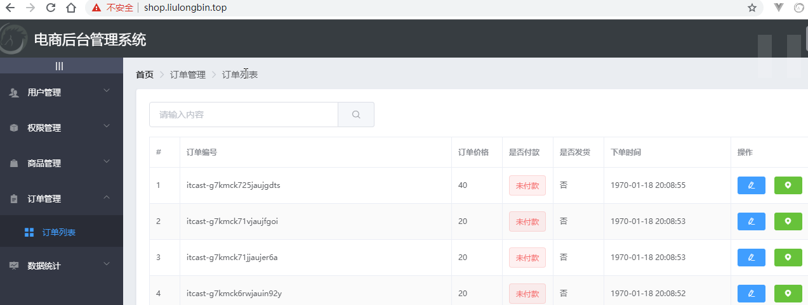

## Day06

## 0. 今日目标

1.完成商品添加

2.完成订单列表

3.完成数据统计展示


## 1. 商品添加

### 1.1 初步使用upload上传组件

1. 上传图片步骤：

   - 点击上传按钮，选择图片

   

   - 确定之后，会显示如下效果

     

   - 点击图片名字，可以预览

     

   - 还可以删除

     

2. 上传图片官网

   

3. 注册upload

   

4. 上传图片结构与方法

   

   - action是指，点击了“点击上传”按钮，将图片上传到后台的url

   - on-preview：是点击图片名字，大图预览的事件

   - on-remove：删除事件

   - list-type：文件列表类型，也就是显示上传后的图片的风格

     

   - picture风格：带图片的列表

     

5. 属性

   

### 1.2 手动为upload组件绑定headers请求头

1. 上传之后，提示为token无效

   

   - 什么时候会提示这个错误信息呢？
   - 服务器在检测到前端发起的请求中没有Authorization请求头，或者请求头中的token不合法

2. 我们在之前通过拦截器，统一的给axios添加了请求头：

   

   - 那为啥还报错呢，这是因为，刚刚上传图片，并没有使用axios，而是elment-ui的upload组件自己根据url上传的

3. 官网：查看，发现有headers属性

   

4. 添加headers

   

5. 上传成功

   

   - 上传成功之后，返回的数据里有一个tmp_path，临时路径
   - 为啥是临时路径呢？
   - 因为上传图片是第四步，如果用户最后没走完所有步骤呢？这个图片是不是就是一个没用的图片呀，所以目前存储的路径是临时路径

### 1.3 监听upload组件的on-success事件

1. 图片上传成功之后，我们需要记录成功之后的图片路径：temp_path

   

2. 路径保存到哪呢，我们看一下添加商品的请求参数：pics，应该保存到添加商品表单的pics中，最后提交添加商品的表单，需要这些数据

   

3. addForm增加pics，pics是一个数组，因为可以上传多张图片

   

4. 上传成功之后，需要将图片路径保存到pics中。

   - 关键我们怎么知道，用户点击上传图片之后，什么时候上传成功了呢？

   - 官网：上传成功之后，有一个回调事件on-success

     

5. 添加成功事件

   

6. 打印response效果：图片临时路径就在data中

   

7. 保存临时路径：

   

   - 这里为啥要将路径放到一个对象picInfo中，再放入pics数组，因为参数要求：

     

8. addForm打印效果：如果上传两张，这里就会有俩图片路径

   

### 1.4 监听upload组件的on-remove事件

1. 删除逻辑思路：

   

2. 运行，看下打印的file是什么：

   

   - file对象中可以通过response.data.temp_path，找到当前删除图片的路径

3. 移除逻辑

   

   - 点击删除图片之后，系统调用handleRemove方法，并且传递了要删除的图片对象file
   - 通过file.response.data.tmp_path可以获取到当前图片的路径
   - 数组的findIndex方法，是查找当前符合条件的索引

4. 删除第一张，第一张是556.jpg

   

5. 删除之后：只剩下484.jpg

   

### 1.5 实现图片的预览效果

1. 预览效果

   

2. 增加file参数，并打印

   

3. 观察file：点击图片名称，观察控制台

   

   - 打印的数据中有一个url，这个就是后台服务器的图片路径，我们预览就来看这个路径
   - 为啥不使用tmp_path，因为tmp_path的路径并不完整

4. 直接将完整url，访问，可以看到图片

   

5. 增加属性

   

   - previewPath，存储预览路径
   - previewVisible：预览对话框显示标记

6. 预览逻辑

   

7. 预览对话框

   

8. 效果

   

### 1.6 安装并配置vue-quill-editor

1. 商品内容的富文本

   

2. 安装富文本依赖

   

3. 富文本介绍

   

4. 富文本注册介绍

   

5. SPA使用介绍

   

6. 导入富文本

   

7. 富文本结构+按钮

   

   - 给富文本绑定的属性是goods_introduce，参照接口：

     

8. 富文本属性

   

9. 样式

   

10. 效果

   

   - 默认的内容，就是在段落里，所以12345包裹在p标签里

### 1.7 实现表单数据的预验证

1. 添加预校验

   

2. 选择商品分类，然后直接到最后一步，点击添加商品

   

3. 哪个是必填项？带红色星号的都是必填项

   

4. 给基本信息的必填项添加一下，再次点击添加商品，就不会再提示

5. 为啥那些是必填项：看接口

   

### 1.8 把goods_cat从数组转换为字符串

1. 先来看接口：

   

   - **goods_cat必须是一个以逗号分隔的字符串**

2. 而addForm中的goods_cat是一个数组

   

3. 将goods_cat转换为逗号分隔的字符串

   

4. 运行之后，点击添加按钮，报错：

   

   - 因为cascader需要一个数组，但是我们给数组goods_cat转换为了字符串
   - 所以我们不能直接给addForm中的数组进行转换
   - 我们来进行深拷贝：将addForm进行深拷贝之后，再将goods_cat进行转换
   - 这样的话，cascader绑定的goods_cat并没有改变，就不会报错
   - **注意**：其实这里我们的代码不会报这个错误，这个应该是element-ui对这一块做了升级，兼容性更强了，可以字符串，也可以是数组。所以如下操作没必要处理了

5. 深拷贝依赖安装

   

6. 导入：重命名为_（lodash一般重命名为\_）

   

7. 深拷贝

   

   - 深拷贝，会将addForm内部所有的内容都拷贝出来，变成一个一模一样的另一个数据，修改form不会影响addForm
   - 浅拷贝，只会将addForm的地址拷贝出来给form，这样的话form和addForm指向同一个对象，修改form相当于修改addForm

8. 效果：点击添加商品之后，没有报错，而goods_cat已经变为字符串

   

### 1.9 处理attrs数组

1. attrs数组

   

   - attrs是一个数组，包含动态参数和静态属性
   - 数组中每一个动态参数或静态属性都是一个对象
   - 对象中包含分类参数id：attr_id和分类参数可选项的名字：attr_value

2. addForm增加attrs

   

3. 处理attrs

   

   - 动态参数的可选项值，需要进行拼接，因为是有多个（**注意**，这里也需要逗号分隔）
   - 静态参数的可选项值，不需要拼接，因为只有一个
   - 最终需要把this.addForm.attrs赋值给form.attrs
   - 因为我们最终提交的是form，而不是this.addForm

4. form打印效果：

   

### 1.10 完成商品添加操作

1. 添加接口

   

2. 添加逻辑，请求参数我们都已经封装到了form中

   

   - 添加成功之后，api服务器返回的状态码为201

3. 添加之后，重新跳转到商品列表界面，并且看到刚刚添加的数据

   

### 1.11 将goods_list分支的代码合并且推送到码云

1. 提交goods_list

   

2. 合并

   

## 2. 订单列表

### 2.1 创建order子分支

1. 创建order分支

   

### 2.2 通过路由渲染订单列表页面

1. 订单界面效果

   

2. 新建界面：components/order/Order.vue

   

3. 注册订单界面

   

4. 效果

   

5. 处理订单界面的基本布局

   

6. 效果

   

### 2.3 根据分页获取订单数据列表

1. 订单列表效果

   

2. 订单列表接口

   

   - 前三个参数是必填项，我们先处理前三个参数

3. 订单列表属性

   

4. 订单列表逻辑

   

5. 订单结果打印：res

   

### 2.4 渲染订单table表格

1. 订单列表表格

   

2. 表格结构

   

   - **注意**：上图中的是否发货，可以不用插槽，因为is_send不需要过滤器，是否发货这一列，也没嵌套其他组件
   - 表格中的属性，依据响应数据中goods中的对象的属性（下图）

3. 响应数据

   

4. 效果

   

### 2.5 实现分页功能

1. 分页功能

   

2. 分页结构

   

3. 分页方法

   

4. 分页效果

   

### 2.6 实现省市区县数据联动效果

#### 2.6.1 显示对话

1. 修改地址：真正的修改功能不实现，只实现里边的省市区级联菜单

   

   

2. 对话框

   

3. 对话框显示标记属性：

   

4. 点击事件

   

5. 对话框效果

   

#### 2.6.2 对话框校验

1. 增加表单，并校验

   

   - 这里的addressForm中的属性名：address1和address2是随便写的，因为我们不去真正的提交修改地址操作，所以不用对照修改地址接口中的参数（其实压根没准备这个接口）

2. 效果

   

#### 2.6.3 增加省市区

1. 省市区：省市区的数据已经准备好，咱们直接导入使用即可

   

2. 拷贝到order中

   

3. 导入

   

4. 定义属性cityData，属性名与属性值一致，所以简写：

   

5. 增加级联选择器，并且使用数据

   

   - 这里的cascader没有指定props：分析图如下：

     

     

6. 样式

   

7. 重置对话框

   

8. 效果

   

### 2.7 展示物流进度对话框并获取物流信息

#### 2.7.1 显示对话框

1. 物流对话框

   

2. 物流对话框结构

   

3. 添加显示对话事件

   

4. 效果

   

#### 2.7.2 获取物流信息

1. 物流接口：

   

   - 参数id就使用测试的这个物流单号即可，写死即可（因为我们只提供了这一个物流信息）

2. 获取物流信息

   

3. 物流数据属性

   

4. 打印效果：

   

### 2.8 手动导入并使用Timeline组件

1. Timeline组件官网：

   

2. 但是老师的element插件版本有点低，所以不能直接导入

   

   - 我们使用的所有Element组件，都是基于vue-cli-plugin-element插件的

3. 需要通过外部文件导入，此文件在素材中

   

4. copy到项目的plugins

   

5. 导入timeline，通过文件形式导入（导入俩文件夹中的index.js即可）

   

6. 导入样式（文件导入形式，需要自己导入样式）

   

7. timeline结构

   

   - 循环progressInfo，循环出的每一个对象是activity（其实这个名字可以改一下，activity不太合适）

   - timestamp：时间戳，也就是具体时间。我们指定activity.time

   - 显示的内容为activity.context

   - 看接口：接口中有time和ftime，这俩时间一样，用哪个都一样。context：具体物流的描述信息

     

8. 效果（timeline就是显示俩内容，一个物流信息（activity.context），一个时间（activity.time））

   

### 2.9 将本地order分支的代码合并且推送到码云

1. 提交暂存区

   

   - 这里的警告，是将timeline文件夹中的相关文件的LF替换为CRLF

   - 介绍如下：

     

   - 那说明timeline的文件可能是在Mac OS操作系统中处理的，所以通过LF表示换行

   - 而现在在windows上提交，所以git将LF换为CRLF

2. 推送

   

3. 合并

   

   

   

## 3. 数据统计

### 3.1 创建report子分支

1. 创建report分支

   

### 3.2 通过路由加载数据报表组件

1. 数据报表效果

   

2. 新建界面：components/report/Report.vue

   

3. 注册

   

4. 效果

   

5. 报表基本效果

   

6. 效果

   

### 3.3 安装Echarts并渲染Demo图表

1. 使用Echarts，需要使用第三方依赖

   

   

2. 官网介绍：<https://www.echartsjs.com/zh/tutorial.html> 

   

3. 第一步：

   

4. 第二步：

   

5. 第三步：

   

   - 需要界面渲染结束之后，才能找到main元素

6. 第四步：可以直接复制

   ```js
   //继续在mounted中写：
   //4.准备数据和配置项
   var option = {
       title: {
           text: 'ECharts 入门示例'
       },
       tooltip: {},
       legend: {
           data:['销量']
       },
       xAxis: {
           data: ["衬衫","羊毛衫","雪纺衫","裤子","高跟鞋","袜子"]
       },
       yAxis: {},
       series: [{
           name: '销量',
           type: 'bar',
           data: [5, 20, 36, 10, 10, 20]
       }]
   };
   ```

7. 第五步：将数据option设置给myChart对象

   

8. 效果

   

### 3.4 获取折线图数据并渲染图表

1. 获取图标数据接口

   

   - 这个接口返回的数据，需要与options进行合并

2. 要合并的options数据定义如下：直接copy

   ```js
     data() {
       return {
         // 需要合并的数据
         options: {
           title: {
             text: '用户来源'
           },
           tooltip: {
             trigger: 'axis',
             axisPointer: {
               type: 'cross',
               label: {
                 backgroundColor: '#E9EEF3'
               }
             }
           },
           grid: {
             left: '3%',
             right: '4%',
             bottom: '3%',
             containLabel: true
           },
           xAxis: [
             {
               boundaryGap: false
             }
           ],
           yAxis: [
             {
               type: 'value'
             }
           ]
         }
       }
     },
   ```

3. 获取报表数据，并且合并

   

4. 这里用到了lodash，导入

   

5. 修改宽度

   

6. 效果

   

### 3.5 将本地的report分支合并且推送到码云

1. 添加暂存区

   

2. 提交推送

   

3. 合并

   