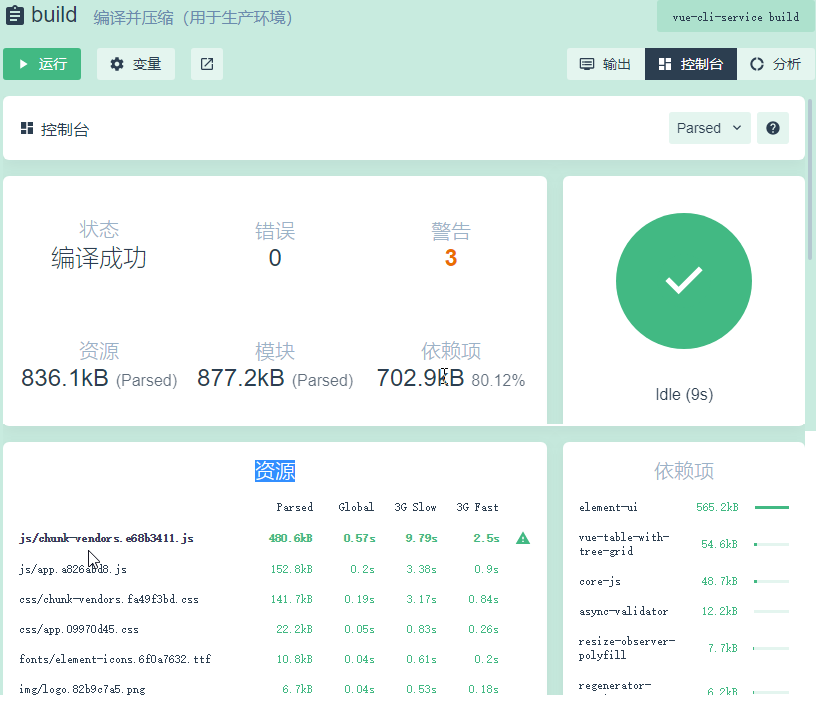
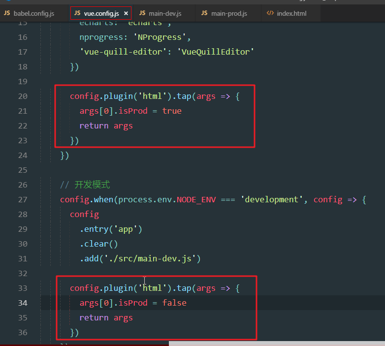
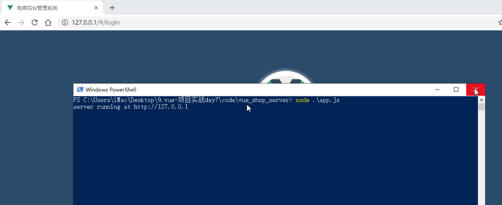
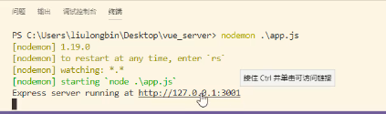

# Day07

##0.今日目标

1.完成项目优化

2.完成项目上线

## 1. 项目优化

### 1.1 介绍项目优化的策略

1. 项目优化策略


- 这些都是啥意思，后边一一介绍

### 1.2 通过nprogress添加进度条效果

1. 进度条效果（当我们打开某个界面的时候，上方会有一个进度条，显示当前界面打开的过程）

   

2. 需要使用第三方依赖

   

3. 使用nprogress：下图是在main.js中增加代码

   

   - 我们想要的效果，是在当前界面打开，到显示完毕，这整个过程显示一个进度条
   - 所以，需要在打开界面之后发起请求的时候，开启进度条
   - 等到界面的数据响应回来之后，隐藏进度条
   - response拦截器，是在接收到服务器响应时会触发的

4. 最后脚手架serve运行，点击菜单会发现进度条

### 1.3 解决serve命令中提示的ESLint语法错误（如果关闭了eslint校验，这一步省略）

#### 1. bug1（这里的所有bug，都是serve运行出现的问题，目前还不能build）

- 问题截图：

  

- 问题描述：i3定义后，但从未使用

- 问题代码：将(item3,i3)改为item3

  

#### 2. bug2

- 问题截图：

  

- 问题描述：scope定义后，但从未使用

- 问题代码：将如下选中代码删除

  

3. bug3

- 问题截图：

  

- 问题描述：期望[]在同一行

- 问题代码：

  

  - 将代码改为一行之后，格式化之后会重新变为多行

  - 修改配置：

    

    - printWidth：允许一行内最多可以容纳多少个字符，默认80个比较少，所以换行了

#### 4. bug4

- 问题截图：

  

- 问题描述：scope定义后，从未使用

- 问题代码：删除如下代码

  

#### 5. bug5

- 问题截图：

  

- 问题描述：attr_id没有遵循驼峰命名法

- 问题代码：将如下方法中的所有的attr_id改为attrId

  

#### 6. bug6

- 问题截图：

  

- 问题描述：attr_id没有遵循驼峰命名法

- 问题代码：将removeParams的attr_id修改为attrId，修改之后截图如下

  

### 1.4 在执行build命令期间移除所有的console

1. build运行

   

2. 运行之后出现错误：

   

   - 在build编译过程中，代码中不允许有console控制台打印
   - 控制台打印，是在程序员开发代码期间，调试用的一直手段
   - 编译之后，项目上线之后，控制台打印对用户是没用的（一般用户也不知道console控制台的存在）
   - **注意：如果关闭了eslint校验，这一步就不会出现这个错误，但是大家还是需要添加取出console的依赖**

3. 去掉console控制台打印代码，需要用到第三方依赖，百度搜索

   

4. 依赖介绍：先安装，在配置

   

5. 安装依赖：选择开发依赖

   

   - 之前的依赖都是按照在运行依赖，而这个工具安装在开发依赖
   - 运行依赖：是线上环境所需要的依赖
   - 开发依赖：是开发阶段所需要的依赖
   - 现在这个依赖，只是在编译的时候，去掉console代码，上线之后就没用了

6. 插件配置

   

7. 再次编译build：只有如下警告，这个是说有些文件过大，这个一会处理

   

### 1.5 只在发布阶段移除所有的console

1. 修改配置：之前的配置，在开发和编译阶段，都给console去掉了，修改如下：

   

   - process.env.NODE_ENV获取到的是啥？其实是项目运行是mode参数的值
   - 为啥判断等于production的时候，再添加，看下边：因为build运行是mode的参数是production

2. 开发阶段运行时的参数：

   

3. build运行时的参数：

   

### 1.6 生成打包报告

1. 生成报告两种方式：

   

2. 分析面板：

   

   - 这个面板是饼状图，将项目中体积比较大的文件进行了统计
   - 我们从这个图中，知道哪些文件比较大之后，就可以针对性优化

3. 控制台面板

   - 总体大小描述：

     

     - 项目资源总共大小2M
     - 依赖项竟然达到1.9M，那这时候就需要考虑将依赖项进行优化

   - 速度统计

     

     - 不同网络状态下，项目启动时间
     - 发现启动时间过长，做针对性优化

   - 资源

     

     - 资源中第一个js，后边跟上了一个感叹号，说明这个资源过大
     - 依赖项，对于所依赖的工具，进行了大小排序

### 1.7 通过vue.config.js修改webpack的默认配置

1. 修改webpack配置

   

   - 配置文件就是向外暴露一些配置选项

2. 新建配置文件：项目根目录/vue.config.js

   

### 1.8 介绍configureWebpack与chainWebpack

1. 配置不同的打包入口

   

   - 如果新建这俩打包入口文件之后，那如何配置不同的打包入口呢？如下：

2. 俩配置节点

   

   - 我们接下来介绍chainWebpack如何配置（configureWebpack不再介绍）

### 1.9 通过chainWebpack自定义打包入口

1. chainWebpack配置节点如下：

   

2. 处理俩入口文件：

   

   - 将之前的main.js复制一份
   - 一份名字改为main-dev.js：开发入口文件
   - 一份名字改为main-prod.js：生产入口文件  （生产环境，也叫线上环境）
   - 目前两份代码一致，后边做修改

3. 配置如下：

   

   - 如果是production，就修改配置的入口，先清空clear，再添加add
   - 如果是development，也是这样
   - 为啥要先清空，再添加，因为如果第一次是production运行，add添加了一个入口，接下来第二次是development运行，如果不清空，再添加add一个入口，就会变成俩入口

4. 最终：serve运行一次（开发模式），build运行一次（线上模式）。都没问题即可。

   

### 1.10 通过externals加载外部CDN资源

- cdn资源是网络上的资源，比如依赖包的js，css等
- 为了减小项目打包文件过大问题，一般我们会将本地的依赖包，改为网络上的

#### 1.10.1 externals配置

1. 问题描述

   

2. build之后，控制台看到资源这一块的描述：

   

   - 这个chunk-vendros.js文件为啥这么大呢？
   - 这是因为，他是整合了，项目中所有的导入的依赖项

3. 解决

   

   - 所以，我们会将依赖项配置到externals中
   - 如果配置了externals，打包的时候，就不会将externals内的依赖项打入到chunk-vendros.js文件
   - 有同学问？那我们的依赖项如果没有随着打包打进去，项目还能运行么？
   - 可以，他会找window全局中的这些依赖项（一会我们会通过script导入cdn网络地址的依赖）
     - html中通过script标签或link标签引入的js或css就是全局的
     - 如果是在vue文件中import导入js或css就是局部的（如：lodash）

4. 配置介绍

   

   - externals配置的是一个对象
   - 对象中的key是，我们在导入时，from后边的依赖名字
   - key如果带有横杆，需要添加引号
   - 对象中的value，是我们导入时，import后边的名字

5. 具体配置

   

   - 配置代码如下，直接复制：

   ```js
   config.set('externals', {
       vue: 'Vue',
       'vue-router': 'VueRouter',
       axios: 'axios',
       lodash: '_',
       echarts: 'echarts',
       nprogress: 'NProgress',
       'vue-quill-editor': 'VueQuillEditor'
   })
   ```

#### 1.10.2 样式文件配置

1. 样式操作

   

2. 打包的时候，这些css文件也会打包进去（删掉如下红框内的导入）

   

3. 所以，我们配置：

   

   - 配置成打包之后的cdn路径，不在配置成自己项目的路径
   - 这样的话，我们的项目查找这些css文件，就直接通过cdn的网络url来查找

   - 代码如下：直接复制

     ```html
      <!-- nprogress 的样式表文件 -->
         <link rel="stylesheet" href="https://cdn.staticfile.org/nprogress/0.2.0/nprogress.min.css" />
         <!-- 富文本编辑器 的样式表文件 -->
         <link rel="stylesheet" href="https://cdn.staticfile.org/quill/1.3.4/quill.core.min.css" />
         <link rel="stylesheet" href="https://cdn.staticfile.org/quill/1.3.4/quill.snow.min.css" />
         <link rel="stylesheet" href="https://cdn.staticfile.org/quill/1.3.4/quill.bubble.min.css" />
         <!-- element-ui 的样式表文件 -->
         <link rel="stylesheet" href="https://cdn.staticfile.org/element-ui/2.8.2/theme-chalk/index.css" />
     ```

#### 1.10.3 js文件配置

1. js操作如下

   

2. 配置如下

   

   - 我们这里导入的是cdn网络中的js文件
   - script导入的js文件，作为全局对象使用
   - 这样配置之后，项目就知道从哪里找咱们的依赖包，从全局对象中找

   - 代码如下，直接复制

     ```html
     <script src="https://cdn.staticfile.org/vue/2.5.22/vue.min.js"></script>
         <script src="https://cdn.staticfile.org/vue-router/3.0.1/vue-router.min.js"></script>
         <script src="https://cdn.staticfile.org/axios/0.18.0/axios.min.js"></script>
         <script src="https://cdn.staticfile.org/lodash.js/4.17.11/lodash.min.js"></script>
         <script src="https://cdn.staticfile.org/echarts/4.1.0/echarts.min.js"></script>
         <script src="https://cdn.staticfile.org/nprogress/0.2.0/nprogress.min.js"></script>
         <!-- 富文本编辑器的 js 文件 -->
         <script src="https://cdn.staticfile.org/quill/1.3.4/quill.min.js"></script>
         <script src="https://cdn.jsdelivr.net/npm/vue-quill-editor@3.0.4/dist/vue-quill-editor.js"></script>
     
     ```

#### 1.10.4 错误1

- 处理完上述步骤之后，出现如下错误

  

- 解决方案

  

- 我们这里使用了externals，所以按照第二种方案解决：删除package.json中的vue-router。

- 其他的依赖不需要删除，这个vue-router比较特殊，本地和cdn上都有的话，externals不起作用

- **但是**：如果给package.json里的vue-router删除了之后，serve就不能运行了，只能build运行。意思就是只能运行线上模式

#### 1.10.5 错误2

- 错误：在处理完打包配置，发现运行之后，出现如下错误，这个是eslint校验异常

  

- 这时候需要再给eslint校验关闭

  

- 关闭之后会在vue.config.js中增加一行：lintOnSave:false

  

- 如果之前就关闭过eslint那么，你在配置打包信息的时候可能给lintOnSave给删除了。再次添加上就可以了

### 1.11 演示externals的效果

1. 重新build运行如下：

   

   - chunk-vendors.js已经变小了
   - 依赖项中只剩下element-ui，之前比较大的都已经没有了

### 1.12 通过CDN优化ElementUI的打包

1. cdn优化ElementUI不太一样，不需要配置external，但是需要屏蔽js导入，按照如下步骤：

   

2. 注释导入element.js

   

3. 添加elementui的css和js

   

   - 复制如下：

     ```html
     <!-- element-ui 的样式表文件 -->
     <link rel="stylesheet" href="https://cdn.staticfile.org/element-ui/2.8.2/theme-chalk/index.css" />
     <!-- element-ui 的 js 文件 -->
     <script src="https://cdn.staticfile.org/element-ui/2.8.2/index.js"></script>
     ```

4. 效果

   

### 1.13 自定制首页内容

1. 首页定制，配置

   

2. 使用配置项

   

3. 配置如下：

   

   - config.plugin('html')获取htmlwebpack插件，html固定写法
   - tap()用来修改插件中的参数：args就是插件中所有的参数

4. 使用isProd参数：如果是开发模式，那么就在页面标题前，添加dev -

   

   - 将所有的cdn资源包裹在if判断中，因为只有在生产环境，才会使用cdn的资源
   - 注意在html中如果想写js代码，需要用<%= xxx  %>包裹
   - 插件的名字是：htmlWebpackPlugin（固定写法）
   - 通过htmlWebpackPlugin.options 获取参数isProd

5. 开发模式运行（serve运行）：效果

   

6. 线上模式运行（build运行）：效果

   

   - build之后，打包的内容都放在了dist目录下
   - 这里并没有dev -
   - 并且有cdn的资源引入

### 1.14 实现路由懒加载

1. 路由懒加载

   

   - 将Foo和Bar组件打包到一组，放到group-foo这一组中
     - 如果Foo或者Bar加载，那么group-foo这一组都会加载（但不会加载其他组）
   - 将Baz单独一组

2. 安装依赖

   

3. 注册插件：  直接复制： '@babel/plugin-syntax-dynamic-import' 

   

4. 修改router.js中的组件导入

   - 将所有的组件，进行分组，随意三两个组件一组
   - 分组之后，这些组件就不会一次性全部加载
   - 而是在用到某一个组件是，加载他所属的这一组组件
   - 从而实现了懒加载
   - 代码如下：可以直接复制

   ```js
   // import Login from './components/Login.vue'
   const Login = () => import(/* webpackChunkName: "login_home_welcome" */ './components/Login.vue')
   // import Home from './components/Home.vue'
   const Home = () => import(/* webpackChunkName: "login_home_welcome" */ './components/Home.vue')
   // import Welcome from './components/Welcome.vue'
   const Welcome = () => import(/* webpackChunkName: "login_home_welcome" */ './components/Welcome.vue')
   
   // import Users from './components/user/Users.vue'
   const Users = () => import(/* webpackChunkName: "Users_Rights_Roles" */ './components/user/Users.vue')
   // import Rights from './components/power/Rights.vue'
   const Rights = () => import(/* webpackChunkName: "Users_Rights_Roles" */ './components/power/Rights.vue')
   // import Roles from './components/power/Roles.vue'
   const Roles = () => import(/* webpackChunkName: "Users_Rights_Roles" */ './components/power/Roles.vue')
   
   // import Cate from './components/goods/Cate.vue'
   const Cate = () => import(/* webpackChunkName: "Cate_Params" */ './components/goods/Cate.vue')
   // import Params from './components/goods/Params.vue'
   const Params = () => import(/* webpackChunkName: "Cate_Params" */ './components/goods/Params.vue')
   
   // import GoodsList from './components/goods/List.vue'
   const GoodsList = () => import(/* webpackChunkName: "GoodsList_Add" */ './components/goods/List.vue')
   // import Add from './components/goods/Add.vue'
   const Add = () => import(/* webpackChunkName: "GoodsList_Add" */ './components/goods/Add.vue')
   
   // import Order from './components/order/Order.vue'
   const Order = () => import(/* webpackChunkName: "Order_Report" */ './components/order/Order.vue')
   // import Report from './components/report/Report.vue'
   const Report = () => import(/* webpackChunkName: "Order_Report" */ './components/report/Report.vue')
   ```

5. 之前的资源：js/app.js比较大

   

6. 重新build运行：js/app.js变为8.3k   （懒加载会影响这个app.js的大小）

   

## 2. 项目上线

- 上线步骤

  

### 2.1 通过node创建web服务器

1. 第一步介绍：

   

2. 新建node服务项目：vue_shop_server

   

3. 初始化包管理文件：

   

4. 安装express

   

5. 找到dist目录，复制

   

6. 粘贴

   

7. vue_shop_server根目录新建app.js，并添加代码：

   ```js
   const express = require('express') //导入express
   const app = express() //实例化express，获取web服务器app
   
   //注册中间件：express.static
   //将dist目录托管为静态资源
   app.use(express.static('./dist'))
   //启动web服务，监听80端口，打印log
   app.listen(80, () => {
       console.log('server running at http://127.0.0.1')
   })
   ```

8. node运行

   

9. 访问

   

10. 问题：

   .png)

### 2.2 开启文件的Gzip网络传输压缩

1. gzip压缩介绍

   

   - 当用户访问项目中的界面时，服务器会将当前界面相关的js文件，css文件，等相关文件，通过网络传输给用户
   - gzip可以将这些文件进行压缩之后，再进行传输，这样网页访问速度更快，节约贷带宽

2. 我们先来看下，压缩之前的chunk.js文件的大小：74.1kb

   

3. 安装compression

   

4. 导入compression

   

   - compression就是对于静态文件进行压缩，所以需要在托管之前

5. 添加compression之后，重新看chunk.js发现传输的大小只有24.6k

   

### 2.3 配置HTTPS服务

1. 为啥需要https

   

   - s--safe，安全的意思
   - **一般配置https服务，都是后台开发人员处理的处理的，所以接下来的内容，咱们了解即可**
   - 并且这一步不用做，因为用的是itcast的公私钥，所以无法正常配置https

2. 申请ssl证书

   

3. 演示如下

   - 输入域名

   

   - 输入邮箱：注意这个不用真正创建，因为你得用自己申请的域名，用itcast.cn是不行的（大家只需要知道这个过程即可）

     

4. 导入

   

   - https默认端口443
   - http默认端口80

5. 素材中有传智的公私钥

   

6. 粘贴

   

7. 具体操作：

   

8. 注意：这一步是运行不了的，因为公私钥是用的传智的公私钥，而传智的域名我们用不了。所以大家只是了解这个过程即可，工作中是后台人员处理

9. 所以代码还需要修改到http端口80启动

   

### 2.4 使用pm2管理应用

1. 问题

   

   - 运行了vue_shop_server之后，可以访问
   - 但是终端一关闭，就访问不了了
   - 运行项目，终端一直开着，总是不方便
   - 使用pm2解决

2. pm2

   

3. 安装

   

4. pm2启动项目

   

   - id为0，我们可以通过id和app_name去操作这个项目
   - status：online，正在运行中

5. 通过pm2启动项目，可以访问：

   

6. 命令演示

   

   - ls：list，查看pm2管理的所有项目
   - pm2 stop 0，停止id为0的项目
   - pm2 restart 0，重新启动id为0的项目
     - 注意，项目停止之后，重新启动是通过restart
     - start其实是通过pm2创建一个管理的项目，并且启动

7. 删除管理项目

   

   - 删除之后，就没有管理的项目了

### 2.5 解决bug，项目build之后，角色列表数据不显示的bug

1. 通过nodemon运行是可以在代码修改之后自动重启（直接通过node运行也可以）

   

2. 发现角色列表数据无法显示

   

3. 先确定，数据回来没：发现有数据

   

4. console有错误：他说rowKey is required。这个是因为element-ui版本的问题

   

5. 查看官网：说是如果row中包含children字段（也就是当前行数据中有children），就需要指定row-key

   

6. 我们的数据中确实有children

   

7. 添加row-key，重新build

   

8. 找到自己项目内的dist，复制所有内容

   

9. 删除vue-shop-server中的dist目录中的所有文件，然后粘贴

    

10. 访问，可以访问正常数据

   

11. 但是，发现有展开行了

    

12. 这是因为新版的element-ui默认有展开行了，我们自己的是2.4.5

    

13. 提供的cdn的是2.8.2

    

14. 修改为2.4.5

    

15. ok

    

16. 注意：其实如果我们直接使用的cdn的element-ui是2.4.5的这个版本的话，压根不用提供row-key。这时候如果修改过版本之后，**还是有问题，那就删除row-key**