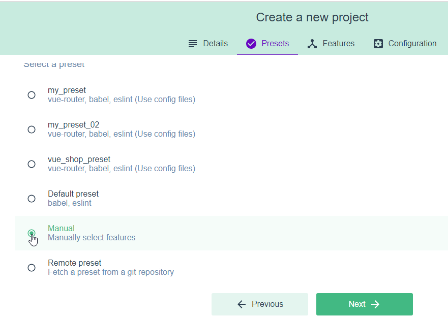
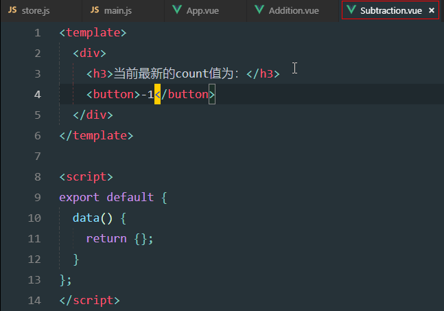
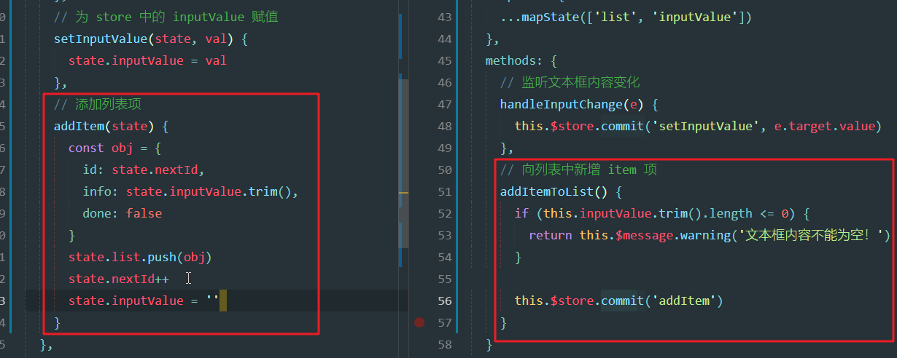

# Day10

##0. 今日目标

1.Vuex概述

2.Vuex基本使用

3.使用Vuex完成todo案例

## 1.vuex基础

### 1.1 vuex概述

1. 问题

   

   - 之前共享数据，是通过以上方式
   - 以上方式，只适用于**小范围内**传递数据

2. vuex介绍：更适合用于传递数据，包括大范围传递

   

   - 没有vuex时：A向B传递数据，需要通过上图中的蓝色剪头来进行一一传递，非常麻烦
   - 有vuex时，A直接将要共享的数据，存储到Store中，然后B直接从Store中获取即可，非常简单。

3. 好处

   

4. 哪些数据适合存储

   

### 1.2 vuex的基本使用

1. 使用步骤

   

   

2. 创建vuex项目

   1. 选择目录

      

   2. 创建项目

      

   3. 选择手动配置

      

   4. 选择依赖

      

   5. eslint配置

      

3. 创建成功之后，默认有store.js文件

   

   - 在这个文件中，导入了vue和vuex

   - 并且注册了vuex

   - 然后暴露了vuex的store数据

   - 大家在创建出来之后，没有store.js，而是store/index.js（跟router一样，版本导致的）

     

4. main文件

   

   - 将store对象挂载到了vue中
   - 这样所有的vue组件都可以使用store对象

### 1.3 初始化计数器项目的基本结构

1. 运行

   

2. 默认界面

   

3. app界面修改，删除之前的所有内容，修改如下：

   

4. 效果

   

5. 删除HelloWorld

   

6. 减法界面：components/Subtraction.vue

   

7. 加法界面：components/Addition.vue

   

8. app界面导入俩界面：

   

9. 效果

   

10. 配置格式的语法处理：末尾分号，单引号（根目录新建.prettierrc）

    

11. 提交本地仓库

    

### 1.4 定义并访问全局共享的数据

1. 核心

   

   - 接下来一一介绍

2. State介绍

   

   - 在vue界面中访问count：this.$store.state.count

3. 定义共享数据count

   

4. 访问count

   

   - 在template中访问vue实例中的内容时，this可以省略
   - 完整写法：{{this.$store.state.count}}

5. 效果

   

### 1.5 组件访问state中数据的第二种方式

1. 第二种用法

   

   - mapState是固定写法

     - 可以理解为：mapState是state数据映射的函数，通过mapState可以获取state中的数据

     - mapState(['state数据1','state数据2'])，将想要获取的state数据，作为参数传递给mapState

     - 例如：mapState(['count'])，获取到的就是count数据对应的一个对象{count:f}

     - 打印mapState(['count'])，结果如下

       

   - 这个count是一个function，这个方法到底是干嘛的不用管

   - 我们只需要对mapState(['count'])进行展开...运算之后，就获取到原有的count属性

   - 最终结果：

     ```js
     computed:{
         count:0
     }
     ```

   - **注意**：state最终映射到computed中，变成一个计算属性

2. 减法中使用第二种方式

   

   - 导入mapState之后，就可以使用第二种用法：可以将store共享数据，映射为计算属性

   - mapState(['count'])找到store里的count数据

   - ... 展开运算符，只有展开之后，才能映射成功为计算属性

   - 最终相当于在computed中定义了一个count属性：

     ```js
     computed:{
         count:0
     }
     ```

3. 效果

   

4. 分析

   

### 1.6 学习mutation的基本使用

1. +1操作

   

2. 效果：可以成功，并且没有报错

   

   - 可以成功，并且没有报错
   - 但是这里我们不能这样处理，需要通过Mutation来修改store的值

3. Mutation介绍：mutation：变化的意思

   

   - 为啥只能通过mutation来操作store的数据呢？

     - 为了统一管理，可以将修改store值的操作，统一在一起，可以方便监控数据的变化

     - 比如：在Addition和Subtracion以及其他很多界面，都是直接修改count的值，那么后期发现count的值有问题，那么我们就需要找很多文件，一个一个文件排查才可能找出问题，不方便监控数据的变化

       

4. mutation中定义add方法，修改count

   

   - 这样的话，所有的count修改的逻辑，都定义在mutations中，以后想要知道哪里的逻辑修改了count，就方便找了

5. 触发add方法

   

   - commit：提交，理解为触发，调用
   - commit就是用于调用mutation中的方法

### 1.7 在触发mutation的时候携带参数

1. mutation传参

   

   - 定义方法时，
     - 第一个参数是固定接收state对象，参数名可以改，但是一般都是state
       - 为啥第一个参数固定接收state对象，因为mutations方法就是用于修改state中的数据的，
       - 所以需要有state对象才能修改
     - 第二个参数step（自定义），就是我们在调用时传递的第一个参数
   - commit：调用方法时
     - 第一个参数：调用的方法名
     - 第二个参数：给调用的方法传递的第一个参数值

2. 定义带参数的mutations方法

   

3. 调用带参数的mutations方法

   

4. 效果

   

### 1.8 触发mutation的第二种方式

1. mutations第二种用法：映射函数

   

   - 这里的mapMutations也是固定的名字

   - mapMutations用于映射mutations方法

   - 与mapState类似，都是一个映射函数，用法也一致

   - 只不过mutations既然是一个函数，那么就在methods中映射

   - 最终效果相当于：

     ```js
     methods: {
         add(state) {
             state.count++
         },
         addN(state, step) {
              state.count += step
         },
     }
     ```

2. 定义sub方法

   

3. 使用

   

   - 通过...mapMutations将sub映射为当前组件方法，所以可以通过this调用sub方法
   - 其实这里可以不用定义btnHandler1方法，调用this.sub()
   - 直接在-1的按钮上，click事件触发sub即可

4. 带参数的方法

   

5. 映射带参数的方法

   

   - 映射有参的函数，和无参的函数是一样的
   - 只是调用的时候，传递参数

6. 效果：点击一次-1按钮，再点击一次-N按钮，如下：

   

7. 分析

   

### 1.9 action的基本使用

1. 先来看一个现象：通过vue调试工具中的第二个窗口，vuex数据窗口

   

   - 点击+1，count为1
   - 点击+N，count为4
   - 数据是可以通过vue调试工具实时观察的

2. 我们来处理一个延迟逻辑

   

3. 效果：

   

   - 发现点击了+1之后，1s之后界面显示了count为1

   - 但是vue调试工具中，count还是为0

   - 虽然能够成功，但是调试工具出了问题，所以mutations中不能执行异步操作

     

     - 那怎么办呢？使用Action

4. Action介绍

   

   - 异步操作都定义到actions中
     - actions中要操作数据，必须通过commit触发方法来修改
     - actions中不能直接修改store的数据，数据只能在mutations中修改
     - 异步方法必须有一个参数，context，代表当前store实例对象
       - 因为为了方便通过commit触发mutations方法
   - 触发action
     - 通过store实例中的方法dispatch来调用
     - dispatch：分发的意思，异步的任务都是通过分发的方式调用的

5. 异步方法定义

   

6. 触发异步方法

   

7. 效果

   

### 1.10 在触发action的时候携带参数

1. 异步参数

   

   - 定义异步方法，第二个参数就是要给addN方法传递的参数
   - 调用异步方法，第一个参数是调用的方法名，第二个参数是给addNAsync方法传递的参数

2. 添加异步参数方法

   

3. Addition方法，添加按钮

   

4. 定义方法

   

5. 效果

   

### 1.11 触发action的第二种方式

1. Action第二种用法：映射

   

   - 根state数据，mutations方法的第二种使用一模一样
   - 因为action也是方法，所以同mutations一样映射到methods中

2. 定义异步方法

   

3. 定义按钮

   

4. 导入

   

5. 映射，调用

   

6. 效果

   

7. 这里映射的subAsync也可以直接使用

   

8. 带参数的第二种用法

   

9. 效果

   

### 1.12 介绍getter的使用

1. getter介绍

   

   - getter虽然定义的是一个方法，但是当属性使用（类似Vue的计算属性）

2. getter使用介绍

   

   - 既然getter当属性使用，所以在computed中映射

3. 定义getters方法，并使用

   

4. 效果

   

5. 第二种用法：映射

   

6. 效果

   

## 2.vuex案例

### 2.1 新建项目并初始化基本结构

#### 2.1.1 案例介绍

1. 介绍：案例Todos，跟jquery中的todolist类似

   

2. 添加

   

3. 选中某个任务，当前任务状态为已完成（右下角条数，为未完成任务数）

   

4. 未完成：点击下方未完成按钮，切换未完成列表

   

5. 已完成

   

6. 清楚已完成（还有删除功能，不在截图）

   

#### 2.1.2 初始化项目

1. 初始化步骤

   

2. 通过vue ui，创建项目

   

   - 这里的创建步骤除了项目名不一样，剩下的步骤跟1.2章节里的第二块内容一样：2.创建vuex项目

3. 安装依赖

   - axios

   

   - ant-design-vue

   

4. 初始化代码（整个todo列表的代码）：这些代码都在素材的vue-todos.txt中

   

5. 修改main.js文件

   - 代码：复制即可

     ```js
     import Vue from 'vue'
     import App from './App.vue'
     
     // 1. 导入 ant-design-vue 组件库
     import Antd from 'ant-design-vue'
     // 2. 导入组件库的样式表
     import 'ant-design-vue/dist/antd.css'
     
     Vue.config.productionTip = false
     // 3. 安装组件库
     Vue.use(Antd)
     
     new Vue({
       render: h => h(App)
     }).$mount('#app')
     ```

   - 替换main.js中所有代码

   

6. 修改App.vue

   - 代码：直接复制

     ```html
     <template>
       <div id="app">
         <a-input placeholder="请输入任务" class="my_ipt" />
         <a-button type="primary">添加事项</a-button>
     
         <a-list bordered :dataSource="list" class="dt_list">
           <a-list-item slot="renderItem" slot-scope="item">
             <!-- 复选框 -->
             <a-checkbox>{{item.info}}</a-checkbox>
             <!-- 删除链接 -->
             <a slot="actions">删除</a>
           </a-list-item>
     
           <!-- footer区域 -->
           <div slot="footer" class="footer">
             <!-- 未完成的任务个数 -->
             <span>0条剩余</span>
             <!-- 操作按钮 -->
             <a-button-group>
               <a-button type="primary">全部</a-button>
               <a-button>未完成</a-button>
               <a-button>已完成</a-button>
             </a-button-group>
             <!-- 把已经完成的任务清空 -->
             <a>清除已完成</a>
           </div>
         </a-list>
       </div>
     </template>
     
     <script>
     export default {
       name: 'app',
       data() {
         return {
           list: [
             {
               id: 0,
               info: 'Racing car sprays burning fuel into crowd.',
               done: false
             },
             { id: 1, info: 'Japanese princess to wed commoner.', done: false },
             {
               id: 2,
               info: 'Australian walks 100km after outback crash.',
               done: false
             },
             { id: 3, info: 'Man charged over missing wedding girl.', done: false },
             { id: 4, info: 'Los Angeles battles huge wildfires.', done: false }
           ]
         }
       }
     }
     </script>
     
     <style scoped>
     #app {
       padding: 10px;
     }
     
     .my_ipt {
       width: 500px;
       margin-right: 10px;
     }
     
     .dt_list {
       width: 500px;
       margin-top: 10px;
     }
     
     .footer {
       display: flex;
       justify-content: space-between;
       align-items: center;
     }
     </style>
     ```

     

   - 替换App.vue中所有代码

   

7. 效果（如果这一步出现不了，就处理下一步eslint）

   

8. eslint校验

   - 校验错误：方法前需要空格

   

   - eslintrc.js中增加：

     

9. 去除末尾分号，单引号：新建.prettierrc文件，增加如下

   

### 2.2 动态加载任务列表数据

#### 2.2.1 数据改为异步请求

1. 挂载store

   

2. 查看原有结构：

   - 数据list

     

   - a-list列表组件，显示list数据

   

   - dataSource是a-list组件的数据源，此组件根据list数据，遍历a-list-item组件
   - 这里的数据list，写死在了App.vue中，不太合适。我们需要做些处理

3. list数据剪切到list.json中

   

4. 新建list.json，粘贴list数组数据

   

5. 目前还没有获取list.json数据，所以是空列表

   

6. 通过axios异步获取list.json数据

   

   - **问题**，刚刚在App.vue中的list本来有数据的，现在给放到list.json，然后再通过axios异步请求这个list.json，疯了？
   - **注意**，其实这里的list.json里的数据，后期应该是后台服务器返回的，所以我们需要axios发起请求获取。我们只是尽量模拟的更逼真一点

7. 调用

   

8. 数据打印

   

#### 2.2.2 将数据交由store处理

1. 刚刚的数据，只是打印出来了，我们需要将这个数据交由store处理

   1. 首先需要在state中定义数据:list
   2. 接下来为了给list赋值（相当于修改数据），所以定义方法initList
   3. 因为数据是异步请求的，所以需要有异步方法getList

   

2. 使用异步方法：映射方式使用

   1. 导入mapState
   2. 映射数据list

   

3. 效果

   

#### 2.2.3 分析

- 上述逻辑分析如下：


### 2.3 实现文本框与store数据的双向同步

#### 2.3.1 store数据显示到文本框

1. store.js中定义inputValue数据，App.vue中映射inputValue

   

2. input控件绑定value属性与inputValue进行绑定

   

3. 效果：inputValue的值，显示到input控件中

   

#### 2.3.2 文本框修改同步store数据

1. input控件添加change事件

   

2. 定义修改inputValue的mutations方法setInputValue，然后在handle中调用此方法

   

   - e.target.value是获取当前文本框的value属性值

3. 效果：修改文本框的值，inputValue的值也会修改

   

   - 这里其实是通过:value与@change实现了一个双向数据绑定，但是为啥不用v-model呢？
     - 因为a-input不支持v-model

#### 2.3.3 分析

- 分析如下：

  

### 2.4 完成添加事项的操作

1. 添加点击事件

   

2. 事件方法

   - 在app.vue中定义addItemToList方法
     - 方法中使用了this.$message，这个message是ant中提供的全局提示对象
     - 跟element-ui的message非常类似，只不过ant不需要自己添加$message对象
   - 在store.js中定义addItem方法
     - done属性默认为false，刚添加的任务肯定是未完成的

   

3. addItem中组件了一个obj对象，这个对象为啥有id，info，done属性呢？如下图：

   - 因为list.json中的数据对象，就是这些属性

   

4. nextId：这个值为5，这是因为list.json中最大是4，所以我们这里定义一个5。然后在添加完之后自增+1即可

   

5. 效果

   

   - 添加完成之后，nextId为6

6. 分析

   

### 2.5 完成删除任务事项的操作

1. 删除事件

   

   - slot-scope中的item就是当前行数据，也就是当前任务数据
   - 当前任务数据中有id，也就是当期任务的id

2. 删除逻辑

   - store.js中增加removeItem方法
     - 方法中通过findIndex遍历查找，满足与删除id一致的当前索引
     - 然后splice移除
   - app.vue中增加removeItemById方法

   

   - 这里在splice之前，增加了一个索引i是否等于-1的判断，为啥之前类似的逻辑并没有添加过？

   - 其实之前的逻辑也应该添加的，如果是-1的话，就会从末尾开始删除

     

3. 效果

   

### 2.6 动态绑定复选框的选中状态

1. 复选框选中状态，跟数据中的done完成数据是相关的，我们现在改变俩值

   

2. 在界面上，通过vue调试工具，可以看见刚刚改的数据，已经生效：

   

   - 注意：调试工具中的state，是将store中的state的所有的数据都显示出来了
   - 而store中的list是请求list.json的数据
   - 所以list.json数据一旦变化，list属性的数据也会变化

3. 增加checkbox的属性checked，绑定item的done属性即可

   

4. 效果：

   

### 2.7 修改任务事项的完成状态

1. checkbox添加改变事件

   

   - **注意**：这里其实可以简单点，直接写事件函数，通过$event代表当前事件对象

     

     - 如果事件处理程序，需要传递参数，就需要我们自己传递当前事件对象$event(Vue基础第一天)

2. 改变状态逻辑

   - store.js中增加changeStatus方法
     - 查找满足与当前操作的任务id一致的数据索引
     - 然后修改当前索引数据的done属性
   - app.vue中增加cbStatusChanged方法
     - e.target.checked获取当前checkbox的选中状态

   

3. 修改前

   

4. 修改后：

   

### 2.8 使用getters统计未完成的任务条数

1. 开始处理未完成任务数

   

2. 添加getters

   - store.js中增加getters方法，unDoneLength，统计未完成数量
     - 为啥使用getters呢？因为getters是不修改数据，只是加工处理数据
     - 那么现在就是根据list来过滤出满足条件的数据，这就是处理数据
   - app.vue中映射getters

   

3. 效果

   

### 2.9 清除已完成的任务

1. 处理清除功能

   

2. 添加点击事件

   

3. 增加清除逻辑

   - store.js的mutations中增加方法cleanDone
     - 过滤出done为false的数据，重新赋值给list
   - app.vue中增加clean方法

   

4. 清除前

   

5. 清除后

   

### 2.10 动态切换按钮的高亮效果

1. 底部切换按钮，切换之后高亮随之改变

   

2. 按钮的点击事件

   

   - 高亮的type为primary
   - 点击按钮时，传递不同的参数，代表点击的按钮不同

3. 改变viewkey值

   

   - 当点击按钮之后，触发changeList方法，然后调用changeViewKey
   - changeViewKey改变数据viewKey的值

4. viewKey定义：这个值就代表当前高亮显示的按钮，默认all，代表全部这个按钮高亮

   

5. 映射viewkey

   

6. 根据viewKey的值，判断按钮显示primary还是default

   

7. 未完成点击时，viewKey为undone，并且按钮高亮

   

8. 已完成点击时，viewKey为done，并且按钮高亮

   

9. 全部点击时，viewKey为all，并且按钮高亮

   

### 2.11 实现列表数据的动态切换

1. 增加getters方法：infolist

   

   - 根据不同的viewKey，返回对应的数据

2. 映射infolist

   

   - mapState中给list移除，list不需要映射了

3. 修改a-list绑定额数据源为infolist

   

4. 效果：

   
