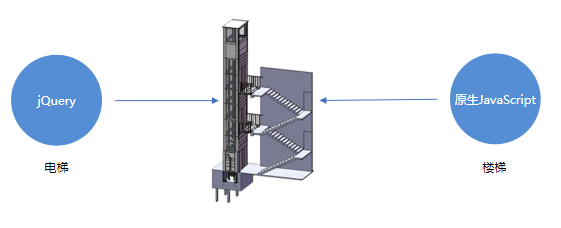
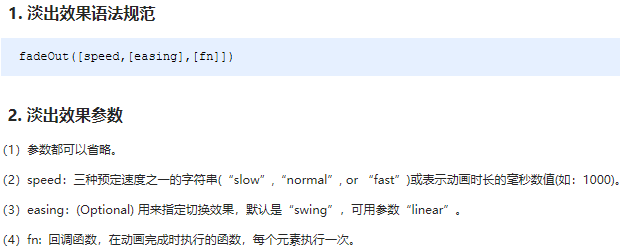
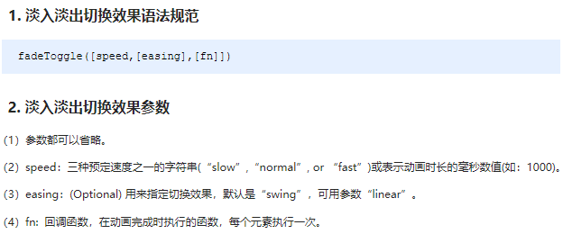

# day01 - jQuery

> 学习目标：
>
> 能够说出什么是 jQuery 
> 能够说出 jQuery 的优点
> 能够简单使用 jQuery
> 能够说出 DOM 对象和 jQuery 对象的区别
> 能够写出常用的 jQuery 选择器 
> 能够操作 jQuery 样式
> 能够写出常用的 jQuery 动画 
> 能够操作 jQuery 属性
> 能够操作 jQuery 元素
> 能够操作 jQuery 元素尺寸、位置


## 1.1. jQuery 介绍

### 1.1.1 JavaScript 库

​	JavaScript库：即 library，**是一个封装好的特定的集合（方法和函数）**。从封装一大堆函数的角度理解库，就是在这个库中，封装了很多预先定义好的函数在里面，比如动画animate、hide、show，比如获取元素等。

> 简单理解： 就是一个JS 文件，里面对我们原生js代码进行了封装，存放到里面。这样我们可以快速高效的使用这些封装好的功能了。
>
> 比如 jQuery，就是为了快速方便的操作DOM，里面基本都是函数（方法）。

​	常见的JavaScript 库：jQuery、Prototype、YUI、Dojo、Ext JS、移动端的zepto等，这些库都是对原生 JavaScript 的封装，内部都是用 JavaScript 实现的，我们主要学习的是 jQuery。

补充，几个概念的**理解**：

库：  js文件，对原生js做封装的工具（原有功能进行升级）

插件： js文件，小工具，swiper （提供额外功能）

框架： js文件，大工具，bootstrap（提供额外功能）

### 1.1.2 jQuery的概念

​	jQuery总体概况如下 :

- jQuery 是一个快速、简洁的 JavaScript 库，其设计的宗旨是“write Less，Do More”，即倡导写更少的代码，做更多的事情。

- j 就是 JavaScript；   Query 查询； 意思就是查询js，把js中的DOM操作做了封装，我们可以快速的查询使用里面的功能。

- **jQuery 封装了 JavaScript 常用的功能代码**，优化了 DOM 操作、事件处理、动画设计和 Ajax 交互。

- 学习jQuery本质： 就是学习调用这些**函数**（方法）。

- jQuery 出现的目的是加快前端人员的开发速度，我们可以非常方便的调用和使用它，从而提高开发效率。

  

  **理解**：Jquery：对js进行了升级，更加简单，更加牛逼，是简化版的JS。

### 1.1.3 jQuery的优点

1. 轻量级。核心文件才几十kb，不会影响页面加载速度。
2. 跨浏览器兼容，基本兼容了现在主流的浏览器。
3. 链式编程、隐式迭代。
4. 对事件、样式、动画支持，大大简化了DOM操作。
5. 支持插件扩展开发。有着丰富的第三方的插件，例如：树形菜单、日期控件、轮播图等。
6. 免费、开源。

## 1.2. jQuery 的基本使用

### 1.2.1 jQuery 的下载

jQuery的官网地址： https://jquery.com/，官网即可下载最新版本。

>  各个版本的下载：https://code.jquery.com/

版本介绍：

> 1x ：兼容 IE 678 等低版本浏览器， 官网不再更新
>
> 2x ：不兼容 IE 678 等低版本浏览器， 官网不再更新
>
> 3x ：不兼容 IE 678 等低版本浏览器， 是官方主要更新维护的版本

### 1.2.2. 体验jQuery

步骤：

- 引入jQuery文件。
- 在文档最末尾插入 script 标签，书写体验代码。
- $('div').hide() 可以隐藏盒子。

### 1.2.3. jQuery的入口函数

jQuery中常见的两种入口函数：

```javascript
// 第一种: 简单易用。 ***
$(function () {   
    ...  // 此处是页面 DOM 加载完成的入口
}) ; 

// 第二种: 繁琐，但是也可以实现  （ready：准备，dom准备好了）
$(document).ready(function(){
   ...  //  此处是页面DOM加载完成的入口
});
```

总结：

1. 等着 DOM 结构渲染完毕即可执行内部代码，不必等到所有外部资源加载完成，jQuery 帮我们完成了封装。
2. **相当于原生 js 中的 DOMContentLoaded**。
3. 不同于原生 js 中的 load 事件是等页面文档、外部的 js 文件、css文件、图片加载完毕才执行内部代码。
4. 更推荐使用第一种方式。

### 1.2.4. jQuery中的顶级对象$

1.  \$是 jQuery 的别称，在代码中可以使用 jQuery 代替，但一般为了方便，通常都直接使用 $ 。
2.  \$是jQuery的顶级对象，相当于原生JavaScript中的 window。**把元素利用$包装成jQuery对象，就可以调用jQuery 的方法**。

### 1.2.5.  jQuery 对象和 DOM 对象

使用 jQuery 方法和原生JS获取的元素是不一样的，总结如下 : 

1. 用原生 JS 获取来的对象就是 DOM 对象
2. jQuery 方法获取的元素就是 jQuery 对象。
3. jQuery 对象本质是： 利用$对DOM 对象包装后产生的对象（**jquery对象就是一个伪数组，存储的是一个一个的DOM对象** ）***。

> 注意：
>
> 只有 jQuery 对象才能使用 jQuery 方法，DOM 对象则使用原生的 JavaScirpt 方法。


### 1.2.6.  jQuery 对象和 DOM 对象转换 ***

- DOM 对象与 jQuery 对象之间是可以相互转换的。
- 因为原生js 比 jQuery 更大，原生的一些属性和方法 jQuery没有给我们封装. 
- 要想使用这些属性和方法需要把jQuery对象转换为DOM对象才能使用。
- 代码：

```javascript
// 1.DOM对象转换成jQuery对象，方法只有一种
var box = document.getElementById('box');  // 获取DOM对象
var jQueryObject = $(box);  // 把DOM对象转换为 jQuery 对象

// 2.jQuery 对象转换为 DOM 对象有两种方法：
//   2.1 jQuery对象[索引值]
var domObject1 = $('div')[0]

//   2.2 jQuery对象.get(索引值)
var domObject2 = $('div').get(0)
 
```

总结：实际开发**比较常用的是把DOM对象转换为jQuery对象**，这样能够调用功能更加强大的jQuery中的方法。

**注意： jquery对象是包含了dom对象的一个伪数组**  *** 

## 1.3. jQuery 选择器

原生 JS 获取元素方式很多，很杂，而且兼容性情况不一致，因此 jQuery 给我们做了封装，使获取元素统一标准。

### 1.3.1. 基础选择器 ***

```js
$("选择器")   //  里面选择器直接写 CSS 选择器即可，但是要加引号 
```

基础选择器如下图：


### 1.3.2. 层级选择器 ***

层级选择器最常用的两个分别为：后代选择器和子代选择器。

曾经选择器如下图：


**基础选择器和层级选择器案例代码**

```javascript
<body>
    <div>我是div</div>
    <div class="nav">我是nav div</div>
    <p>我是p</p>
    <ul>
        <li>我是ul 的</li>
        <li>我是ul 的</li>        
        <li>我是ul 的</li>
    </ul>
    <script>
        $(function() {
            console.log($(".nav"));
            console.log($("ul li"));
        })
    </script>
</body>
```

### 1.3.3. 筛选选择器

筛选选择器，顾名思义就是在所有的选项中选择满足条件的进行筛选选择。常见如下 :


**语法**： 基础选择器/层级选择器:关键字   （:冒号前可以是标签选择器，类选择器，层级选择器）

**理解**： 筛选选择器，从某个集合中进行过滤。

**案例代码**

```js
<body>
    <ul>
        <li>多个里面筛选几个</li>
        <li>多个里面筛选几个</li>
        <li>多个里面筛选几个</li>
        <li>多个里面筛选几个</li>
        <li>多个里面筛选几个</li>
        <li>多个里面筛选几个</li>
    </ul>
    <ol>
        <li>多个里面筛选几个</li>
        <li>多个里面筛选几个</li>
        <li>多个里面筛选几个</li>
        <li>多个里面筛选几个</li>
        <li>多个里面筛选几个</li>
        <li>多个里面筛选几个</li>
    </ol>
    <script>
        $(function() {
            $("ul li:first").css("color", "red");
            $("ul li:eq(2)").css("color", "blue");
            $("ol li:odd").css("color", "skyblue");
            $("ol li:even").css("color", "pink");
        })
    </script>
</body>
```

### 1.3.4. 筛选方法 ***


**重点记住**： parent() children() find() siblings() eq() 

**注意**：

上述方法中，children，find，sliblings，这三个方法的参数为字符串，代表选择器

**理解**：为啥children有参数？

比如div下有2个p，2个a，这时候想获取标签名为p的儿子们，那就可以通过$('div').children('p')这种方式来获取

**总结**：

```js
// 子代选择
$('ul>li');
$('ul').children('li');
// 后代选择
$('ul li');
$('ul').find('li');
//选择某一个
$("ul li:eq(2)");
$("ul li").eq(2);
// 筛选方法，比选择器用的多，因为更加灵活（可以很方便的使用变量）
// 比如：要选择的某一个不确定，通过变量index表示
$("ul li:eq("+index+")").css("color", "blue");
$("ul li").eq(index).css("color", "blue");
```

### 1.3.5. 知识铺垫 ***

- jQuery 设置样式

```javascript
$('div').css('属性', '值')    
```

- jQuery 里面的排他思想

```javascript
// 想要多选一的效果，排他思想：当前元素设置样式，其余的兄弟元素清除样式。
$(this).css(“color”,”red”);
$(this).siblings().css(“color”,””);
```

- 隐式迭代

```javascript
// 遍历内部 DOM 元素（伪数组形式存储）的过程就叫做隐式迭代。
// 简单理解：给匹配到的所有元素进行循环遍历，执行相应的方法，而不用我们再进行循环，简化我们的操作，方便我们调用。
$('div').hide();  // 页面中所有的div全部隐藏，不用循环操作


// 以前的js是不允许对于一组对象直接操作的，只能对一个元素对象进行操作
var divs = document.getElementsByTagName('div');
divs.style.backgroundColor = 'red'; // 错误，style是dom对象的属性，不能通过伪数组调用
divs[0].style.backgroundColor = 'red'; // 正确
```

**注意**：为啥jquery对象是一个伪数组，因为要做隐式迭代 

- 链式编程 （此知识点不要求必须掌握，能够看懂即可）

```javascript
// 链式编程是为了节省代码量，看起来更优雅。
$(this).css('color', 'red').sibling().css('color', ''); 
$(this).css();// 返回的是调用者
$(this).slibilng();// 返回我的兄弟姐们
//jq的操作方法： css(),hide(),show()，事件等等，会将调用者返回
//jq的筛选方法，会将筛选完的对象返回。 非筛选方法（操作方法），会将调用者（jq对象）返回
```

### 1.3.6. 案例：淘宝服饰精品案例
**思路分析:** 

1.核心原理：鼠标经过左侧盒子某个小li，就让内容区盒子相对应图片显示，其余的图片隐藏。

2.需要得到当前小li 的索引号，就可以显示对应索引号的图片

3.jQuery 得到当前元素索引号 $(this).index()

4.中间对应的图片，可以通过  eq(index) 方法去选择

5.显示元素 show()   隐藏元素 hide()

**代码**：

```javascript
<script>
    $(function() {
        // 1. 鼠标经过左侧的小li 
        $("#left li").mouseover(function() {
            // 2. 得到当前小li 的索引号
            var index = $(this).index(); // Jquery中给元素默认增加了索引，通过index()方法获取
            console.log(index);
            // 3. 让我们右侧的盒子相应索引号的图片显示出来就好了
            // $("#content div").eq(index).show();
            // 4. 让其余的图片（就是其他的兄弟）隐藏起来
            // $("#content div").eq(index).siblings().hide();
            // 链式编程
            $("#content div").eq(index).show().siblings().hide();

        })
    })
</script>
```

## 1.4.  jQuery 样式操作 ***

jQuery中常用的样式操作有两种：css() 和 设置类样式方法

### 1.4.1. 方法1: 操作 css 方法

jQuery 可以使用 css 方法来修改简单元素样式； 也可以操作类，修改多个样式。

常用以下三种形式 : 

```javascript
// 1.参数只写属性名，则是返回属性值
var strColor = $(this).css('color');

// 2.  参数是属性名，属性值，逗号分隔，是设置一组样式，属性必须加引号，值如果是数字可以不用跟单位和引号
$(this).css('color', 'red');

// 3.  参数可以是对象形式，方便设置多组样式。属性名和属性值用冒号隔开， 属性可以不用加引号
$(this).css({ "color":"white","font-size":"20px"});

function css(){
    var length  = paramters.length
    if(length==1){// 一个获取参数的属性名参数，设置多组属性的对象
        if (typeof(paramters[0]) == 'string' ){
            // 获取操作
        }else{
            // 设置操作（对象形式）
        }
    }else{
        //设置一组属性
    }
}


```

​	注意：css() 多用于样式少时操作，多了则不太方便。

​		    css()操作的是行内样式  （style属性）

### 1.4.2. 方法2: 设置类样式方法

​作用等同于以前的 classList，可以操作类样式， 注意操作类里面的参数不要加点。

常用的三种设置类样式方法：

```javascript
// 1.添加类
$("div").addClass("current");  // className，classList

// 2.删除类
$("div").removeClass("current");

// 3.切换类
$("div").toggleClass("current");

```

注意：

1. 设置类样式方法比较适合样式多时操作，可以弥补css()的不足。
2. 原生 JS 中 className 会覆盖元素原先里面的类名，jQuery 里面类操作只是对指定类进行操作，不影响原先的类名。

### 1.4.3. 案例：tab 栏切换

**思路分析**: 

1.点击上部的li，当前li 添加current类，其余兄弟移除类。

2.点击的同时，得到当前li 的索引号

3.让下部里面相应索引号的item显示，其余的item隐藏

**代码**：

```javascript
<script>
    $(function() {
    // 1.点击上部的li，当前li 添加current类，其余兄弟移除类
    $(".tab_list li").click(function() {
        // 链式编程操作
        $(this).addClass("current").siblings().removeClass("current");
        // 2.点击的同时，得到当前li 的索引号
        var index = $(this).index();
        console.log(index);
        // 3.让下部里面相应索引号的item显示，其余的item隐藏
        $(".tab_con .item").eq(index).show().siblings().hide();
    });
})
</script>
```

## 1.5. jQuery 效果

​jQuery 给我们封装了很多动画效果，最为常见的如下：

- 显示隐藏：show() / hide() / toggle() ;
- 划入划出：slideDown() / slideUp() / slideToggle() ; 
- 淡入淡出：fadeIn() / fadeOut() / fadeToggle() / fadeTo() ; 
- 自定义动画：animate() ;

**注意**：

- 动画或者效果一旦触发就会执行，如果多次触发，就造成多个动画或者效果排队执行。

- jQuery为我们提供另一个方法，可以停止动画排队：stop() ;

### 1.5.1. 显示隐藏 （对角线动画）

​	显示隐藏动画，常见有三个方法：show() / hide() / toggle() ;

​	语法规范如下:


**代码演示**

```javascript
<body>
    <button>显示</button>
    <button>隐藏</button>
    <button>切换</button>
    <div></div>
    <script>
        $(function() {
            $("button").eq(0).click(function() {
                $("div").show(1000, function() {
                    alert(1);
                });
            })
            $("button").eq(1).click(function() {
                $("div").hide(1000, function() {
                    alert(1);
                });
            })
            $("button").eq(2).click(function() {
              $("div").toggle(1000);
            })
            // 一般情况下，我们都不加参数直接显示隐藏就可以了
        });
    </script>
</body>
```

### 1.5.2. 滑入滑出 （卷拉门，高度动画）

​	滑入滑出动画，常见有三个方法：slideDown() / slideUp() / slideToggle() ; 

​	语法规范如下:


**代码演示**

```javascript
<body>
    <button>下拉滑动</button>
    <button>上拉滑动</button>
    <button>切换滑动</button>
    <div></div>
    <script>
        $(function() {
            $("button").eq(0).click(function() {
                // 下滑动 slideDown()
                $("div").slideDown();
            })
            $("button").eq(1).click(function() {
                // 上滑动 slideUp()
                $("div").slideUp(500);
            })
            $("button").eq(2).click(function() {
                // 滑动切换 slideToggle()
                $("div").slideToggle(500);
            });
        });
    </script>
</body>
```

案例：下拉菜单

```js
<script>
    $(function() {
    // 鼠标经过
    // $(".nav>li").mouseover(function() {
    //     // $(this) jQuery 当前元素  this不要加引号
    //     // show() 显示元素  hide() 隐藏元素
    //     $(this).children("ul").slideDown(200);
    // });
    // // 鼠标离开
    // $(".nav>li").mouseout(function() {
    //     $(this).children("ul").slideUp(200);
    // });
    // 1. 事件切换 hover 就是鼠标经过和离开的复合写法
    // $(".nav>li").hover(function() {
    //     $(this).children("ul").slideDown(200);
    // }, function() {
    //     $(this).children("ul").slideUp(200);
    // });
    // 2. 事件切换 hover  如果只写一个函数，那么鼠标经过和鼠标离开都会触发这个函数
    $(".nav>li").hover(function() {
        $(this).children("ul").slideToggle();
    });
})
</script>
```


### 1.5.3 淡入淡出 （透明度动画）

​	淡入淡出动画，常见有四个方法：fadeIn() / fadeOut() / fadeToggle() / fadeTo() ; 

​	语法规范如下:







**代码演示**

```javascript
<body>
    <button>淡入效果</button>
    <button>淡出效果</button>
    <button>淡入淡出切换</button>
    <button>修改透明度</button>
    <div></div>
    <script>
        $(function() {
            $("button").eq(0).click(function() {
                // 淡入 fadeIn()
                $("div").fadeIn(1000);
            })
            $("button").eq(1).click(function() {
                // 淡出 fadeOut()
                $("div").fadeOut(1000);
            })
            $("button").eq(2).click(function() {
                // 淡入淡出切换 fadeToggle()
                $("div").fadeToggle(1000);
            });
            $("button").eq(3).click(function() {
                //  修改透明度 fadeTo() 这个速度和透明度要必须写
                $("div").fadeTo(1000, 0.5);
            });
        });
    </script>
</body>
```

### 1.5.4 自定义动画 ***

​	自定义动画非常强大，通过参数的传递可以模拟以上所有动画，方法为：animate() ;

​	语法规范如下:


**代码演示**

```javascript
<body>
    <button>动起来</button>
    <div></div>
    <script>
        $(function() {
            $("button").click(function() {
                $("div").animate({
                    left: 500,
                    top: 300,
                    opacity: .4,
                    width: 500
                }, 500);
            })
        })
    </script>
</body>
```

### 1.5.5 停止动画排队 ***

动画或者效果一旦触发就会执行，如果多次触发，就造成多个动画或者效果排队执行。

停止动画排队的方法为：stop() ; 

- stop() 方法用于停止动画或效果。
- stop() 写到动画或者效果的前面， 相当于停止结束上一次的动画。

​ **总结**: 每次使用动画之前，先调用 stop() ,在调用动画。

### 1.5.6. 事件切换

jQuery中为我们添加了一个新事件 hover() ; 功能类似 css 中的伪类 :hover 。介绍如下

**语法**

```javascript
hover([over,]out)     // 其中over和out为两个函数
```

- over:鼠标移到元素上要触发的函数（相当于mouseenter）
- out:鼠标移出元素要触发的函数（相当于mouseleave）
- 如果只写一个函数，则鼠标经过和离开都会触发它

**hover事件和停止动画排列案例**

```javascript
<body>
    <ul class="nav">
        <li>
            <a href="#">微博</a>
            <ul><li><a href="">私信</a></li><li><a href="">评论</a></li><li><a href="">@我</a></li></ul>
        </li>
        <li>
            <a href="#">微博</a>
            <ul><li><a href="">私信</a></li><li><a href="">评论</a></li><li><a href="">@我</a></li></ul>
        </li>
    </ul>
    <script>
        $(function() {
            // 鼠标经过
            // $(".nav>li").mouseover(function() {
            //     // $(this) jQuery 当前元素  this不要加引号
            //     // show() 显示元素  hide() 隐藏元素
            //     $(this).children("ul").slideDown(200);
            // });
            // // 鼠标离开
            // $(".nav>li").mouseout(function() {
            //     $(this).children("ul").slideUp(200);
            // });
            // 1. 事件切换 hover 就是鼠标经过和离开的复合写法
            // $(".nav>li").hover(function() {
            //     $(this).children("ul").slideDown(200);
            // }, function() {
            //     $(this).children("ul").slideUp(200);
            // });
            // 2. 事件切换 hover  如果只写一个函数，那么鼠标经过和鼠标离开都会触发这个函数
            $(".nav>li").hover(function() {
                // stop 方法必须写到动画的前面
                $(this).children("ul").stop().slideToggle();
            });
        })
    </script>
</body>
```

### 1.5.7. 案例：王者荣耀手风琴效果

**思路分析**: 

1.鼠标经过某个小li 有两步操作：

2.当前小li 宽度变为 224px， 同时里面的小图片淡出，大图片淡入

3.其余兄弟小li宽度变为69px， 小图片淡入， 大图片淡出

**代码**：

```javascript
<script type="text/javascript">
    $(function() {
    // 鼠标经过某个小li 有两步操作：
    $(".king li").mouseenter(function() {
        // 1.当前小li 宽度变为 224px， 同时里面的小图片淡出，大图片淡入
        $(this).stop().animate({
            width: 224
        }).find(".small").stop().fadeOut().siblings(".big").stop().fadeIn();
        // 2.其余兄弟小li宽度变为69px， 小图片淡入， 大图片淡出
        $(this).siblings("li").stop().animate({
            width: 69
        }).find(".small").stop().fadeIn().siblings(".big").stop().fadeOut();
    })
});
</script>
```


## 1.6. 今日总结


 jquery中的顶级对象$ 比较特殊，可以当做一个对象使用，也可以当做一个函数使用 ***

1. 当做函数使用

​        (1). 如果传递的是一个匿名函数，当做入口函数使用（DOMContentLoaded）

​        (2). 如果传递的是一个DOM对象，当做类型转换使用，将DOM对象转换为jq对象

​        (3). 如果传递的是一个css选择器（字符串），当做获取元素使用

​	(4). 如果是html内容的字符串，当做创建元素对象使用

2. $ 是一个函数，也是一个对象，可以直接调用方法

```javascript
$.each(arr, function(i, ele) {
    console.log(i);
    console.log(ele);
    })
```

**注意点**：
	1. $('video')[0].play() // jquery对象是一个伪数组，伪数组内部存储的都是DOm对象
	2. $("ul li").css("color", "red"); // 遍历伪数组中所有元素对象，依次设置样式 （隐式迭代）
	3.获取当前js元素对象，this--- $(this) 将js的当前元素对象this，转换为了jq的当前元素对象


